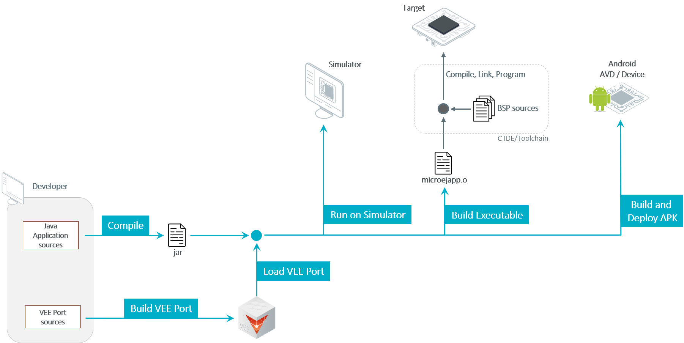

.. _ack_overview:

Overview
========

The MicroEJ Android Compatibility Kit is composed of two main components:

* A runtime: applications developed on MicroEJ can run on the Android platform thanks to the Android-based implementation of the MicroEJ Foundation libraries and dedicated support libraries.
* A developer kit: the SDK 6 and a Gradle plugin enable support for developing applications in Android Studio with Gradle.

Workflow
--------

..
   | Copyright 2008-2023, MicroEJ Corp. Content in this space is free 
   for read and redistribute. Except if otherwise stated, modification 
   is subject to MicroEJ Corp prior approval.
   | MicroEJ is a trademark of MicroEJ Corp. All other trademarks and 
   copyrights are the property of their respective owners.