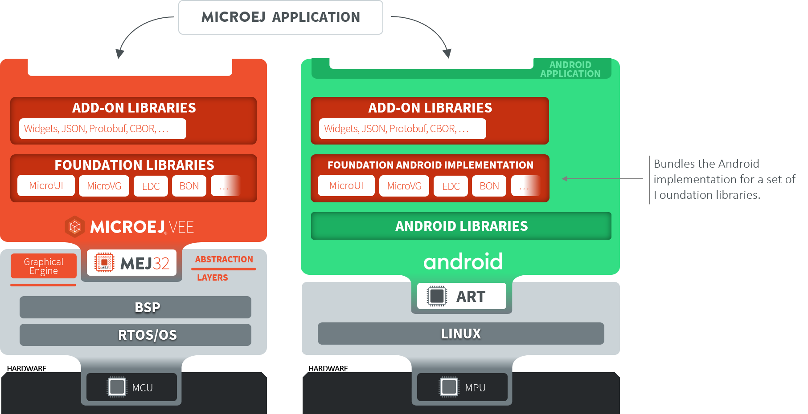

.. _ack_overview:

Overview
========

The MicroEJ Android Compatibility Kit is composed of two main components:

* A runtime: applications developed on MicroEJ can run on the Android platform thanks to the Android-based implementation of the MicroEJ Foundation libraries and dedicated support libraries.
* A developer kit: the SDK 6 and a Gradle plugin provide the necessary support for developing applications in Android Studio using Gradle.

Workflow
--------

Below is a general overview of the workflow when developing a product that targets both MicroEJ and Android-powered devices.

.. figure:: images/general-workflow.png
    :alt: General workflow
    :align: center

    General Workflow

Software Architecture
---------------------

Applications designed to run in MicroEJ VEE can also run on Android, thanks to a specific implementation of MicroEJ Foundation libraries based on Android libraries.

    Software Architecture

..
   | Copyright 2008-2023, MicroEJ Corp. Content in this space is free 
   for read and redistribute. Except if otherwise stated, modification 
   is subject to MicroEJ Corp prior approval.
   | MicroEJ is a trademark of MicroEJ Corp. All other trademarks and 
   copyrights are the property of their respective owners.