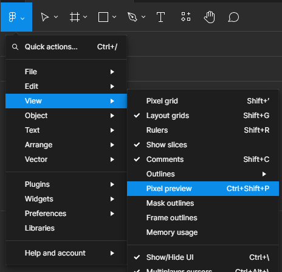

.. _section_ui_advanced_front_panel:

Front Panel: Advanced Usage
===========================

The Front Panel is provided by the VEE Ports.

It is especially useful for those exposing a MicroUI display, LEDs and input devices.
It then provides an interactive window for the Application simulation.
See :ref:`section_frontpanel`.

The following sections provides a non-exhaustive list of tips to make the best use of the Front Panel for Application developers.

.. _fp-tips-windows-scaling:

Pixel Accurate Display: Window scaling
--------------------------------------

The Front Panel Display is designed for a pixel-accurate simulation of the GUI application. It uses MicroUI's graphics engine, not the system native engine.
Therefore, the Front Panel does not support scaling of the window. For accurate graphics, the window must not be resized by the system or the application
that launched the simulation (typically the IDE). Check your settings:

.. tabs::

   .. tab:: System (Windows)

      On Windows, check your Display settings:

      .. figure:: images/windows-settings-display-scale+layout.png
         :alt: Windows Display "Scale & Layout" settings
         :align: center

         Windows Display "Scale & Layout" settings

   .. tab:: Application (Windows)

      If needed, override the application auto scaling with the system's in Windows Explorer:

      .. figure:: images/windows-application-high-dpi-scaling-override.png
         :alt: Windows Application "High DPI scaling override" setting
         :align: center

         Windows Application "High DPI scaling override" setting

.. _fp-tips-zoom-pixels:

Zoom on pixelated view for checking custom drawings
---------------------------------------------------

Assuming a pixel accurate simulated display (see :ref:`Window scaling<fp-tips-windows-scaling>`), use a screen magnifier tool to zoom on portions of the GUI.
It is especially useful to check custom drawings as well as MicroUI Fonts (EJF) & Images.
Also, make sure the tool does not apply a filter to smooth when scaling.

.. tabs::

   .. tab:: Windows Magnifier

      .. figure:: images/windows-magnifier-example-widget.png
         :alt: Windows Magnifier Example
         :align: center

         Windows Magnifier Example

   .. tab:: Windows Magnifier Settings

      .. figure:: images/windows-settings-magnifier-smooth-edges.png
         :alt: Windows Magnifier "Smooth edges of images and text" setting
         :align: center

         Windows Magnifier "Smooth edges of images and text" setting

.. _fp-tips-screenshots:

Take screenshots of the simulated display
-----------------------------------------

An alternative is to make a screenshot and zooming with an image viewer/editor. For that, use a screenshot tool or programmatically
extend the Front Panel with:

.. code-block:: java

   // Use ej.fp.widget package to access ej.fp.widget.Display.visibleBuffer
   package ej.fp.widget;

   import java.awt.Graphics;
   import java.awt.Image;
   import java.awt.Toolkit;
   import java.awt.datatransfer.DataFlavor;
   import java.awt.datatransfer.Transferable;
   import java.awt.datatransfer.UnsupportedFlavorException;
   import java.awt.image.BufferedImage;
   import java.io.IOException;

   import ej.fp.Device;
   import ej.fp.widget.Button.ButtonListener;

   public class SceenshotOnClick implements ButtonListener {

       @Override
       public void press(Button widget) {
           copyImageToClipboard(copyToType(takeScreenshot(), BufferedImage.TYPE_INT_RGB));
           System.out.println("Screenshot copied to clipboard");
       }

       @Override
       public void release(Button widget) {
           // do nothing
       }

       private static BufferedImage takeScreenshot() {
           Display display = Device.getDevice().getWidget(Display.class, null);
           return (BufferedImage) display.visibleBuffer.getRAWImage();
       }

       private static Image copyToType(BufferedImage src, int imageType) {
           BufferedImage dst = new BufferedImage(src.getWidth(), src.getHeight(), imageType);
           Graphics g = dst.createGraphics();
           g.drawImage(src, 0, 0, null);
           g.dispose();
           return dst;
       }

       private static void copyImageToClipboard(Image image) {
           Toolkit.getDefaultToolkit().getSystemClipboard().setContents(new Transferable() {

               @Override
               public boolean isDataFlavorSupported(DataFlavor flavor) {
                   return DataFlavor.imageFlavor.equals(flavor);
               }

               @Override
               public DataFlavor[] getTransferDataFlavors() {
                   return new DataFlavor[] { DataFlavor.imageFlavor };
               }

               @Override
               public Object getTransferData(DataFlavor flavor) throws UnsupportedFlavorException, IOException {
                   if (!DataFlavor.imageFlavor.equals(flavor)) {
                       throw new UnsupportedFlavorException(flavor);
                   }
                   return image;
               }

           }, null);
       }

   }

.. _fp-tips-visual-testing:

Visual Testing
--------------

Such screenshots simplifies visual testing. The screenshot can be compared against a made-up image from
design specification (typically exported from design tools), or against another screenshot taken from a different version of the application.
To go further (and possibly automate such tests), use tools like `ImageMagick <https://imagemagick.org/>`_:

.. tabs::

   .. tab:: Before

      .. figure:: images/visual-testing-1-before.png
         :align: center

   .. tab:: After

      .. figure:: images/visual-testing-2-after.png
         :align: center

   .. tab:: Compare

      .. code-block:: console

         $ compare before.png after.png compare.png

      |

      .. figure:: images/visual-testing-3-compare.png
         :align: center

.. _fp-tips-figma:

Compare screenshots with Figma frames
-------------------------------------

In Figma, frames can be easily exported to PNG images. But it may need more processing before the comparison with the screenshot.
First (optional), within Figma, enable Pixel Preview (:guilabel:`View` > :guilabel:`Pixel Preview (Ctrl+Shift+P)`):

Then, if the exported frame does not contain only the display, the image can be cropped with:

.. code-block:: console

   $ convert figma.png -crop 480x480+45+45 figma-cropped.png

Then, if the :ref:`MicroUI bpp setting <display_pixel_structure_driver>` is not ``RGB888``, the image can be filtered to match the supported colors.
For example, for ``bpp=RGB565``, apply the following filter:

.. code-block:: console

   $ convert figma.png -channel red,blue -evaluate AND 63743 -channel green -evaluate AND 64767 figma-rgb565.png

.. _fp-tips-always-on-top:

Keep the Front Panel always on top
----------------------------------

To keep the front panel visible while developing the application, use multiple displays and/or use tools like Microsoft PowerToys'
`Always on Top <https://learn.microsoft.com/en-us/windows/powertoys/always-on-top>`_ utility.

Front Panel Options
-------------------

JRE tab / options

.. list-table:: Front Panel Options
   :widths: 20 20 60
   :header-rows: 1

   * - Options
     - Chapter
     - Aim
   * - ``ej.fp.project``
     - :ref:`fp_installation`
     - XXX_TODO  
   * - ``ej.fp.hil``
     - :ref:`fp_ui_classpath`
     - XXX_TODO 
   * - ``ej.fp.display.flushVisualizer``
     - XXX_TODO
     - XXX_TODO 
   * - ``ej.fp.brs.drawnColor``
     - XXX_TODO
     - XXX_TODO 
   * - ``ej.fp.brs.restoredColor``
     - XXX_TODO
     - XXX_TODO 
   * - ``ej.fp.brs.dirtyColor``
     - XXX_TODO
     - XXX_TODO 
