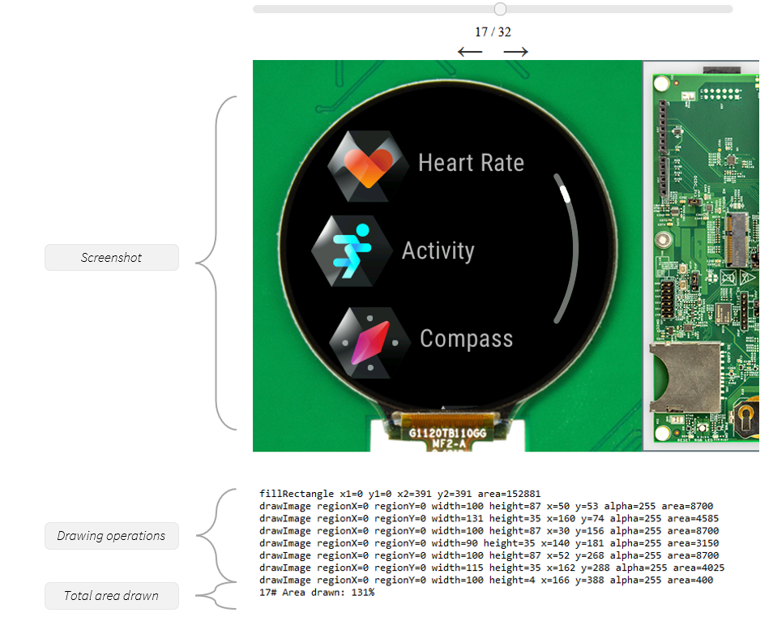
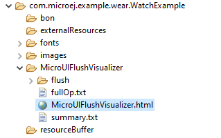

.. _microuiflushvisualizer:

MicroUI Flush Visualizer
========================

Building smooth and visually appealing UI applications requires a keen focus on performance.
To achieve efficient UI rendering, minimizing unnecessary work that consumes valuable CPU time is essential.

This article introduces the MicroUI Flush Visualizer, a tool designed to investigate potential performance bottlenecks in UI applications running on the Simulator by showing the pixel surface drawn between two MicroUI frame buffer flushes.

- Requirements: VEE Port with UI Pack 13.0.0 or higher.

Here are examples of the MicroUI Flush Visualizer in action:

+----------------------------------------------------------------+--------------------------------------------------------------------+
|Simple GFX                                                      | Demo Wearable                                                      |
+================================================================+====================================================================+
| .. image:: images/small-demo-ui-flush-visualizer-simpleGFX.png | .. image:: images/small-demo-ui-flush-visualizer-demo-wearable.png |
+----------------------------------------------------------------+--------------------------------------------------------------------+

Understanding the Rendering Pipeline
------------------------------------

One key element to successful smooth UI applications is performance.
An efficient UI application must only draw what is necessary to achieve the visual effects desired.
For example, assuming the application targets 60 FPS to perform a transition between two screens, that means the application has 1/60s ~= 16ms in total to execute the *Rendering Pipeline*.

The *Rendering Pipeline* of a UI application consists of three main phases: Layout, Rendering, and Flush.

1. *Layout*: This phase determines which widgets should be displayed on the screen and the positions of the widgets.
   It is typically triggered when widgets are added or removed from the widget hierarchy.
   An application should only modify the widget hierarchy when necessary and avoid doing so during animation to ensure efficiency.

2. *Rendering*: During this phase, each widget executes its rendering code to perform the necessary drawing operations.
   The widgets must render only what is needed and minimize overlapping with other widgets to ensure optimal performance.

3. *Flush*: This phase involves copying the UI working buffer to the screen buffer.
   The VEE Port performs this operation, and it is the responsibility of the Firmware developer to optimize this process, for example, by utilizing a GPU.

The MicroUI Flush Visualizer is a tool designed to visualize the drawing operations requested by widgets during the *Rendering* phase between each flush.

The MicroUI Flush Visualizer provides the following information:

- A screenshot of the result of the Rendering Pipeline (what was shown on the screen).
- A list of drawing operations that were performed during the *Rendering* phase.
- The total area covered by the sum of the area drawn by the drawing operations as a percentage.
  A value of 100% indicates that the area drawn is equivalent to the surface of the entire display; a value of 200% indicates the area drawn is equivalent to twice the surface of the entire display.

This tool helps identify potential bottlenecks in the application's rendering by looking for flushes that exceed 200% of the display area.

A perfect application has 100% of its display area drawn.
A total area drawn between 100% to 200% is the norm in practice because widgets often overlap.
However, if the total area drawn is bigger than 200%, that means that the total surface of the display was drawn more than twice, meaning that a lot of time could be spent drawing things that are never shown.

As always, when conducting a performance study, measure.
Use :ref:`systemview` to identify the bottlenecks in your application on the embedded target.
A total area drawn over 200% is inefficient, but your application may have bigger bottlenecks.
Confirm it by measuring the time spent drawing vs. the time spent elsewhere between flushes.

Installation
------------

1. Open the Front Panel file ``.fp``.

2. Replace the ``ej.fp.widget.Display`` widget by ``ej.fp.widget.FlushVisualizerDisplay``. XXX_TODO

For example:

.. code-block:: xml

   <ej.fp.widget.FlushVisualizerDisplay x="10" y="10" width="200" height="200" filter="f.png" />

The ``FlushVisualizerDisplay`` widget is available in the `frontpanel widget module <https://forge.microej.com/artifactory/microej-developer-repository-release/ej/tool/frontpanel/widget/>`__ version 2.2.+ for UI Pack 13.4.0 or later and version 3.+ for UI Pack 13.5.1 or later.

Usage
-----

1. Run the application in the Simulator.

2. Open the file ``MicroUIFlushVisualizer/MicroUIFlushVisualizer.html`` that was generated in the :ref:`application output folder <outputfiles>`.

Limitations
-----------

Please refer to the javadoc of the ``FlushVisualizerDisplay`` widget.

..
   | Copyright 2023-2024, MicroEJ Corp. Content in this space is free 
   for read and redistribute. Except if otherwise stated, modification 
   is subject to MicroEJ Corp prior approval.
   | MicroEJ is a trademark of MicroEJ Corp. All other trademarks and 
   copyrights are the property of their respective owners.