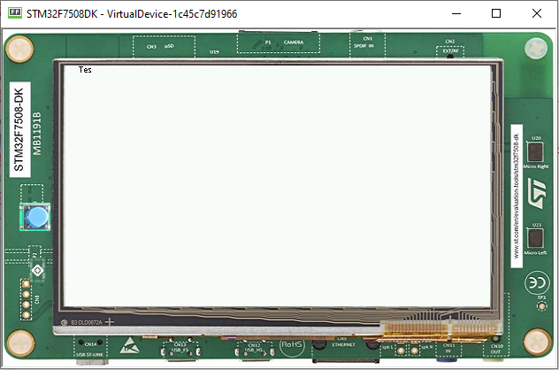

How to Detect Text Overflow
===========================

Widgets that display a text may experience text overflow when the strings are too long to fit into the available area. It can be the case, for example, in applications that support multiple languages because widgets have to deal with texts of different lengths.

Instrumenting the Widget
------------------------

The goal is to check whether the text to be displayed is within the content bounds of the widget. A way to test this is to extend or modify the widget.
In this article, the widget ``MyLabel`` will extend the type `Label`_ from the Widget library, which displays a text:

.. code-block:: java
    :emphasize-lines: 3

    import ej.widget.basic.Label;

    public class MyLabel extends Label {

        public MyLabel(String text) {
            super(text);
        }
    }

.. _Label: https://repository.microej.com/javadoc/microej_5.x/apis/ej/widget/basic/Label.html

Overriding the onLaidOut() Method
---------------------------------
 
Once the position and size of a wigdet are set during the lay out process, the `onLaidOut()`_ method is called to notify the widget.
Overriding `onLaidOut()`_ of class ``MyLabel`` is a good place to check whether the text overflows or not.

For example, the following snippet compares the text width with the available width: it will print a message if an overflow is detected.

.. code-block:: java
    :emphasize-lines: 12,13,14

    @Override
    protected void onLaidOut() {
        super.onLaidOut();
        
        // compute the width of the text with the specified font
        final Font font = getStyle().getFont();
        final String text = getText();
        final int textWidth = font.stringWidth(text);
        
        // compare to the width available for the content of the widget
        final int contentWidth = getContentBounds().getWidth();
        if (textWidth > contentWidth) {
            System.out.println("Overflow detected:\n > Text: \"" + text + "\"\n > Width = " + textWidth + " px (available: " + contentWidth + " px)");
        }
    }

.. _onLaidOut(): https://repository.microej.com/javadoc/microej_5.x/apis/ej/mwt/Widget.html#onLaidOut--

Testing
-------

Here is a case where the widget size is set manually to be a little shorter than the text width:
  
.. code-block:: java
    :emphasize-lines: 6

    public static void main(String[] args) {
        MicroUI.start();
        Desktop desktop = new Desktop();
        Canvas canvas = new Canvas();
        // add a label with an arbitrary fixed width of 25 pixels (which is too short)
        canvas.addChild(new MyLabel("Some text"), 20, 20, 25, 10);
        desktop.setWidget(canvas);
        desktop.requestShow();
    }

The text is cropped and the console logs that a text overflow has been detected:

.. code-block:: console

    =============== [ Initialization Stage ] ===============
    =============== [ Converting fonts ] ===============
    =============== [ Converting images ] ===============
    =============== [ Launching on Simulator ] ===============
    Overflow detected:
     > Text: "Some text"
     > Width = 47 px (available: 25 px)

Improving the Detection
-----------------------

To ease the correction process, it is best to add some additional debug information to locate the issue. 
Let's extract the text overflow detection into a helper class, so that it is available for all classes across the application.

The following snippet:
 
* extracts the text overflow detection into the class ``MyTextHelper``.
* prints the part of the text that is displayed.
* prints the path to the widget in the widget tree to help the tester locate the affected widget in the GUI.

.. code-block:: java
    :emphasize-lines: 13,30

    public class MyLabel extends Label {

        public MyLabel(String text) {
            super(text);
        }

        @Override
        protected void onLaidOut() {
            super.onLaidOut();

            final Font font = getStyle().getFont();
            final String text = getText();
            MyTextHelper.checkTextOverflow(this, text, font);
        }
    }

    public class MyTextHelper {

        /**
        * Checks whether the given text overflows for the specified widget and font. In the case where an overflow is
        * detected, the method prints a message that details the error.
        *
        * @param widget
        *            the widget that displays the text.
        * @param text
        *            the text to display.
        * @param font
        *            the font used for drawing the text.
        */
        public static void checkTextOverflow(final Widget widget, final String text, final Font font) {
            final int textWidth = font.stringWidth(text);
            final int contentWidth = widget.getContentBounds().getWidth();

            if (textWidth > contentWidth) {
                String displayedText = buildDisplayedText(text, font, contentWidth);
                String widgetPath = buildWidgetPath(widget);
                System.out.println(
                        "Overflow detected:\n > Text: \"" + text + "\"\n > Width = " + textWidth + " px (available: "
                                + contentWidth + " px) \n > Displayed: \"" + displayedText + "\"\n > Path : " + widgetPath);
            }
        }

        private static String buildDisplayedText(String text, Font font, int width) {
            for (int i = text.length() - 1; i > 0; i--) {
                if (font.substringWidth(text, 0, i) <= width) {
                    return text.substring(0, i);
                }
            }

            return "";
        }

        private static String buildWidgetPath(Widget widget) {
            StringBuilder builder = new StringBuilder();

            Widget ancestor = widget;
            do {
                builder.insert(0, " > " + ancestor.getClass().getSimpleName());
                ancestor = ancestor.getParent();
            } while (ancestor != null);
            builder.insert(0, widget.getDesktop().getClass().getSimpleName());

            return builder.toString();
        }
    }

When the application is launched again, the console shows more information about the text overflow:

.. code-block:: console

    =============== [ Initialization Stage ] ===============
    =============== [ Converting fonts ] ===============
    =============== [ Converting images ] ===============
    =============== [ Launching on Simulator ] ===============
    Overflow detected:
     > Text: "Some text"
     > Width = 47 px (available: 25 px) 
     > Displayed: "Some"
     > Path : Desktop > Canvas > MyLabel

To keep control over the extra verbosity and code size, one option is to use :ref:`BON constants <section.classpath.elements.constants>` to enable/disable this debug code at will.
In the following snippet, when the constant ``com.mycompany.check.text.overflow`` is set to ``false``, the debug code will not be embedded in the application.

.. code-block:: java
    :emphasize-lines: 2

    public static void checkTextOverflow(final Widget widget, final String text, final Font font) {
        if (Constants.getBoolean("com.mycompany.check.text.overflow")) {
            final int textWidth = font.stringWidth(text);
            final int contentWidth = widget.getContentBounds().getWidth();

            if (textWidth > contentWidth) {
                String displayedText = buildDisplayedText(text, font, contentWidth);
                String widgetPath = buildWidgetPath(widget);
                System.out.println(
                        "Overflow detected:\n > Text: \"" + text + "\"\n > Width = " + textWidth + " px (available: "
                                + contentWidth + " px) \n > Displayed: \"" + displayedText + "\"\n > Path : " + widgetPath);
            }
        }
    }

..
   | Copyright 2008-2022, MicroEJ Corp. Content in this space is free 
   for read and redistribute. Except if otherwise stated, modification 
   is subject to MicroEJ Corp prior approval.
   | MicroEJ is a trademark of MicroEJ Corp. All other trademarks and 
   copyrights are the property of their respective owners.
