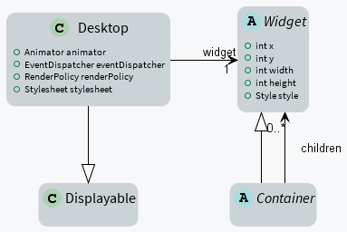

Architecture
============

Structure
---------

Widget
~~~~~~

A widget is an object that is intended to be displayed on a screen. A Widget occupies a specific region of the display and holds a state. A user may interact with a widget (using a touch screen or a button for example).

Widgets are arranged on a desktop. A widget can be part of only one desktop hierarchy, and can appear only once on that desktop.

Container
~~~~~~~~~

A container follows the composite pattern: it is a widget composed of other widgets. It also defines the layout policy of its children (defining their bounds). The children's positions are relative to the position of their parent.
Containers can be nested to design elaborate user interfaces.

By default, the children are rendered in the order in which they have been added in the container. And thus if the container allows overlapping, the widgets added last will be on top of the widgets added first. A container can also modify how its children are rendered.

Desktop
~~~~~~~

A desktop is a displayable intended to be shown on a display (cf. MicroUI). At any time, only one desktop can be displayed per display.

A desktop contains a widget (or a container). When the desktop is shown, its widget (and all its hierarchy for a container) is drawn on the display.

Rendering
---------

A new rendering of a widget on the display can be requested by calling its `requestRender()` method. The rendering is done asynchronously in the MicroUI thread.

When a container is rendered, all its children are also rendered.

A widget can be transparent, meaning that it does not draw every pixel of its bounds. In this case, when this widget is asked to be rendered, its parent is asked to be rendered in the area of the widget (recursively if the parent is also transparent). Usually a widget is transparent when its background (from the style) is transparent.

A widget can also be rendered directly in a specific graphics context by calling its `render(GraphicsContext)` method. It can be useful to render a widget (and its children) in an image for example.

Render Policy
~~~~~~~~~~~~~

The most naive render policy would be to render the whole hierarchy of the desktop. However `DefaultRenderPolicy` is smarter than that: it only repaints the widget, and its ancestors if the widget is transparent. The result is correct only if there is no overlapping widget, in which case  `ZIndexRenderPolicy` should be used instead.

Lay Out
-------

All widgets are laid out at once during the lay out process. This process can be started by `Desktop.requestLayOut()`, `Widget.requestLayOut()`. The layout is also automatically done when the desktop is shown (`Desktop.onShown()`). This process is composed of two steps, each step browses the hierarchy of widgets following a depth-first algorithm:
* compute the optimal size for each widget and container (considering the constraints of the lay out),
* set position and size for each widget.

Once the position and size of a widget is set, the widget is notified by a call to `onLaidOut()`.

Event Dispatch
--------------

Events generated in the hardware (touch, buttons, etc.) are sent to the event dispatcher of the desktop. It is then responsible of sending the event to one or several widgets of the hierarchy. A widget receives the event through its `handleEvent(int)` method. This method returns a boolean that indicates whether or not the event has been consumed by the widget or not.

Widgets are disabled by default and don't receive the events.

Pointer Event Dispatcher
~~~~~~~~~~~~~~~~~~~~~~~~

By default, the desktop proposes an event dispatcher that handles only pointer events.

Pointer events are grouped in sessions. A session starts when the pointer is pressed, and ends when the pointer is released or when it exits the pressed widget.

While no widget consumes the events, they are sent to the widget that is under the pointer (see `Desktop.getWidgetAt(int, int)`), then sent to all its parent hierarchy recursively.

Once a widget has consumed an event, it will be the only one to receive the next events during the session.

.. figure:: images/pointer_event_dispatcher_flow.png
   :alt: Pointer Event Dispatcher Flow
   :align: center

A widget can redefine its reactive area by subclassing the `contains(int x, int y)` method. It is useful when a widget does not fill fully its bounds.

.. Add an example such as a circular slider or an analog watchface.

Style
-----

A style describes how widgets must be rendered on screen. The attributes of the style are strongly inspired from CSS.

Dimension
~~~~~~~~~

The dimension is used to constrain the size of the widget.

MWT provides multiple implementations of dimensions:

- ``NoDimension`` does not constrain the dimension of the widget, so the widget will take all the space granted by its parent container.
- ``OptimalDimension`` constrains the dimension of the widget to its optimal size, which is given by the ``computeContentOptimalSize()`` method of the widget.
- ``FixedDimension`` constrains the dimension of the widget to a fixed absolute size.
- ``RelativeDimension`` constrains the dimension of the widget to a percentage of the size of its parent container.

Alignment
~~~~~~~~~

The horizontal and vertical alignments are used to position the content of the widget within its bounds.

The alignment is used by the framework to position the widget within its available space if the size of the widget has been constrained with a ``Dimension``.

The alignment can also be used in the ``renderContent()`` method in order to position the drawings of the widget (such as a text or an image) within its content bounds.

Outlines
~~~~~~~~

The margin, border and padding are the 3 outlines which wrap the content of the widget. The widget is wrapped in the following sequence: first the padding, then the border, and finally the margin.

MWT provides multiple implementations of invisible outlines which are usually used for margin and padding:

- ``NoOutline`` does not wrap the widget in an outline.
- ``UniformOutline`` wraps the widget in an outline which thickness is equal on all sides.
- ``FlexibleOutline`` wraps the widget in an outline which thickness can be configured for each side.

MWT also provides multiple implementations of visible outlines which are usually used for border:

- ``RectangularBorder`` draws a plain rectangle around the widget.
- ``RoundedBorder`` draws a plain rounded rectangle around the widget.

Background
~~~~~~~~~~

The background is used to render the background of the widget.
The background covers the border, the padding and the content of the widget, but not its margin.

MWT provides multiple implementations of backgrounds:

- ``NoBackground`` leaves a transparent background behind the widget.
- ``RectangularBackground`` draws a plain rectangle behind the widget.
- ``RoundedBackground`` draws a plain rounded rectangle behind the widget.
- ``ImageBackground`` draws an image behinds the widget.

Color
~~~~~

The color is not used by the framework itself, but it may be used in the ``renderContent()`` to select the color of the drawings.

Font
~~~~

The font is not used by framework itself, but it may be used in the ``renderContent()`` to select the font to use when drawing strings.

Extra fields
~~~~~~~~~~~~

Extra fields are not used by framework itself, but they may be used in the ``renderContent()`` to customize the behavior and the appearance of the widget.

See chapter ``How-To Define an Extra Style Field`` for more information on extra fields.

Stylesheet
----------

A stylesheet allows to customize the appearance of all the widgets of a desktop without changing the code of the widget subclasses.

MWT provides multiple implementations of stylesheets:

- ``VoidStylesheet`` assigns the same default style for every widget.
- ``CascadingStylesheet`` assigns styles to widgets using selectors, similarly to CSS.

For example, the following code customizes the style of every ``Label`` widget of the desktop:

.. code-block:: Java

	CascadingStylesheet stylesheet = new CascadingStylesheet();

	EditableStyle labelStyle = stylesheet.getSelectorStyle(new TypeSelector(Label.class));
	labelStyle.setColor(Colors.RED);
	labelStyle.setBackground(new RectangularBackground(Colors.WHITE));

	desktop.setStylesheet(stylesheet);

Desktop and widget states
-------------------------

Desktop and widgets pass through different states. Once created, they can be attached, then they can be shown.

A desktop is attached automatically as soon as it is shown on the display.
It can also be attached manually by calling ``Desktop.setAttached()``. It could be used to render the desktop (and its widgets) on an image for example.

A widget is attached when it is contained by a desktop that is attached.

In the same way, by default, a widget is shown when its desktop is shown. But for optimisation purpose, a container can control when its children are shown or hidden. A typical use case is when the widgets are moved outside the display.

Once a widget is attached, it means that it is ready to be shown (for instance, the necessary resources are allocated). In other word, once attached a widget is ready to be rendered (on an image or on the display).

Once a widget is shown, it means that it is intended to be rendered on the display. While shown, it may start a periodic refresh or an animation.

.. figure:: images/showSequence.png
   :alt: Show Sequence
   :align: center

..
   | Copyright 2008-2020, MicroEJ Corp. Content in this space is free 
   for read and redistribute. Except if otherwise stated, modification 
   is subject to MicroEJ Corp prior approval.
   | MicroEJ is a trademark of MicroEJ Corp. All other trademarks and 
   copyrights are the property of their respective owners.
