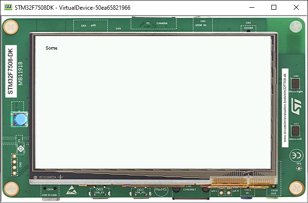

How To Detect Text overflow
===============================
The Issue
-------------

Widgets that display some text may encounter text overflow when the strings are too long to fit into the available area. This is often the case in applications which support multiple languages, because widgets have to cope with texts of different lengths.

Extending the Widget
----------------------
The goal is to check if the text to be displayed fits into the content boundaries of the widget. A straightforward way to test this is to extend or modify the widget.
In this article, the type `MyLabel` will extend the type `Label` from the Widget library which displays a text.

.. code-block:: java

    public class MyLabel extends Label {

        public MyLabel(String text) {
            super(text);
        }

        @Override
        protected void onLaidOut() {
            super.onLaidOut();
        }
    }

Overriding the onLaidOut() Method
----------------------------------
 
As soon as a widget is laid out, its position and size are set and its `onLaidOut()` method is called.
Overriding this method is the best way to check whether the text fits or not.

In the method body, get the `Font` from the `Style` of the widget, and compare the text width to the content width.

.. code-block:: java

    @Override
    protected void onLaidOut() {
        super.onLaidOut();
        final Font font = getStyle().getFont();
        final String text = getText();
        // get the width of the text with the specified font
        final int stringWidth = font.stringWidth(text);
        // get the available width for the content in the widget (excluding outlines)
        final int contentWidth = getContentBounds().getWidth();
        if (stringWidth > contentWidth) {
            System.err.println("The text size is greater than the widget content width!");
        }
    }

Testing
----------------------
The check can be easily validated by putting the widget in a canvas and setting its boundaries manually (a little shorter than the text width).
  
.. code-block:: java

    public static void main(String[] args) {
        MicroUI.start();
        Desktop desktop = new Desktop();
        Canvas canvas = new Canvas();
        canvas.addChild(new MyLabel("Test"), 15, 0, 15, 10);
        desktop.setWidget(canvas);
        desktop.requestShow();
    }

The console should show this:

.. code-block:: console

    The text size is greater than the widget content width!

Improving the Bounds Check
----------------------------

To make the correction process easier, it's possible to indicate where the text is truncated.

.. code-block:: java

    @Override
    protected void onLaidOut() {
        final Font font = getStyle().getFont();
        final String text = getText();
        final int stringWidth = font.stringWidth(text);
        final int labelWidth = this.getContentBounds().getWidth();
        if (stringWidth > labelWidth) {
            for (int i = text.length() - 1; i >= 0; i--) {
                if (font.substringWidth(text, 0, i) <= labelWidth) {
                    System.out.printErr(text + "\" truncates after \"" + text.substring(0, i) + "\""); //$NON-NLS-1$ //$NON-NLS-2$
                    break;
                }

            }
        }
    }

This block of code may also be extracted to a helper class in order to be used in other Widgets.

.. code-block:: java

    public class LabelBoundsCheck {

    public static boolean fits(final Font font, final String text, final int contentWidth) {
            int stringWidth = font.stringWidth(text);
            if (stringWidth > contentWidth) {
                for (int i = text.length() - 1; i >= 0; i--) {
                    if (font.substringWidth(text, 0, i) <= contentWidth) {
                        System.out.printErr(text + "\" truncates after \"" + text.substring(0, i) + "\""); //$NON-NLS-1$ //$NON-NLS-2$
                        return false;
                   }
                }
            }
        return true;
    }
    
    }

Using BON Constant
----------------------------

To avoid verbosity on the console, it's possible to use BON constants to show the error at developer will

.. code-block:: java

    if (Constants.getBoolean("com.mycompany.checkTextOverflow")) {
        LabelBoundsCheck.fits(font,text,contentWidth);
    }