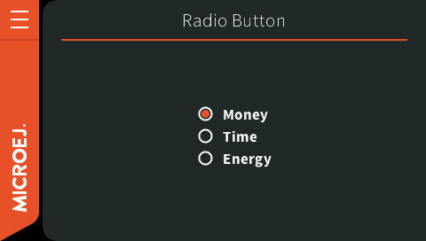
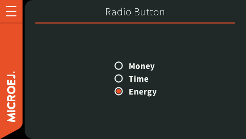

.. _mwt_how_to_debug:

How to Debug
============

Highlighting the Bounds of the Widgets
--------------------------------------

When designing a UI, it can be pretty convenient to highlight the bounds of each widget.
Here are some cases where it helps:

- Verify if the layout fits the expected design.
- Set the outlines (margin, padding, border).
- Check the alignment of the widget content inside its bounds.

Setting the ``ej.mwt.debug.bounds.enabled`` constant to ``true`` will add a rectangle overlay over each widget and container.
For more information about constants, see the :ref:`section.classpath.elements.constants` section.

By default, the rectangles around the widgets are magenta.
But their color can be adjusted by modifying the ``ej.mwt.debug.bounds.color`` constant.

Here is an example of a ``xxx.constants.list`` file with the result in an application:

.. code-block::

	ej.mwt.debug.bounds.enabled=true
	ej.mwt.debug.bounds.color=0x00ff00

.. figure:: images/highlightWidgetList.png
	:alt: Highlight widgets in a list
	:align: center
 
.. figure:: images/highlightWidgetWheel.png
	:alt: Highlight widgets in a wheel
	:align: center

.. note:: Available since MWT 3.3.0.

Monitoring the Render Operations
--------------------------------

When developing a GUI application, it may not be obvious what/how exactly the UI is rendered.
Especially, when a widget can be re-rendered from a distant part of the application code.
Or simply because of the ``RenderPolicy`` used.

MWT provides a way to inject a monitor for the following render operations:

* Render requests done by the Application.
* Successive render executions triggered by the ``RenderPolicy``.

Setting the ``ej.mwt.debug.render.enabled`` constant to ``true`` will enable the monitoring of above render operations.
For more information about the monitoring mechanism, see `RenderPolicy Javadoc <https://repository.microej.com/javadoc/microej_5.x/apis/ej/mwt/render/RenderPolicy.html>`_.
For more information about constants, see the :ref:`section.classpath.elements.constants` section.

The Widget library provides a default monitor implementation that prints the operations on the standard output.
The logs produced also contain information about what is rendered (widget and area) and what code requested the rendering.
For more information about this monitor implementation, see `RenderMonitor Javadoc <https://repository.microej.com/javadoc/microej_5.x/apis/ej/widget/debug/RenderMonitor.html>`_.

To use a different implementation (and if Widget is not in the classpath), set the ``ej.mwt.debug.render.monitor`` constant
to the FQN of the monitor implementation class.

Here is an example of a ``xxx.constants.list`` file with the result in an application:

.. code-block::

	ej.mwt.debug.render.enabled=true
	ej.mwt.debug.render.monitor=ej.widget.debug.RenderMonitor

	Screenshot before click

.. code-block::
	:caption: Application logs after click

	rendermonitor@ INFO: Render requested on com.microej.demo.widget.common.PageHelper$2 > SimpleDock > OverlapContainer > SimpleDock > List > RadioButton at {0,0 87x25} of {221,116 87x25} by com.microej.demo.widget.radiobutton.widget.RadioButtonGroup.setChecked(RadioButtonGroup.java:47)
	rendermonitor@ INFO: Render requested on com.microej.demo.widget.common.PageHelper$2 > SimpleDock > OverlapContainer > SimpleDock > List > RadioButton at {0,0 87x25} of {221,166 87x25} by com.microej.demo.widget.radiobutton.widget.RadioButtonGroup.setChecked(RadioButtonGroup.java:50)
	rendermonitor@ INFO: Render executed on  com.microej.demo.widget.common.PageHelper$2 > SimpleDock > OverlapContainer > SimpleDock > List > RadioButton at {-221,-116 87x25} of {221,116 87x25}
	rendermonitor@ INFO: Render executed on  com.microej.demo.widget.common.PageHelper$2 > SimpleDock > OverlapContainer > SimpleDock > List > RadioButton at {-221,-141 87x25} of {221,141 87x25}
	rendermonitor@ INFO: Render executed on  com.microej.demo.widget.common.PageHelper$2 > SimpleDock > OverlapContainer > SimpleDock > List > RadioButton at {-221,-166 87x25} of {221,166 87x25}
	rendermonitor@ INFO: Render executed on  com.microej.demo.widget.common.PageHelper$2 > SimpleDock > OverlapContainer > ImageWidget at {133,116 87x25} of {44,0 20x16}
	rendermonitor@ INFO: Render executed on  com.microej.demo.widget.common.PageHelper$2 > SimpleDock > OverlapContainer > ImageWidget at {133,-140 87x25} of {44,256 20x16}
	rendermonitor@ INFO: Render executed on  com.microej.demo.widget.common.PageHelper$2 > SimpleDock > OverlapContainer > SimpleDock > List > RadioButton at {-221,-116 87x25} of {221,166 87x25}
	rendermonitor@ INFO: Render executed on  com.microej.demo.widget.common.PageHelper$2 > SimpleDock > OverlapContainer > ImageWidget at {133,166 87x25} of {44,0 20x16}
	rendermonitor@ INFO: Render executed on  com.microej.demo.widget.common.PageHelper$2 > SimpleDock > OverlapContainer > ImageWidget at {133,-90 87x25} of {44,256 20x16}

	Screenshot after click

.. note:: Available since MWT 3.5.0 & Widget 5.0.0.

.. _section_monitoring_animators:

Monitoring the Animators
------------------------

Since an animator ticks its animations as often as possible, the animator may take 100% CPU usage if none of its animations requests a render.

MWT provides a way to inject a monitor to be notified when none of the animations has requested a render during an animator tick.

Setting the ``ej.mwt.debug.animator.enabled`` constant to ``true`` will enable animator monitoring.
For more information about constants, see the :ref:`section.classpath.elements.constants` section.

The Widget library provides a default monitor implementation which logs warning messages.
The logs produced also contain information about the animations running on the animator.
The Animation instances are logged using their ``toString()`` method, so it can be a good idea to override this method
in the Animation subclasses to be able to identify them.

To use a different implementation (and if Widget is not in the classpath), set the ``ej.mwt.debug.animator.monitor`` constant
to the FQN of the monitor implementation class.

Here is an example of a ``xxx.constants.list`` file with the result in an application:

.. code-block::

	ej.mwt.debug.animator.enabled=true

.. code-block::
	:caption: Application logs when the watchface update animation is started but it doesn't request a render

	animatormonitor WARNING: No render requested during animator tick. Animations list: [Watchface update animation]

.. note:: Available since MWT 3.5.0 & Widget 5.0.0.

..
   | Copyright 2021-2024, MicroEJ Corp. Content in this space is free 
   for read and redistribute. Except if otherwise stated, modification 
   is subject to MicroEJ Corp prior approval.
   | MicroEJ is a trademark of MicroEJ Corp. All other trademarks and 
   copyrights are the property of their respective owners.
