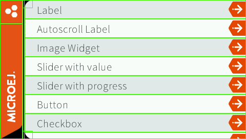
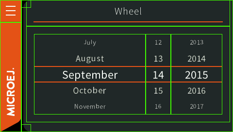

.. _mwt_how_to_debug:

How to Debug
============

Highlighting the Bounds of the Widgets
--------------------------------------

When designing a UI, it can be pretty convenient to highlight the bounds of each widget.
Here are some cases where it helps:

- Verify if the layout fits the expected design.
- Set the outlines (margin, padding, border).
- Check the alignment of the widget content inside its bounds.

Setting the ``ej.mwt.debug.bounds.enabled`` constant to ``true`` will add a rectangle overlay over each widget and container.
For more information about constants, see the :ref:`section.classpath.elements.constants` section.

By default, the rectangles around the widgets are magenta.
But their color can be adjusted by modifying the ``ej.mwt.debug.bounds.color`` constant.

Here is an example of a ``xxx.constants.list`` file with the result in an application:

.. code-block::

	ej.mwt.debug.bounds.enabled=true
	ej.mwt.debug.bounds.color=0x00ff00

 

.. note:: Available since MWT 3.3.0.
..
   | Copyright 2021-2023, MicroEJ Corp. Content in this space is free 
   for read and redistribute. Except if otherwise stated, modification 
   is subject to MicroEJ Corp prior approval.
   | MicroEJ is a trademark of MicroEJ Corp. All other trademarks and 
   copyrights are the property of their respective owners.
