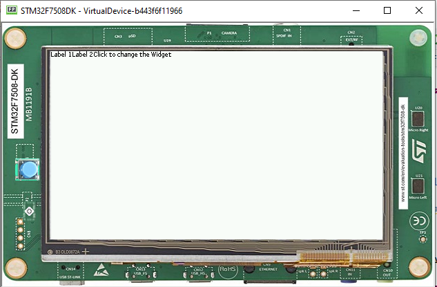

Hiding a Widget
====================
Hiding widgets can be done by:
- Swapping the entire desktop; or
- Selectively by placing your widgets in a custom hideable container.

Using Desktop To hide a widget
------------------------------

In the code sample below, a button is created to change the desktop when clicked:

.. code-block:: java

    MicroUI.start();
    Desktop desktop = new Desktop();
    Canvas canvas;
    Flow list = new Flow(LayoutOrientation.HORIZONTAL);
    list.addChild(new Label("Label 1"));
    list.addChild(new Label("Label 2"));
    Button button = new Button("Click to change the Widget");
    Desktop desktop2 = new Desktop();
    button.setOnClickListener(new OnClickListener() {
        @Override
        public void onClick() {
            desktop2.setWidget(new Label("new Widget"));
            desktop2.requestShow();
        }
    });
    list.addChild(button);
    desktop.setWidget(list);
    desktop.requestShow();

A new desktop with a single widget is created, hiding the original desktop. To go back just use requestShow on the first desktop.

.. code-block:: java

    MicroUI.start();
    Desktop desktop = new Desktop();
    Canvas c;
    Flow list = new Flow(LayoutOrientation.HORIZONTAL);
    list.addChild(new Label("Label 1"));
    list.addChild(new Label("Label 2"));
    Button button = new Button("Click to change the Widget");
    Desktop desktop2 = new Desktop();
    button.setOnClickListener(new OnClickListener() {
        @Override
        public void onClick() {
            Button button2 = new Button("Click to change back the Widget");
            button2.setOnClickListener(new OnClickListener() {
                @Override
                public void onClick() {
                    desktop.requestShow();
                }
            });
            desktop2.setWidget(b2);
            desktop2.requestShow();
        }
    });
    list.addChild(button);
    desktop.setWidget(list);
    desktop.requestShow();

.. image:: images/hidewidgethidden.png

Using a Hideable Container to Hide a Widget
-------------------------------------------

This sample shows how to create a hideable container by disabling the rendering of its children.

The children are not rendered, since the widget, and all of its children should be hidden

.. code-block:: java
    
    	public class HideableContainer extends OverlapContainer {

		private boolean visibility = true;

		public boolean isVisible() {
			return this.visibility;
		}

		public void setVisible(boolean visible) {
			if (this.visibility != visible) {
				this.visibility = visible;
				this.setEnabled(visible);
				Container parent = this.getParent();
				if (parent != null) {
					parent.requestRender();
				}
			}
		}

		@Override
		public void render(GraphicsContext g) {
			if (this.visibility) {
				super.render(g);
			}
		}
	}

Adding this to a button in the DemoWidget sample application yields these results
.. image:: images/hideableContainerShown.png

After clicking the Button

