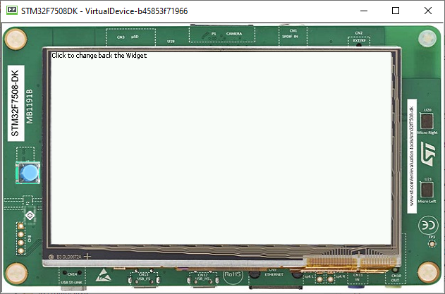

Hiding a Widget
====================
- To hide a widget, it's possible to use desktops to show and hide then at will 
- in the sample below, The desktop will be exchanged with the one with the container/widget

Using Desktop To hide a widget
------------------------------

In the code Sample below, a button is created to change the Desktop when clicked:

.. code-block:: java

    MicroUI.start();
    Desktop desktop = new Desktop();
    Canvas c;
    Flow list = new Flow(Orientation");
    list.addChild(new Label("Label 1"));
    list.addChild(new Label("Label 2"));
    Button b = new Button("Click to change the Widget");
    Desktop desktop2 = new Desktop();
    b.setOnClickListener(new OnClickListener() {
        @Override
        public void onClick() {
            desktop2.setWidget(new Label("new Widget"));
            desktop2.requestShow();
        }
    });
    list.addChild(b);
    desktop.setWidget(list);
    desktop.requestShow();

A new desktop with a widget is created, this will hide the Desktop, to go back to the first desktop you do the same process of calling requestShow from the desktop

.. code-block:: java

    MicroUI.start();
    Desktop desktop = new Desktop();
    Canvas c;
    Flow list = new Flow(LayoutOrientation.HORIZONTAL);
    list.addChild(new Label("Label 1"));
    list.addChild(new Label("Label 2"));
    Button b = new Button("Click to change the Widget");
    Desktop desktop2 = new Desktop();
    b.setOnClickListener(new OnClickListener() {
        @Override
        public void onClick() {
            Button b2 = new Button("Click to change back the Widget");
            b2.setOnClickListener(new OnClickListener() {
                @Override
                public void onClick() {
                    desktop.requestShow();
                }
            });
            desktop2.setWidget(b2);
            desktop2.requestShow();
        }
    });
    list.addChild(b);
    desktop.setWidget(list);
    desktop.requestShow();

Using a Hideable Container to Hide a Widget
-------------------------------------------

It is also possible to use a Hideable Container, which will render selectively the its children widget

On the widget hierarchy, a container is also a Widget, so if this Widget is a sibling of any other widget, There should be no Issues
.. code-block:: java
    
    	public class HideableContainer extends OverlapContainer {

		private boolean visibility = true;

		public boolean isVisible() {
			return this.visibility;
		}

		public void setVisible(boolean visible) {
			if (this.visibility != visible) {
				this.visibility = visible;
				this.setEnabled(visible);
				Container parent = this.getParent();
				if (parent != null) {
					parent.requestRender();
				}
			}
		}

		@Override
		public void render(GraphicsContext g) {
			if (this.visibility) {
				super.render(g);
			}
		}
	}

Adding this to a button in the DemoWidget sample application yields these results

After clicking the Button

.. image:: images/hideableContainerHidden.png

