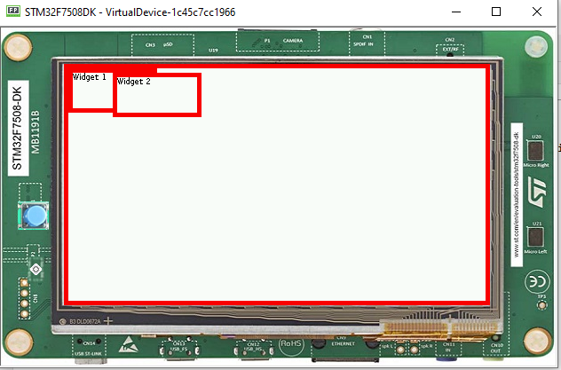
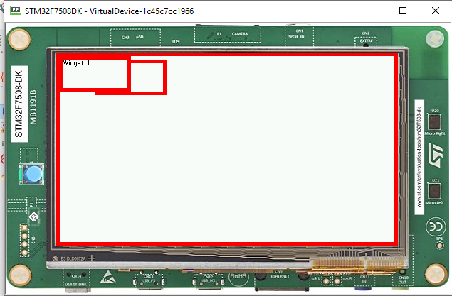
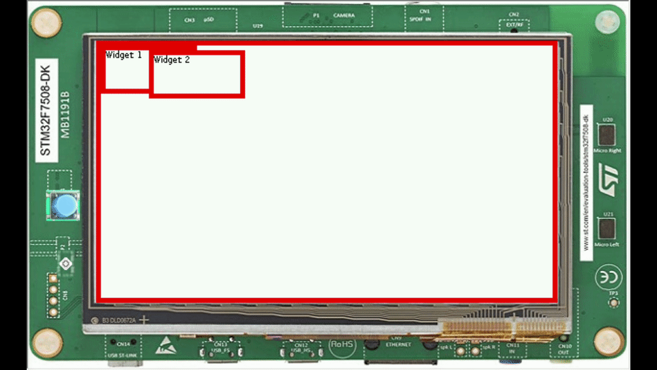

Overlap Render Policy
======================
Introduction
-------------
The MWT library implements two `render policies <https://docs.microej.com/en/latest/ApplicationDeveloperGuide/UI/MWT/concepts.html#render-policy>`_: the ``DefaultRenderPolicy`` and the ``OverlapRenderPolicy``:

* ``DefaultRenderPolicy``: renders the specified widget. If the widget is transparent, it renders its parent in the same way (and recursively).
* ``OverlapRenderPolicy``: not only renders the specified widget but also the other widgets that overlap with it.

While the ``DefaultRenderPolicy`` will be the perfect match for most UI designs, it will not handle the case where widgets overlap. In this case, the ``OverlapRenderPolicy`` will be the render policy to choose in order to avoid rendering inconsistencies.

Overlapping Widgets
-------------------
A widget is said to overlap with another when:
* their boundaries intersect
* it comes after in the widget tree (depth-first search)
Here is a snippet of code that displays two widgets that overlap:

.. code-block:: java

    public class Main {

    public static void main(String[] args) {
            MicroUI.start();

            Desktop desktop = new Desktop();

            // Simple style to show the border of the two widgets.
            CascadingStylesheet stylesheet = new CascadingStylesheet();
            EditableStyle style = stylesheet.getDefaultStyle();
            style.setBorder(new RectangularBorder(Colors.RED, 5));
            desktop.setStylesheet(stylesheet);

            // Use a Canvas to overlap two widgets.
            Canvas root = new Canvas();
            Label widget1 = new Label("Widget 1");
            Label widget2 = new Label("Widget 2");

            // Widget 1 is added after Widget 2
            root.addChild(widget2, 50, 5, 100, 50);
            root.addChild(widget1, 0, 0, 100, 50);

            desktop.setWidget(root);
            Display.getDisplay().requestShow(desktop);
        }
    }

Here is the result:

- Adding widget 1 after widget 2

.. code-block:: java
        
    root.addChild(widget2, 50, 5, 100, 50);
    root.addChild(widget1, 0, 0, 100, 50);

As expected, widget 1 overlaps widget 2. So far, the ``DefaultRenderPolicy`` is being used and it provides good results: the widgets of the desktop are rendered recursively in order after the call to ``Display.getDisplay().requestShow(desktop)``.

Rendering the Widgets
--------------------------
Let's see how the ``DefaultRenderPolicy`` performs when a widget is requested to render.
In most cases, a widget is requested to render when its content has been updated (e.g. the value displayed has changed). Here, we use a small loop to repaint each widget in turn:

.. code-block:: java

    while (true) {
        try {
            Thread.sleep(1000);
        } catch (InterruptedException e) {
        }
        System.out.println("Render Widget 1");
        widget1.requestRender();

        try {
            Thread.sleep(1000);
        } catch (InterruptedException e) {

        }
        System.out.println("Render Widget 2");
        widget2.requestRender();
    }

The widgets should alternate as shown below:

When a widget is requested to render, it is rendered on top of the other widgets, regardless of their order in the widget hierarchy.
Unlike the ``DefaultRenderPolicy``, the ``OverlapRenderPolicy`` will inspect the relative order of other widgets when rendering a widget. Widgets that comes later in the widget tree (depth-first search) will be rendered too, if their boundaries intersect those of the widget.
Overriding the method ``createRenderPolicy()`` of the desktop, as follows, will cause the ``OverlapRenderPolicy`` to be applied when rendering widgets:
  
.. code-block:: java

    Desktop desktop = new Desktop() {
        @Override
        protected RenderPolicy createRenderPolicy() {
            return new OverlapRenderPolicy(this);
        }
    };

Here is the result when using the ``OverlapRenderPolicy``:

