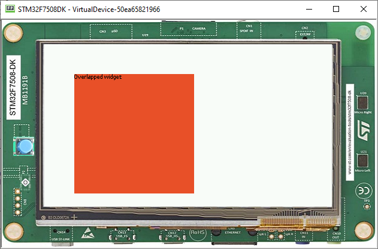

How to Use the Overlap Render Policy
====================================

The MWT library implements two :ref:`render policies <section_render_policy>`: the `DefaultRenderPolicy`_ and the `OverlapRenderPolicy`_:

* ``DefaultRenderPolicy``: renders the specified widget. If the widget is transparent, it renders its parent (and recursively).
* ``OverlapRenderPolicy``: renders the specified widget but also the other widgets that overlap with it.

While the ``DefaultRenderPolicy`` will be fine for most GUIs, it will not handle properly the case where widgets overlap. In this case, the ``OverlapRenderPolicy`` will be the best match.

.. _DefaultRenderPolicy: https://repository.microej.com/javadoc/microej_5.x/apis/ej/mwt/render/DefaultRenderPolicy.html
.. _OverlapRenderPolicy: https://repository.microej.com/javadoc/microej_5.x/apis/ej/mwt/render/OverlapRenderPolicy.html

Making Widgets Overlap
----------------------

A widget is said to overlap with another when:

* their boundaries intersect
* it comes after in the widget tree (depth-first search)

The following snippet displays two widgets that overlap:

.. code-block:: java
    :emphasize-lines: 9,11

    public static void main(String[] args) {
        MicroUI.start();

        Desktop desktop = new Desktop();

        // make two widgets overlap in a Canvas container
        Canvas rootWidget = new Canvas();
        final Button overlapped = new Button("Overlapped widget");
        rootWidget.addChild(overlapped, 50, 50, 200, 200);
        final Label overlapping = new Label("Overlapping widget");
        rootWidget.addChild(overlapping, 125, 75, 100, 50);
        desktop.setWidget(rootWidget);

        // the overlapping widget is silver
        CascadingStylesheet stylesheet = new CascadingStylesheet();
        EditableStyle style = stylesheet.getSelectorStyle(new TypeSelector(Label.class));
        style.setBackground(new RectangularBackground(Colors.SILVER));

        // the overlapped widget is orange
        style = stylesheet.getSelectorStyle(new TypeSelector(Button.class));
        style.setBackground(new RectangularBackground(0xee502e));
        desktop.setStylesheet(stylesheet);

        desktop.requestShow();
    }

As expected from the `addChild()`_ sequence, the widget ``overlapping`` overlaps the widget ``overlapped``:

So far, the ``DefaultRenderPolicy`` is being used and it seems to look fine: the widgets of the desktop are rendered successively in depth-first order after the call to `desktop.requestShow()`_.

.. _addChild(): https://repository.microej.com/javadoc/microej_5.x/apis/ej/widget/container/Canvas.html#addChild-ej.mwt.Widget-int-int-int-int-
.. _desktop.requestShow(): https://repository.microej.com/javadoc/microej_5.x/apis/ej/mwt/Desktop.html#requestShow--

Requesting a New Render
-----------------------

Let's see how the ``DefaultRenderPolicy`` performs when the widget ``overlapped`` is requested to render again.
In most cases, a widget is requested to render when its content has been updated (e.g. the value displayed has changed). 
For demonstration purposes, let's introduce a mean to trigger a new render: each time the user clicks on the widget ``overlapped``, it will request the widget to render.

The snippet above shows how to do that, by adding an `OnClickListener`_ to the ``overlapped`` widget:

.. code-block:: java
    :emphasize-lines: 5

    overlapped.setOnClickListener(new OnClickListener() {
        
        @Override
        public void onClick() {
            overlapped.requestRender();
        }
    });

When the user clicks on the widget ``overlapped``, the widget is rendered again but not the widget ``overlapping``. 
As a consequence, the widget that overlaps is not displayed anymore:

When using the ``DefaultRenderPolicy``, widgets are rendered regardless of their order in the widget hierarchy.
However, the ``OverlapRenderPolicy`` will take account of the relative order of the other widgets: widgets that come after in the widget tree will be rendered if their boundaries intersect those of the widget.

.. _OnClickListener: https://repository.microej.com/javadoc/microej_5.x/apis/ej/widget/basic/OnClickListener.html

Using the OverlapRenderPolicy
-----------------------------

Overriding the method `createRenderPolicy()`_ of the `Desktop`_, as follows, will cause the ``OverlapRenderPolicy`` to be used when rendering widgets:
  
.. code-block:: java
    :emphasize-lines: 4

    Desktop desktop = new Desktop() {
        @Override
        protected RenderPolicy createRenderPolicy() {
            return new OverlapRenderPolicy(this);
        }
    };

Now, both widgets will be displayed correctly when they are requested to render.

As a conclusion, favor the ``OverlapRenderPolicy`` when a GUI uses overlapping elements. 
Note that this render policy is slightly more time-consuming because it traverses the widget tree to determine which widgets are overlapping with each other.

.. _createRenderPolicy(): https://repository.microej.com/javadoc/microej_5.x/apis/ej/mwt/Desktop.html#createRenderPolicy--
.. _Desktop: https://repository.microej.com/javadoc/microej_5.x/apis/ej/mwt/Desktop.html

..
   | Copyright 2008-2022, MicroEJ Corp. Content in this space is free 
   for read and redistribute. Except if otherwise stated, modification 
   is subject to MicroEJ Corp prior approval.
   | MicroEJ is a trademark of MicroEJ Corp. All other trademarks and 
   copyrights are the property of their respective owners.
