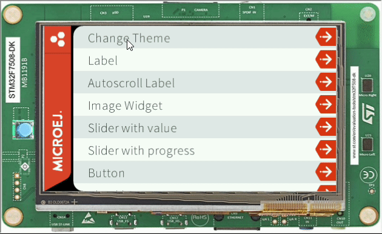

Theming with MicroEJ
=====================

- MicroEJ a cascading stylesheet, it's possible to change it according to each screen
- For this example, Demo-Widget will be used, since it already has a well defined stylesheet and color scheme

Defining Themes
-----------------
In this example, a light and a dark theme will be created, since the Demo Widget it's already in a dark color scheme, Only the attributes will be changed
  
Also, A Theme class will be created to handle the two themes
  
Theme Class

.. code-block:: java

    public int DEFAULT_BACKGROUND = 0;
    public int ALTERNATE_BACKGROUND = 0;
    public int DEFAULT_FOREGROUND = 0;
    public int DEFAULT_BORDER = 0;
    public int EMPTY_SPACE = 0;
    public int CORAL = 0;
    public int ABSINTHE = 0;
    public int POMEGRANATE = 0;

    private static Theme lightTheme = new LightTheme();
    private static Theme darkTheme = new DarkTheme();;

    Theme() {
    }

    public static final Theme getLightThemeInstance() {

        return lightTheme;
    }

    public static final Theme getDarkThemeInstance() {

        return darkTheme;
    }

Dark Theme Class

.. code-block:: java

    public class DarkTheme extends Theme {
        DarkTheme() {

            this.DEFAULT_BACKGROUND = 0x262a2c;
            this.ALTERNATE_BACKGROUND = 0x4b5357;
            this.DEFAULT_FOREGROUND = 0xffffff;
            this.DEFAULT_BORDER = 0x97a7af;
            this.EMPTY_SPACE = Colors.BLACK;
            this.CORAL = 0xee502e;
            this.ABSINTHE = 0x6cc24a;
            this.POMEGRANATE = 0xcf4520;
        }
    }

Light Theme Class

.. code-block:: java

    public class LightTheme extends Theme {

        LightTheme() {
            this.DEFAULT_BACKGROUND = 0xffffff;
            this.ALTERNATE_BACKGROUND = 0x4b5357;
            this.DEFAULT_FOREGROUND = 0x262a2c;
            this.DEFAULT_BORDER = 0x97a7af;
            this.EMPTY_SPACE = Colors.BLACK;
            this.CORAL = 0xee502e;
            this.ABSINTHE = 0x6cc24a;
            this.POMEGRANATE = 0xcf4520;
        }
    }

At the demo Colors class, to apply a theme, This method will be added

.. code-block:: java

    public static void applyTheme(Theme t) {
        DEFAULT_BACKGROUND = t.DEFAULT_BACKGROUND;
        ALTERNATE_BACKGROUND = t.ALTERNATE_BACKGROUND;
        DEFAULT_FOREGROUND = t.DEFAULT_FOREGROUND;
        DEFAULT_BORDER = t.DEFAULT_BORDER;
        EMPTY_SPACE = t.EMPTY_SPACE;
        CORAL = t.CORAL;
        ABSINTHE = t.ABSINTHE;
        POMEGRANATE = t.POMEGRANATE;
    }

Adding a menu option to change the Theme
-----------------------------------------

To change the theme, a menu item will be created, and added, At `com.microej.demo.widget.main.MainPage` and at the Method getContentWidget();

.. code-block:: java

		MenuItem changetheme = new MenuItem("Change Theme");
		changetheme.addClassSelector(LIST_ITEM);
		list.addChild(changetheme);
		changetheme.setOnClickListener(new OnClickListener() {

			@Override
			public void onClick() {
				switch (SELECTED_THEME) {
				case DARK_THEME:
					SELECTED_THEME = LIGHT_THEME;
					Theme lightThemeInstance = Theme.getLightThemeInstance();
					assert lightThemeInstance != null;
					DemoColors.applyTheme(lightThemeInstance);
					break;
				case LIGHT_THEME:
					SELECTED_THEME = DARK_THEME;
					Theme darkThemeInstance = Theme.getDarkThemeInstance();
					assert darkThemeInstance != null;
					DemoColors.applyTheme(darkThemeInstance);
					break;
				}
			}

		});
	
this is how it should look like

