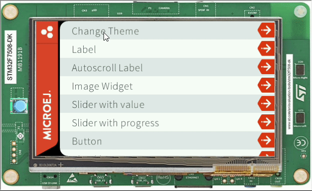
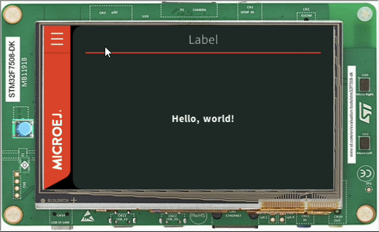

Theming with MicroEJ
=====================

- MicroEJ a cascading stylesheet, it's possible to change it according to each screen
- For this example, Demo-Widget will be used, since it already has a well defined stylesheet and color scheme

Defining Themes
-----------------
In this example, a light and a dark theme will be created, since the Demo Widget it's already in a dark color scheme, Only the attributes will be changed
  
Also, A Theme class will be created to handle the two themes
  
Theme Class

.. code-block:: java

    public int DEFAULT_BACKGROUND = 0;
    public int ALTERNATE_BACKGROUND = 0;
    public int DEFAULT_FOREGROUND = 0;
    public int DEFAULT_BORDER = 0;
    public int EMPTY_SPACE = 0;
    public int CORAL = 0;
    public int ABSINTHE = 0;
    public int POMEGRANATE = 0;

    private static Theme lightTheme = new LightTheme();
    private static Theme darkTheme = new DarkTheme();;

    Theme() {
    }

    public static final Theme getLightThemeInstance() {

        return lightTheme;
    }

    public static final Theme getDarkThemeInstance() {

        return darkTheme;
    }

Dark Theme Class

.. code-block:: java

    public class DarkTheme extends Theme {
        DarkTheme() {

            this.DEFAULT_BACKGROUND = 0x262a2c;
            this.ALTERNATE_BACKGROUND = 0x4b5357;
            this.DEFAULT_FOREGROUND = 0xffffff;
            this.DEFAULT_BORDER = 0x97a7af;
            this.EMPTY_SPACE = Colors.BLACK;
            this.CORAL = 0xee502e;
            this.ABSINTHE = 0x6cc24a;
            this.POMEGRANATE = 0xcf4520;
        }
    }

Light Theme Class

.. code-block:: java

    public class LightTheme extends Theme {

        LightTheme() {
            this.DEFAULT_BACKGROUND = 0xffffff;
            this.ALTERNATE_BACKGROUND = 0x4b5357;
            this.DEFAULT_FOREGROUND = 0x262a2c;
            this.DEFAULT_BORDER = 0x97a7af;
            this.EMPTY_SPACE = Colors.BLACK;
            this.CORAL = 0xee502e;
            this.ABSINTHE = 0x6cc24a;
            this.POMEGRANATE = 0xcf4520;
        }
    }

At the demo Colors class, to apply a theme, This method will be added

.. code-block:: java

    public static void applyTheme(Theme t) {
        DEFAULT_BACKGROUND = t.DEFAULT_BACKGROUND;
        ALTERNATE_BACKGROUND = t.ALTERNATE_BACKGROUND;
        DEFAULT_FOREGROUND = t.DEFAULT_FOREGROUND;
        DEFAULT_BORDER = t.DEFAULT_BORDER;
        EMPTY_SPACE = t.EMPTY_SPACE;
        CORAL = t.CORAL;
        ABSINTHE = t.ABSINTHE;
        POMEGRANATE = t.POMEGRANATE;
    }

Adding a menu option to change the Theme
-----------------------------------------

To change the theme, a menu item will be created, and added, At `com.microej.demo.widget.main.MainPage` and at the Method getContentWidget();

.. code-block:: java

		MenuItem changetheme = new MenuItem("Change Theme");
		changetheme.addClassSelector(LIST_ITEM);
		list.addChild(changetheme);
		changetheme.setOnClickListener(new OnClickListener() {

			@Override
			public void onClick() {
				switch (SELECTED_THEME) {
				case DARK_THEME:
					SELECTED_THEME = LIGHT_THEME;
					Theme lightThemeInstance = Theme.getLightThemeInstance();
					assert lightThemeInstance != null;
					DemoColors.applyTheme(lightThemeInstance);
					break;
				case LIGHT_THEME:
					SELECTED_THEME = DARK_THEME;
					Theme darkThemeInstance = Theme.getDarkThemeInstance();
					assert darkThemeInstance != null;
					DemoColors.applyTheme(darkThemeInstance);
					break;
				}
			}

		});
	
this is how it should look like

Improving theming
-------------------------------------

Now, some changes are going to be made 

Extract the onClick() code to a method in navigation

.. code-block:: java

    	public static void applyTheme(Page caller) {
		switch (SELECTED_THEME) {
		case DARK_THEME:
			SELECTED_THEME = LIGHT_THEME;
			Theme lightThemeInstance = Theme.getLightThemeInstance();
			assert lightThemeInstance != null;
			DemoColors.applyTheme(lightThemeInstance);
			break;
		case LIGHT_THEME:
			SELECTED_THEME = DARK_THEME;
			Theme darkThemeInstance = Theme.getDarkThemeInstance();
			assert darkThemeInstance != null;
			DemoColors.applyTheme(darkThemeInstance);
			break;
		}

	}

The mainpage MenuItem OnClickListener should look like this

.. code-block:: java

    changetheme.setOnClickListener(new OnClickListener() {

    @Override
    public void onClick() {
        Navigation.applyTheme(callee);
    }

    });

add two more fields on DemoColors

.. code-block:: java

    public static int EVEN = 0;

    public static int ODD = 0;

also adding both fields to the theme code

The colors added to the DarkTheme Constructor

.. code-block:: java

    this.EVEN = Colors.WHITE;
    this.ODD = 0xe5e9eb;

The colors added to the LightTheme Constructor

.. code-block:: java

    this.ODD = Colors.WHITE;
    this.EVEN = Colors.WHITE;

to make the changes more visible, let's add this to the ScrollableList at MainPage

.. code-block:: java

    public void populateStylesheet(CascadingStylesheet stylesheet) {
    EditableStyle style = stylesheet.getSelectorStyle(new TypeSelector(Scrollbar.class));
    style.setDimension(new FixedDimension(2, Widget.NO_CONSTRAINT));
    style.setPadding(new UniformOutline(1));
    style.setColor(GRAY);
    style.setBackground(new RectangularBackground(DemoColors.EMPTY_SPACE));

    style = stylesheet.getSelectorStyle(new ClassSelector(LIST_ITEM));
    style.setColor(DemoColors.ALTERNATE_BACKGROUND);
    style.setPadding(
            new FlexibleOutline(LIST_ITEM_PADDING_TOP, 0, LIST_ITEM_PADDING_BOTTOM, LIST_ITEM_PADDING_LEFT));
    style.setHorizontalAlignment(Alignment.LEFT);
    style.setBackground(new GoToBackground(DemoColors.EVEN));

    style = stylesheet.getSelectorStyle(new TypeSelector(Scroll.class));
    style.setBackground(new RectangularBackground(Colors.WHITE));

    style = stylesheet
            .getSelectorStyle(new AndCombinator(new ClassSelector(LIST_ITEM), OddChildSelector.ODD_CHILD_SELECTOR));
    style.setBackground(new GoToBackground(DemoColors.ODD));
    }

add the option to changed the theme

.. code-block:: java
		
        Toggle toggle3 = new Toggle("Dark theme") { //$NON-NLS-1$
			@Override
			public boolean handleEvent(int event) {

				int type = Event.getType(event);
				if (type == Pointer.EVENT_TYPE) {
					int action = Buttons.getAction(event);
					if (action == Buttons.RELEASED) {
						Navigation.applyTheme(callee);
					}
				}
				return super.handleEvent(event);
			}
		};

Also, a checking is needed when the theme is changed from the Item on the List, or from the toggle button, the applyTheme method should look like this

.. code-block:: java

    public static void applyTheme(Page caller) {
    switch (SELECTED_THEME) {
    case DARK_THEME:
        SELECTED_THEME = LIGHT_THEME;
        Theme lightThemeInstance = Theme.getLightThemeInstance();
        assert lightThemeInstance != null;
        DemoColors.applyTheme(lightThemeInstance);
        break;
    case LIGHT_THEME:
        SELECTED_THEME = DARK_THEME;
        Theme darkThemeInstance = Theme.getDarkThemeInstance();
        assert darkThemeInstance != null;
        DemoColors.applyTheme(darkThemeInstance);
        break;
    }
    final Desktop mainDesktop2 = mainDesktop;
    if (caller instanceof MainPage) {

        assert mainDesktop2 != null;
        mainDesktop2.setStylesheet(createStylesheet(caller));
        mainDesktop2.requestLayOut();
        Display.getDisplay().requestShow(mainDesktop2);

    } else {
        assert mainDesktop2 != null;
        mainDesktop2.setStylesheet(createStylesheet(new MainPage()));
        Display.getDisplay().getDisplayable();
        updateTitleBar(false);
        Desktop desktop = createDesktop(caller);
        desktop.setStylesheet(createStylesheet(caller));
        desktop.requestLayOut();
        Display.getDisplay().requestShow(desktop);
    }

}

the final result should look like this

