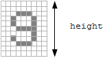
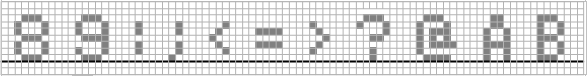
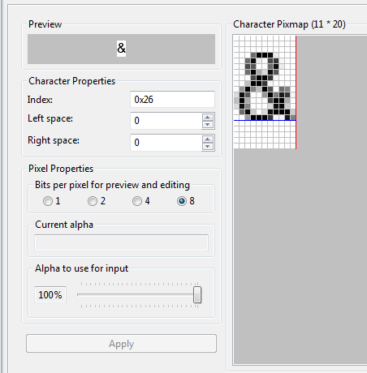
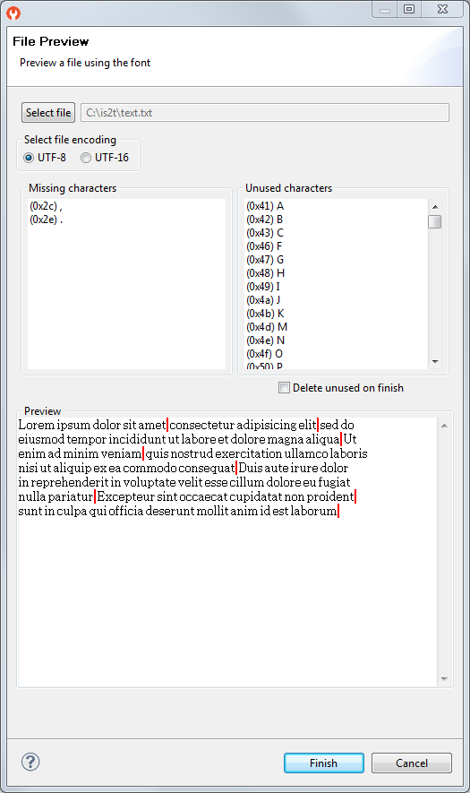

.. _section.tool.fontdesigner:

=============
Font Designer
=============

Principle
=========

The Font Designer module is a graphical tool (Eclipse plugin) that runs
within the MicroEJ IDE used to build and edit MicroUI fonts. It
stores fonts in a platform-independent format.

Functional Description
======================

.. figure:: images/designer_font-process2.*
   :alt: Font Generation
   :scale: 70%
   :align: center

   Font Generation

Font Management
===============

Create a MicroEJ Font
---------------------

To create a MicroEJ font, follow the steps below:

1. Open the Eclipse wizard:
   :guilabel:`File` > :guilabel:`New` > :guilabel:`Other…` > :guilabel:`MicroEJ` > :guilabel:`MicroEJ Font`.

2. Select a directory and a name.

3. Click Finish.

Once the font is created, a new editor is opened: the MicroEJ Font
Designer.

Edit a MicroEJ Font
-------------------

You can edit your font with the MicroEJ Font Designer (by
double-clicking on a ``*.ejf`` file or after running the new MicroEJ
Font wizard).

This editor is divided into three main parts:

-  The top left part manages the main font properties.

-  The top right part manages the character to embed in your font.

-  The bottom part allows you to edit a set of characters or an
   individual character.

Main Properties
~~~~~~~~~~~~~~~

The main font properties are:

-  font size: height and width (in pixels).

-  baseline (in pixels).

-  space character size (in pixels).

-  styles and filters.

-  identifiers.

Refer to the following sections for more information about these
properties.

Font Height
^^^^^^^^^^^

A font has a fixed height. This height includes the white pixels at the
top and at the bottom of each character simulating line spacing in
paragraphs.

   Font Height

Font Width: Proportional and Monospace Fonts
^^^^^^^^^^^^^^^^^^^^^^^^^^^^^^^^^^^^^^^^^^^^

A monospace font is a font in which all characters have the same width.
For example a '!' representation will be the same width as a 'w' (they
will be in the same size rectangle of pixels). In a proportional font, a
'w' will be wider than a '!'.

A monospace font usually offers a smaller memory footprint than a
proportional font because the Font Designer does not need to store the
size of each character. As a result, this option can be useful if the
difference between the size of the smallest character and the biggest
one is small.

Baseline
^^^^^^^^

Characters have a baseline: an imaginary line on top of which the
characters seem to stand. Note that characters can be partly under the
line, for example, 'g' or '}'.

   The Baseline

Space Character
^^^^^^^^^^^^^^^

The Space character (0x20) is a specific character because it has no
filled pixels. From the Main Properties Menu you can fix the space
character size in pixels.

.. note::

   When the font is monospace, the space size is equal to the font
   width.

.. _section.tool.fontdesigner.styles:

Styles
^^^^^^

Font Designer allows creating a font file that holds several combinations of built-in styles (styles hardcoded in pixels map) and runtime styles (styles rendered dynamically at runtime). However, since MicroUI 3, a MicroUI font holds only one style: ``PLAIN``, ``BOLD``, ``ITALIC`` or ``BOLD + ITALIC``. 

Font Designer features three drop-downs, one for each of ``BOLD``, ``ITALIC``, and ``UNDERLINED``. Each drop-down has three options: ``None``, ``Built-in`` and ``Dynamic``. The font options must be adjusted to be compatible with MicroUI 3:

* The style option ``Dynamic`` (that targets the runtime style) is forbidden; select ``None`` instead.
* The syle ``UNDERLINED`` is forbidden; select ``None`` instead.

The styles options ``Built-in`` tag the font as bold, italic, or bold and italic. This style can be retrieved by the MicroEJ Application thanks the methods `Font.isBold() <https://repository.microej.com/javadoc/microej_5.x/apis/ej/microui/display/Font.html#isBold-->`_ and `Font.isItalic() <https://repository.microej.com/javadoc/microej_5.x/apis/ej/microui/display/Font.html#isItalic-->`_. Adjust the styles options according to the font:

* The font is a `plain` font: select ``None`` option for each style.
* The font is a `bold` font: select ``Built-in`` for the style `bold` and ``None`` for the other styles.
* The font is an `italic` font: select ``Built-in`` for the style `italic` and ``None`` for the other styles.
* The font is a `bold` and `italic` font: select ``Built-in`` for the styles `bold` and `italic` and ``None`` for ``UNDERLINED``.

.. warning:: When a font holds a dynamic style or when the style ``UNDERLINED`` is not ``None``, an error at MicroEJ application compile-time is thrown (incompatible font file).

Identifiers
^^^^^^^^^^^

A number of identifiers can be attached to a MicroUI font. At least one
identifier is required to specify the font. Identifiers are a mechanism
for specifying the contents of the font – the set or sets of characters
it contains. The identifier may be a standard identifier (for example,
LATIN) or a user-defined identifier. Identifiers are numbers, but
standard identifiers, which are in the range 0 to 80, are typically
associated with a handy name. A user-defined identifier is an identifier
with a value of 81 or higher.

Character List
~~~~~~~~~~~~~~

The list of characters can be populated through the import button, which
allows you to import characters from system fonts, images or another
MicroEJ font.

Import from System Font
^^^^^^^^^^^^^^^^^^^^^^^

This page allows you to select the system font to use (left part) and
the range of characters. There are predefined ranges of characters below
the font selection, as well as a custom selection picker (for example
0x21 to 0xfe for Latin characters).

The right part displays the selected characters with the selected font.
If the background color of a displayed character is red, it means that
the character is too large for the defined height, or in the case of a
monospace font, it means the character is too high or too wide. You can
then adjust the font properties (font size and style) to ensure that
characters will not be truncated.

When your selection is done, click the Finish button to import this
selection into your font.

Import from Images
^^^^^^^^^^^^^^^^^^

This page allows the loading of images from a directory. The images must
be named as follows: ``0x[UTF-8].[extension]``.

When your selection is done, click the Finish button to import the
images into your font.

Character Editor
~~~~~~~~~~~~~~~~

When a single character is selected in the list, the character editor is
opened.

   Character Editor

You can define specific properties, such as left and right space, or
index. You can also draw the character pixel by pixel - a left-click in
the grid draws the pixel, a right-click erases it.

The changes are not saved until you click the Apply button. When changes
are applied to a character, the editor shows that the font has changed,
so you can now save it.

The same part of the editor is also used to edit a set of characters
selected in the top right list. You can then edit the common editable
properties (left and right space) for all those characters at the same
time.

Working With Anti-Aliased Fonts
^^^^^^^^^^^^^^^^^^^^^^^^^^^^^^^

By default, when characters are imported from a system font, each pixel
is either fully opaque or fully transparent. Fully opaque pixels show as
black squares in the character grid in the right-hand part of the
character editor; fully transparent pixels show as white squares.

However, the pixels stored in an ``ejf`` file can take one of 256
grayscale values. A fully-transparent pixel has the value 255 (the RGB
value for white), and a fully-opaque pixel has the value 0 (the RGB
value for black). These grayscale values are shown in parentheses at the
end of the text in the Current alpha field when the mouse cursor hovers
over a pixel in the grid. That field also shows the transparency level
of the pixel, as a percentage, where 100% means fully opaque.

It is possible to achieve better-looking characters by using a
combination of fully-opaque and partially-transparent pixels. This
technique is called *anti-aliasing*. Anti-aliased characters can be
imported from system fonts by checking the anti aliasing box in the
import dialog. The '&' character shown in the screenshot above was
imported using anti aliasing, and you can see the various gray levels of
the pixels.

When the Font Generator converts an ``ejf`` file into the raw format
used at runtime, it can create fonts with characters that have 1, 2, 4
or 8 bits-per-pixel (bpp). If the raw font has 8 bpp, then no conversion
is necessary and the characters will render with the same quality as
seen in the character editor. However, if the raw font has less than 8
bpp (the default is 1 bpp) any gray pixels in the input file are
compressed to fit, and the final rendering will be of lower quality (but
less memory will be required to hold the font).

It is useful to be able to see the effects of this compression, so the
character editor provides radio buttons that allow the user to preview
the character at 1, 2, 4, or 8 bpp. Furthermore, when 2, 4 or 8 bpp is
selected, a slider allows the user to select the transparency level of
the pixels drawn when the left mouse button is clicked in the grid.

Previewing a Font
~~~~~~~~~~~~~~~~~

You can preview your font by pressing the Preview... button, which opens
the Preview wizard. In the Preview wizard, press the Select File button,
and select a text file which contains text that you want to see rendered
using your font. Characters that are in the selected text file but not
available in the font will be shown as red rectangles.

   Font Preview

Removing Unused Characters
~~~~~~~~~~~~~~~~~~~~~~~~~~

In order to reduce the size of a font file, you can reduce the number of
characters in your font to be only those characters used by your
application. To do this, create a file which contains all the characters
used by your application (for example, concatenating all your NLS files
is a good starting point). Then open the Preview wizard as described
above, selecting that file. If you select the check box Delete unused on
finish, then those characters that are in the font but not in the text
file will be deleted from the font when you press the Finish button,
leaving your font containing the minimum number of characters. As this
font will contain only characters used by a specific application, it is
best to prepare a "complete" font, and then apply this technique to a
copy of that font to produce an application specific cut-down version of
the font.

Use a MicroEJ Font
------------------

A MicroEJ Font must be converted to a format which is specific to the
targeted platform. The Font Generator tool performs this operation for
all fonts specified in the list of fonts configured in the application
launch.

Dependencies
============

No dependency.

Installation
============

The Font Designer module is already installed in the MicroEJ environment. 

Use
===

Create a new ``ejf`` font file or open an existing one in order to open
the Font Designer plugin.

..
   | Copyright 2008-2022, MicroEJ Corp. Content in this space is free 
   for read and redistribute. Except if otherwise stated, modification 
   is subject to MicroEJ Corp prior approval.
   | MicroEJ is a trademark of MicroEJ Corp. All other trademarks and 
   copyrights are the property of their respective owners.
