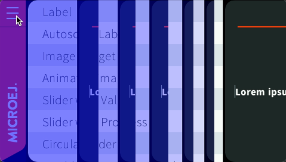

Rendering
=========

Clipping Region
---------------

The clipping region is a rectangle used to restrict the drawing operations.
It is usually refered more simply as clip.

The clip can be set on any ``GraphicsContext`` with:

- `GraphicsContext.setClip(int, int, int, int)`_: sets the clipping area to the given rectangle.
- `GraphicsContext.intersectClip(int, int, int, int)`_: sets the clipping area to the intersection between the current clipping area and the given rectangle.
- `GraphicsContext.resetClip()`_: resets the clipping area to the entire bounds of the graphics context.

The clip can be retrieved with:

- `GraphicsContext.getClipX()`_: gets the x coordinate of the clipping area.
- `GraphicsContext.getClipY()`_: gets the y coordinate of the clipping area.
- `GraphicsContext.getClipWidth()`_: gets the width of the clipping area.
- `GraphicsContext.getClipHeight()`_: gets the height of the clipping area.

.. _GraphicsContext.setClip(int, int, int, int): https://repository.microej.com/javadoc/microej_5.x/apis/ej/microui/display/GraphicsContext.html#setClip-int-int-int-int-
.. _GraphicsContext.intersectClip(int, int, int, int): https://repository.microej.com/javadoc/microej_5.x/apis/ej/microui/display/GraphicsContext.html#intersectClip-int-int-int-int-
.. _GraphicsContext.resetClip(): https://repository.microej.com/javadoc/microej_5.x/apis/ej/microui/display/GraphicsContext.html#resetClip--
.. _GraphicsContext.getClipX(): https://repository.microej.com/javadoc/microej_5.x/apis/ej/microui/display/GraphicsContext.html#getClipX--
.. _GraphicsContext.getClipY(): https://repository.microej.com/javadoc/microej_5.x/apis/ej/microui/display/GraphicsContext.html#getClipY--
.. _GraphicsContext.getClipWidth(): https://repository.microej.com/javadoc/microej_5.x/apis/ej/microui/display/GraphicsContext.html#getClipWidth--
.. _GraphicsContext.getClipHeight(): https://repository.microej.com/javadoc/microej_5.x/apis/ej/microui/display/GraphicsContext.html#getClipHeight--

Translation Vector
------------------

It is possible to modify the origin of a ``GraphicsContext`` by setting a translation vector.
This origin will be used by all drawing operations to translate the given coordinates.
In other words, the translation x and y coordinates will be added to the x and y coordinates given to the subsequent drawing operations.

The translation coordinates can be negative.

The translation can be set on any ``GraphicsContext`` with:

- `GraphicsContext.setTranslation(int, int)`_: sets the translation coordinates.
- `GraphicsContext.translate(int, int)`_: adds the given coordinates to the current translation coordinates.
- `GraphicsContext.resetTranslation()`_: resets the translation coordinates to (0,0).

The translation can be retrieved with:

- `GraphicsContext.getTranslationX()`_: gets the x coordinate of the translation.
- `GraphicsContext.getTranslationY()`_: gets the y coordinate of the translation.

.. _GraphicsContext.setTranslation(int, int): https://repository.microej.com/javadoc/microej_5.x/apis/ej/microui/display/GraphicsContext.html#setTranslation-int-int-
.. _GraphicsContext.translate(int, int): https://repository.microej.com/javadoc/microej_5.x/apis/ej/microui/display/GraphicsContext.html#translate-int-int-
.. _GraphicsContext.resetTranslation(): https://repository.microej.com/javadoc/microej_5.x/apis/ej/microui/display/GraphicsContext.html#resetTranslation--
.. _GraphicsContext.getTranslationX(): https://repository.microej.com/javadoc/microej_5.x/apis/ej/microui/display/GraphicsContext.html#getTranslationX--
.. _GraphicsContext.getTranslationY(): https://repository.microej.com/javadoc/microej_5.x/apis/ej/microui/display/GraphicsContext.html#getTranslationY--

Rendering Pipeline
------------------

The Rendering Pipeline of a MicroUI application consists of two main phases: Render, and Flush.

1. *Render*: During this phase, the application executes its rendering code to perform the necessary drawing operations.
   The application can either draw the whole screen for each frame or just a part.
2. *Flush*: This phase involves copying the back buffer to the front buffer.
   The VEE Port performs this operation, and it is the responsibility of the VEE Port developer to optimize this process, for example, by utilizing a GPU.

To reduce the number of pixels drawn, it may be interesting to redraw only subpart(s) of the display.
In this case, the *Render* phase consists in setting the clip to the desired region and then draw inside this region.
And again for each region to redraw.

Display Buffer Management
-------------------------

The display usually involves several buffers.
It may be for one or several of these reasons:

- the display has its own memory that is not mapped by the CPU,
- to avoid seeing the steps of the drawing (if the display reads in the same memory as the application is drawing to),
- to allow the application to draw more quickly after a flush,
- etc.

More information can be found in the :ref:`section_display` section of the VEE Porting Guide.

When the buffer used to draw is changed after a flush, the new buffer needs to be "refreshed" with the content of the previous buffer to avoid glitches.
This copy is managed by the Buffer Refresh Strategy (BRS).
To save some copy time, the BRS optimizes the refreshed region.
For example, if the full screen is drawn, nothing needs to be restored (the same goes if the very same zone is drawn several times in a row).
More information can be found in the :ref:`section_brs` section of the VEE Porting Guide.

The BRS has two ways to detect the drawn regions.
Both are using the clip:

1. The first one does not require any action from the application, the BRS saves the clip when a drawing is done.
2. The second one consists in declaring the list of the regions that will be modified before starting the drawings.
   This is done by setting the clip and calling the `GraphicsContext.notifyDrawingRegion()`_ method for each region.
   Declaring the regions is advised when redrawing several parts of the display in the frames.

.. _GraphicsContext.notifyDrawingRegion(): https://repository.microej.com/javadoc/microej_5.x/apis/ej/microui/display/GraphicsContext.html#notifyDrawingRegion--

Since the refreshing is based on the clip, it means that all the pixels in the clip need to be drawn since they will not be refreshed.
In other words, the pixels left unchanged inside the clip may contain unexpected data that will create glitches in the display.

To detect such pixels, :ref:`an option can be set<refresh_dirty_regions>` that draw a colored rectangle when a clip is detected by the BRS.
If a pixel with that color is seen on the display, that means that it has not been drawn by the application.

   Example of animation with clip not correctly set.

   Example of animation with clip not correctly set with highlight option (``ej.fp.brs.dirtyColor=0x200000ff``).

..
   | Copyright 2008-2024, MicroEJ Corp. Content in this space is free 
   for read and redistribute. Except if otherwise stated, modification 
   is subject to MicroEJ Corp prior approval.
   | MicroEJ is a trademark of MicroEJ Corp. All other trademarks and 
   copyrights are the property of their respective owners.
