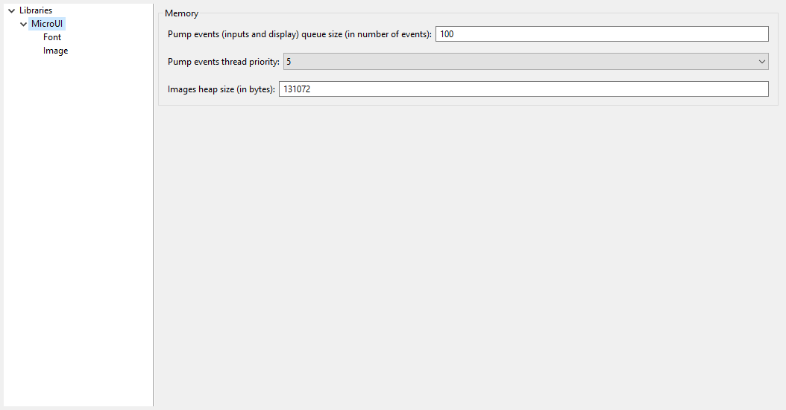
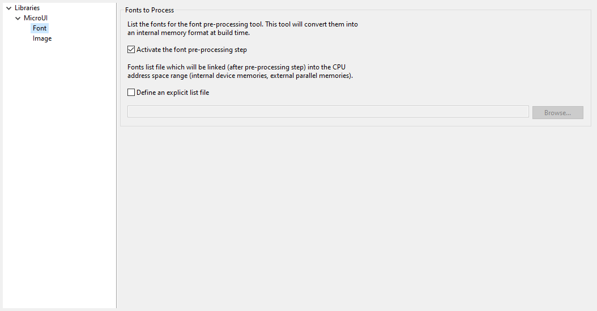
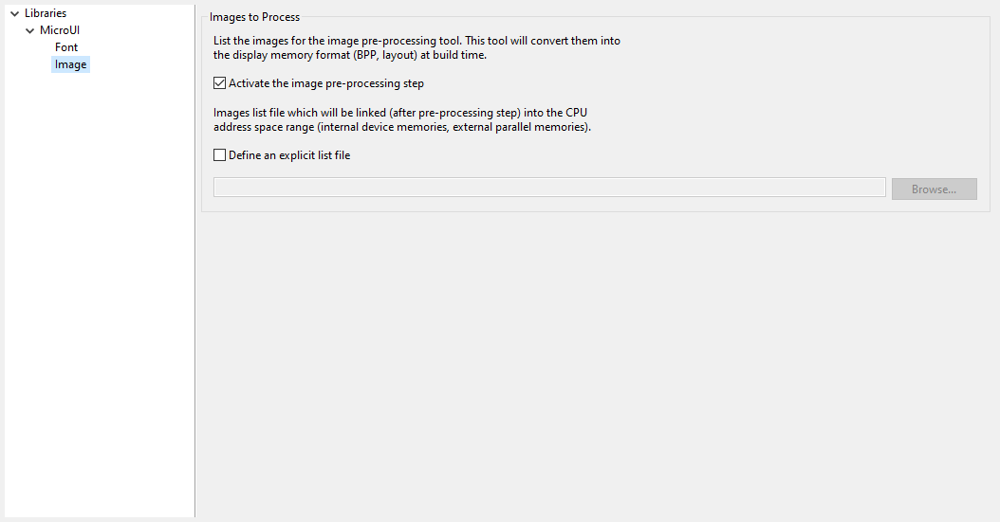

.. _section_ui_options_microui:

Category: Libraries
===================

Category: MicroUI
-----------------

Group: Memory
^^^^^^^^^^^^^

Option(text): Pump events (inputs and display) queue size (in number of events)
"""""""""""""""""""""""""""""""""""""""""""""""""""""""""""""""""""""""""""""""

*Option Name*: ``ej.microui.memory.queue.size``

*Default value*: ``100``

*Description*:

Specifies the size of the pump events queue.

Option(combo): Pump events thread priority
""""""""""""""""""""""""""""""""""""""""""

*Option Name*: ``com.microej.library.microui.pump.priority``

*Default value*: ``5``

*Available values*: ``1`` to ``10``

*Description*:

Specifies the priority of the pump events queue.

.. _section_ui_options_imagesheapsize:

Option(text): Images heap size (in bytes)
"""""""""""""""""""""""""""""""""""""""""

*Option Name*: ``ej.microui.memory.imagesheap.size``

*Default value*: ``131072``

*Description*:

Specifies the size of the images heap. This heap is used to store the dynamic
user images, the decoded images and the working buffers of embedded image
decoders (for instance the PNG decoder). A too small value can cause
OutOfMemory errors and incomplete drawings.

Category: Font
^^^^^^^^^^^^^^

Group: Fonts to Process
"""""""""""""""""""""""

*Description*:

This group allows to select a file describing the font files which need to be
converted into a RAW format. At MicroUI runtime, the pre-generated fonts will
be read from the flash memory without any modifications (see MicroUI
specification).

Option(checkbox): Activate the font pre-processing step
~~~~~~~~~~~~~~~~~~~~~~~~~~~~~~~~~~~~~~~~~~~~~~~~~~~~~~~

*Option Name*: ``ej.microui.fontConverter.useIt``

*Default value*: ``true``

*Description*:

When checked, enables the next option ``Fonts list`` file. When the next option
is disabled, there is no check on the file path validity.

Option(checkbox): Define an explicit list file
~~~~~~~~~~~~~~~~~~~~~~~~~~~~~~~~~~~~~~~~~~~~~~

*Option Name*: ``ej.microui.fontConverter.file.enabled``

*Default value*: ``false``

*Description*:

By default, list files are loaded from the classpath. When checked, only the
next option ``Fonts list`` file is processed.

Option(browse):
~~~~~~~~~~~~~~~~

*Option Name*: ``ej.microui.fontConverter.file``

*Default value*: ``(empty)``

*Description*:

Browse to select a font list file. Refer to Font Generator chapter for more
information about the font list file format.

Category: Image
^^^^^^^^^^^^^^^

Group: Images to Process
""""""""""""""""""""""""

*Description*:

This group allows to select a file describing the image files which need to
be converted into a RAW format. At MicroUI runtime, the pre-generated images
will be read from the flash memory without any modifications (see MicroUI
specification).

Option(checkbox): Activate the image pre-processing step
~~~~~~~~~~~~~~~~~~~~~~~~~~~~~~~~~~~~~~~~~~~~~~~~~~~~~~~~

*Option Name*: ``ej.microui.imageConverter.useIt``

*Default value*: ``true``

*Description*:

When checked, enables the next option ``Images list`` file. When the next
option is disabled, there is no check on the file path validity.

Option(checkbox): Define an explicit list file
~~~~~~~~~~~~~~~~~~~~~~~~~~~~~~~~~~~~~~~~~~~~~~

*Option Name*: ``ej.microui.imageConverter.file.enabled``

*Default value*: ``false``

*Description*:

By default, list files are loaded from the classpath. When checked, only the
next option ``Images list`` file is processed.

Option(browse):
~~~~~~~~~~~~~~~~

*Option Name*: ``ej.microui.imageConverter.file``

*Default value*: ``(empty)``

*Description*:

Browse to select an image list file. Refer to Image Generator chapter for
more information about the image list file format.

..
   | Copyright 2008-2023, MicroEJ Corp. Content in this space is free 
   for read and redistribute. Except if otherwise stated, modification 
   is subject to MicroEJ Corp prior approval.
   | MicroEJ is a trademark of MicroEJ Corp. All other trademarks and 
   copyrights are the property of their respective owners.