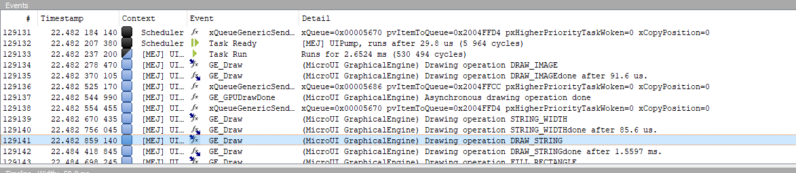

.. include:: ../../../VEEPortingGuide/uiReplaces.rst

.. _microui_traces:

Debug Traces
=============

MicroUI logs several actions when traces are enabled (see :ref:`event-tracing`). 
This chapter explains the trace identifiers.

.. note:: Most of the logs are only available on the Embedded VEE Port (not on the Simulator).

Trace format
------------

The trace output format is the following:

``[TRACE: MicroUI] Event AA(BB[CC],DD[EE])``

where:

- AA is the event identifier. See next table.
- BB is the first event data.
- CC is the index of the first event data (0x0).
- DD is the second event data.
- EE is the index of the second event data (0x1).
- etc.

For example, given the following trace output:

``[TRACE: MicroUI] Event 0x2(1[0x0],2[0x1],117571586[0x2])``

- 0x2 -> Execute native input event
- 1 -> Event “Button” (index 0x0)
- 2 -> Generator Id (index 0x1)
- 117571586 -> event data (index 0x2)

Trace identifiers
-----------------

The following tables describe some events data.

.. warning:: These tables are only compatible with the latest pack available (|UIPACKVERSION|).

.. list-table:: MicroUI Traces
   :widths: 10 60 30
   :header-rows: 1

   * - Event ID
     - Description
     - End of event
   * - 0x0 (0) 
     - Execute EventGenerator event ``%0%`` (see Event Type). Generator id is ``%1%`` and data is ``%2%``. 
     - End of ``%0%`` (see Event Type). 
   * - 0x1 (1) 
     - Drop event ``%0%``. 
     - 
   * - 0x2 (2) 
     - Execute native input event ``%0%`` (see Event Type). Generator id is ``%1%`` and data is ``%2%``. 
     - End of ``%0%`` (see Event Type). 
   * - 0x3 (3) 
     - Execute display event ``%0%`` (see Event Type). Event is ``%1%``. 
     - End of ``%0%`` (see Event Type). 
   * - 0x4 (4) 
     - Execute user event ``%0%``. 
     - End of ``%0%``. 
   * - 0x5 (5) 
     - Create new image using ``%0%`` algorithm (see Create Image). 
     - Image created, image identifier is ``%0%``. 
   * - 0x6 (6) 
     - New image characteristics ``%0%`` (see Image Type), identifier is ``%1%`` and memory size is ``%2%``. 
     - 
   * - 0xa (10) 
     - Flush start. Region (``%0%``, ``%1%``) (``%2%`` x ``%3%``). 
     - 
   * - 0xb (11) 
     - Flush done. 
     - 
   * - 0xc (12) 
     - Start drawing operation ``%0%`` (see Drawing Type). 
     - Drawing status ``%0%`` (see Drawing Status) 
   * - 0xd (13) 
     - Start drawing operation ``%0%`` (see Drawing Type). 
     - Drawing status ``%0%`` (see Drawing Status) 
   * - 0xf (15) 
     - Asynchronous drawing operation done. 
     - 
   * - 0x10 (16) 
     - Flush ``%0%`` from back buffer ``%1%`` start. Region (``%2%``, ``%3%``) (``%4%`` x ``%5%``). 
     - 
   * - 0x11 (17) 
     - Flush ``%0%`` done. New back buffer: ``%1%``. 
     - 
   * - 0x14 (20) 
     - Invalid input event ``%0%``. 
     - 
   * - 0x15 (21) 
     - Event queue is full, cannot add event ``%0%``. 
     - 
   * - 0x16 (22) 
     - Add event ``%0%`` at index ``%1%``; queue length is ``%2%``. 
     - 
   * - 0x17 (23) 
     - Replace event ``%0%`` by ``%1%`` at index ``%2%``; queue length is ``%3%``. 
     - 
   * - 0x18 (24) 
     - Read event ``%0%`` at index ``%1%``. 
     - 
   * - 0x28 (40) 
     - Start drawing operation ``%0%`` (see Drawing Type). 
     - Drawing status ``%0%`` (see Drawing Status) 
   * - 0x32 (50) 
     - [BRS] New drawing region (``%0%``, ``%1%``) to (``%2%``, ``%3%``) 
     - 
   * - 0x33 (51) 
     - [BRS] Flush LCD (id = ``%0%`` buffer = ``%1%``) with a single region (``%2%``, ``%3%``) to (``%4%``, ``%5%``) 
     - 
   * - 0x34 (52) 
     - [BRS] Flush LCD (id = ``%0%`` buffer = ``%1%``) with ``%2%`` regions 
     - 
   * - 0x35 (53) 
     - [BRS] Add a region (``%0%``, ``%1%``) to (``%2%``, ``%3%``) 
     - 
   * - 0x36 (54) 
     - [BRS] Remove a region (``%0%``, ``%1%``) to (``%2%``, ``%3%``) 
     - 
   * - 0x37 (55) 
     - [BRS] Restore a region (``%0%``, ``%1%``) to (``%2%``, ``%3%``) 
     - 
   * - 0x38 (56) 
     - [BRS] Clear the list of regions 
     - 
   * - 0x39 (57) 
     - [BRS] Restore a region (``%0%``, ``%1%``) (``%2%`` x ``%3%``) 
     - 
   * - 0x3c (60)
     - Get pixel from image ``%0%`` (``%1%``, ``%2%``)
     - 
   * - 0x3d (61)
     - Get ARGB array from image ``%0%`` region (``%1%``, ``%2%``) (``%3%`` x ``%4%``)
     -
   * - 0x3e (62)
     - Get string width (``%0%`` characters)
     -
   * - 0x3f (63)
     - Set foreground color: dest ``%0%`` color = ``%1%``
     -
   * - 0x40 (64)
     - Set background color: dest ``%0%`` color = ``%1%``
     -
   * - 0x41 (65)
     - Remove background color: dest ``%0%``
     -
   * - 0x42 (66)
     - Set clip: dest ``%0%`` region (``%1%``, ``%2%``) (``%3%`` x ``%4%``)
     -
   * - 0x43 (67)
     - Draw ing out of clip:: dest ``%0%``
     -
   * - 0x44 (68)
     - Drawn region: dest ``%0%`` clip disabled = ``%1%`` region (``%2%``, ``%3%``) (``%4%`` x ``%5%``)
     -
   * - 0x50 (80)
     - Write pixel: dest ``%0%`` (``%1%``, ``%2%``)
     - Drawing status ``%0%`` (see Drawing Status) 
   * - 0x51 (81)
     - Draw line: dest ``%0%`` (``%1%``, ``%2%``) to (``%3%``, ``%4%``)
     - Drawing status ``%0%`` (see Drawing Status) 
   * - 0x52 (82)
     - Draw horizontal line: dest ``%0%`` (``%1%``, ``%2%``) length ``%3%``
     - Drawing status ``%0%`` (see Drawing Status) 
   * - 0x53 (83)
     - Draw vertical line: dest ``%0%`` (``%1%``, ``%2%``) length ``%3%``
     - Drawing status ``%0%`` (see Drawing Status) 
   * - 0x54 (84)
     - Draw rectangle: dest ``%0%`` anchor (``%1%``, ``%2%``) size (``%3%`` x ``%4%``)
     - Drawing status ``%0%`` (see Drawing Status) 
   * - 0x55 (85)
     - Fill rectangle: dest ``%0%`` anchor (``%1%``, ``%2%``) size (``%3%`` x ``%4%``)
     - Drawing status ``%0%`` (see Drawing Status) 
   * - 0x56 (86)
     - Draw rounded rectangle: dest ``%0%`` anchor (``%1%``, ``%2%``) size (``%3%`` x ``%4%``) corner (``%5%`` x ``%6%``)
     - Drawing status ``%0%`` (see Drawing Status) 
   * - 0x57 (87)
     - Fill rounded rectangle: dest ``%0%`` anchor (``%1%``, ``%2%``) size (``%3%`` x ``%4%``) corner (``%5%`` x ``%6%``)
     - Drawing status ``%0%`` (see Drawing Status) 
   * - 0x58 (88)
     - Draw circle arc: dest ``%0%`` anchor (``%1%``, ``%2%``) diameter ``%3%`` start ``%5%`` angle ``%6%``
     - Drawing status ``%0%`` (see Drawing Status) 
   * - 0x59 (89)
     - Fill circle arc: dest ``%0%`` anchor (``%1%``, ``%2%``) diameter ``%3%`` start ``%5%`` angle ``%6%``
     - Drawing status ``%0%`` (see Drawing Status) 
   * - 0x5a (90)
     - Draw ellipse arc: dest ``%0%`` anchor (``%1%``, ``%2%``) size (``%3%`` x ``%4%``) start ``%5%`` angle ``%6%``
     - Drawing status ``%0%`` (see Drawing Status) 
   * - 0x5b (91)
     - Fill ellipse arc: dest ``%0%`` anchor (``%1%``, ``%2%``) size (``%3%`` x ``%4%``) start ``%5%`` angle ``%6%``
     - Drawing status ``%0%`` (see Drawing Status) 
   * - 0x5c (92)
     - Draw ellipse: dest ``%0%`` anchor (``%1%``, ``%2%``) size (``%3%`` x ``%4%``)
     - Drawing status ``%0%`` (see Drawing Status) 
   * - 0x5d (93)
     - Fill ellipse: dest ``%0%`` anchor (``%1%``, ``%2%``) size (``%3%`` x ``%4%``)
     - Drawing status ``%0%`` (see Drawing Status)
   * - 0x5e (94)
     - Draw circle: dest ``%0%`` anchor (``%1%``, ``%2%``) diameter ``%3%``
     - Drawing status ``%0%`` (see Drawing Status) 
   * - 0x5f (95)
     - Fill circle: dest ``%0%`` anchor (``%1%``, ``%2%``) diameter ``%3%``
     - Drawing status ``%0%`` (see Drawing Status) 
   * - 0x60 (96)
     - Draw image: dest ``%0%`` image ``%1%`` from (``%2%``, ``%3%``) size (``%4%`` x ``%5%``) anchor (``%6%``, ``%7%``) alpha ``%8%``
     - Drawing status ``%0%`` (see Drawing Status) 
   * - 0x61 (97)
     - Draw string: dest ``%0%`` (``%1%`` characters) anchor (``%2%``, ``%3%``)
     - Drawing status ``%0%`` (see Drawing Status) 
   * - 0x62 (98)
     - Draw renderable string: dest ``%0%`` (``%1%`` characters) anchor (``%2%``, ``%3%``)
     - Drawing status ``%0%`` (see Drawing Status) 
   * - 0x6e (110)
     - Draw thick faded point: dest ``%0%`` (``%1%``, ``%2%``) thickness ``%3%`` fade ``%4%``
     - Drawing status ``%0%`` (see Drawing Status) 
   * - 0x6f (111)
     - Draw thick faded line: dest ``%0%`` (``%1%``, ``%2%``) to (``%3%``, ``%4%``) thickness ``%5%`` fade ``%6%``
     - Drawing status ``%0%`` (see Drawing Status) 
   * - 0x70 (112)
     - Draw thick faded circle: dest ``%0%`` anchor (``%1%``, ``%2%``) diameter ``%3%`` thickness ``%4%`` fade ``%5%``
     - Drawing status ``%0%`` (see Drawing Status) 
   * - 0x71 (113)
     - Draw thick faded circle arc: dest ``%0%`` anchor (``%1%``, ``%2%``) diameter ``%3%`` start ``%5%`` angle ``%6%`` thickness ``%7%`` fade ``%8%``
     - Drawing status ``%0%`` (see Drawing Status) 
   * - 0x72 (114)
     - Draw thick faded ellipse: dest ``%0%`` anchor (``%1%``, ``%2%``) size (``%3%`` x ``%4%``) thickness ``%5%`` fade ``%6%``
     - Drawing status ``%0%`` (see Drawing Status) 
   * - 0x73 (115)
     - Draw thick line: dest ``%0%`` (``%1%``, ``%2%``) to (``%3%``, ``%4%``) thickness ``%5%``
     - Drawing status ``%0%`` (see Drawing Status) 
   * - 0x74 (116)
     - Draw thick circle: dest ``%0%`` anchor (``%1%``, ``%2%``) diameter ``%3%`` thickness ``%4%``
     - Drawing status ``%0%`` (see Drawing Status) 
   * - 0x75 (117)
     - Draw thick ellipse: dest ``%0%`` anchor (``%1%``, ``%2%``) size (``%3%`` x ``%4%``) thickness ``%5%``
     - Drawing status ``%0%`` (see Drawing Status)
   * - 0x76 (118)
     - Draw thick Circle arc: dest ``%0%`` anchor (``%1%``, ``%2%``) diameter ``%3%`` start ``%4%`` angle ``%5%`` thickness ``%6%`` fade ``%7%``
     - Drawing status ``%0%`` (see Drawing Status) 
   * - 0x77 (119)
     - Draw polygon: dest ``%0%`` lenght ``%1%``
     - Drawing status ``%0%`` (see Drawing Status) 
   * - 0x78 (120)
     - Fill polygon: dest ``%0%`` lenght ``%1%``
     - Drawing status ``%0%`` (see Drawing Status) 
   * - 0x82 (130)
     - Draw flipped image: dest ``%0%`` image ``%1%`` from (``%2%``, ``%3%``) size (``%4%`` x ``%5%``) anchor (``%6%``, ``%7%``) ``%8%`` (see Flip Type) alpha ``%9%``
     - Drawing status ``%0%`` (see Drawing Status) 
   * - 0x83 (131)
     - Draw rotated image: dest ``%0%`` image ``%1%`` anchor (``%2%``, ``%3%``) center=(``%4%``, ``%5%``) angle ``%6%`` alpha ``%7%`` approx ``%8%`` (see Approximation)
     - Drawing status ``%0%`` (see Drawing Status) 
   * - 0x84 (132)
     - Draw scaled image: dest ``%0%`` image ``%1%`` anchor (``%2%``, ``%3%``) factor ``%4%`` alpha ``%5%`` approx ``%6%`` (see Approximation)
     - Drawing status ``%0%`` (see Drawing Status) 
   * - 0x85 (133)
     - Draw scaled string: dest ``%0%`` (``%1%`` characters) anchor (``%2%``, ``%3%``) factor ``%4%`` approx ``%5%`` (see Approximation)
     - Drawing status ``%0%`` (see Drawing Status) 
   * - 0x86 (134)
     - Draw scaled renderable string: dest ``%0%`` (``%1%`` characters) anchor (``%2%``, ``%3%``) factor ``%4%`` approx ``%5%`` (see Approximation)
     - Drawing status ``%0%`` (see Drawing Status) 
   * - 0x87 (135)
     - Draw rotated character: dest ``%0%`` char ``%1%`` anchor (``%2%``, ``%3%``) center (``%4%``, ``%5%``) angle ``%6%`` alpha ``%7%`` approx ``%8%`` (see Approximation)
     - Drawing status ``%0%`` (see Drawing Status) 
   * - 0x88 (136)
     - Draw image deformed: dest ``%0%`` image ``%1%``
     - Drawing status ``%0%`` (see Drawing Status) 

.. table:: Event Type

   +-------------+----------------------------------------+
   | Event ID    | Description                            |
   +=============+========================================+
   | 0x0 (0)     | Event "Command"                        |
   +-------------+----------------------------------------+
   | 0x1 (1)     | Event "Button"                         |
   +-------------+----------------------------------------+
   | 0x2 (2)     | Event "Pointer"                        |
   +-------------+----------------------------------------+
   | 0x3 (3)     | Event "State"                          |
   +-------------+----------------------------------------+
   | 0x4 (4)     | Event "Unknwon"                        |
   +-------------+----------------------------------------+
   | 0x5 (5)     | Event "Call Serially"                  |
   +-------------+----------------------------------------+
   | 0x6 (6)     | Event "MicroUI Stop"                   |
   +-------------+----------------------------------------+
   | 0x7 (7)     | Event "Input"                          |
   +-------------+----------------------------------------+
   | 0x8 (8)     | Event "Show Displayable"               |
   +-------------+----------------------------------------+
   | 0x9 (9)     | Event "Hide Displayable"               |
   +-------------+----------------------------------------+
   | 0xb (11)    | Event "Pending Flush"                  |
   +-------------+----------------------------------------+
   | 0xc (12)    | Event "Force Flush"                    |
   +-------------+----------------------------------------+
   | 0xd (13)    | Event "Repaint Displayable"            |
   +-------------+----------------------------------------+
   | 0xe (14)    | Event "Repaint Current Displayable"    |
   +-------------+----------------------------------------+
   | 0xf (15)    | Event "KF Stop Feature"                |
   +-------------+----------------------------------------+

   
.. table:: Create Image

   +-------------+----------------------------------------+
   | Event ID    | Description                            |
   +=============+========================================+
   | 0x0 (0)     | Create BufferedImage                   |
   +-------------+----------------------------------------+
   | 0x1 (1)     | Create Image from path                 |
   +-------------+----------------------------------------+
   | 0x2 (2)     | Create Image from InputStream          |
   +-------------+----------------------------------------+

.. table:: Image Type

   +-------------+----------------------------------------------------------------+
   | Event ID    | Description                                                    |
   +=============+================================================================+
   | 0x0 (0)     | New BufferedImage                                              |
   +-------------+----------------------------------------------------------------+
   | 0x1 (1)     | Load MicroEJ Image from RAW file                               |
   +-------------+----------------------------------------------------------------+
   | 0x2 (2)     | New MicroEJ Image from encoded image                           |
   +-------------+----------------------------------------------------------------+
   | 0x3 (3)     | New MicroEJ Image from RAW image in external memory            |
   +-------------+----------------------------------------------------------------+
   | 0x4 (4)     | New MicroEJ Image from encoded image in external memory        |
   +-------------+----------------------------------------------------------------+
   | 0x5 (5)     | New MicroEJ Image from memory InputStream                      |
   +-------------+----------------------------------------------------------------+
   | 0x6 (6)     | New MicroEJ Image from byte array InputStream                  |
   +-------------+----------------------------------------------------------------+
   | 0x7 (7)     | New MicroEJ Image from generic InputStream                     |
   +-------------+----------------------------------------------------------------+
   | 0x8 (8)     | Link Image                                                     |
   +-------------+----------------------------------------------------------------+

.. table:: Drawing Type

   +-------------+--------------------------------------------+
   | Event ID    | Description                                |
   +=============+============================================+
   | 0x1 (1)     | Write pixel                                |
   +-------------+--------------------------------------------+
   | 0x2 (2)     | Draw line                                  |
   +-------------+--------------------------------------------+
   | 0x3 (3)     | Draw horizontal line                       |
   +-------------+--------------------------------------------+
   | 0x4 (4)     | Draw vertical line                         |
   +-------------+--------------------------------------------+
   | 0x5 (5)     | Draw rectangle                             |
   +-------------+--------------------------------------------+
   | 0x6 (6)     | Fill rectangle                             |
   +-------------+--------------------------------------------+
   | 0x7 (7)     | Unknown                                    |
   +-------------+--------------------------------------------+
   | 0x8 (8)     | Draw rounded rectangle                     |
   +-------------+--------------------------------------------+
   | 0x9 (9)     | Fill rounded rectangle                     |
   +-------------+--------------------------------------------+
   | 0xa (10)    | Draw circle arc                            |
   +-------------+--------------------------------------------+
   | 0xb (11)    | Fill circle arc                            |
   +-------------+--------------------------------------------+
   | 0xc (12)    | Draw ellipse arc                           |
   +-------------+--------------------------------------------+
   | 0xd (13)    | Fill ellipse arc                           |
   +-------------+--------------------------------------------+
   | 0xe (14)    | Draw ellipse                               |
   +-------------+--------------------------------------------+
   | 0xf (15)    | Fill ellipse                               |
   +-------------+--------------------------------------------+
   | 0x10 (16)   | Draw circle                                |
   +-------------+--------------------------------------------+
   | 0x11 (17)   | Fill circle                                |
   +-------------+--------------------------------------------+
   | 0x12 (18)   | Draw ARGB array                            |
   +-------------+--------------------------------------------+
   | 0x13 (19)   | Draw image                                 |
   +-------------+--------------------------------------------+
   | 0x14 (20)   | Draw string                                |
   +-------------+--------------------------------------------+
   | 0x15 (21)   | Get string width                           |
   +-------------+--------------------------------------------+
   | 0x32 (50)   | Draw polygon                               |
   +-------------+--------------------------------------------+
   | 0x33 (51)   | Fill polygon                               |
   +-------------+--------------------------------------------+
   | 0x34 (52)   | Get ARGB image data                        |
   +-------------+--------------------------------------------+
   | 0x35 (53)   | Draw string                                |
   +-------------+--------------------------------------------+
   | 0x36 (54)   | Draw deformed string                       |
   +-------------+--------------------------------------------+
   | 0x37 (55)   | Draw deformed image                        |
   +-------------+--------------------------------------------+
   | 0x38 (56)   | Draw rotated character bilinear            |
   +-------------+--------------------------------------------+
   | 0x39 (57)   | Draw rotated character nearest neighbor    |
   +-------------+--------------------------------------------+
   | 0x3a (58)   | Get string width                           |
   +-------------+--------------------------------------------+
   | 0x3b (59)   | Get pixel                                  |
   +-------------+--------------------------------------------+
   | 0x64 (100)  | Draw thick faded point                     |
   +-------------+--------------------------------------------+
   | 0x65 (101)  | Draw thick faded line                      |
   +-------------+--------------------------------------------+
   | 0x66 (102)  | Draw thick faded circle                    |
   +-------------+--------------------------------------------+
   | 0x67 (103)  | Draw thick faded circle arc                |
   +-------------+--------------------------------------------+
   | 0x68 (104)  | Draw thick faded ellipse                   |
   +-------------+--------------------------------------------+
   | 0x69 (105)  | Draw thick line                            |
   +-------------+--------------------------------------------+
   | 0x6a (106)  | Draw thick circle                          |
   +-------------+--------------------------------------------+
   | 0x6b (107)  | Draw thick ellipse                         |
   +-------------+--------------------------------------------+
   | 0x6c (108)  | Draw thick circle arc                      |
   +-------------+--------------------------------------------+
   | 0xc8 (200)  | Draw image with fli                        |
   +-------------+--------------------------------------------+
   | 0xc9 (201)  | Draw image with rotation (simple)          |
   +-------------+--------------------------------------------+
   | 0xca (202)  | Draw image with rotation (bilinear)        |
   +-------------+--------------------------------------------+
   | 0xcb (203)  | Draw image with scalling (simple)          |
   +-------------+--------------------------------------------+
   | 0xcc (204)  | Draw image with scalling (bilinear)        |
   +-------------+--------------------------------------------+
   | 0xcd (205)  | Draw string with scaling (bilinear)        |
   +-------------+--------------------------------------------+
   | 0xce (206)  | Draw character with rotation (bilinear)    |
   +-------------+--------------------------------------------+
   | 0xcf (207)  | Draw character with rotation (simple)      |
   +-------------+--------------------------------------------+

.. table:: Drawing Status

   +-------------+--------------------------------------------+
   | Event ID    | Description                                |
   +=============+============================================+
   | 0x0 (0)     | Synchronous drawing done                   |
   +-------------+--------------------------------------------+
   | 0x1 (1)     | Asynchronous drawing delayed               |
   +-------------+--------------------------------------------+

.. list-table:: Flip Type
   :header-rows: 1

   * - Event ID
     - Description
   * - 0x0 (0)
     - none
   * - 0x1 (1)
     - mirror 90°
   * - 0x2 (2)
     - 270°
   * - 0x3 (3)
     - mirror
   * - 0x4 (4)
     - 180°
   * - 0x5 (5)
     - mirror 270°
   * - 0x6 (6)
     - mirror 180°
   * - 0x7 (7)
     - 90°

.. list-table:: Approximation
   :header-rows: 1

   * - Event ID
     - Description
   * - 0x0 (0)
     - bilinear
   * - 0x1 (1)
     - nearest neighbor

SystemView Integration
----------------------

The traces are :ref:`systemview` compatible.

   MicroUI Traces displayed in SystemView

The following text can be copied in a file called ``SYSVIEW_MicroUI.txt`` and copied in SystemView installation folder (e.g. ``SEGGER/SystemView_V252a/Description/``).

.. warning:: These traces are only compatible with the latest pack available (|UIPACKVERSION|).

.. code-block::

   #
   # SystemView Description File
   #
   # Copyright 2019-2025 MicroEJ Corp. All rights reserved.
   # This library is provided in source code for use, modification and test, subject to license terms.
   # Any modification of the source code will break MicroEJ Corp. warranties on the whole library.

   #===========
   # NamedTypes 
   #===========

   NamedType Bool 0=false
   NamedType Bool 1=true

   # --------------
   # MicroUI Events
   # --------------

   NamedType UIEvent 0=COMMAND
   NamedType UIEvent 1=BUTTON
   NamedType UIEvent 2=POINTER
   NamedType UIEvent 3=STATE
   NamedType UIEvent 4=UNKNOWN
   NamedType UIEvent 5=CALLSERIALLY
   NamedType UIEvent 6=STOP
   NamedType UIEvent 7=INPUT
   NamedType UIEvent 8=SHOW_DISPLAYABLE
   NamedType UIEvent 9=HIDE_DISPLAYABLE
   NamedType UIEvent 11=PENDING_FLUSH
   NamedType UIEvent 12=FORCE_FLUSH
   NamedType UIEvent 13=REPAINT_DISPLAYABLE
   NamedType UIEvent 14=REPAINT_CURRENT_DISPLAYABLE
   NamedType UIEvent 15=KF_STOP_FEATURE
   NamedType UIEvent *="%u"

   # ------------
   # Image Events
   # ------------

   NamedType UINewImage 0=MUTABLE_IMAGE
   NamedType UINewImage 1=IMAGE_FROM_PATH
   NamedType UINewImage 2=IMAGE_FROM_INPUTSTREAM

   NamedType UIImageData 0=BUFFER
   NamedType UIImageData 1=RAW
   NamedType UIImageData 2=ENCODED
   NamedType UIImageData 3=RAW_EXTERNAL
   NamedType UIImageData 4=ENCODED_EXTERNAL
   NamedType UIImageData 5=MEMORY_INPUTSTREAM
   NamedType UIImageData 6=BYTEARRAY_INPUTSTREAM
   NamedType UIImageData 7=GENERIC_INPUTSTREAM
   NamedType UIImageData 8=LINK_IMAGE

   # --------------
   # Drawing Events
   # --------------

   NamedType UIDrawAsync 0="Drawing operation done"
   NamedType UIDrawAsync 1="Drawing operation delayed"

   NamedType UIDestination  *="dest=0x%x"
   NamedType UIFlush  *="flush=%u"
   NamedType UISource  *="image=0x%x"
   NamedType UIDiameter *="diameter=%u"
   NamedType UIAlpha *="alpha=%u"
   NamedType UIThickness *="thickness=%u"
   NamedType UIFade *="fade=%u"
   NamedType UIString *="%u characters"

   NamedType UIApprox 0="(bilinear)"
   NamedType UIApprox 1="(nearest neighbor)"

   NamedType UIFlip 0="flip=none"
   NamedType UIFlip 1="flip=mirror90"
   NamedType UIFlip 2="flip=270"
   NamedType UIFlip 3="flip=mirror"
   NamedType UIFlip 4="flip=180"
   NamedType UIFlip 5="flip=mirror270"
   NamedType UIFlip 6="flip=mirror180"
   NamedType UIFlip 7="flip=90"

   # ------------------
   # Old Drawing Events
   # ------------------

   # Deprecated (kept for backward compatibility UI Pack < 14.4.0)

   NamedType UIDrawAlgo 1=WRITE_PIXEL
   NamedType UIDrawAlgo 2=DRAW_LINE
   NamedType UIDrawAlgo 3=DRAW_HORIZONTALLINE
   NamedType UIDrawAlgo 4=DRAW_VERTICALLINE
   NamedType UIDrawAlgo 5=DRAW_RECTANGLE
   NamedType UIDrawAlgo 6=FILL_RECTANGLE
   NamedType UIDrawAlgo 7=UNKNOWN
   NamedType UIDrawAlgo 8=DRAW_ROUNDEDRECTANGLE
   NamedType UIDrawAlgo 9=FILL_ROUNDEDRECTANGLE
   NamedType UIDrawAlgo 10=DRAW_CIRCLEARC
   NamedType UIDrawAlgo 11=FILL_CIRCLEARC
   NamedType UIDrawAlgo 12=DRAW_ELLIPSEARC
   NamedType UIDrawAlgo 13=FILL_ELLIPSEARC
   NamedType UIDrawAlgo 14=DRAW_ELLIPSE
   NamedType UIDrawAlgo 15=FILL_ELLIPSE
   NamedType UIDrawAlgo 16=DRAW_CIRCLE
   NamedType UIDrawAlgo 17=FILL_CIRCLE
   NamedType UIDrawAlgo 18=DRAW_ARGB
   NamedType UIDrawAlgo 19=DRAW_IMAGE
   NamedType UIDrawAlgo 20=DRAW_STRING
   NamedType UIDrawAlgo 21=STRING_WIDTH

   NamedType UIDrawAlgo 50=DRAW_POLYGON
   NamedType UIDrawAlgo 51=FILL_POLYGON
   NamedType UIDrawAlgo 52=GET_ARGB
   NamedType UIDrawAlgo 53=DRAW_STRING
   NamedType UIDrawAlgo 54=DRAW_DEFORMED_STRING
   NamedType UIDrawAlgo 55=DRAW_DEFORMED_IMAGE
   NamedType UIDrawAlgo 56=DRAW_CHAR_ROTATION_BILINEAR
   NamedType UIDrawAlgo 57=DRAW_CHAR_ROTATION_SIMPLE
   NamedType UIDrawAlgo 58=STRING_WIDTH
   NamedType UIDrawAlgo 59=READ_PIXEL

   NamedType UIDrawAlgo 100=DRAW_THICK_FADED_POINT
   NamedType UIDrawAlgo 101=DRAW_THICK_FADED_LINE
   NamedType UIDrawAlgo 102=DRAW_THICK_FADED_CIRCLE
   NamedType UIDrawAlgo 103=DRAW_THICK_FADED_CIRCLE_ARC
   NamedType UIDrawAlgo 104=DRAW_THICK_FADED_ELLIPSE
   NamedType UIDrawAlgo 105=DRAW_THICK_LINE
   NamedType UIDrawAlgo 106=DRAW_THICK_CIRCLE
   NamedType UIDrawAlgo 107=DRAW_THICK_ELLIPSE
   NamedType UIDrawAlgo 108=DRAW_THICK_CIRCLEARC

   NamedType UIDrawAlgo 200=DRAW_FLIPPED_IMAGE
   NamedType UIDrawAlgo 201=DRAW_ROTATED_IMAGE_NEARESTNEIGHBOR
   NamedType UIDrawAlgo 202=DRAW_ROTATED_IMAGE_BILINEAR
   NamedType UIDrawAlgo 203=DRAW_SCALED_IMAGE_NEARESTNEIGHBOR
   NamedType UIDrawAlgo 204=DRAW_SCALED_IMAGE_BILINEAR
   NamedType UIDrawAlgo 205=DRAW_SCALED_STRING_BILINEAR
   NamedType UIDrawAlgo 206=DRAW_CHAR_WITH_ROTATION_BILINEAR
   NamedType UIDrawAlgo 207=DRAW_CHAR_WITH_ROTATION_NEARESTNEIGHBOR

   #=======
   # Events
   #=======

   # ---------------
   # MicroUI Library
   # ---------------

   # [0-9]: 10 events

   0        UI_ExecuteGenEvent  type=%UIEvent (generatorID=%u data=0x%x)   | event=%UIEvent done
   1        UI_UnknownEvent     drop=0x%x
   2        UI_InputEvent       type=%UIEvent (generatorID=%u, event=0x%x) | event=%UIEvent done
   3        UI_DisplayEvent     event=%UIEvent (0x%x)                      | event=%UIEvent done
   4        UI_UserEvent        event=0x%x                                 | event=0x%x done
   5        UI_NewImage         type=%UINewImage                         | id=0x%x
   6        UI_ImageData        type=%UINewImage data=%UIImageData id=0x%x size=%u*%u

   # -----------------------
   # MicroUI Graphics Engine
   # -----------------------

   # [10-19]: 10 events

   # Deprecated (kept for backward compatibility UI Pack < 14.4.0)
   10       UI_FlushStart      region=(%u,%u)(%ux%u)
   11       UI_FlushDone       flush done
   12       UI_DrawInternal    draw=%UIDrawAlgo                   | draw=%UIDrawAlgo done
   13       UI_Draw            draw=%UIDrawAlgo                   | draw=%UIDrawAlgo done

   15       UI_GPUDrawDone     asynchronous drawing operation done
   16       UI_Flush           %UIFlush %UIDestination region=(%u,%u)(%ux%u)
   17       UI_FlushDone       %UIFlush %UIDestination

   # ---------------------
   # MicroUI Events Engine
   # ---------------------

   # [20-29]: 10 events

   20       UI_InvalidEvent    invalid=0x%x
   21       UI_QueueFull       drop=0x%x
   22       UI_AddEvent        add=0x%x (index=%u queueLength=%u)
   23       UI_ReplaceEvent    replace=0x%x by 0x%x (index=%u queueLength=%u)
   24       UI_ReadEvent       read=0x%x (index=%u)

   # ---------------------
   # MicroUI LED Engine
   # ---------------------

   # [30-39]: 10 events

   # ----------------
   # MicroUI C Module
   # ----------------

   # [40-139]: 100 events (see symbol CCO_MICROUI_NB_LOGS)

   # Deprecated (kept for backward compatibility UI Pack < 14.4.0)
   40       UI_Draw              %UIDrawAlgo  |  %UIDrawAsync
   50       BRS_NewRegion        region (%u,%u) to (%u,%u)
   53       BRS_AddRegion        (%u,%u) to (%u,%u)
   54       BRS_RemoveRegion     (%u,%u) to (%u,%u)
   55       BRS_RestoreRegion    (%u,%u) to (%u,%u)
   56       BRS_ClearList     

   51       BRS_FlushSingleRect  %UIFlush %UIDestination (region (%u,%u) to (%u,%u))
   52       BRS_FlushMultiRect   %UIFlush %UIDestination (%u regions)
   57       BRS_RestoreRegion    region=(%u,%u)(%ux%u)

   60       UI_GetPixel               %UISource %d,%d
   61       UI_GetImageARGB           %UISource from %d,%d size=%dx%d
   62       UI_StringWidth            %UIString
   63       UI_SetForegroundColor     %UIDestination color=0x%x
   64       UI_SetBackgroundColor     %UIDestination color=0x%x
   65       UI_RemoveBackgroundColor  %UIDestination
   # // clip seen as a container (use a START event)
   66       UI_SetClip                %UIDestination region=(%u,%u)(%ux%u) | (force START event)
   67       UI_OutOfClip              %UIDestination
   # // region seen as a drawing (use a STANDALONE event)
   68       UI_DrawnRegion            %UIDestination clipDisabled=%Bool region=(%u,%u)(%ux%u)

   80       UI_WritePixel            %UIDestination %d,%d | %UIDrawAsync
   81       UI_DrawLine              %UIDestination %d,%d to %d,%d | %UIDrawAsync
   82       UI_DrawHorizontalLine    %UIDestination %d,%d length=%d | %UIDrawAsync
   83       UI_DrawVerticalLine      %UIDestination %d,%d length=%d | %UIDrawAsync
   84       UI_DrawRectangle         %UIDestination anchor=%d,%d size=%dx%d | %UIDrawAsync
   85       UI_FillRectangle         %UIDestination anchor=%d,%d size=%dx%d | %UIDrawAsync
   86       UI_DrawRoundedRectangle  %UIDestination anchor=%d,%d size=%dx%d corner=%dx%d | %UIDrawAsync
   87       UI_FillRoundedRectangle  %UIDestination anchor=%d,%d size=%dx%d corner=%dx%d | %UIDrawAsync
   88       UI_DrawCircleArc         %UIDestination anchor=%d,%d %UIDiameter start=%d angle=%d | %UIDrawAsync
   89       UI_FillCircleArc         %UIDestination anchor=%d,%d %UIDiameter start=%d angle=%d | %UIDrawAsync
   90       UI_DrawEllipseArc        %UIDestination anchor=%d,%d size=%dx%d start=%d angle=%d | %UIDrawAsync
   91       UI_FillEllipseArc        %UIDestination anchor=%d,%d size=%dx%d start=%d angle=%d | %UIDrawAsync
   92       UI_DrawEllipse           %UIDestination anchor=%d,%d size=%dx%d | %UIDrawAsync
   93       UI_FillEllipse           %UIDestination anchor=%d,%d size=%dx%d | %UIDrawAsync
   94       UI_DrawCircle            %UIDestination anchor=%d,%d %UIDiameter | %UIDrawAsync
   95       UI_FillCircle            %UIDestination anchor=%d,%d %UIDiameter | %UIDrawAsync
   96       UI_DrawImage             %UIDestination %UISource from %d,%d size=%dx%d anchor=%d,%d %UIAlpha | %UIDrawAsync
   97       UI_DrawString            %UIDestination %UIString anchor=%d,%d | %UIDrawAsync
   98       UI_DrawRenderableString  %UIDestination %UIString anchor=%d,%d | %UIDrawAsync

   110      UI_DrawThickFadedPoint      %UIDestination %d,%d %UIThickness %UIFade | %UIDrawAsync
   111      UI_DrawThickFadedLine       %UIDestination %d,%d to %d,%d %UIThickness %UIFade | %UIDrawAsync
   112      UI_DrawThickFadedCircle     %UIDestination anchor=%d,%d %UIDiameter %UIThickness %UIFade | %UIDrawAsync
   113      UI_DrawThickFadedCircleArc  %UIDestination anchor=%d,%d %UIDiameter start=%d angle=%d %UIThickness %UIFade | %UIDrawAsync
   114      UI_DrawThickFadedEllipse    %UIDestination anchor=%d,%d size=%dx%d %UIThickness %UIFade | %UIDrawAsync
   115      UI_DrawThickLine            %UIDestination %d,%d to %d,%d %UIThickness | %UIDrawAsync
   116      UI_DrawThickCircle          %UIDestination anchor=%d,%d %UIDiameter %UIThickness | %UIDrawAsync
   117      UI_DrawThickEllipse         %UIDestination anchor=%d,%d size=%dx%d %UIThickness | %UIDrawAsync
   118      UI_DrawThickCircleArc       %UIDestination anchor=%d,%d %UIDiameter start=%d angle=%d %UIThickness %UIFade | %UIDrawAsync
   119      UI_DrawPolygon              %UIDestination lenght=%u | %UIDrawAsync
   120      UI_FillPolygon              %UIDestination lenght=%u | %UIDrawAsync

   130      UI_DrawFlippedImage            %UIDestination %UISource from %d,%d size=%dx%d anchor=%d,%d %UIFlip %UIAlpha | %UIDrawAsync
   131      UI_DrawRotatedImage            %UIDestination %UISource anchor=%d,%d center=%d,%d angle=%d %UIAlpha %UIApprox | %UIDrawAsync
   132      UI_DrawScaledImage             %UIDestination %UISource anchor=%d,%d factor=%dx%d %UIAlpha %UIApprox | %UIDrawAsync
   133      UI_DrawScaledString            %UIDestination %UIString anchor=%d,%d factor=%dx%d %UIApprox | %UIDrawAsync
   134      UI_DrawScaledRenderableString  %UIDestination %UIString anchor=%d,%d factor=%dx%d %UIApprox | %UIDrawAsync
   135      UI_DrawRotatedCharacter        %UIDestination char=%c anchor=%d,%d center=%d,%d angle=%d %UIAlpha %UIApprox | %UIDrawAsync
   136      UI_DrawImageDeformed           %UIDestination %UISource | %UIDrawAsync

.. hint:: Retrieve a compatible file with the VEE Port's UI Pack in the UI Pack (open it with as a zip): in the VEE Port configuration project, open ``[veeport-configuration]\target~\dependencies\[architecture]-ui-pack.xpfp\build\fragments\microui\content\lib\SYSVIEW_MicroUI.txt``.

..
   | Copyright 2008-2025, MicroEJ Corp. Content in this space is free 
   for read and redistribute. Except if otherwise stated, modification 
   is subject to MicroEJ Corp prior approval.
   | MicroEJ is a trademark of MicroEJ Corp. All other trademarks and 
   copyrights are the property of their respective owners.
