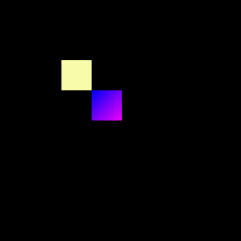

.. include:: aliases.rst

Android Vector Drawable Loader
==============================

Overview
--------

The AVD Loader is an Add-on Library that can load vector images from Android Vector Drawable XML files.
Unlike the vector images that are loaded using a raw output file format (see :ref:`Vector Images <vectorimage_overview>`), the XML parsing and interpreting is done at runtime.
This is useful for loading a vector image as an external resource, especially when the resource has to be loaded dynamically (i.e., not known at build-time).

To use the AVD Loader library, add the following dependency to a :ref:`module description file <mmm_module_description>`:

.. code-block:: XML

	<dependency org="ej.library.ui" name="vectorimage-loader" rev="1.1.0"/>

.. note::

   The AVD Loader library requires the VG Pack 1.2 and above.

.. _section.avdloader.format:

Supported Format
----------------

The library supports the vector drawables with the following elements (in that order):

:``<vector>``: Used to define a vector drawable
   
   :``android:viewportWidth``: The width of the image (must be a positive value).
   :``android:viewportHeight``: The height of the image (must be a positive value).

:``<path>``: Defines a path.

   :``android:fillColor``: (optional) The color used to fill the path. Color is specified as a 32-bit ARGB value in hexadecimal format (``#AARRGGBB``). This attribute is optional when a gradient color is specified (see below).
   :``android:fillType``: The fillType for the path, can be either ``evenOdd`` or ``nonZero``.
   :``android:pathData``: The path data, using the commands in {``M``, ``L``, ``C``, ``Q``, ``Z``} (match upper-case).

A linear gradient can also be used as color fill for a ``<path>``. This element is optional if a solid color fill has been specified.

:``<gradient>``: Used to define a linear gradient
   
   :``android:endX``: The x-coordinate for the end of the gradient vector.
   :``android:endY``: The y-coordinate for the end of the gradient vector.
   :``android:startX``: The x-coordinate for the start of the gradient vector.
   :``android:startY``: The y-coordinate for the start of the gradient vector.

   :``<item>``: Defines an item of the gradient (minimum two items for a gradient).

      :``android:color``: The color of the item. Color is specified as a 32-bit ARGB value in hexadecimal format (``#AARRGGBB``).
      :``android:offset``: The position of the item inside the gradient (value in [0..1]).

Here is an example of a Vector Drawable ``myImage.xml`` that complies with that format. 
It defines a 100 x 100 image with two paths: the first one with a solid color fill, the second one with a linear gradient.

.. code-block:: XML

   <vector xmlns:aapt="http://schemas.android.com/aapt" xmlns:android="http://schemas.android.com/apk/res/android" android:height="100.0dp" android:viewportHeight="100.0" android:viewportWidth="100.0" android:width="100.0dp">
      <path android:fillColor="#FFFFFFAA" android:fillType="nonZero" android:pathData="M0,0L50,0L50,50L0,50Z " />
      <path android:fillType="nonZero" android:pathData="M50,50L100,50L100,100L50,100Z ">
         <aapt:attr name="android:fillColor">
            <gradient android:endX="100.0" android:endY="100.0" android:startX="50.0" android:startY="50.0" android:type="android:linear">
               <item android:color="#FF0000FF" android:offset="0.0" />
               <item android:color="#FFFF00FF" android:offset="1.0" />
            </gradient>
         </aapt:attr>
      </path>
   </vector>

The library only supports a subset of the `Vector Drawable specification <https://developer.android.com/reference/android/graphics/drawable/VectorDrawable>`_, to optimize the CPU time and memory needed for parsing and interpreting Vector Drawables in resource-constrained embedded devices.
If the input Vector Drawable does not comply with this format, the library will throw an exception.

.. note::

   The image generator tool provides a way to make a Vector Drawable compatible with the library.
   See :ref:`this section <section.avdloader.convert>` for more information.

Loading a Vector Drawable
-------------------------

The following code loads the Vector Drawable ``myImage.xml`` with the ``AvdImageLoader.loadImage()`` method. 
This method has one parameter which is the path to the Vector Drawable file, provided as :ref:`a raw resource of the application <section.classpath.elements.raw_resources>`.
The resulting vector image can then be drawn on the display:

|startTable|

.. code-block:: java

   public static void main(String[] args) {
      MicroUI.start();
      
      Display display = Display.getDisplay();
      GraphicsContext g = display.getGraphicsContext();
      
      try (ResourceVectorImage image = AvdImageLoader.loadImage("/images/myImage.xml")) {
         VectorGraphicsPainter.drawImage(g, image, 100, 100);
         display.requestFlush();
      }
   }

.. code-block::
   :caption: Declaration of the resource in a ``*.resources.list`` file.
      
   /images/myImage.xml

|midTable|
  

|endTable|

.. note::

   The image must be provided as a raw resource of the application, either :ref:`internal or external <chapter.microej.applicationResources>`. For external resource loading, the BSP must implement the proper Abstraction Layer API (LLAPI), see :ref:`section_externalresourceloader` for more information on the implementation.

.. warning::
   The new image is a ``ResourceVectorImage``. In the current implementation, an image loaded with the ``AvdImageLoader`` is allocated in the Java heap. To release memory, the application must close the image and remove any references to it.

Limitations
-----------

The AVD Loader can only load static images (i.e., no animations). The other limitations are :ref:`the same as for vector images <vectorimage_limitations>`. 

Advanced
--------

.. _section.avdloader.convert:

Make a Vector Drawable compatible with the library
~~~~~~~~~~~~~~~~~~~~~~~~~~~~~~~~~~~~~~~~~~~~~~~~~~

To ensure that a Vector Drawable can be loaded by the AVD Loader library at runtime, the image generator tool can generate a compatible version of the drawable.

The tool comes with the VG pack installed in the platform, use the following command line to run it:

.. code-block::

   java -cp [path_to_platform]/source/tools/imagegenerator-vectorimage.jar com.microej.converter.vectorimage.Main --input originalImage.xml --avd myImage.xml

This processes the input Vector Drawable ``originalImage.xml`` and outputs a Vector Drawable ``myImage.xml`` which is compliant with the library and optimized for runtime loading.

The processing does the following:

* Normalize the output
* Limit the size of the XML file (e.g., minification)
* Pre-process the resource-consuming operations (e.g., transformations, stroking)

Convert a SVG into a compatible Vector Drawable
~~~~~~~~~~~~~~~~~~~~~~~~~~~~~~~~~~~~~~~~~~~~~~~

It is possible to convert a SVG into a compatible Vector Drawable using the platform tooling. Use the following command:

.. code-block::

   java -cp [path_to_platform]/source/tools/imagegenerator-vectorimage.jar com.microej.converter.vectorimage.Main --input originalImage.svg --avd myImage.xml

This processes the input SVG ``originalImage.svg`` and outputs a Vector Drawable ``myImage.xml``.

Memory Usage
~~~~~~~~~~~~

The loading of a Vector Drawable at runtime uses Java heap:

* for the working buffers and intermediate objects used during the loading phase. The XML parser is optimized to stream the data and uses as few heap as possible.
* for the image data.

Simplify the Path Data
~~~~~~~~~~~~~~~~~~~~~~

The loading time and heap usage grow linearly with the number of path commands in the Vector Drawable.
To achieve optimal performances, it is recommended to reduce the number of path commands, by "simplifying" the paths. The simplification algorithm will determine the optimal amount of anchor points to use in the artwork.
Most of the modern Graphic Design Software have an option to simplify a path (check `this article <https://helpx.adobe.com/illustrator/using/simplify_paths.html>`_ for Adobe Illustrator for example).

Monitor the Number of Path Commands
~~~~~~~~~~~~~~~~~~~~~~~~~~~~~~~~~~~

To print the number of paths and path commands declared in a Vector Drawable, set the :ref:`constant <section.classpath.elements.constants>` ``ej.vectorimage.loader.debug.enabled`` to ``true``. 
This will output the numbers in the console when loading a file.

Output example:

.. code-block::

   avdimageloader INFO: Parsed a path data with a number of 5 commands
   avdimageloader INFO: Parsed a path data with a number of 5 commands
   avdimageloader INFO: Parsed a path data with a number of 28 commands
   avdimageloader INFO: Number of paths in loaded image: 3

Troubleshooting
---------------

The Image Cannot Be Parsed
~~~~~~~~~~~~~~~~~~~~~~~~~~

A error can be raised when the parsing fails:

.. code-block::

   Exception in thread "main" ej.microvg.VectorGraphicsException: MicroVG: The image cannot be parsed. The image must be a valid AVD image, converted with the platform's image generator.

This error indicates that the file is not a compatible Vector Drawable, as specified in :ref:`this section <section.avdloader.format>`.

..
   | Copyright 2008-2023, MicroEJ Corp. Content in this space is free 
   for read and redistribute. Except if otherwise stated, modification 
   is subject to MicroEJ Corp prior approval.
   | MicroEJ is a trademark of MicroEJ Corp. All other trademarks and 
   copyrights are the property of their respective owners.