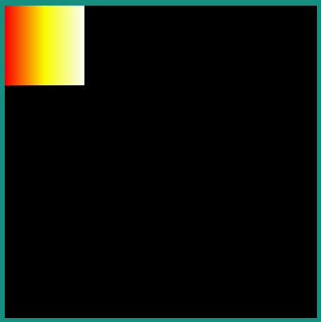
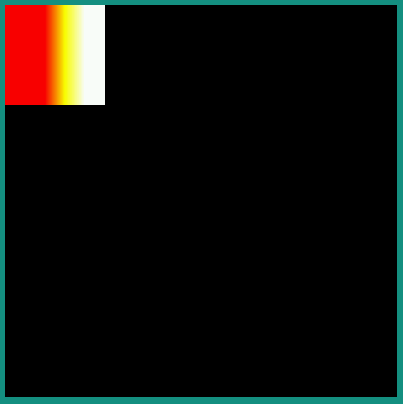
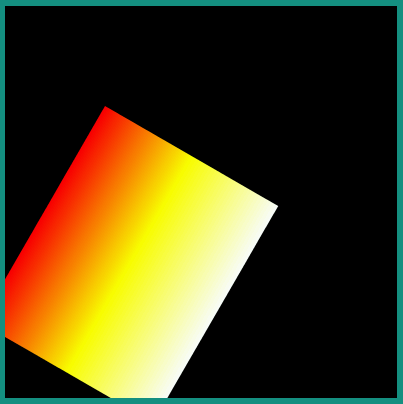

.. include:: aliases.rst

.. _Linear Gradient:

Linear Gradient
===============

The MicroVG library supports the drawing of shapes with a linear gradient of color.

A linear gradient is specified by a linear segment and a set of ARGB colors associated with points on that segment.

The colors along the segment between those points are calculated using linear interpolation, then extended perpendicular to that line.

The position of the color points on the segment are given from ``0.0f`` (start of point) to ``1.0f`` (end of the segment).

There are two ways to create a gradient:

- with a start point, an end point and a color table: the first color will be applied to the start point, the second color to the end point and other colors distributed evenly along the gradient segment.

|startTable| 

.. code-block:: java

   Path path = new Path();
   path.moveTo(0, 0);
   path.lineTo(100, 0);
   path.lineTo(100, 100);
   path.lineTo(0, 100);
   path.close();

   LinearGradient gradient = new LinearGradient(0, 0, 99, 0, 
                                                new int[] { 0xffff0000, 0xffffff00, 0xffffffff });

   VectorGraphicsPainter.fillPath(g, path, new Matrix(), gradient);

|midTable|

|endTable|

- with a start point, an end point, a color table and a position table: the colors are applied to their corresponding relative positions on the segment. If the first point is not the start point of the segment, then first color is applied from the start of the segment to the first point. If the last point is not the end point of the segment, then last color is applied from the last point to the end of the segment.

|startTable| 

.. code-block:: java

   LinearGradient gradient = new LinearGradient(0, 0, 99, 0, 
                                                new int[] { 0xffff0000, 0xffffff00, 0xffffffff },
                                                new float[] { 0.4f, 0.6f, 0.8f });

   VectorGraphicsPainter.fillPath(g, path, new Matrix(), gradient);

|midTable|

|endTable|

The transformation applied to the object (`Path` or `String`) to draw with a gradient is also applied to that gradient. The `LinearGradient` is not updated after the drawing.

|startTable| 

.. code-block:: java

   LinearGradient gradient = new LinearGradient(0, 0, 99, 0, 
                                                new int[] { 0xffff0000, 0xffffff00, 0xffffffff });

   Matrix matrix = new Matrix();
   matrix.setScale(2, 2.5f);
   matrix.postRotate(30);
   matrix.postTranslate(100, 100);

   VectorGraphicsPainter.fillPath(g, path, matrix, gradient);

|midTable|

|endTable|

..
   | Copyright 2008-2022, MicroEJ Corp. Content in this space is free 
   for read and redistribute. Except if otherwise stated, modification 
   is subject to MicroEJ Corp prior approval.
   | MicroEJ is a trademark of MicroEJ Corp. All other trademarks and 
   copyrights are the property of their respective owners.