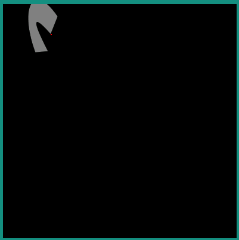

.. include:: aliases.rst

.. _Matrix:

Matrix
======

A `Matrix` is composed of an array of numbers with three rows and three columns. It is used to apply an affine transformations to `Path` points. (Refer to <https://en.wikipedia.org/wiki/Transformation_matrix#Affine_transformations> to get more information about affine transformations).

The available transformations are:

- translation
- rotation
- scaling

Scaling and rotation are always perform around the (0,0) pivot point. In order to rotate or scale a `Path` with a pivot point, the matrix must be translated before and after the rotation/scaling.

`Matrix` are created as identity matrix, which means that the resulting `Path` of the transformation is identical to the original `Path`.

The `Matrix` can be initialized with a transformation with set methods:

- `setTranslate(translateX, translateY)`
- `setRotate(angle)`
- `setScale(scaleX, scaleY)`

A transformation can be prepended to a `Matrix` with the prepend methods:

- `preTranslate(translateX, translateY)`
- `preRotate(angle)`
- `preScale(scaleX, scaleY)`

A transformation can be appended to a `Matrix` with the append methods:

- `postTranslate(translateX, translateY)`
- `postRotate(angle)`
- `postScale(scaleX, scaleY)`

A `Matrix` can also get transformations from an other `Matrix` with the contatenante and set methods:

- `preConcat(matrix)`
- `postConcat(matrix)`
- `set(matrix)`
- `setConcat(matrix0, matrix1)`

Once a `Matrix` has been computed, it can be used to draw an object (`Path`, `String`, `VectorImage`). All points of the drawn object will be transformed by the `Matrix`.

When a `Matrix` has been computed with multiple type of transformation, the sequence order of the transformation is important. Chaining the transformations in a different order will not provide the same `Matrix`. The result of the previous transformation is the input to the next transformation.

The following examples use the `Path` created in the section :ref:`Path creation` with different transformations.

Translation
~~~~~~~~~~~

|startTable|

.. code-block:: java

   Matrix matrix = new Matrix();
   matrix.setTranslate(200, 150);

|midTable|

|endTable|

Rotation
~~~~~~~~

Around point (0,0).

|startTable|

.. code-block:: java

   Matrix matrix = new Matrix();
   matrix.setRotate(40);

|midTable|

|endTable|

Around a pivot point (80,50).

|startTable|

.. code-block:: java

   Matrix matrix = new Matrix();
   matrix.setRotate(40);

   float pivotX = 80;
   float pivotY = 50;
   matrix.preTranslate(-pivotX, -pivotY);
   matrix.postTranslate(pivotX, pivotY);

|midTable|

|endTable|

Scale
~~~~~

From point (0,0).

|startTable|

.. code-block:: java

   Matrix matrix = new Matrix();
   matrix.setScale(2,3);

|midTable|

|endTable|

Contatenate Matrixes
~~~~~~~~~~~~~~~~~~~~~~~

Sequence order has an incidence on the rendering.

|startTable|

.. code-block:: java

   Matrix matrix0 = new Matrix();
   matrix0.setScale(2, 3);

   Matrix matrix1 = new Matrix();
   matrix1.setTranslate(100, 40);

   Matrix matrix2 = new Matrix();
   matrix2.setConcat(matrix0, matrix1);

   g.setColor(Colors.GRAY);
   VectorGraphicsPainter.fillPath(g, path, matrix2);

   matrix2.setConcat(matrix1, matrix0);

   g.setColor(Colors.YELLOW);
   VectorGraphicsPainter.fillPath(g, path, matrix2);

|midTable|

|endTable|

..
   | Copyright 2008-2022, MicroEJ Corp. Content in this space is free 
   for read and redistribute. Except if otherwise stated, modification 
   is subject to MicroEJ Corp prior approval.
   | MicroEJ is a trademark of MicroEJ Corp. All other trademarks and 
   copyrights are the property of their respective owners.