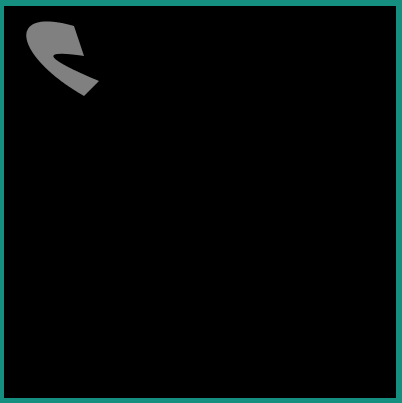
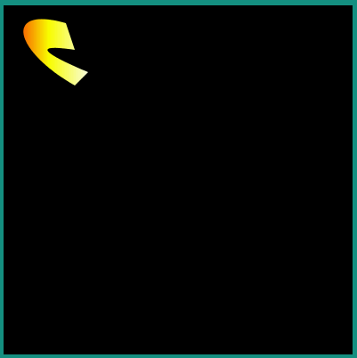
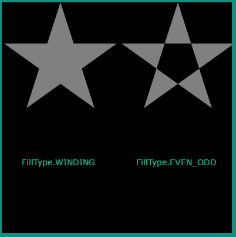
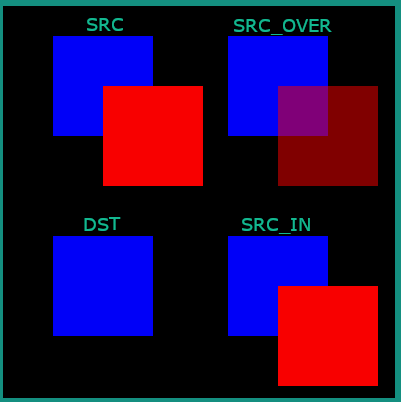

.. include:: aliases.rst

Path
============

.. _Path creation:

Path Creation
-------------

The MicroVG library enables the creation of vector paths composed of the following commands:

- Move 
- Line 
- Cubic Bezier Curve 
- Quadratic Bezier Curve 
- Close

The coordinates of the points associated with these commands can be absolute or relative.

.. code-block:: java

   Path path = new Path();

   path.moveTo(70, 20);
   path.cubicTo(0, 0, 10, 50, 80, 90);
   path.lineTo(95, 75);
   path.quadTo(12, 40, 80, 50);
   path.close();

.. code-block:: java
   
   Path path = new Path();

   path.moveTo(70, 20);
   path.cubicToRelative(-70, -20, -60, 30, 10, 70);
   path.lineToRelative(15, -15);
   path.quadToRelative(-83, -35, -15, -25);
   path.close();

Path Drawing
------------

A path can be drawn with a call to `ej.microvg.VectorGraphicsPainter.fillPath() <https://repository.microej.com/javadoc/microej_5.x/apis/ej/microvg/VectorGraphicsPainter.html#fillPath-ej.microui.display.GraphicsContext-ej.microvg.Path-float-float->`_.

The drawn path will be filled with the graphic context color or with a linear gradient.

The path can be transformed by a transformation matrix (this concept is explained in :ref:`Matrix` section) before drawing.

A `FillType` and an `Alpha Blending Mode` can be applied during the drawing.

Fill Path With Graphics Context Color
~~~~~~~~~~~~~~~~~~~~~~~~~~~~~~~~~~~~~

The default alpha channel value of the drawing is ``0xFF`` (opaque opacity).

|startTable|

.. code-block:: java

   g.setColor(Colors.GRAY);
   VectorGraphicsPainter.fillPath(g, path, 0, 0);

|midTable|

|endTable|

Fill Path With a Linear Gradient
~~~~~~~~~~~~~~~~~~~~~~~~~~~~~~~~

Refer to :ref:`Linear Gradient` section for more details about the definition of a linear gradient.

The opacity value of the drawing is defined by the Alpha channel of the ARGB color values of the each linear gradient stop point.

|startTable|

.. code-block:: java

   LinearGradient gradient = new LinearGradient(0, 0, 100, 0, new int[] { 0xffff0000, 0xffffff00, 0xffffffff });
   VectorGraphicsPainter.fillPath(g, path, new Matrix(), gradient);

|midTable|

|endTable|

.. _FillType:

Fill Type
~~~~~~~~~

A path can be drawn with a `FillType` argument. This argument defines the way a path will be filled. 

The following values are a available:

- FillType.Winding: Specifies that "inside" is computed by a non-zero sum of signed edge crossings.
- FillType.EVEN_ODD: Specifies that "inside" is computed by an odd number of edge crossings.

|startTable|

.. code-block:: java

   Path path = new Path();

   path.moveTo(50, 0);
   path.lineTo(21, 90);
   path.lineTo(98, 35);
   path.lineTo(2, 35);
   path.lineTo(79, 90);
   path.close();

|midTable|

|endTable|

.. _Alpha Blending Mode:

Opacity and Blending Mode
~~~~~~~~~~~~~~~~~~~~~~~~~

The opacity of the drawing can be provided to the `fillPath` method with a blending mode.

When the drawing is done with graphic context color, the given alpha value replaces the default value (``0xFF``).

When the drawing is done with a linear gradient, the given alpha is applied above each gradient colors alpha channel values(0x80 alpha value on ``#80FFFFFF`` ARGB color leads to ``#40FFFFFF`` color).

The supported blending modes are:

- ``SRC``: The source pixels replace the destination pixels.
- ``SRC_OVER``: The source pixels are drawn over the destination pixels.
- ``DST_OVER``: The source pixels are drawn behind the destination pixels.
- ``SRC_IN``: Keeps the source pixels that cover the destination pixels, discards the remaining source and destination pixels.

..
   | Copyright 2008-2023, MicroEJ Corp. Content in this space is free 
   for read and redistribute. Except if otherwise stated, modification 
   is subject to MicroEJ Corp prior approval.
   | MicroEJ is a trademark of MicroEJ Corp. All other trademarks and 
   copyrights are the property of their respective owners.