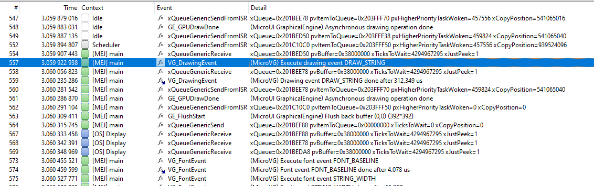

.. _microvg_traces:

Debug Traces
=============

MicroVG logs several actions when traces are enabled. 
This chapter explains the traces identifiers.

.. note:: The logs are only available on the Embedded VEE Port (not on the Simulator).

Trace format
------------

The trace output format is the following:

``[TRACE: MicroVG] Event AA(BB[CC])``

where:

- AA is the event identifier. See next table.
- BB is the event data.
- CC is the index of the event data (0x0).

For example, given the following trace output:

``[TRACE: MicroVG] Event 0x2(2[0x0])``

- 0x2 -> Execute drawing event
- 2 -> Event “Draw String” (index 0x0)

Trace identifiers
-----------------

The following tables describe some events data.

.. table:: MicroVG Traces

   +-------------+---------------------------------------------+-----------------------------------------------+
   | Event ID    | Description                                 | End of event                                  |
   +=============+=============================================+===============================================+
   | 0x0 (0)     | Image event ``%0%`` (see Image Type).       | End of ``%0%`` (see Image Type).              |
   +-------------+---------------------------------------------+-----------------------------------------------+
   | 0x1 (1)     | Font event ``%0%`` (see Font Type).         | End of ``%0%`` (see Font Type).               |
   +-------------+---------------------------------------------+-----------------------------------------------+
   | 0x2 (2)     | Drawing event ``%0%`` (see Drawing Type).   | End of ``%0%`` (see Drawing Type).            |
   +-------------+---------------------------------------------+-----------------------------------------------+
      
.. table:: Image Type

   +-------------+----------------------------------------------------------------+
   | Event ID    | Description                                                    |
   +=============+================================================================+
   | 0x0 (0)     | Get or load image from RAW file                                |
   +-------------+----------------------------------------------------------------+
   | 0x1 (1)     | Create BufferedVectorImage                                     |
   +-------------+----------------------------------------------------------------+
   | 0x2 (2)     | Close image                                                    |
   +-------------+----------------------------------------------------------------+

.. table:: Font Type

   +-------------+----------------------------------------------------------------+
   | Event ID    | Description                                                    |
   +=============+================================================================+
   | 0x0 (0)     | Load font from TTF / OTF file                                  |
   +-------------+----------------------------------------------------------------+
   | 0x1 (1)     | Retrieve font baseline                                         |
   +-------------+----------------------------------------------------------------+
   | 0x2 (2)     | Retrieve font height                                           |
   +-------------+----------------------------------------------------------------+
   | 0x3 (3)     | Measure string width                                           |
   +-------------+----------------------------------------------------------------+
   | 0x4 (4)     | Measure string height                                          |
   +-------------+----------------------------------------------------------------+

.. table:: Drawing Type

   +-------------+--------------------------------------------+
   | Event ID    | Description                                |
   +=============+============================================+
   | 0x0 (0)     | Fill path with a color                     |
   +-------------+--------------------------------------------+
   | 0x1 (1)     | Fill path with a linear gradient           |
   +-------------+--------------------------------------------+
   | 0x2 (2)     | Draw string with a color                   |
   +-------------+--------------------------------------------+
   | 0x3 (3)     | Draw string with a linear gradient         |
   +-------------+--------------------------------------------+
   | 0x4 (4)     | Draw string on a circle with a color       |
   +-------------+--------------------------------------------+
   | 0x5 (5)     | Draw string on a circle with a gradient    |
   +-------------+--------------------------------------------+
   | 0x6 (6)     | Draw image                                 |
   +-------------+--------------------------------------------+

SystemView Integration
----------------------

The traces are :ref:`systemview` compatible.

   MicroVG Traces displayed in SystemView

The following text can be copied in a file called ``SYSVIEW_MicroVG.txt`` and copied in SystemView installation folder (e.g. ``SEGGER/SystemView_V252a/Description/``).

.. code-block::
   
   NamedType VGImage 0=LOAD_IMAGE
   NamedType VGImage 1=CREATE_IMAGE
   NamedType VGImage 2=CLOSE_IMAGE

   NamedType VGFont 0=LOAD_FONT
   NamedType VGFont 1=FONT_BASELINE
   NamedType VGFont 2=FONT_HEIGHT
   NamedType VGFont 3=STRING_WIDTH
   NamedType VGFont 4=STRING_HEIGHT

   NamedType VGDraw 0=DRAW_PATH
   NamedType VGDraw 1=DRAW_PATH_GRADIENT
   NamedType VGDraw 2=DRAW_STRING
   NamedType VGDraw 3=DRAW_STRING_GRADIENT
   NamedType VGDraw 4=DRAW_STRING_ON_CIRCLE
   NamedType VGDraw 5=DRAW_STRING_ON_CIRCLE_GRADIENT
   NamedType VGDraw 6=DRAW_IMAGE
   NamedType VGDraw 7=DRAW_VGLITE_PATH
   NamedType VGDraw 8=UPLOAD_VGLITE_PATH

   0        VG_ImageEvent      (MicroVG) Execute image event %VGImage  | (MicroVG) Image event %VGImage done
   1        VG_FontEvent       (MicroVG) Execute font event %VGFont  | (MicroVG) Font event %VGFont done
   2        VG_DrawingEvent    (MicroVG) Execute drawing event %VGDraw  | (MicroVG) Drawing event %VGDraw done

..
   | Copyright 2008-2023, MicroEJ Corp. Content in this space is free 
   for read and redistribute. Except if otherwise stated, modification 
   is subject to MicroEJ Corp prior approval.
   | MicroEJ is a trademark of MicroEJ Corp. All other trademarks and 
   copyrights are the property of their respective owners.
