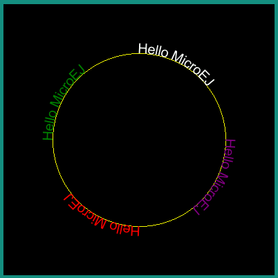

.. include:: aliases.rst

.. _section_vector_fonts:

Vector Fonts
============

Overview
--------

The MicroVG library enables the usage of Vector Fonts. 

Compared to MicroUI :ref:`section.ui.Fonts`, Vector Fonts brings the following features:

- the text strings are scalable and can be transformed using a `Matrix` object.
- the TTF/OTF font files don't need to be preprocessed.
- the text strings can be drawn with opacity, a color or a linear gradient.

The library also considers the `Kerning` space described in the font file kerning table, and allows a fine adjustement of the inter-letters spacing.

It also provides metrics measurement methods to correctly place the text within the surrounding drawing elements (i.e. in a label).

Loading a Font File
-------------------

Font files must be declared as ressources in a `.resources.list` file available in the classpath(:ref:`chapter.microej.applicationResources`).

Then the font has to be loaded in a `VectorFont` object with a call to `ej.microvg.VectorFont.loadFont() <https://repository.microej.com/javadoc/microej_5.x/apis/ej/microvg/VectorFont.html#loadFont-java.lang.String->`_. This `VectorFont` object can then be used to draw text strings.

Text String Drawing
-------------------

A string can be drawn in the graphics context with a call to `ej.microvg.VectorGraphicsPainter.drawString() <https://repository.microej.com/javadoc/microej_5.x/apis/ej/microvg/VectorGraphicsPainter.html#drawString-ej.microui.display.GraphicsContext-java.lang.String-ej.microvg.VectorFont-float-float-float->`_.

The text string height is scalable, and multiple font files can be used in parrallel.

|startTable| 

.. code-block:: java

		VectorFont font0 = VectorFont.loadFont("/fonts/Arial.ttf");
		VectorFont font1 = VectorFont.loadFont("/fonts/RAVIE.ttf");

		int x = 20;
		int y = 30;
		int yOffset = 150;

		g.setColor(Colors.LIME);
		VectorGraphicsPainter.drawString(g, "Hello MicroEJ", font0, 20, x, y);
		VectorGraphicsPainter.drawString(g, "Hello MicroEJ", font1, 20, x, y + yOffset);

		g.setColor(Colors.RED);
		y += 20;
		VectorGraphicsPainter.drawString(g, "Hello MicroEJ", font0, 30, x, y);
		VectorGraphicsPainter.drawString(g, "Hello MicroEJ", font1, 30, x, y + yOffset);

		g.setColor(Colors.WHITE);
		y += 30;
		VectorGraphicsPainter.drawString(g, "Hello MicroEJ", font0, 40, x, y);
		VectorGraphicsPainter.drawString(g, "Hello MicroEJ", font1, 40, x, y + yOffset);

		g.setColor(Colors.YELLOW);
		y += 40;
		VectorGraphicsPainter.drawString(g, "Hello MicroEJ", font0, 50, x, y);
		VectorGraphicsPainter.drawString(g, "Hello MicroEJ", font1, 50, x, y + yOffset);

		display.flush();

|midTable| 

|endTable| 

Text Color
~~~~~~~~~~

The text string can be colored with the graphics context color or a with a linear gradient(:ref:`Linear Gradient`).

`FillType` and `Alpha Blending Mode` are also managed similarly to `Path` drawing (refer to :ref:`FillType` and :ref:`Alpha Blending Mode`).

|startTable|

.. code-block:: java

		g.setColor(Colors.LIME);
		VectorGraphicsPainter.drawString(g, "Hello MicroEJ", font, 50, x, y);

		LinearGradient gradient = new LinearGradient(0, 0, 250, 50, 
                                                new int[] { 0xffff0000, 0xffffff00, 0xffffffff });

		Matrix matrix = new Matrix();
		matrix.setTranslate(x, y + 60);
		VectorGraphicsPainter.drawGradientString(g, "Hello MicroEJ", font, 50, matrix, gradient, 0xff,
				BlendMode.SRC_OVER, 0);

|midTable| 

|endTable| 

Text Transformations
~~~~~~~~~~~~~~~~~~~~

The text string can also be transformed with a `Matrix` to translate, rotate, scale the drawing.

|startTable|

.. code-block:: java

		Matrix matrix0 = new Matrix();

		matrix0.setTranslate(20, 60);
		VectorGraphicsPainter.drawString(g, "Hello MicroEJ", font, 50, matrix0, 0xff, BlendMode.SRC_OVER, 0);

		matrix0.preRotate(180);
		matrix0.postTranslate(300, 120);
		VectorGraphicsPainter.drawString(g, "Hello MicroEJ", font, 50, matrix0, 0xff, BlendMode.SRC_OVER, 0);

		Matrix matrix1 = new Matrix();
		matrix1.setScale(0.5f, 1.2f);
		matrix1.postRotate(45);
		matrix1.postTranslate(80, 200);

		VectorGraphicsPainter.drawString(g, "Hello MicroEJ", font, 50, matrix1, 0xff, BlendMode.SRC_OVER, 0);

		matrix1.setScale(0.5f, 1.2f);
		matrix1.postRotate(-45);
		matrix1.postTranslate(200, 300);
		VectorGraphicsPainter.drawString(g, "Hello MicroEJ", font, 50, matrix1, 0xff, BlendMode.SRC_OVER, 0);

|midTable| 

|endTable| 

Letter Spacing
~~~~~~~~~~~~~~

The inter character distance can be adjusted for each string drawing. By default, the inter character distance is computed from the font file metrics, considering `kerning <https://en.wikipedia.org/wiki/Kerning>`_, if the font file includes a kerning table. It can be adjusted with the ``letterSpacing`` parameter of drawString(). Its default value is 0 pixel, a positive/negative value will increase/reduce the inter space distance by the corresponding pixel value.

|startTable|

.. code-block:: java

		Matrix matrix = new Matrix();

		matrix.setTranslate(20, 60);
		VectorGraphicsPainter.drawString(g, "Hello MicroEJ", font, 50, matrix, 0xff, BlendMode.SRC_OVER, 0);

		matrix.postTranslate(0, 60);
		VectorGraphicsPainter.drawString(g, "Hello MicroEJ", font, 50, matrix, 0xff, BlendMode.SRC_OVER, 5f);

		matrix.postTranslate(0, 60);
		VectorGraphicsPainter.drawString(g, "Hello MicroEJ", font, 50, matrix, 0xff, BlendMode.SRC_OVER, -2);

|midTable| 

|endTable| 

.. _colored_emojis:

Colored Emojis
~~~~~~~~~~~~~~

The library supports the drawing of colored multilayer glyphs, but only for the embedded implementation. The simulator implementation draws the full emoji glyph with the color of the graphics context.

Only font files with CPAL/COLR tables are supported.

Font files with CBDT/CBLC tables are not supported.

To add colored emojis to a font, see the tutorial :ref:`tutorial_append_emojis`.

 
.. _metrics_and_text_positioning:

Metrics and Text Positioning
----------------------------

All metrics provided by the `ej.microvg.VectorFont <https://repository.microej.com/javadoc/microej_5.x/apis/ej/microvg/VectorFont.html>`_ class are given for a specific font size. The font size defines the height to which each character bounding box will be scaled.

The following figure presents some concepts of font metrics standarts:

When a string is drawn with a call to `ej.microvg.VectorGraphicsPainter.drawString() <https://repository.microej.com/javadoc/microej_5.x/apis/ej/microvg/VectorGraphicsPainter.html#drawString-ej.microui.display.GraphicsContext-java.lang.String-ej.microvg.VectorFont-float-float-float->`_ or `ej.microvg.VectorGraphicsPainter.drawGradientString() <https://repository.microej.com/javadoc/microej_5.x/apis/ej/microvg/VectorGraphicsPainter.html#drawGradientString-ej.microui.display.GraphicsContext-java.lang.String-ej.microvg.VectorFont-float-ej.microvg.Matrix-ej.microvg.LinearGradient-int-ej.microvg.BlendMode-float->`_, the anchor point of the string is the top left corner of the text rendering box. This anchor point is located horizontally on the first pixel of the first drawn glyph and vertically on the max ascent line.

The `ej.microvg.VectorFont.getBaselinePosition() <https://repository.microej.com/javadoc/microej_5.x/apis/ej/microvg/VectorFont.html#getBaselinePosition-float->`_ method can be used to position the text baseline on a horizontal line.

The `ej.microvg.VectorFont.getHeight() <https://repository.microej.com/javadoc/microej_5.x/apis/ej/microvg/VectorFont.html#getHeight-float->`_ method can be used to center a text inside a label, by positionning the anchor point in order to have the same space above and below the text string.

Two other methods are available to position a known text in a label:

- `ej.microvg.VectorFont.measureStringHeight() <https://repository.microej.com/javadoc/microej_5.x/apis/ej/microvg/VectorFont.html#measureStringHeight-java.lang.String-float->`_
- `ej.microvg.VectorFont.measureStringWidth()  <https://repository.microej.com/javadoc/microej_5.x/apis/ej/microvg/VectorFont.html#measureStringWidth-java.lang.String-float->`_

These methods return the width and height of a string drawing. They are computed from the width and height of the glyphs composing the string.

These methods can measure a specific glyph width and height using a one character string.

.. note::

   The metrics are extracted from the character glyph metrics without considering the antialiasing introduced by the glyphs rasterizer.

.. _drawOnCircle:

Drawing a Text on a Circle
--------------------------

The library proposes the drawing of a text on a circle by a call to `ej.microvg.VectorGraphicsPainter.drawStringOnCircle() <https://repository.microej.com/javadoc/microej_5.x/apis/ej/microvg/VectorGraphicsPainter.html#drawStringOnCircle-ej.microui.display.GraphicsContext-java.lang.String-ej.microvg.VectorFont-float-ej.microvg.Matrix-float-ej.microvg.VectorGraphicsPainter.Direction->`_. The string is rendered as if the baseline of the string was a circle arc. 

The string direction can be either clockwise or counter clockwise.

All the features described above are still available (linear gradient, transformations, letter spacing, kerning, colored emojis). 

|startTable|

.. code-block:: java

		int x = 196;
		int y = 196;
		int diameter = 250;

		g.setColor(Colors.YELLOW);

		Painter.drawCircle(g, x - diameter / 2, y - diameter / 2, diameter);

		g.setColor(Colors.PURPLE);
		Matrix matrix = new Matrix();

		matrix.setTranslate(x, y);

		VectorGraphicsPainter.drawStringOnCircle(g, "Hello MicroEJ", font, 50, matrix, diameter / 2,
				Direction.CLOCKWISE);

		diameter = 100;

		g.setColor(Colors.YELLOW);
		Painter.drawCircle(g, x - diameter / 2, y - diameter / 2, diameter);

		g.setColor(Colors.RED);
		VectorGraphicsPainter.drawStringOnCircle(g, "Hello MicroEJ", font, 20, matrix, diameter / 2,
				Direction.COUNTER_CLOCKWISE);

|midTable|

|endTable|

The anchor point of the drawing is the center of the circle.

The position where the text starts along the circle is the 3 o'clock position (positive X axis). This starting position can be modified by specifying a rotation into the transformation `Matrix`.

|startTable|

.. code-block:: java

	g.setColor(Colors.PURPLE);
	Matrix matrix = new Matrix();

	matrix.setTranslate(x, y);

	VectorGraphicsPainter.drawStringOnCircle(g, "Hello MicroEJ", font, 20, matrix, diameter / 2,
			Direction.CLOCKWISE);

	matrix.preRotate(90);
	g.setColor(Colors.RED);
	VectorGraphicsPainter.drawStringOnCircle(g, "Hello MicroEJ", font, 20, matrix, diameter / 2,
			Direction.CLOCKWISE);

	matrix.preRotate(90);
	g.setColor(Colors.GREEN);
	VectorGraphicsPainter.drawStringOnCircle(g, "Hello MicroEJ", font, 20, matrix, diameter / 2,
			Direction.CLOCKWISE);

	matrix.preRotate(90);
	g.setColor(Colors.WHITE);
	VectorGraphicsPainter.drawStringOnCircle(g, "Hello MicroEJ", font, 20, matrix, diameter / 2,
			Direction.CLOCKWISE);

|midTable|

|endTable|

.. _section_vg_font_complex:

Complex Text Layout
-------------------	

Some scripts like Arabic or Thai scripts request a specific text layout mode where the shape or positioning of a grapheme depends on its relation to other graphemes (Refer to `https://en.wikipedia.org/wiki/Complex_text_layout <https://en.wikipedia.org/wiki/Complex_text_layout>`_).

The MicroVG library provides two different layout modes:

- the simple layout mode for latin scripts and other scripts where character unicodes and glyphs are one-to-one associated.
- the complex layout mode for complex text layout scripts like arabic or thai.

The simple layout mode draws the text character as described in the previous sections. It uses the font **Kerning** table and the glyphs advanceX parameter to position the glyphs one after the other.

The complex layout mode uses the **GPOS** and **GSUB** font tables to substitute and position the character glyph.

The complex layout mode can be selected while loading the glyph with `ej.microvg.VectorFont.loadFont` by passing a supplementary boolean argument with value `true`.

Next example shows the same arabic string drawn with the same font but with simple (in white) and complex layout(in RED).

|startTable|

.. code-block:: java

	VectorFont font0 = VectorFont.loadFont(FONT_NAME, false);
	VectorFont font1 = VectorFont.loadFont(FONT_NAME, true);

	String s = "العربية";

	g.setColor(Colors.WHITE);
	VectorGraphicsPainter.drawString(g, s, font0, 20, 50, 50);

	g.setColor(Colors.RED);
	VectorGraphicsPainter.drawString(g, s, font1, 20, 50, 100);

|midTable|

|endTable|

Text Measurement and Positioning
~~~~~~~~~~~~~~~~~~~~~~~~~~~~~~~~

The measurement of string in complex layout mode respects the requirements presented in :ref:`metrics_and_text_positioning`. 

Strings from script where text is read from right to left, like arabic, are still drawn with the anchor point located on the top left of the string.

Bidirectional Text
~~~~~~~~~~~~~~~~~~

The complex layout mode does not support bidirectional text. A bidirectional text has to be splitted in multiple strings and each string has to be drawn to the correct location.

Limitations
~~~~~~~~~~~

The simulator rendering of complex layout mode for :ref:`drawOnCircle` feature is done with many approximations. This rendering can still be used to have an overview of the text positionning on the display.

The letterSpacing feature is not supported by the simulator implementation. Texts will be displayed with a letterspacing value of 0.

..
   | Copyright 2008-2022, MicroEJ Corp. Content in this space is free 
   for read and redistribute. Except if otherwise stated, modification 
   is subject to MicroEJ Corp prior approval.
   | MicroEJ is a trademark of MicroEJ Corp. All other trademarks and 
   copyrights are the property of their respective owners.