.. include:: aliases.rst

Vector Images
=============

.. _vectorimage_overview:

Overview
--------

Vector Images are graphical resources that can be accessed with a call to `ej.microvg.VectorImage.getImage()`_. The images are converted at build-time (using the image generator tool) to immutable resources.

Images that must be processed by the image generator tool are declared in ``*.vectorimages.list`` files. The file format is a standard Java properties file, each line representing a ``/`` separated resource path relative to the MicroEJ classpath root referring to a vector image file (e.g. ``.svg``, ``.xml``). The resource must be followed by a parameter (separated by a ``:``) which defines and/or describes the image output file format (raw format).

Currently accepted formats are : 

- ``:VGF``: vglite compatible format with coordinates encoded as float numbers (32 bits).
- ``:VG32``: vglite compatible format with coordinates encoded as signed int numbers (32 bits).
- ``:VG16``: vglite compatible format with coordinates encoded as signed short numbers (16 bits).
- ``:VG8``: vglite compatible format with coordinates encoded as signed char numbers (8 bits).

Example:

::

   /com/mycompany/MyImage1.svg:VGF
   /com/mycompany/androidVectorDrawable.xml:VG8

.. _ej.microvg.VectorImage.getImage(): https://repository.microej.com/javadoc/microej_5.x/apis/ej/microvg/VectorImage.html#getImage-java.lang.String-

Supported Input Files
---------------------

The image generator tool supports the following input file formats:

- Android Vector Drawable
- SVG 

Refer to the :ref:`vectorimage_limitations` section for the list of supported features for these file formats.

The vector image objects are extracted and converted to paths made of ``Move``, ``Line`` and ``Curve`` commands. 

Each path is associated with either a fill color or a linear gradient. All object strokes are converted to filled paths at build-time.

Objects group transformations are also extracted from the input file and applied at run-time.

Drawing Images
---------------

Drawing and Transforming Images
~~~~~~~~~~~~~~~~~~~~~~~~~~~~~~~

Once an image has been loaded it can be drawn in the graphic context with a call to `ej.microvg.VectorGraphicsPainter.drawImage()`_.

The image is associated with a transformation :ref:`Matrix` that will be applied in order to translate, scale and/or rotate the image. 

The application can get the width and the height of the image with `ej.microvg.VectorImage.getWidth()`_ and `ej.microvg.VectorImage.getHeight()`_ to correctly scale and position the image in the application window.

The following example describes how an Android Vector Drawable file can be drawn and positioned on the display.

- Android Vector Drawable file:

.. code-block:: xml

   <vector xmlns:android="http://schemas.android.com/apk/res/android" xmlns:aapt="http://schemas.android.com/aapt"
      android:width="100dp" android:height="100dp" android:viewportWidth="100" android:viewportHeight="100">
      <path android:pathData="M 0 0 h50 v50 h-50 z" android:fillColor="#FFFFAA"/>
      <path android:pathData="M 50 50 h50 v50 h-50 z">
         <aapt:attr name="android:fillColor">
               <gradient
                  android:startColor="#0000ff" android:startX="50" android:startY="50"
                  android:endColor="#ff00ff" android:endX="100" android:endY="100"
                  android:type="linear">
               </gradient>
         </aapt:attr>
      </path>
   </vector>

|startTable| 
  
.. code-block:: java

   public static void main(String[] args) {

      MicroUI.start();

      Display display = Display.getDisplay();
      GraphicsContext g = display.getGraphicsContext();

      VectorImage image = VectorImage.getImage("/images/myImage.xml"); //$NON-NLS-1$

      Matrix matrix0 = new Matrix();
      matrix0.setTranslate(20, 20);
      matrix0.preScale(50 / image.getWidth(), 50 / image.getHeight());

      Matrix matrix1 = new Matrix();
      matrix1.setTranslate(150, 150);
      matrix1.preRotate(45);

      VectorGraphicsPainter.drawImage(g, image, matrix0);
      VectorGraphicsPainter.drawImage(g, image, matrix1);

      display.flush();
   }

|midTable|

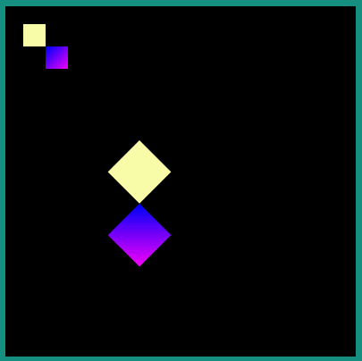

|endTable|

.. _ej.microvg.VectorGraphicsPainter.drawImage(): https://repository.microej.com/javadoc/microej_5.x/apis/ej/microvg/VectorGraphicsPainter.html#drawImage-ej.microui.display.GraphicsContext-ej.microvg.VectorImage-float-float-
.. _ej.microvg.VectorImage.getWidth(): https://repository.microej.com/javadoc/microej_5.x/apis/ej/microvg/VectorImage.html#getWidth--
.. _ej.microvg.VectorImage.getHeight(): https://repository.microej.com/javadoc/microej_5.x/apis/ej/microvg/VectorImage.html#getHeight--

Drawing With Opacity
~~~~~~~~~~~~~~~~~~~~

The vector image can be drawn with a global opacity level. 

|startTable| 
  
.. code-block:: java

   VectorImage image = VectorImage.getImage("/images/myImage.xml"); //$NON-NLS-1$

   // the global opacity rendering value, between 0 (transparent) and 255 (opaque)
   int opacity = 0x80;

   VectorGraphicsPainter.drawImage(g, image, new Matrix(), opacity);

|midTable|
  
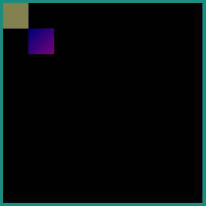

|endTable|

.. warning:: As paths are drawn one after the other, images that contain overlapping paths are not correctly colored when a global opacity is applied. The rendering of these images will throw an exception. The images must be reworked to suppress overlapping.

Color Filtering
~~~~~~~~~~~~~~~

A VectorImage object can be derived from another VectorImage object, keeping the paths and transformations but updating the colors using a color matrix.

This color matrix is a 4x5 float matrix. It is organized like that: 

- Each line is used to compute a component of the resulting color, in this order: red, green, blue, alpha.
- The four first columns are multipliers applied to a component of the initial color, in this order: red, green, blue, alpha.
- The last column is a constant value.

Let A, R, G, B be the components of the initial color and the following array a color matrix: 

.. code-block:: 

   { rR, rG, rB, rA, rC,  // red
     gR, gG, gB, gA, gC,  // green
     bR, bG, bB, bA, bC,  // blue
     aR, aG, aB, aA, aC } // alpha
 
The resulting color components are computed as: 

 .. code-block:: 

   resultRed = rR * R + rG * G + rB * B + rA * A + rC
   resultGreen = gR * R + gG * G + gB * B + gA * A + gC
   resultBlue = bR * R + bG * G + bB * B + bA * A + bC
   resultAlpha = aR * R + aG * G + aB * B + aA * A + aC
 
If the resulting component value is below 0 or above 255, the component value is clamped to these limits.

A VectorImage object can also be drawn associated to a color matrix by a call to `ej.microvg.VectorGraphicsPainter.drawFilteredImage()`_.
 
The following example illustrates this feature.

|startTable| 
  
.. code-block:: java

  VectorImage image = VectorImage.getImage("/images/myImage.xml"); //$NON-NLS-1$

   // Derive a new VectorImage
   float[] colorMatrix0 = new float[] { //
         1f, 0, 0, 0, 0, // red
         0, 0, 0, 0, 0, // green
         0, 0, 1f, 0, 0, // blue
         0, 0, 0, 1f, 0, // alpha
   };

   VectorImage imageFiltered = image.filterImage(colorMatrix0);
   VectorGraphicsPainter.drawImage(g, imageFiltered, new Matrix());

   float[] colorMatrix1 = new float[] { //
         0f, 0, 0, 0, 0, // red
         0.5f, 0.5f, 0, 0, 0, // green
         0, 0, 1f, -0.5f, 0, // blue
         0, 0, 0, 1f, 0, // alpha
   };
   Matrix matrix1 = new Matrix();
   matrix1.setTranslate(image.getWidth(), 0);

   VectorGraphicsPainter.drawFilteredImage(g, image, matrix1, colorMatrix1);

|midTable|

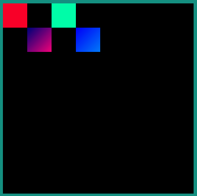

|endTable|

.. _ej.microvg.VectorGraphicsPainter.drawFilteredImage(): https://repository.microej.com/javadoc/microej_5.x/apis/ej/microvg/VectorGraphicsPainter.html#drawFilteredImage-ej.microui.display.GraphicsContext-ej.microvg.VectorImage-ej.microvg.Matrix-float:A-

Animated Vector Images
----------------------

The Android Vector Drawable format provides the ability to change the properties of vector graphics over time, in order to create animated effects.

The transformations of the objects over the time are embedded in the Vector image file and a call to `ej.microvg.VectorGraphicsPainter.drawAnimatedImage()`_ or `ej.microvg.VectorGraphicsPainter.drawFilteredAnimatedImage()`_ will draw the image for a specific time frame.

The application can get the duration of the image animation with a call to `ej.microvg.VectorImage.getDuration()`_.

Every image object that is animated outside the image viewbox is clipped at the image boundary. In any cases, especially when the image is rotated, the image boundary is the rectangle that contains all the corners of the original image.

The supported file format is an Animated Vector Drawable xml file with animations and vector definition in the same file as described in `Android API`_.

The SVG format also supports the animation of vector graphics objects, but this feature is not yet implemented in the MicroVG library for this file format.

SVG files that need to be animated should be converted to Android Vector Drawable format with the Android Vector Asset tool and then animated manually or with a tool like `Shapeshifter <https://shapeshifter.design/>`_.

.. _ej.microvg.VectorGraphicsPainter.drawAnimatedImage(): https://repository.microej.com/javadoc/microej_5.x/apis/ej/microvg/VectorGraphicsPainter.html#drawAnimatedImage-ej.microui.display.GraphicsContext-ej.microvg.VectorImage-float-float-long-
.. _ej.microvg.VectorGraphicsPainter.drawFilteredAnimatedImage(): https://repository.microej.com/javadoc/microej_5.x/apis/ej/microvg/VectorGraphicsPainter.html#drawFilteredAnimatedImage-ej.microui.display.GraphicsContext-ej.microvg.VectorImage-ej.microvg.Matrix-long-float:A-
.. _ej.microvg.VectorImage.getDuration(): https://repository.microej.com/javadoc/microej_5.x/apis/ej/microvg/VectorImage.html#getDuration--
.. _Android API: https://developer.android.com/reference/android/graphics/drawable/AnimatedVectorDrawable#define-an-animatedvectordrawable-all-in-one-xml-file

Supported animations
~~~~~~~~~~~~~~~~~~~~

This section will present the different available animations with an example. 

For each example, this simple java code will be used. 

.. code-block:: java

   VectorImage image = VectorImage.getImage("/images/myImage.xml"); //$NON-NLS-1$
   Matrix matrix = new Matrix();
   matrix.setTranslate(100,100);
   matrix.preScale(2,2);

   long elapsed = 0;
   long step = 10;
   while (true) {
      // Clear Screen
      g.setColor(Colors.BLACK);
      Painter.fillRectangle(g, 0, 0, display.getWidth(), display.getHeight());

      VectorGraphicsPainter.drawAnimatedImage(g, image, matrix, elapsed);

      display.flush();

      // Pause the current thread
      try {
         Thread.sleep(step);
      } catch (InterruptedException e) {
         e.printStackTrace();
      }

      // Update current image time
      if (elapsed < image.getDuration()) {
         elapsed += step;
      } else {
         elapsed = 0;
      }
   }

TranslateX and TranslateY
*************************

Any group in the Android Vector Drawable can be translated in X or Y direction with an object animator. 

|startTable| 

.. code-block:: xml

   <animated-vector xmlns:android="http://schemas.android.com/apk/res/android"
         xmlns:aapt="http://schemas.android.com/aapt">
   <aapt:attr name="android:drawable">
      <vector android:width="100dp" android:height="100dp"
               android:viewportWidth="100" android:viewportHeight="100">
         <group android:name="yellow_group">
               <path android:pathData="M 0 0 h50 v50 h-50 z" android:fillColor="#FFFFAA"/>
         </group>
         <group android:name="gradient_group">
         <path android:pathData="M 50 50 h50 v50 h-50 z">
               <aapt:attr name="android:fillColor">
                  <gradient
                     android:startColor="#0000ff" android:startX="50" android:startY="50"
                     android:endColor="#ff00ff" android:endX="100" android:endY="100"
                     android:type="linear">
                  </gradient>
               </aapt:attr>
         </path>
         </group>
      </vector>
   </aapt:attr>
   <target android:name="yellow_group">
      <aapt:attr name="android:animation">
         <set android:ordering="together">
               <objectAnimator android:propertyName="translateX" android:valueType="floatType"
                  android:duration="1000" android:startOffset="0" android:valueFrom="0" android:valueTo="50"/>
               <objectAnimator android:propertyName="translateX" android:valueType="floatType"
                  android:duration="1000" android:startOffset="1500" android:valueFrom="50" android:valueTo="0"/>
         </set>
      </aapt:attr>
   </target>
   <target android:name="gradient_group">
      <aapt:attr name="android:animation">
         <set android:ordering="together">
               <objectAnimator android:propertyName="translateX" android:valueType="floatType"
                  android:duration="1000" android:startOffset="0" android:valueFrom="0" android:valueTo="-50"/>
               <objectAnimator android:propertyName="translateX" android:valueType="floatType"
                  android:duration="1000" android:startOffset="1500" android:valueFrom="-50" android:valueTo="0"/>
               <objectAnimator android:propertyName="translateY" android:valueType="floatType"
                  android:duration="1000" android:startOffset="0" android:valueFrom="0" android:valueTo="-50"/>
               <objectAnimator android:propertyName="translateY" android:valueType="floatType"
                  android:duration="1000" android:startOffset="1500" android:valueFrom="-50" android:valueTo="0"/>
         </set>
      </aapt:attr>
   </target>
   </animated-vector>

|midTable|
  
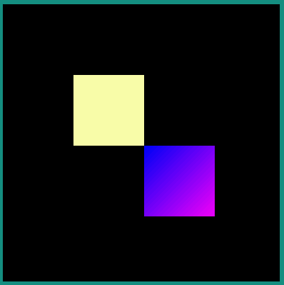

|endTable|

TranslateXY over a path
***********************

Any group in the Android Vector Drawable can be translated over a path.

|startTable|

.. code-block:: xml

   <animated-vector xmlns:android="http://schemas.android.com/apk/res/android"
                    xmlns:aapt="http://schemas.android.com/aapt">
   <aapt:attr name="android:drawable">
      <vector android:width="100dp" android:height="100dp" 
               android:viewportWidth="100" android:viewportHeight="100">
        ... same as previous example
      </vector>
   </aapt:attr>
   <target android:name="gradient_group">
      <aapt:attr name="android:animation">
         <set android:ordering="together">
              <objectAnimator
                    android:propertyName="translateXY" android:duration="5000"
                    android:propertyXName="translateX" android:propertyYName="translateY"
                    android:pathData="M -0.143 0.479 C -30.355 28.02 -153.405 -111.8 -39.441 -70.818 
                                     C -48.423 -63.52 70.593 -18.608 -91.09 -15.802 Z"/>
         </set>
      </aapt:attr>
   </target>
   </animated-vector>

|midTable|
  

|endTable|

ScaleX and ScaleY
*****************

A group in the Android Vector Drawable can be scaled on X or Y direction. The scaling pivot point is the one defined in the group attributes. By default, the pivot point is (0,0).

|startTable|

.. code-block:: xml

   <animated-vector xmlns:android="http://schemas.android.com/apk/res/android"
                    xmlns:aapt="http://schemas.android.com/aapt">
   <aapt:attr name="android:drawable">
      <vector android:width="100dp" android:height="100dp" 
               android:viewportWidth="100" android:viewportHeight="100">
         <group android:name="yellow_group" android:pivotX="25" android:pivotY="25">
               <path android:pathData="M 0 0 h50 v50 h-50 z" android:fillColor="#FFFFAA"/>
         </group>
         <group android:name="gradient_group" >
         <path android:pathData="M 50 50 h50 v50 h-50 z">
               <aapt:attr name="android:fillColor">
                  <gradient
                     android:startColor="#0000ff" android:startX="50" android:startY="50"
                     android:endColor="#ff00ff" android:endX="100" android:endY="100"
                     android:type="linear">
                  </gradient>
               </aapt:attr>
         </path>
         </group>
      </vector>
   </aapt:attr>
   <target android:name="yellow_group">
      <aapt:attr name="android:animation">
         <set android:ordering="together">
               <objectAnimator android:propertyName="scaleX" android:valueType="floatType"
                  android:duration="1000" android:startOffset="0" android:valueFrom="1" 
                  android:valueTo="0.5"/>
               <objectAnimator android:propertyName="scaleX" android:valueType="floatType"
                  android:duration="1000" android:startOffset="1500" android:valueFrom="0.5" 
                  android:valueTo="1"/>
         </set>
      </aapt:attr>
   </target>
   <target android:name="gradient_group">
      <aapt:attr name="android:animation">
         <set android:ordering="together">
               <objectAnimator android:propertyName="scaleX" android:valueType="floatType"
                  android:duration="1000" android:startOffset="0" 
                  android:valueFrom="0.2" android:valueTo="1"/>
               <objectAnimator android:propertyName="scaleX" android:valueType="floatType"
                  android:duration="1000" android:startOffset="1500" 
                  android:valueFrom="1" android:valueTo="0.2"/>
               <objectAnimator android:propertyName="scaleY" android:valueType="floatType"
                  android:duration="1000" android:startOffset="0" 
                  android:valueFrom="0.2" android:valueTo="1"/>
               <objectAnimator android:propertyName="scaleY" android:valueType="floatType"
                  android:duration="1000" android:startOffset="1500"
                  android:valueFrom="1" android:valueTo="0.2"/>
         </set>
      </aapt:attr>
   </target>
   </animated-vector>

|midTable|
  
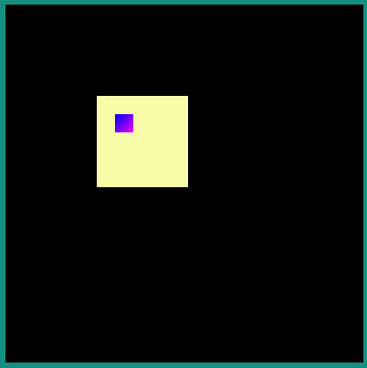

|endTable|

Rotate
******

A group in the Android Vector Drawable can be rotated around a pivot point. The pivot point is the one defined in the group attributes. By default, the pivot point is (0,0).

|startTable|

.. code-block:: xml

   <animated-vector xmlns:android="http://schemas.android.com/apk/res/android"
                    xmlns:aapt="http://schemas.android.com/aapt">
   <aapt:attr name="android:drawable">
      <vector android:width="100dp" android:height="100dp"
               android:viewportWidth="100" android:viewportHeight="100">
         ... same as previous example
      </vector>
   </aapt:attr>
   <target android:name="yellow_group">
      <aapt:attr name="android:animation">
         <set android:ordering="together">
               <objectAnimator android:propertyName="rotation" android:valueType="floatType"
                  android:duration="1000" android:startOffset="0" 
                  android:valueFrom="0" android:valueTo="720"/>
               <objectAnimator android:propertyName="rotation" android:valueType="floatType"
                  android:duration="1000" android:startOffset="1500" 
                  android:valueFrom="720" android:valueTo="0"/>
         </set>
      </aapt:attr>
   </target>
   </animated-vector>

|midTable|
  

|endTable|

Morphing
********

The Android Vector Drawable format supports the animation of the ``pathData`` attribute of a path. With this type of animation a shape can be transformed to a totally different other shape. The only constraint is that the origin and destination ``pathData`` must have the same commands format.

Lets take, for instance, the morphing of a rectangle to a circle which have the following commands.

:: 

   Circle: M 11.9 9.8 C 11.9 8.1 13.3 6.7 14.9 6.7 C 16.6 6.7 18 8.1 18 9.8 C 18 11.6 16.6 13 14.9 13 C 13.3 13 11.9 11.6 11.9 9.8 Z

   Rectangle: M 11.9 6.7 H 18 V 13 H 11.9 Z

The rectangle path has to be reworked to match with the sequence of commands of the circle path. 

The following tools can be used to manipulate the paths to create the wanted animation effect:

- `Shapeshifter <https://shapeshifter.design/>`_
- `SVGPathEditor <https://yqnn.github.io/svg-path-editor>`_

There is an infinity of possibilities to create the new path, and the association of each points of the paths will induce a specific morphing animation. As an example, let's define two rectangles very similar visually but with different definitions:

::

   New Rectangle path1: M 11.9 9.8 C 11.897 7.735 11.906 7.995 11.906 6.697 C 16.6 6.7 16.601 6.706 17.995 6.697 C 18 11.6 17.995 11.587 18.004 13.006 C 13.3 13 13.852 13.006 11.897 13.006 Z

   New Rectangle path2: M 11.906 6.697 C 11.953 6.698 12.993 6.698 17.995 6.697 C 17.999 8.331 17.997 9.93 18.002 13.004 C 16.239 13.007 16.009 13.001 11.893 13.007 C 13.3 13 13.852 13.006 11.893 13.007 Z

|startTable|

.. code-block:: xml

   <animated-vector xmlns:android="http://schemas.android.com/apk/res/android"
                    xmlns:aapt="http://schemas.android.com/aapt">
    <aapt:attr name="android:drawable">
        <vector android:width="20dp" android:height="20dp"
                 android:viewportWidth="20" android:viewportHeight="20">
            <path android:fillColor="#FF0000" android:pathData="M 0 0 h40 v40 h-40"/>
            <path android:fillColor="#FF0000" android:pathData="M 0 0 h40 v40 h-40"/>
            <group android:name="group1" android:translateX="-10">
                <path
                    android:name="circle1"
                    android:pathData="M 11.9 9.8 C 11.9 8.1 13.3 6.7 14.9 6.7 
                                      C 16.6 6.7 18 8.1 18 9.8 
                                      C 18 11.6 16.6 13 14.9 13 
                                      C 13.3 13 11.9 11.6 11.9 9.8 Z"
                    android:fillColor="#FFFFAA"/>
            </group>
            <group android:name="group2">
                <path android:name="circle2"
                    android:pathData="M 11.9 9.8 C 11.9 8.1 13.3 6.7 14.9 6.7 
                                      C 16.6 6.7 18 8.1 18 9.8 
                                      C 18 11.6 16.6 13 14.9 13 
                                      C 13.3 13 11.9 11.6 11.9 9.8 Z"
                    android:fillColor="#00FFAA" />
            </group>
        </vector>
    </aapt:attr>

    <target android:name="circle1">
    <aapt:attr name="android:animation">
        <set>
            <objectAnimator
                android:propertyName="pathData"
                android:duration="2000"
                android:valueFrom="M 11.9 9.8 C 11.9 8.1 13.3 6.7 14.9 6.7 
                                   C 16.6 6.7 18 8.1 18 9.8 
                                   C 18 11.6 16.6 13 14.9 13 
                                   C 13.3 13 11.9 11.6 11.9 9.8 Z"
                android:valueTo="M 11.9 9.8 C 11.897 7.735 11.906 7.995 11.906 6.697 
                                 C 16.6 6.7 16.601 6.706 17.995 6.697 
                                 C 18 11.6 17.995 11.587 18.004 13.006 
                                 C 13.3 13 13.852 13.006 11.897 13.006 Z"
                android:valueType="pathType"/>
        </set>
    </aapt:attr>
    </target>
    <target android:name="circle2">
        <aapt:attr name="android:animation">
            <set>
                <objectAnimator
                    android:propertyName="pathData"
                    android:duration="2000"
                    android:valueFrom="M 11.9 9.8 C 11.9 8.1 13.3 6.7 14.9 6.7 
                                       C 16.6 6.7 18 8.1 18 9.8 
                                       C 18 11.6 16.6 13 14.9 13 
                                       C 13.3 13 11.9 11.6 11.9 9.8 Z"
                    android:valueTo="M 11.906 6.697 C 11.953 6.698 12.993 6.698 17.995 6.697 
                                     C 17.999 8.331 17.997 9.93 18.002 13.004 
                                     C 16.239 13.007 16.009 13.001 11.893 13.007 
                                     C 13.3 13 13.852 13.006 11.893 13.007 Z"
                    android:valueType="pathType"/>
            </set>
        </aapt:attr>
   </target>
   </animated-vector>

|midTable|

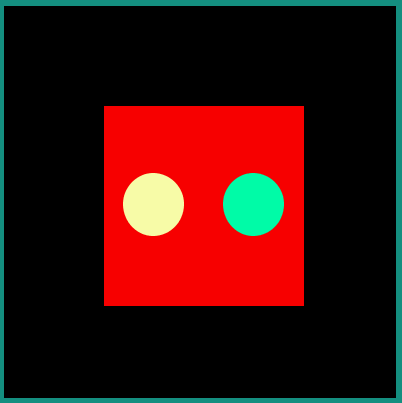

|endTable|

.. warning:: As path strokes are converted at build-time to filled path, the morphing of stroked paths is not supported. Any image with a path morphing animation on a stroked path will be rejected. Path strokes must be manually converted to filled path and the morphing of these new filled paths must be created.

Color and Opacity
*****************

Any path fillColor, strokeColor, fillAlpha and strokeAlpha attributes in the Android Vector Drawable can be animated. 

|startTable|

.. code-block:: xml

   <animated-vector xmlns:android="http://schemas.android.com/apk/res/android"
                    xmlns:aapt="http://schemas.android.com/aapt">
    <aapt:attr name="android:drawable">
        <vector android:width="55dp" android:height="55dp"
                 android:viewportWidth="55" android:viewportHeight="55">
           <group android:translateX="5">
            <path android:name="fillColor" android:fillColor="#FF00FF" 
                  android:pathData="M 0 0 h20 v20 h-20 Z"/>
            <path android:name="fillAlpha" android:fillColor="#FF0000" 
                  android:pathData="M 25 0 h20 v20 h-20 Z"/>
            <path android:name="strokeColor" android:strokeWidth="5" 
                  android:strokeColor="#FFFF00" android:pathData="M 0 25 h20 v20 h-20 Z"/>
            <path android:name="strokeAlpha" android:strokeWidth="5" android:strokeColor="#00FF00" 
                  android:pathData="M 25 25 h20 v20 h-20 Z"/>
           </group>
        </vector>
    </aapt:attr>

    <target android:name="fillColor">
    <aapt:attr name="android:animation">
        <set><objectAnimator
                android:propertyName="fillColor"
                android:duration="3000"
                android:valueFrom="#FF00FF"
                android:valueTo="#FFFF00"/>
        </set>
    </aapt:attr>
    </target>
    <target android:name="strokeColor">
        <aapt:attr name="android:animation">
            <set><objectAnimator
                    android:propertyName="strokeColor"
                    android:duration="3000"
                    android:valueFrom="#FFFF00"
                    android:valueTo="#FF00FF"/>
            </set>
        </aapt:attr>
    </target>

    <target android:name="fillAlpha">
        <aapt:attr name="android:animation">
            <set> <objectAnimator
                    android:propertyName="fillAlpha"
                    android:duration="3000"
                    android:valueFrom="0.2"
                    android:valueTo="1"
                    android:valueType="floatType"/>
            </set>
        </aapt:attr>
    </target>
    <target android:name="strokeAlpha">
        <aapt:attr name="android:animation">
            <set> <objectAnimator
                    android:propertyName="strokeAlpha"
                    android:duration="3000"
                    android:valueFrom="1"
                    android:valueTo="0.2"
                    android:valueType="floatType"/>
            </set>
        </aapt:attr>
    </target>
   </animated-vector>

|midTable|
  
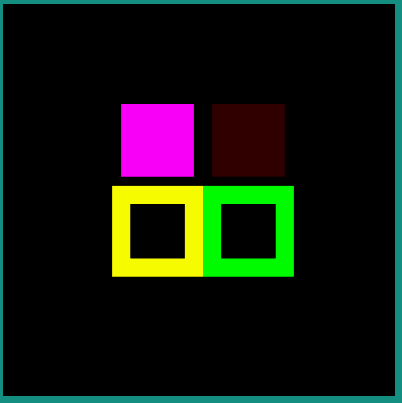

|endTable|

.. warning:: The color of paths colored with a linear gradient can not be animated.

Easing Interpolators
********************

Every animation is associated with an easing interpolator. By default, the animation transition is linear, but the rate of change in the animation can be defined by an interpolator. This allows the existing animation effects to be accelerated, decelerated, repeated, bounced, etc.

The supported Android interpolators are:

  - accelerate_cubic
  - accelerate_decelerate
  - accelerate_quad
  - anticipate
  - anticipate_overshoot
  - bounce
  - cycle
  - decelerate_cubic
  - decelerate_quad
  - decelerate_quint
  - fast_out_extra_slow_in
  - fast_out_linear_in
  - fast_out_slow_in
  - linear
  - linear_out_slow_in
  - overshoot

Any other vectorial path can also be used as the interpolator easing function.

Following examples show the behavior of some of the interpolators for a simple translation animation.

- Image:

.. code-block:: 

   <animated-vector xmlns:android="http://schemas.android.com/apk/res/android" xmlns:aapt="http://schemas.android.com/aapt">
    <aapt:attr name="android:drawable">
        <vector android:width="100dp" android:height="100dp" android:viewportWidth="100" android:viewportHeight="100">
        <path android:pathData="M 0 0 h100 v20 h-100 Z" android:strokeColor="#FFFFFF" android:strokeWidth="1"/>
           <group android:name="translate">
            <path android:pathData="M 0 0 h20 v20 h-20 Z" android:fillColor="#335566"/>
         </group>
        </vector>
    </aapt:attr>

    <target android:name="translate">
    <aapt:attr name="android:animation">
        <set><objectAnimator
                android:propertyName="translateX"
                android:duration="2000"
                android:valueFrom="0"
                android:valueTo="80"
                android:interpolator = "@android:interpolator/linear" />
        </set>
    </aapt:attr>
    </target>
   </animated-vector>

|startTable|

.. code-block:: xml

         android:interpolator = "@android:interpolator/linear"

|midTable|

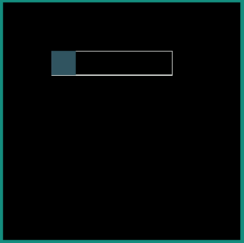

|endTable|

|startTable|

.. code-block:: xml

         android:interpolator = "@android:interpolator/accelerate_cubic"

|midTable|

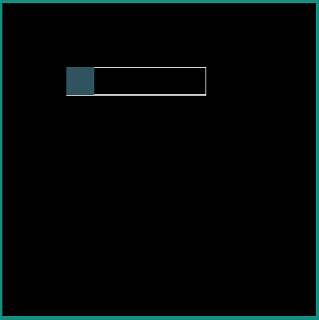

|endTable|

|startTable|

.. code-block:: xml

         android:interpolator = "@android:interpolator/bounce"

|midTable|

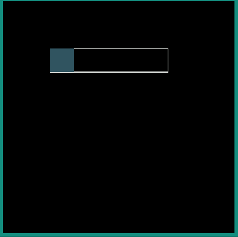

|endTable|

|startTable|

.. code-block:: xml

         android:interpolator = "@android:interpolator/fast_out_slow_in"

|midTable|

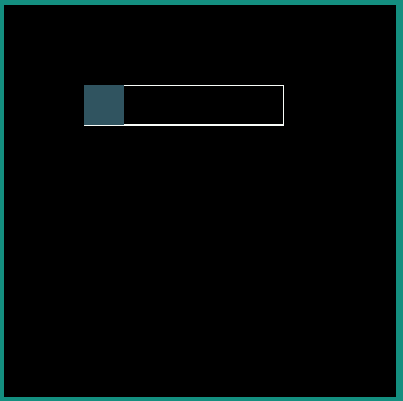

|endTable|

|startTable|

.. code-block:: xml

         <aapt:attr name="android:interpolator">
            <pathInterpolator android:pathData="M 0 0 C 0.371 2.888 0.492 -1.91 1 1"/>
         </aapt:attr>

|midTable600|

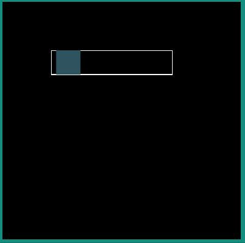

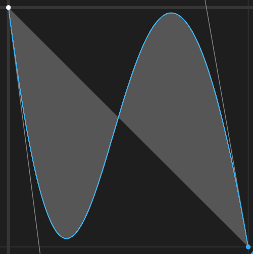

|endTable|

|startTable|

.. code-block:: xml

         <aapt:attr name="android:interpolator">
            <pathInterpolator android:pathData="M 0 0 C 0.333 1.939 0.171 -0.906 0.601 0.335 C 0.862 0.998 0.83 -0.771 1 1"/>
         </aapt:attr>

|midTable600|

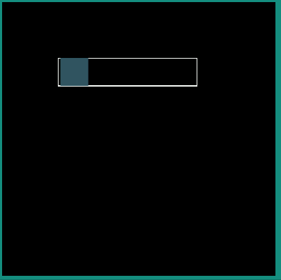

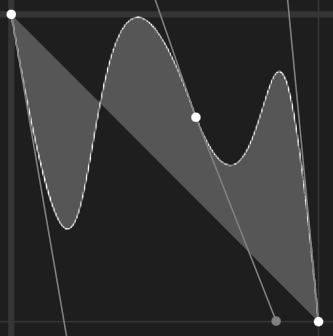

|endTable|

.. _vectorimage_limitations:

Limitations / Supported Features
--------------------------------

Android Vector Drawable
~~~~~~~~~~~~~~~~~~~~~~~

The MicroVG library supports most of the Android Vector Drawable features with the following limitations:

- ``clip-path`` feature is only supported for static images.
- ``trim-path`` animation is not supported.
- morphing animations are not supported for paths with stroke.
- usage of path opacity is limited
  
   - ``drawImage`` with alpha is not supported if the image contains overlapping paths.
   - images with global alpha(``android:alpha`` attribute of ``vector`` element) and overlapping paths are not supported.
   - Beware that using ``android:fillColor`` and ``android:strokeColor`` attributes on the same path leads to overlapping paths.
  
- ``radial`` and ``sweep`` gradient types are not supported.
- ``tint``, ``tintMode`` and ``autoMirrored`` features are not supported.
- ``trimPath`` feature is not supported.

SVG
~~~

The MicroVG library supports a subset of SVGTiny: https://www.w3.org/TR/SVGTiny12/ including:

- Path
- Basic shape
- Painting filling
- Painting stroking
- Painting gradient (only linear gradient with one pattern)
- Painting color formats : #RRGGBB, #RGB, rgb(r,g,b), keywords
- Transforms 
- Text
- Fonts (the text fonts used in the SVG file has to be installed on the operating system)

  
..
   | Copyright 2008-2022, MicroEJ Corp. Content in this space is free 
   for read and redistribute. Except if otherwise stated, modification 
   is subject to MicroEJ Corp prior approval.
   | MicroEJ is a trademark of MicroEJ Corp. All other trademarks and 
   copyrights are the property of their respective owners.