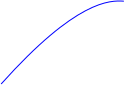
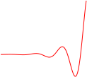

.. _motion_concepts:

Concepts
========

Functions
---------

The `Function`_ interface represents a mathematical function.
Its purpose is to associate a floating value to any input floating value between ``0f`` and ``1f``.
This function specifies the rate of change of a parameter over time (for example the position of an object).

The library provides a set of functions among the most common ones.
Each one contains a convenient instance.
For example the `singleton for the linear function`_.

Simple functions
~~~~~~~~~~~~~~~~

The `constant function`_ represents a constant motion whose value is always the stop value.

The `linear function`_ represents a uniform linear motion: the velocity is constant (no acceleration or deceleration).

Easing functions
~~~~~~~~~~~~~~~~

The easing functions come in 3 forms:

- Ease-in: the function is eased at the beginning.
- Ease-out: the function is eased at the end.
- Ease-in-out: the function is eased at the beginning and the end.

Here are the easing functions available in the library:

|startTable| 
`Circ ease-in`_

|secondColumn| 
`Circ ease-out`_

|thirdColumn| 
`Circ ease-in-out`_

|endTable| 

|startTable| 
`Cubic ease-in`_

|secondColumn| 
`Cubic ease-out`_

.. image:: images/cubic-ease-out.svg
   :width: 150px

|thirdColumn| 
`Cubic ease-in-out`_

|endTable| 

|startTable| 
`Expo ease-in`_

|secondColumn| 
`Expo ease-out`_

|thirdColumn| 
`Expo ease-in-out`_

|endTable| 

|startTable| 
`Quad ease-in`_

|secondColumn| 
`Quad ease-out`_

|thirdColumn| 
`Quad ease-in-out`_

|endTable| 

|startTable| 
`Quart ease-in`_

|secondColumn| 
`Quart ease-out`_

|thirdColumn| 
`Quart ease-in-out`_

|endTable| 

|startTable| 
`Quint ease-in`_

|secondColumn| 
`Quint ease-out`_

|thirdColumn| 
`Quint ease-in-out`_

|endTable| 

|startTable| 
`Sine ease-in`_

|secondColumn| 
`Sine ease-out`_

|thirdColumn| 
`Sine ease-in-out`_

|endTable| 

|startTable| 
`Back ease-in`_

.. image:: images/back-ease-in.svg
   :width: 150px

|secondColumn| 
`Back ease-out`_

|thirdColumn| 
`Back ease-in-out`_

|endTable| 

|startTable| 
`Bounce ease-in`_

|secondColumn| 
`Bounce ease-out`_

|thirdColumn| 
`Bounce ease-in-out`_

|endTable| 

|startTable| 
`Elastic ease-in`_

|secondColumn| 
`Elastic ease-out`_

|thirdColumn| 
`Elastic ease-in-out`_

|endTable| 

Custom Function
~~~~~~~~~~~~~~~

It is possible to create custom functions by creating a class implementing the `Function`_ interface.
The `computeValue(float)` method should return a value between ``0f`` and ``1f``.

Motion
------

The `Motion`_ class is used to describe the movement of an element.
It is made of a function, a start value, a stop value and a duration.

It proposes a convenient method `Motion.getValue(long)`_ to retrieve the position of the element at the specified elapsed time.

.. _Function: https://repository.microej.com/javadoc/microej_5.x/apis/ej/motion/Function.html
.. _linear function: https://repository.microej.com/javadoc/microej_5.x/apis/ej/motion/linear/LinearFunction.html
.. _constant function: https://repository.microej.com/javadoc/microej_5.x/apis/ej/motion/constant/ConstantFunction.html
.. _singleton for the linear function: https://repository.microej.com/javadoc/microej_5.x/apis/ej/motion/linear/LinearFunction.html#INSTANCE
.. _Cubic ease-in: https://repository.microej.com/javadoc/microej_5.x/apis/ej/motion/cubic/CubicEaseInFunction.html
.. _Cubic ease-out: https://repository.microej.com/javadoc/microej_5.x/apis/ej/motion/cubic/CubicEaseOutFunction.html
.. _Cubic ease-in-out: https://repository.microej.com/javadoc/microej_5.x/apis/ej/motion/cubic/CubicEaseInOutFunction.html
.. _Circ ease-in: https://repository.microej.com/javadoc/microej_5.x/apis/ej/motion/circ/CircEaseInFunction.html
.. _Circ ease-out: https://repository.microej.com/javadoc/microej_5.x/apis/ej/motion/circ/CircEaseOutFunction.html
.. _Circ ease-in-out: https://repository.microej.com/javadoc/microej_5.x/apis/ej/motion/circ/CircEaseInOutFunction.html
.. _Expo ease-in: https://repository.microej.com/javadoc/microej_5.x/apis/ej/motion/expo/ExpoEaseInFunction.html
.. _Expo ease-out: https://repository.microej.com/javadoc/microej_5.x/apis/ej/motion/expo/ExpoEaseOutFunction.html
.. _Expo ease-in-out: https://repository.microej.com/javadoc/microej_5.x/apis/ej/motion/expo/ExpoEaseInOutFunction.html
.. _Quad ease-in: https://repository.microej.com/javadoc/microej_5.x/apis/ej/motion/quad/QuadEaseInFunction.html
.. _Quad ease-out: https://repository.microej.com/javadoc/microej_5.x/apis/ej/motion/quad/QuadEaseOutFunction.html
.. _Quad ease-in-out: https://repository.microej.com/javadoc/microej_5.x/apis/ej/motion/quad/QuadEaseInOutFunction.html
.. _Quart ease-in: https://repository.microej.com/javadoc/microej_5.x/apis/ej/motion/quart/QuartEaseInFunction.html
.. _Quart ease-out: https://repository.microej.com/javadoc/microej_5.x/apis/ej/motion/quart/QuartEaseOutFunction.html
.. _Quart ease-in-out: https://repository.microej.com/javadoc/microej_5.x/apis/ej/motion/quart/QuartEaseInOutFunction.html
.. _Quint ease-in: https://repository.microej.com/javadoc/microej_5.x/apis/ej/motion/quint/QuintEaseInFunction.html
.. _Quint ease-out: https://repository.microej.com/javadoc/microej_5.x/apis/ej/motion/quint/QuintEaseOutFunction.html
.. _Quint ease-in-out: https://repository.microej.com/javadoc/microej_5.x/apis/ej/motion/quint/QuintEaseInOutFunction.html
.. _Sine ease-in: https://repository.microej.com/javadoc/microej_5.x/apis/ej/motion/sine/SineEaseInFunction.html
.. _Sine ease-out: https://repository.microej.com/javadoc/microej_5.x/apis/ej/motion/sine/SineEaseOutFunction.html
.. _Sine ease-in-out: https://repository.microej.com/javadoc/microej_5.x/apis/ej/motion/sine/SineEaseInOutFunction.html
.. _Back ease-in: https://repository.microej.com/javadoc/microej_5.x/apis/ej/motion/back/BackEaseInFunction.html
.. _Back ease-out: https://repository.microej.com/javadoc/microej_5.x/apis/ej/motion/back/BackEaseOutFunction.html
.. _Back ease-in-out: https://repository.microej.com/javadoc/microej_5.x/apis/ej/motion/back/BackEaseInOutFunction.html
.. _Bounce ease-in: https://repository.microej.com/javadoc/microej_5.x/apis/ej/motion/bounce/BounceEaseInFunction.html
.. _Bounce ease-out: https://repository.microej.com/javadoc/microej_5.x/apis/ej/motion/bounce/BounceEaseOutFunction.html
.. _Bounce ease-in-out: https://repository.microej.com/javadoc/microej_5.x/apis/ej/motion/bounce/BounceEaseInOutFunction.html
.. _Elastic ease-in: https://repository.microej.com/javadoc/microej_5.x/apis/ej/motion/elastic/ElasticEaseInFunction.html
.. _Elastic ease-out: https://repository.microej.com/javadoc/microej_5.x/apis/ej/motion/elastic/ElasticEaseOutFunction.html
.. _Elastic ease-in-out: https://repository.microej.com/javadoc/microej_5.x/apis/ej/motion/elastic/ElasticEaseInOutFunction.html
.. _Motion.getValue(long): https://repository.microej.com/javadoc/microej_5.x/apis/ej/motion/Motion.html#getValue-long-

.. |startTable| raw:: html

   <table width="100%" style="table-layout:fixed"><td style="vertical-align:top" width="100%">

.. |secondColumn| raw:: html

   </td><td style="vertical-align:top" width="100%">

.. |thirdColumn| raw:: html

   </td><td style="vertical-align:top" width="100%">

.. |endTable| raw:: html

   </td></table>

..
   | Copyright 2024, MicroEJ Corp. Content in this space is free 
   for read and redistribute. Except if otherwise stated, modification 
   is subject to MicroEJ Corp prior approval.
   | MicroEJ is a trademark of MicroEJ Corp. All other trademarks and 
   copyrights are the property of their respective owners.
