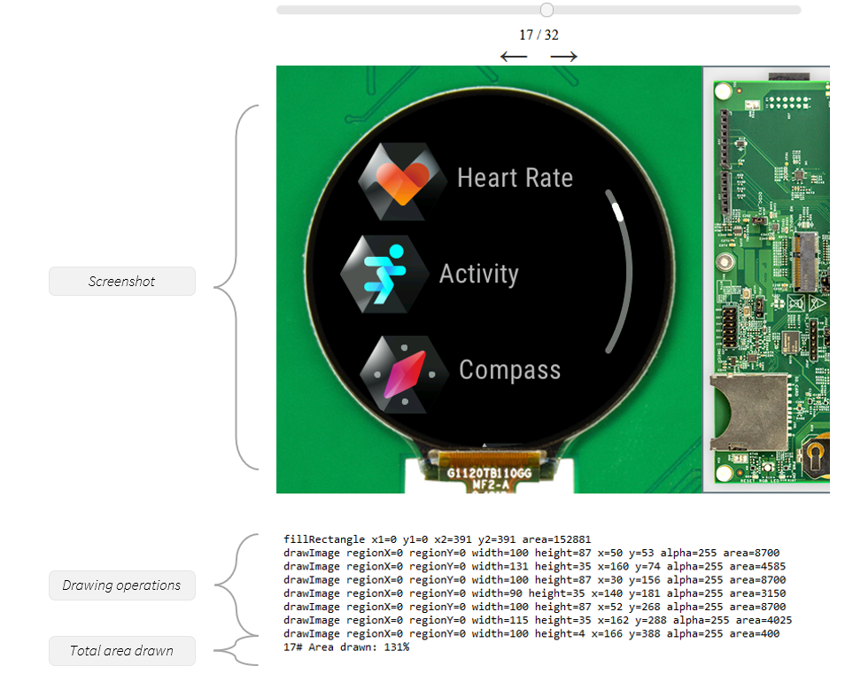
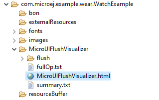

.. _flush_visualizer:

Flush Visualizer
================

Presentation
------------

Building smooth and visually appealing UI applications requires a keen focus on performance.
To achieve efficient UI rendering, minimizing unnecessary work that consumes valuable CPU time is essential.

For example, assuming the application targets 60 FPS to perform a transition between two screens, that means the application has 1/60s ~= 16ms in total to execute the rendering and the flush (see :ref:`rendering_pipeline`).

The Flush Visualizer is a tool designed to investigate potential performance bottlenecks in UI applications running on the Simulator.
The Flush Visualizer provides the following information:

- A screenshot of what was shown on the screen after a flush.
- The list of drawing operations that were performed before this flush (and after the previous one).
- The total area covered by the sum of the area drawn by the drawing operations as a percentage.
  A value of 100% indicates that the area drawn is equivalent to the surface of the entire display.
  A value of 200% indicates the area drawn is equivalent to twice the surface of the entire display.

A perfect application has 100% of its display area drawn.
(It can even be less than 100% if only a subset of the display has changed.)
A total area drawn between 100% to 200% is the norm in practice because widgets often overlap.
However, if the total area drawn is bigger than 200%, that means that the total surface of the display was drawn more than twice.
Probably meaning that a lot of drawings are done above others.
Identifying this drawing (and the ones below) can help reducing the number of drawings done (or their surface).

As always, when conducting a performance study, measure.
Use :ref:`systemview` to identify the bottlenecks in your application on the embedded target.
A total area drawn over 200% is inefficient, but your application may have bigger bottlenecks.
Confirm it by measuring the time spent drawing vs. the time spent elsewhere between flushes.

Installation
------------

Set the option ``ej.fp.display.flushVisualizer`` to ``true`` to enable the flush vizualizer.

This option is available in the for the ``Display`` widget in `frontpanel widget module <https://forge.microej.com/artifactory/microej-developer-repository-release/ej/tool/frontpanel/widget/>`__ version 4.+ for UI Pack 14.0.0 or later.

Usage
-----

1. Run the application in the Simulator.
2. Open the file ``MicroUIFlushVisualizer/MicroUIFlushVisualizer.html`` that was generated in the :ref:`application output folder <outputfiles>`.

Limitations
-----------

Please refer to the javadoc of the ``FlushVisualizer`` class alongside the ``Display`` widget.

Examples
--------

Here are examples of the Flush Visualizer in action:

+----------------------------------------------------------------+--------------------------------------------------------------------+
|Simple GFX                                                      | Demo Wearable                                                      |
+================================================================+====================================================================+
| .. image:: images/small-demo-ui-flush-visualizer-simpleGFX.png | .. image:: images/small-demo-ui-flush-visualizer-demo-wearable.png |
+----------------------------------------------------------------+--------------------------------------------------------------------+

..
   | Copyright 2023-2024, MicroEJ Corp. Content in this space is free 
   for read and redistribute. Except if otherwise stated, modification 
   is subject to MicroEJ Corp prior approval.
   | MicroEJ is a trademark of MicroEJ Corp. All other trademarks and 
   copyrights are the property of their respective owners.