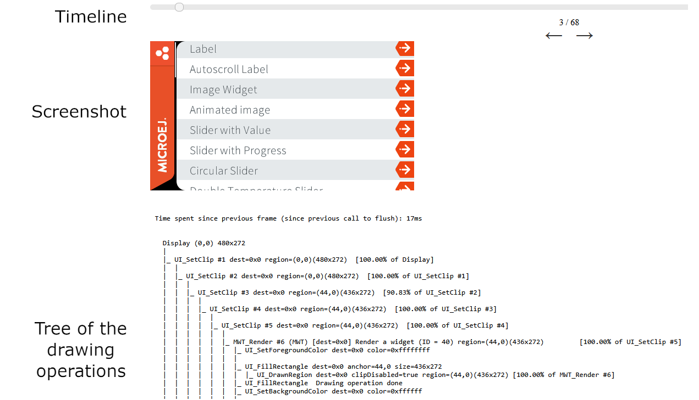

.. _flush_visualizer:

Flush Visualizer
================

Presentation
------------

Building smooth and visually appealing UI applications requires a keen focus on performance.
To achieve efficient UI rendering, minimizing unnecessary work that consumes valuable CPU time is essential.

For example, assuming the application targets 60 FPS to perform a transition between two screens, that means the application has 1/60s ~= 16ms in total to execute the rendering and the flush (see :ref:`rendering_pipeline`).

The Flush Visualizer is a tool designed to investigate potential performance bottlenecks in UI applications running on the Simulator.
It uses the :ref:`microui_traces` to record the drawings whose target is the display (since UI Pack 14.4.1, see :ref:`flush_visualizer_install`).
All other traces (drawings in buffered images and third-party traces of the other libraries) are dropped. 

The Flush Visualizer provides the following information:

  - A timeline with a step for each flush.
  - A screenshot of what is shown on the display at flush time.
  - The list of what is done before this flush (and after the previous one) organized as a tree.
  - A node of the tree can be either a region (the display or a clip) or a drawing operation.
  - Each region defines its bounds and can contain one or several other nodes.
  - Each region also displays the percentage of their parent region they cover.
  - Some of the drawings can compute the percentage of their parent region they cover.
  - The others are either negligeable or unknown.
  - At the end of each region, there is a summary of the percentage covered by the drawings in this region (recursively).

Consider this part of the tree:

.. code::

  |_ UI_SetClip #10 dest=0x0 region=(0,0)(44x46)  [16.91% of UI_SetClip #9]
  |  |
  |  |_ MWT_Render #11 (MWT) [dest=0x0] Render a widget (ID = 61) region=(0,0)(44x46)         [100.00% of UI_SetClip #10]
  |  |  |_ UI_SetForegroundColor dest=0x0 color=0xffee502e
  |  |  |
  |  |  |_ UI_FillRectangle dest=0x0 anchor=0,0 size=44x46 
  |  |  |  |_ UI_DrawnRegion dest=0x0 clipDisabled=true region=(0,0)(44x46) [100.00% of MWT_Render #11]
  |  |  |_ UI_FillRectangle  Drawing operation done
  |  |  |_ UI_SetForegroundColor dest=0x0 color=0xffcf4520
  |  |  |
  |  |  |_ UI_FillRectangle dest=0x0 anchor=0,44 size=44x2 
  |  |  |  |_ UI_DrawnRegion dest=0x0 clipDisabled=true region=(0,44)(44x2) [4.35% of MWT_Render #11]
  |  |  |_ UI_FillRectangle  Drawing operation done
  |  |  |
  |  |  |_ UI_SetClip #12 dest=0x0 region=(0,0)(44x44)  [95.65% of MWT_Render #11]
  |  |  |  |
  |  |  |  |_ UI_SetClip #13 dest=0x0 region=(10,10)(24x24)  [29.75% of UI_SetClip #12]
  |  |  |  |  |_ UI_SetForegroundColor dest=0x0 color=0xffffffff
  |  |  |  |  |
  |  |  |  |  |_ UI_DrawImage dest=0x0 image=0x3 from 0,0 size=24x24 anchor=10,10 alpha=255 
  |  |  |  |  |  |_ UI_DrawnRegion dest=0x0 clipDisabled=true region=(10,10)(24x24) [100.00% of UI_SetClip #13]
  |  |  |  |  |_ UI_DrawImage  Drawing operation done
  |  |  |  |  [100.00% drawn of UI_SetClip #13]
  |  |  |  [29.75% drawn of UI_SetClip #12]
  |  |  [132.81% drawn of MWT_Render #11]
  |  |_ MWT_Render  (MWT) Widget render done (ID = 61)
  |  [132.81% drawn of UI_SetClip #10]

We can see that:

- The MWT_Render #11 is 100% of the clip #10, which is 16.91% of the clip #9.
- It draws 2 rectangles and an image that take respectively 100%, 4.35% and 100% of their parent region.
- The clip #13 is fully covered by the image (100%).
- The clip #10 is covered at 132.81%: 100% for the 1st rectangle, 4.35% for the 2nd, 28.46% for the clip #12 and its inner image (29.75 x 95.65%)

A value of 100% indicates that the area drawn is equivalent to the surface of the region.
A value of 200% indicates that the area drawn is equivalent to twice the surface of the region.
A perfect application has 100% of its root region drawn but its very unlikely for an application that draws anything else than a rectangle or an image.
A total area drawn between 100% to 200% is the norm in practice because widgets often overlap.
However, if the total area drawn is bigger than 200%, that means that the total surface of the region was drawn more than twice.
Probably meaning that a lot of drawings are done above others.
Identifying this drawing (and the ones below) can help reducing the number of drawings done (or their surface).

As always, when conducting a performance study, measure.
Use :ref:`systemview` to identify the bottlenecks in your application on the embedded target.
A total area drawn over 200% is inefficient, but your application may have bigger bottlenecks.
Confirm it by measuring the time spent drawing vs. the time spent elsewhere between flushes.

.. _flush_visualizer_install:

Installation
------------

The Flush Visualizer option is available for the ``Display`` widget in
`frontpanel widget module <https://forge.microej.com/artifactory/microej-developer-repository-release/ej/tool/frontpanel/widget/>`__
version 4.+ for UI Pack 14.0.0 or later.

.. tabs::

   .. tab:: Since UI Pack 14.4.1

    * Set the property ``core.trace.enabled`` to ``true`` to enable the Flush Visualizer.
    * Set the property ``core.trace.autostart`` to ``true`` to start the recording on startup.
    * Start and pause the recording by clicking on the button |FlushVisualizerRecord|.

   .. tab:: Before UI Pack 14.4.1

    * Set the property ``ej.fp.display.flushVisualizer`` to ``true`` to enable the Flush Visualizer.

Refer to the :ref:`application_options` documentation to set the option.

Usage
-----

1. Run the application in the Simulator.
2. Since UI Pack 14.3.0, the button |FlushVisualizer| in the toolbar of the Front Panel opens the Flush Visualizer.
3. The file ``MicroUIFlushVisualizer/MicroUIFlushVisualizer.html`` is generated in the :ref:`application output folder <outputfiles>` and can be opened during or after the execution.

.. |FlushVisualizer| image:: images/monitoring.png

.. image:: images/MicroUIFlushVisualizerApplicationOutputFolder.png

.. note::

  Since MICROEJ SDK 6, the application output folder is located under the ``build/output/`` folder.

Examples
--------

Here are examples of the Flush Visualizer in action:

+--------------------------------------------+---------------------------------------------------+
| MVC Demo                                   | Widget Example                                    |
+============================================+===================================================+
| .. image:: images/flush-visualizer-mvc.png | .. image:: images/flush-visualizer-checkboxes.png |
+--------------------------------------------+---------------------------------------------------+

..
   | Copyright 2023-2025, MicroEJ Corp. Content in this space is free 
   for read and redistribute. Except if otherwise stated, modification 
   is subject to MicroEJ Corp prior approval.
   | MicroEJ is a trademark of MicroEJ Corp. All other trademarks and 
   copyrights are the property of their respective owners.