.. _frontpanel_overview:

Front Panel Overview
====================

The :ref:`Front Panel  Mock <section_frontpanel>` is provided by the VEE Ports.

It is especially useful for those exposing a MicroUI display, LEDs and input devices.
It then provides an interactive window for the Application simulation.

The window contains a toolbar, the device image and a status bar.
It is extensible, so VEE ports can add custom controls and informations.

Following is the list of features available as standard in the UI Pack.

.. _frontpanel_zoom:

Zoom
----

The Front Panel is able to zoom in or out the represented device.

The current value of the zoom is printed in the status bar.

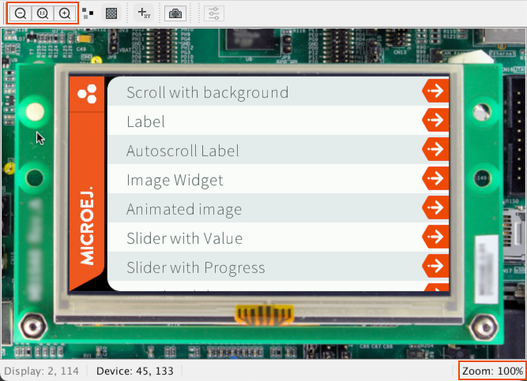

There are three buttons in the toolbar to change the zoom:

- |ZoomOut| Zoom out by increment of 10%.
- |Zoom1:1| Reset the zoom to 100%.
- |ZoomIn| Zoom in by increment of 10%.

The zoom can also be updated when the window size is changed when the :ref:`frontpanel_zoom_fit` option is set.

.. _frontpanel_zoom_interpolation:

Interpolation
-------------

By default, the zoom is done without interpolation |ZoomNoInterpolate| to ease the reading of the pixels drawn on the screen.
But it could be convenient to enable the interpolation |ZoomInterpolate| when a great or small zoom is applied, to better read the strings for instance.

Here is an example of the same content zoomed out with and without interpolation:

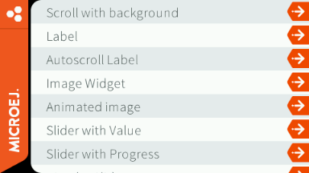

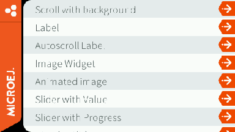

.. _frontpanel_zoom_fit:

Fit
---

By default, the zoom and the window size are not related |ZoomNoFitted|.
That means that when the zoom is changed the window size does not change and scrollbars may appear to navigate in the device.

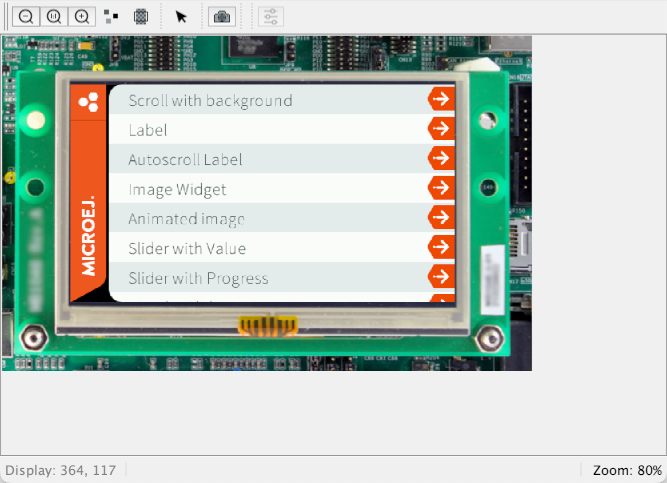

And the other way around, when the window size is changed, the zoom does not change.

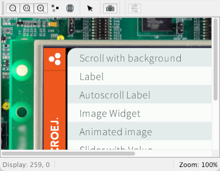

In contrast, the zoom and the window can be linked together |ZoomFitted|.
In this case, a modification of the zoom or the window size have an impact on the other.
It is important to note that in this case, some zooms may not be possible since the window is bound to the display size.

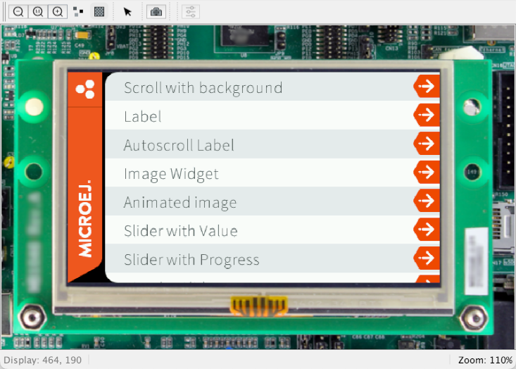

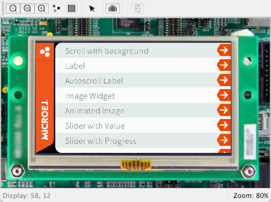

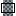
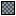

.. _frontpanel_device_coordinates:

Device Coordinates
------------------

It is possible to print the coordinates of the device under the cursor |DeviceCoordinates| in the status bar.
It may be convenient for the development of the Front Panel project of a VEE Port.
It is not activated by default |DeviceNoCoordinates|.

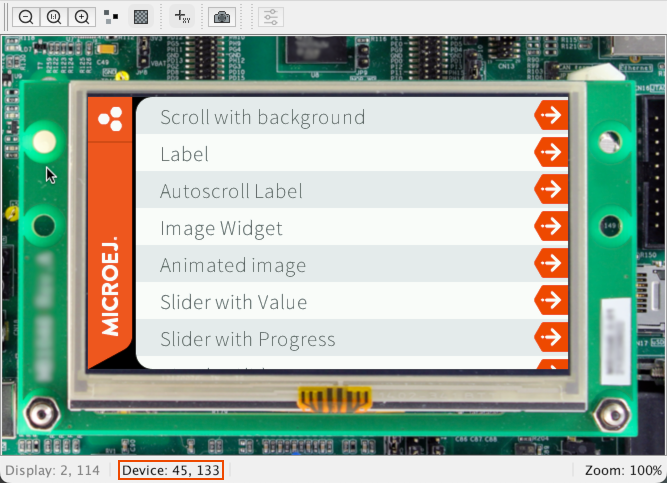

Display Coordinates
-------------------

When the device contains a display, the display coordinates under the cursor are printed in the status bar.

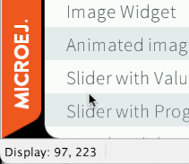

.. _frontpanel_display_screenshot:

Display Screenshot
------------------

When the device contains a display, a new button is available in the toolbar that allows to make a screenshot |DisplayScreenshot| of the current content of the display.
The screenshots are saved in the subfolder ``screenshots`` of the :ref:`application output folder <outputfiles>`.
Their name contains the date and time they are shot at.

When a screenshot is made, a notification appears in the status bar.
Clicking on the notification opens the folder containing the screenshots.

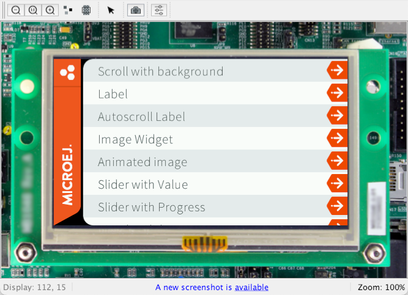

.. |DisplayScreenshot| image:: images/screenshot.png

Open Flush Vizualizer
---------------------

When the :ref:`flush vizualizer<flush_visualizer>` is activated, it is also possible to open it with a button in the toolbar |FlushVizualizer|.

