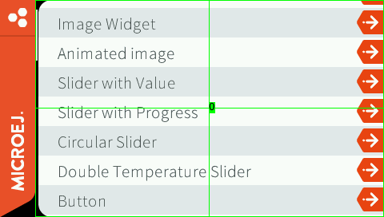
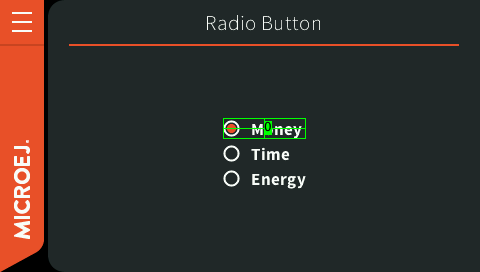
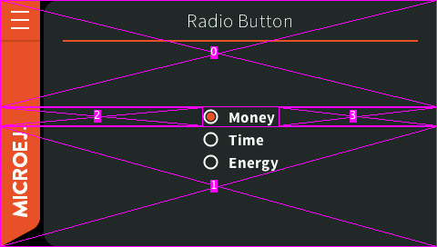
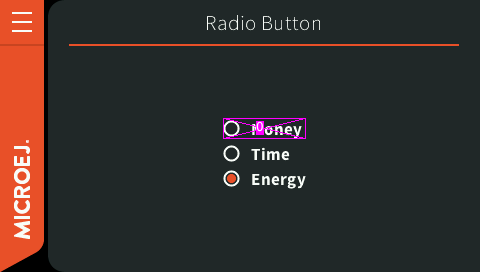
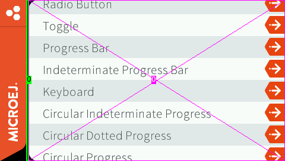
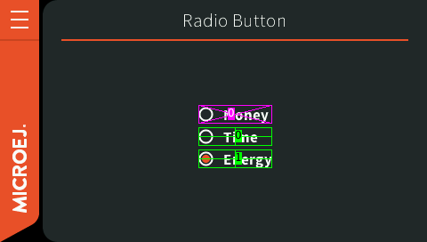

.. _refresh_strategy_highlighting:

Refresh Strategy Highlighting
=============================

Presentation
------------

A buffer refresh strategy is responsible of making sure that what is shown on the display contains all the drawings.
The ones done since last flush *and* the past.
To achieve that it detects the drawn regions and refresh the necessary data in the back buffer.

These informations can also be used to understand what happens for each frame in terms of drawings and refreshes.
It may be very useful to identify performance issues.

The drawn and restored regions can be very different depending on the selected strategy and the associated options.
See :ref:`section_brs` for more information about the different strategies and their behavior.

.. _refresh_drawn_regions:

Drawn Region(s)
---------------

The buffer refresh strategies registers the list of drawn regions between two flushes.
These regions can be highlighted during the execution of an application.
It is activated by setting the ``ej.fp.brs.drawnColor`` option to any 32-bit color (opaque or semi-transparent).

For example with ``ej.fp.brs.drawnColor=0xff00ff00``:

   Drawn region when scrolling.

   Drawn region when selecting a radio button.

.. _refresh_restored_regions:

Restored Region(s)
------------------

It is also possible to track the regions restored by the buffer refresh strategies.
The ``ej.fp.brs.restoredColor`` option can be set to any 32-bit color (opaque or semi-transparent) to highlight these regions.

For example with ``ej.fp.brs.restoredColor=0xffff00ff``:

   Restored region when selecting a radio button when entering page.

   Restored region when selecting another radio button.

.. _refresh_dirty_regions:

Dirty Region(s)
---------------

The buffer refresh strategies use the clip to determine the regions changed between each flush.
If a clip has been set but not fully filled by the drawings, the pixels "not drawn" may be flushed to the display as is (without restoration).
But the content of these pixels is undefined depending on what this buffer was used for before.
It can be a previous frame, one or several flush before depending on the number of buffers.
It can also be random pixels if nothing has been drawn on the buffer yet.

These regions are considered as "dirty" since they do not contain the current drawnings nor the state of the previous display panel.
In other words, it can cause glitches .

To detect easily these regions, a rectangle can be filled with a color for each clip handled by the buffer refresh strategy.
It is activated by setting the ``ej.fp.brs.dirtyColor`` option to any 32-bit color (opaque or semi-transparent).

For example: ``ej.fp.brs.dirtyColor=0x880000ff``.

Combining Highlightings
-----------------------

It is possible to use all the highlightings in the same execution.
It is particularly convenient to see at the same time the drawn regions and the restored regions.

For example:

.. code-block:: properties

   ej.fp.brs.drawnColor=0xff00ff00
   ej.fp.brs.restoredColor=0xffff00ff

   Drawn and restored regions when the scrollbar is hidden at the end of a scroll.

   Drawn and restored regions when selecting another radio button.

..
   | Copyright 2024, MicroEJ Corp. Content in this space is free 
   for read and redistribute. Except if otherwise stated, modification 
   is subject to MicroEJ Corp prior approval.
   | MicroEJ is a trademark of MicroEJ Corp. All other trademarks and 
   copyrights are the property of their respective owners.