.. include:: aliases.rst

MWT Examples
============

The `MWT Examples <https://github.com/MicroEJ/ExampleJava-MWT>`_ are code samples that show how to implement various use cases with MWT.

Because the MWT toolkit is designed to be compact and customizable, it allows for many possibilities when developing a GUI.
Thus, the examples can be used, with or without modifications, to extend and customize the MWT framework for your specific needs.
They also help to learn the best practices for the development of graphic interfaces with MWT.

Source
------

To get the source code of these examples, clone the following GitHub repository: `<https://github.com/MicroEJ/ExampleJava-MWT>`_.

The repository contains several projects (one project for each example).
You can import the projects in MicroEJ SDK to browse the source code and run the examples.

* Go to :guilabel:`File` > :guilabel:`Import...`.
* In :guilabel:`General`, select :guilabel:`Existing Projects into Workspace`.
* Check :guilabel:`Select root directory` and browse to the cloned MWT Examples repository.
* Select the projects to import and click :guilabel:`Finish`.

For each project, please refer to its ``README.md`` file for more details about the example and its usage.

Run the Examples
----------------

Make sure to have a valid Platform in the workspace.
The examples can be tested with the Platform `STM32F7508-DK <https://github.com/MicroEJ/Platform-STMicroelectronics-STM32F7508-DK/tree/1.5.0>`_.

To run the examples in a Virtual Device:

* Right-click on a project.
* Select :guilabel:`Run As` > :guilabel:`MicroEJ Application`.

.. note::

   Some of the examples may require extra configuration, please refer to their README for more details.

To run the examples on a device, :ref:`adapt the Run Configuration <device_build>`, then refer to the Platform documentation.

Provided Examples
-----------------

`Attribute Selectors <https://github.com/MicroEJ/ExampleJava-MWT/tree/master/attribute-selectors>`_
~~~~~~~~~~~~~~~~~~~~~~~~~~~~~~~~~~~~~~~~~~~~~~~~~~~~~~~~~~~~~~~~~~~~~~~~~~~~~~~~~~~~~~~~~~~~~~~~~~~~

|startTable| 

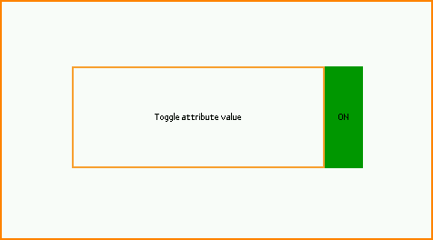

|midTable|
   
This example shows how to customize the style of widgets using attribute selectors, similar to CSS Attribute Selectors.
It provides several types of attribute selectors, any of which can be used in a stylesheet to select widgets based on custom attributes.
In this case, the background color of a label switches depending on the value of an attribute of the label.

|endTable|

`Buffered Image Pool <https://github.com/MicroEJ/ExampleJava-MWT/tree/master/buffered-image-pool>`_
~~~~~~~~~~~~~~~~~~~~~~~~~~~~~~~~~~~~~~~~~~~~~~~~~~~~~~~~~~~~~~~~~~~~~~~~~~~~~~~~~~~~~~~~~~~~~~~~~~~

|startTable| 

|midTable|
   
This example shows how to use a pool of `BufferedImages <https://repository.microej.com/javadoc/microej_5.x/apis/ej/microui/display/BufferedImage.html>`_ to share them across an application.
In this demo, there is one image in the pool, which is shared between the histogram widget and the transition container.

|endTable|

`Context-Sensitive Container <https://github.com/MicroEJ/ExampleJava-MWT/tree/master/context-sensitive-container>`_
~~~~~~~~~~~~~~~~~~~~~~~~~~~~~~~~~~~~~~~~~~~~~~~~~~~~~~~~~~~~~~~~~~~~~~~~~~~~~~~~~~~~~~~~~~~~~~~~~~~~~~~~~~~~~~~~~~~

|startTable| 

|midTable|
   
This example shows a smartwatch application that looks different depending on whether the user is wearing the device on the left arm or on the right arm.
It demonstrates how a container can adapt to the context by changing how its children are laid out: in this case, depending on the wrist mode, 
the widgets are displayed on either the left or right side. 
For demonstration purposes, the example displays a virtual watch to simulate the device flip.

|endTable|

`Drag'n'Drop <https://github.com/MicroEJ/ExampleJava-MWT/tree/master/drag-and-drop>`_
~~~~~~~~~~~~~~~~~~~~~~~~~~~~~~~~~~~~~~~~~~~~~~~~~~~~~~~~~~~~~~~~~~~~~~~~~~~~~~~~~~~~~

|startTable| 

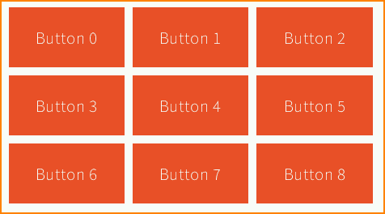

|midTable|
   
This example shows how to implement drag'n'drop support in a grid.

|endTable|

`Focus <https://github.com/MicroEJ/ExampleJava-MWT/tree/master/focus>`_
~~~~~~~~~~~~~~~~~~~~~~~~~~~~~~~~~~~~~~~~~~~~~~~~~~~~~~~~~~~~~~~~~~~~~~~

|startTable| 

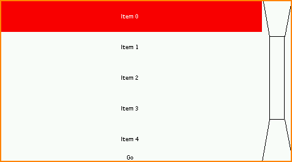

|midTable|
   
This example shows how to introduce focus management in a project when using peripherals like buttons or a joystick.

The virtual joystick (on the right) is used to simulate a hardware joystick. 
When the joystick directions (up, down, left, right) are pressed, the focus changes on the items in the same way as when using the touch pointer.

|endTable|

`Immutable Stylesheet <https://github.com/MicroEJ/ExampleJava-MWT/tree/master/immutable-stylesheet>`_
~~~~~~~~~~~~~~~~~~~~~~~~~~~~~~~~~~~~~~~~~~~~~~~~~~~~~~~~~~~~~~~~~~~~~~~~~~~~~~~~~~~~~~~~~~~~~~~~~~~~~

This example shows how to create and use an immutable stylesheet.
The immutable stylesheet resolves the style for a widget with the same algorithm as the `cascading stylesheet <https://repository.microej.com/javadoc/microej_5.x/apis/ej/mwt/stylesheet/cascading/CascadingStylesheet.html>`_.
The difference is that the immutable stylesheet is described in an immutable file instead of Java code.

`Lazy Stylesheet <https://github.com/MicroEJ/ExampleJava-MWT/tree/master/lazy-stylesheet>`_
~~~~~~~~~~~~~~~~~~~~~~~~~~~~~~~~~~~~~~~~~~~~~~~~~~~~~~~~~~~~~~~~~~~~~~~~~~~~~~~~~~~~~~~~~~~

This example shows how to create and use a "lazy" stylesheet. 
The lazy stylesheet resolves the style for a widget with the same algorithm as the `cascading stylesheet <https://repository.microej.com/javadoc/microej_5.x/apis/ej/mwt/stylesheet/cascading/CascadingStylesheet.html>`_.
The difference is that the lazy stylesheet associates style factories with selectors (rather than styles).
As a result, the style elements are allocated "on demand" when a rule's selector applies to a widget.

`Masking Grid <https://github.com/MicroEJ/ExampleJava-MWT/tree/master/masking-grid>`_
~~~~~~~~~~~~~~~~~~~~~~~~~~~~~~~~~~~~~~~~~~~~~~~~~~~~~~~~~~~~~~~~~~~~~~~~~~~~~~~~~~~~~

|startTable| 

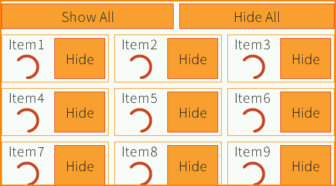

|midTable|

This example shows how to mask a widget temporarily.
The grid is a custom container (``MaskingGrid``) that exposes an API to change the visibility of its children (visible or invisible).
When requested to render, the grid only renders the children marked as visible.

|endTable|

`MVC <https://github.com/MicroEJ/ExampleJava-MWT/tree/master/mvc>`_
~~~~~~~~~~~~~~~~~~~~~~~~~~~~~~~~~~~~~~~~~~~~~~~~~~~~~~~~~~~~~~~~~~~

|startTable| 

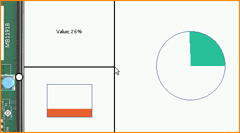

|midTable|

This example shows how to create and use an MVC design pattern (Model, View, Controller).
The value of the model can be changed by clicking on the physical button.

It is also possible to resize all the widgets at once.

|endTable|

`Popup <https://github.com/MicroEJ/ExampleJava-MWT/tree/master/popup>`_
~~~~~~~~~~~~~~~~~~~~~~~~~~~~~~~~~~~~~~~~~~~~~~~~~~~~~~~~~~~~~~~~~~~~~~~

|startTable| 

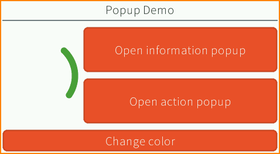

|midTable|

This example shows how to show a popup in an application.

Two types of popups are illustrated.
The information popup can be dismissed by clicking outside of its bounds. The action popup needs the user to click on a button to close it.

|endTable|

`Remove Widget <https://github.com/MicroEJ/ExampleJava-MWT/tree/master/remove-widget>`_
~~~~~~~~~~~~~~~~~~~~~~~~~~~~~~~~~~~~~~~~~~~~~~~~~~~~~~~~~~~~~~~~~~~~~~~~~~~~~~~~~~~~~~~

|startTable| 

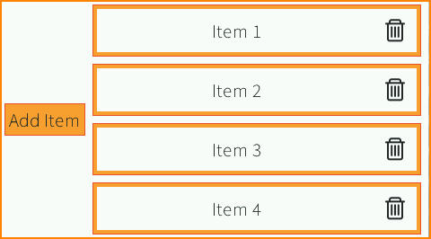

|midTable|

This example shows how to add and remove widgets in a widget hierarchy.
The layout adapts automatically to the number of items because ``requestLayout()`` is called for each addition/deletion on the container.

|endTable|

`Slide Container <https://github.com/MicroEJ/ExampleJava-MWT/tree/master/slide-container>`_
~~~~~~~~~~~~~~~~~~~~~~~~~~~~~~~~~~~~~~~~~~~~~~~~~~~~~~~~~~~~~~~~~~~~~~~~~~~~~~~~~~~~~~~~~~~

|startTable| 

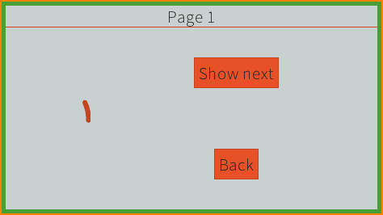

|midTable|

This example shows a slide container. This is a container that shows only its last child.
An animation is done when adding/removing a child by translating the widgets from/to the right.

|endTable|

`Stack Container <https://github.com/MicroEJ/ExampleJava-MWT/tree/master/stack-container>`_
~~~~~~~~~~~~~~~~~~~~~~~~~~~~~~~~~~~~~~~~~~~~~~~~~~~~~~~~~~~~~~~~~~~~~~~~~~~~~~~~~~~~~~~~~~~

|startTable| 

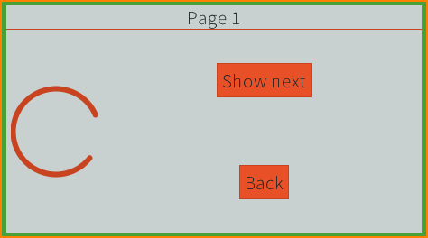

|midTable|

This example shows a stack container. This is a container that stacks its children on top of each other.
An animation is done when adding/removing a child by translating the widget from/to the right.

|endTable|

`Stashing Grid <https://github.com/MicroEJ/ExampleJava-MWT/tree/master/stashing-grid>`_
~~~~~~~~~~~~~~~~~~~~~~~~~~~~~~~~~~~~~~~~~~~~~~~~~~~~~~~~~~~~~~~~~~~~~~~~~~~~~~~~~~~~~~~

|startTable| 

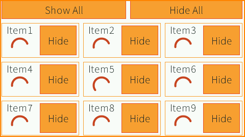

|midTable|

This example shows how to stash a widget temporarily.

The grid is a custom container (``StashingGrid``) that exposes an API to change the visibility of its children (visible or invisible).
When requested to lay out, the grid only lays out the children marked as visible. 
When requested to render, the grid only renders the children marked as visible.

|endTable|

`Virtual Watch <https://github.com/MicroEJ/ExampleJava-MWT/tree/master/virtual-watch>`_
~~~~~~~~~~~~~~~~~~~~~~~~~~~~~~~~~~~~~~~~~~~~~~~~~~~~~~~~~~~~~~~~~~~~~~~~~~~~~~~~~~~~~~~

|startTable| 

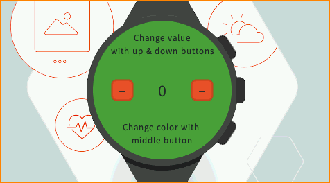

|midTable|

This example shows how to simulate the skin and inputs of a device with a different device (e.g., an evaluation board).
This can be a convenient option when the target hardware is not yet available.

Here, it simulates a watch with a round screen and 3 buttons.
The actual application is shown in a round area of the screen and receives events from the virtual buttons.
The virtual buttons send `commands <https://repository.microej.com/javadoc/microej_5.x/apis/ej/microui/event/generator/Command.html>`_ when clicked, the same way a target device would have sent events from the native world.
The goal is to be able to migrate the application on the target device without modifying the application code.

|endTable|

..
   | Copyright 2008-2022, MicroEJ Corp. Content in this space is free 
   for read and redistribute. Except if otherwise stated, modification 
   is subject to MicroEJ Corp prior approval.
   | MicroEJ is a trademark of MicroEJ Corp. All other trademarks and 
   copyrights are the property of their respective owners.
