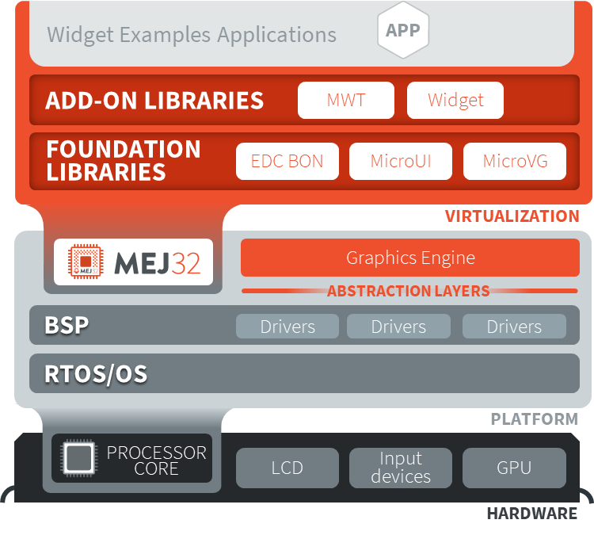

Graphics User Interface
========================

This section presents libraries relative to the user interface.

The following schema shows the Graphical User Interface architecture and modules:

   Graphical User Interface Overview

.. toctree::
   :maxdepth: 2

   MicroUI/index
   MWT/index
   Widgets/index

..
   | Copyright 2008-2020, MicroEJ Corp. Content in this space is free 
   for read and redistribute. Except if otherwise stated, modification 
   is subject to MicroEJ Corp prior approval.
   | MicroEJ is a trademark of MicroEJ Corp. All other trademarks and 
   copyrights are the property of their respective owners.
