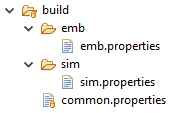

.. _application_options:

Application Options
###################

Introduction
============

To run a MicroEJ Standalone Application on a MicroEJ Platform, a set of options
must be defined. Options can be of different types:

- Memory Allocation options (e.g set the Java Heap size). These options are usually called link-time options.
- Simulator & Debug options (e.g. enable periodic Java Heap dump).
- Deployment options (e.g. copy ``microejapp.o`` to a suitable BSP location).
- Foundation Library specific options (e.g. embed UTF-8 encoding).

The following section describes options provided by MicroEJ Architecture.
Please consult the appropriate MicroEJ Pack documentation for options related to other Foundation Libraries (MicroUI, NET, SSL, FS, ...) integrated to the Platform.

Notice that some options may not be available, in the following cases:

- Option is specific to the MicroEJ Core Engine capability (*tiny*/*single*/*multi*) which is integrated in the targeted Platform.
- Option is specific to the target (MicroEJ Core Engine on Device or Simulator).
- Option has been introduced in a newer version of the MicroEJ Architecture which is integrated in the targeted Platform.
- Options related to :ref:`Board Support Package (BSP) connection <bsp_connection_application_options>`.

.. _sdk_6_define_option:

Defining an Option with SDK 6
=============================

With the SDK 6, the Applications options can be defined in a properties file located in the ``configuration`` folder of the project.
Usually, the options are defined in a file named ``common.properties``, 
but all properties files located in this folder are loaded, no matter what their name is.

To set an option in a properties file, open the file in a text editor and add a line to set the desired option to the desired value, 
for example::
   
   soar.generate.classnames=false

If multiple VEE Ports are defined, the options defined in the ``configuration`` folder are common to all VEE Ports.
Besides these options, it is possible to define options specific to a VEE Port in a properties file located 
in the ``configuration/veePortName`` folder of the project,
where ``veePortName`` is the :ref:`unique name <sdk_6_vee_port_unique_name>` of the VEE Port.

.. _define_option:

Defining an Option with SDK 5 or lower
======================================

With the SDK 5 or lower, a Standalone Application option can be defined either from a launcher or from a properties file.
It is also possible to use both together. Each MicroEJ Architecture and MicroEJ Pack option comes with a default value, which is used if the option has not been set by the user.

.. _define_option_in_launcher:

Using a Launcher
----------------

To set an option in a launcher, perform the following steps:

1. In the SDK, select :guilabel:`Run` > :guilabel:`Run Configurations...` menu,
2. Select the launcher of the application under :guilabel:`MicroEJ Application` or create a new one,
3. Select the :guilabel:`Configuration` tab,
4. Find the desired option and set it to the desired value. If the option does not appear in the page, there are two cases:
   - the option has been introduced in a newer Architecture version,
   - the option is an advanced option. It is set using a system property in the :guilabel:`JRE Tab`. See the :ref:`JRE Tab <launch_jre_tab>` section for more details.

It is recommended to index the launcher configuration to your version control system. To export launcher options to the filesystem, perform the following steps:

1. Select the :guilabel:`Common` tab,
2. Select the :guilabel:`Shared file:` option and browse the desired export folder,
3. Press the :guilabel:`Apply` button. A file named ``[launcher_configuration_name].launch`` is generated in the export folder.

.. _define_option_in_properties_file:

Using a Properties File
-----------------------

Options can be also be defined in properties files.

When a MicroEJ Standalone Application is built using the ``firmware-singleapp`` :ref:`skeleton <mmm_module_skeleton>`, 
options are loaded from properties files located in the ``build`` folder at the root of the project. 

The properties files are loaded in the following order:

1. Every file matching ``build/sim/*.properties``, for Simulator options only (Virtual Device build). These files are optional.
2. Every file matching ``build/emb/*.properties``, for Device options only (Firmware build). These files are optional.
3. Every file matching ``build/*.properties``, both for Simulator and Device options. At least one file is required.

Usually, the ``build`` folder contains a single file named ``common.properties``.

In case an option is defined in multiple properties files, the option of the first loaded file is taken into account and the same option defined in the other files is ignored (a loaded option cannot be overridden).

The figure below shows the expected tree of the ``build`` folder:

   Build Options Folder

It is recommended to index the properties files to your version control system.

To set an option in a properties file, open the file in a text editor and add a line to set the desired option to the desired value. For example: ``soar.generate.classnames=false``.

To use the options declared in properties files in a launcher, perform the following steps:

1. In the SDK, select :guilabel:`Run` > :guilabel:`Run Configurations...`,
2. Select the launcher of the application,
3. Select the :guilabel:`Execution` tab,
4. Under :guilabel:`Option Files`, press the :guilabel:`Add...` button,
5. Browse the ``sim.properties`` file for Simulator or the ``emb.properties`` file for Device (if any) and press :guilabel:`Open` button,
6. Add the ``common.properties`` file and press the :guilabel:`Open` button.

.. note::

   An option set in a properties file can not be modified in the ``Configuration`` tab.
   Options are loaded in the order the properties files are added (you can use ``Up`` and ``Down`` buttons to change the file order).
   In ``Configuration`` tab, hovering the pointer over an option field will show the location of the properties file that defines the option.

Generating a Properties File
----------------------------

In order to export options defined in a ``.launch`` file to a properties file, perform the following steps:

1. Select the ``[launcher_configuration_name].launch`` file,
2. Select :guilabel:`File` > :guilabel:`Export` > :guilabel:`MicroEJ` > :guilabel:`Launcher as Properties File`,
3. Browse the desired output ``.properties`` file,
4. Press the :guilabel:`Finish` button.

.. warning::
   The Simulator uses some system properties to configure internal memory limits.
   See :ref:`simulator_options` for more information.

.. include:: sectionArchitectureOptions.rst

..
   | Copyright 2008-2023, MicroEJ Corp. Content in this space is free 
   for read and redistribute. Except if otherwise stated, modification 
   is subject to MicroEJ Corp prior approval.
   | MicroEJ is a trademark of MicroEJ Corp. All other trademarks and 
   copyrights are the property of their respective owners.
