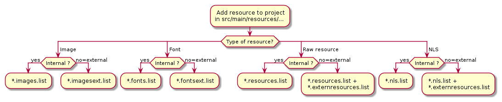

.. _chapter.microej.applicationResources:

Application Resources
#####################

Application resources are the following :ref:`section.classpath.elements`:

-  :ref:`section.applicationResources.raw_resources`

-  :ref:`section.applicationResources.Images`

-  :ref:`section.applicationResources.Fonts`

-  :ref:`section.applicationResources.nls`

Principle
=========

A *resource* is, for an Application, the contents of a file.
This file is known by its path (its relative path from the Application classpath) and its name.
The file may be stored in RAM, flash, or external flash; and it is the responsibility of the Core Engine and/or the BSP to retrieve and load it.

.. _section.applicationResources.internal_and_external_resources:

Internal Resources and External Resources
-----------------------------------------

There are two kinds of resources, internal resources and external resources:

-  Internal resource: The resource is taken into consideration during the Application build.
   The SOAR step loads the resource and copies it into the same C library as the Application.
   Like the Application, the resource is linked into the CPU address space range (internal device memories, external parallel memories, etc.).

-  External resource: The resource is not taken into consideration during the Application build.
   It is the responsibility of the BSP project to manage this kind of resource.
   The resource is often programmed outside the CPU address space range (storage media like SD card, serial NOR flash, EEPROM, etc.).

   The BSP must implement the proper Low Level API (LLAPI) C functions: ``LLEXT_RES_impl.h``.
   See :ref:`section_externalresourceloader` for more information on the implementation.

All resources must be added in the project, usually in ``src/main/resources/...``.
All resources must be declared in the appropriate ``*.list`` files depending on the type (image, font, NLS, raw) and kind (internal or external) resources.
The following figure summarized how to declare resources:

..
   @startuml
   : Add resource to project
   in src/main/resources/...;
   switch (Type of resource?)
   case ( Image )
   if (Internal ?) then (yes)
   : *.images.list;
   kill
   else (no=external)
   : *.imagesext.list;
   kill
   endif
   case ( Font )
   if (Internal ?) then (yes)
   : *.fonts.list;
   kill
   else (no=external)
   : *.fontsext.list;
   kill
   endif
   case ( Raw resource )
   if (Internal ?) then (yes)
   : *.resources.list;
   kill
   else (no=external)
   : *.resources.list +
    *.externresources.list;
   kill
   endif
   case ( NLS )
   if (Internal ?) then (yes)
   : *.nls.list;
   kill
   else (no=external)
   : *.nls.list +
    *.externresources.list;
   kill
   endif
   endswitch
   @enduml

.. _section.applicationResources.raw_resources:

Raw Resources
=============

Raw resources are binary files that are embedded by the application so that they may be dynamically retrieved with a call to
``Class.getResourceAsStream(java.io.InputStream)``.

Raw Resources are declared in MicroEJ Classpath using ``*.resources.list`` files (and in ``*.externresources.list`` for external resources).
The file format is a standard Java properties file, each line is a relative ``/`` separated name of a file in MicroEJ Classpath to be embedded as a resource.

For example:

::

   # The following resource is embedded as a raw resource
   com/mycompany/MyResource.txt

.. _section.applicationResources.Images:

Images
======

.. Keep this section sync'd with the overview in _section.ui.Images

Immutable images are graphical resources that can be accessed with a call to `ej.microui.display.Image.getImage() <https://repository.microej.com/javadoc/microej_5.x/apis/ej/microui/display/Image.html#getImage-java.lang.String->`_ or `ej.microui.display.ResourceImage.loadImage() <https://repository.microej.com/javadoc/microej_5.x/apis/ej/microui/display/ResourceImage.html#loadImage-java.lang.String->`_. As their name suggests, immutable images can not be modified. Therefore, there is no way to get a Graphics Context to draw into these images. To be displayed, these
images have to be converted from their source format to a RAW
format. The conversion can either be done at:

-  build-time (using the image generator tool),

-  run-time (using the relevant decoder library).

Immutable images that must be processed by the Image Generator tool are declared in :ref:`MicroEJ Classpath<chapter.microej.classpath>` ``*.images.list`` files (or ``*.imagesext.list`` for an external resource, see :ref:`section.applicationResources.internal_and_external_resources`).
The file format is a standard Java properties file, each line representing a ``/`` separated resource path relative to the MicroEJ classpath root referring to a standard image file (e.g. ``.png``, ``.jpg``).
The resource may be followed by an optional parameter (separated by a ``:``) which defines and/or describes the image output file format (RAW format).
When no option is specified, the image is embedded as-is and will be decoded at run-time (although listing files without format specifier has no impact on the image generator processing, it is advised to specify them in the ``*.images.list`` files anyway, as it makes the run-time processing behavior explicit).
Example:

::

   # The following image is embedded 
   # as a PNG resource (decoded at run-time)
   com/mycompany/MyImage1.png

   # The following image is embedded 
   # as a 16 bits format without transparency (decoded at build-time)
   com/mycompany/MyImage2.png:RGB565

   # The following image is embedded 
   # as a 16 bits format with transparency (decoded at build-time)
   com/mycompany/MyImage3.png:ARGB1555

Please refer to :ref:`section.ui.Images` for more information.

.. _section.applicationResources.Fonts:

Fonts
=====

.. Keep this section sync'd with the overview in _section.ui.Fonts

Fonts are graphical resources that can be accessed with a call to `ej.microui.display.Font.getFont() <https://repository.microej.com/javadoc/microej_5.x/apis/ej/microui/display/Font.html#getFont-java.lang.String->`_.
To be displayed, these fonts have to be converted at build-time from their source format to the display raw format by the font generator tool.
Fonts that must be processed by the font generator tool are declared in :ref:`MicroEJ Classpath<chapter.microej.classpath>` ``*.fonts.list`` files (or ``*.fontsext.list`` for an external resource, see :ref:`section.applicationResources.internal_and_external_resources`).
The file format is a standard Java properties file, each line representing a ``/`` separated resource path relative to the MicroEJ classpath root referring to a MicroEJ font file (usually with a ``.ejf`` file extension).
The resource may be followed by optional parameters which define :

-  some ranges of characters to embed in the final raw file;

-  the required pixel depth for transparency.

By default, all characters available in the input font file are embedded, and the pixel depth is ``1`` (i.e 1 bit-per-pixel).
Example:

::

   # The following font is embedded with all characters
   # without transparency
   com/mycompany/MyFont1.ejf

   # The following font is embedded with only the latin 
   # unicode range without transparency 
   com/mycompany/MyFont2.ejf:latin

   # The following font is embedded with all characters
   # with 2 levels of transparency
   com/mycompany/MyFont2.ejf::2

MicroEJ font files conventionally end with the ``.ejf`` suffix and are
created using the Font Designer (see :ref:`section.tool.fontdesigner`).

Please refer to :ref:`section.ui.Fonts` for more information.

.. _section.applicationResources.nls:

Native Language Support
=======================

Native Language Support (NLS) allows the application to facilitate internationalization.
It provides support to manipulate messages and translate them in different languages.
Each message to be internationalized is referenced by a key, which can be 
used in the application code instead of using the message directly.

Usage
-----

Messages must be defined in `PO files <https://www.gnu.org/software/gettext/manual/gettext.html#PO-Files>`_, located in the MicroEJ Classpath of the application (for example in the ``src/main/resources`` folder).
Here is an example:

::

   msgid ""
   msgstr ""
   "Language: en_US\n"
   "Language-Team: English\n"
   "MIME-Version: 1.0\n"
   "Content-Type: text/plain; charset=UTF-8\n"

   msgid "Label1"
   msgstr "My label 1"

   msgid "Label2"
   msgstr "My label 2"

These PO files have to be converted to be usable by the application.
In order to let the build system know which PO files to process, 
they must be referenced in files named ``*.nls.list`` (and to ``*.externresources.list`` for external resources), located in the MicroEJ Classpath 
(for example still in the ``src/main/resources`` folder).
The file format of these ``*.nls.list`` files is a standard Java properties file.
Each line represents the Full Qualified Name of a Java interface that will be 
generated and used in the application. Here is an example, let's call it `i18n.nls.list`:

.. code-block::

   com.mycompany.myapp.Labels
   com.mycompany.myapp.Messages

For each line, PO files whose name starts with the interface name (``Messages`` and ``Labels``
in the example) are retrieved from the MicroEJ Classpath and used to generate:

- a Java interface with the given FQN, containing a field for each ``msgid`` of the PO files
- a NLS binary file containing the translations

So, in the example, the generated interface ``com.mycompany.myapp.Labels`` will gather all the 
translations from files named ``Labels*.po`` and located in the MicroEJ Classpath.
PO files are generally suffixed by their locale (``Labels_en_US.po``) but it is only for convenience
since the suffix is not used, the locale is extracted from the PO file's metadata.

Once the generation is done, the application can use the Java interfaces to get internationalized 
messages, for example:

.. code-block:: java

   import com.mycompany.myapp.Labels;

   public class MyClass {

      String label = Labels.NLS.getMessage(Labels.Label1);

      ...

The generation is triggered when building the application or after a change done in any PO or ``*.nls.list`` files.
This allows to always have the Java interfaces up-to-date with the translations and to use them immediately.

The `NLS API module <https://repository.microej.com/modules/ej/library/runtime/nls/>`_
must be added to the :ref:`module.ivy <mmm_module_description>` of the MicroEJ
Application project to use the NLS library.

::

  <dependency org="com.microej.library.runtime" name="nls-po" rev="2.2.0"/>

.. _chapter.microej.nlsExternalLoader:

NLS External Loader
-------------------

The NLS External Loader allows to update the :ref:`PO files <section.applicationResources.nls>` of an application executed on a Virtual Device without rebuilding it.
PO files can be dropped in a given location in the Virtual Device folders to dynamically replace the language strings packaged in the application.

This is typically useful when testing or translating an application in order to have a quick feedback when changing the PO files.
Once the PO files are updated, a simple restart of the Virtual Device allows to immediately see the result.

Installation
^^^^^^^^^^^^

To enable the NLS External Loader in the Virtual Device, add the following dependency to the ``module.ivy`` file of the MicroEJ Firmware project:

.. code-block:: xml

   <dependency org="com.microej.tool" name="nls-po-external-loader" rev="2.3.0" transitive="false"/>

Then rebuild the MicroEJ Firmware project to produce the Virtual Device.

Usage
^^^^^

Once the project built:

- unzip the Virtual Device and create a folder named ``translations`` in the root folder.
- copy all the PO files from the project into the ``translations`` folder.
  All PO files found in this folder are processed, no matter their folder level.
- start the Virtual Device with the launcher.
  The following logs should be printed if the NLS External Loader has been executed and has found the PO files::

   externalPoLoaderInit:init:

   externalPoLoaderInit:loadPo:
      [mkdir] Created dir: <PATH>\tmp\microejlaunch1307817858\resourcebuffer
   [po-to-nls] *.nls files found in <PATH>\output\<FIRMWARE>\resourceBuffer :
   [po-to-nls]   - com.mycompany.Messages1
   [po-to-nls]   - com.mycompany.Messages2
   [po-to-nls] Loading *.po files for NLS interface com.mycompany.Messages1
   [po-to-nls]   => loaded locales : fr_FR,de_DE,ja_JP,en_US
   [po-to-nls] Loading *.po files for NLS interface com.mycompany.Messages2
   [po-to-nls]   => loaded locales : fr_FR,de_DE,ja_JP,en_US

- update the languages strings in the PO files of the Virtual Device (the files in the `translations/` folder).
- restart the Virtual Device and check the changes.

It is important to know the following rules about the NLS External Loader:

- the external PO files names must match with the default PO files names of the application to be processed.
- when PO files with a given name are loaded, the default translations for these PO files are replaced, there is no merge. It means that:

  - if messages are missing in the new PO files, they are not available anymore for the application and may very probably make it crash.
  - if languages are missing (the application has 3 PO files for English, French and Spanish, 
    and only PO files for English and French are available in the translations folder), 
    the messages of the missing languages are not available anymore for the application and may very probably make it crash.
  - if new messages are added in the PO files, it has no impact, they are ignored by the application.

- External PO files are loaded at Virtual Device startup, so any change requires a restart of the Virtual Device to be considered

Troubleshooting
^^^^^^^^^^^^^^^

java.io.IOException: NLS-PO:S=4
"""""""""""""""""""""""""""""""

The following error occurs when at least 1 PO file is missing for a language::

   [parallel2] NLS-PO:I=6
   [parallel2] Exception in thread "main" java.io.IOException: NLS-PO:S=4 323463627 -1948548092
   [parallel2]     at java.lang.Throwable.fillInStackTrace(Throwable.java:79)
   [parallel2]     at java.lang.Throwable.<init>(Throwable.java:30)
   [parallel2]     at java.lang.Exception.<init>(Exception.java:10)
   [parallel2]     at java.io.IOException.<init>(IOException.java:16)
   [parallel2]     at com.microej.nls.BinaryNLS.loadBinFile(BinaryNLS.java:310)
   [parallel2]     at com.microej.nls.BinaryNLS.<init>(BinaryNLS.java:157)
   [parallel2]     at com.microej.nls.BinaryNLS.newBinaryNLS(BinaryNLS.java:118)

Make sure that all PO files are copied in the ``translations`` folder.

Crowdin
^^^^^^^

Crowdin is a cloud-based localization platform which allows to manage multilingual content.
The NLS External Loader can fetch translations directly from Crowdin to make the translation process even easier.
Translators can then contribute and validate their translations in Crowdin and apply them automatically in the Virtual Device.

A new dependency must be added to the ``module.ivy`` file of the MicroEJ Firmware project to enable this integration:

.. code-block:: xml

   <dependency org="com.microej.tool" name="nls-po-crowdin" rev="1.0.0" transitive="false"/>

Once the module has been built, edit the file ``platform/tools/crowdin/crowdin.properties`` to configure the Crowdin connection:

- set ``crowdin.token`` to the Crowdin API token. A token can be generated in the Crowdin in :guilabel:`Settings` > :guilabel:`API` > click on :guilabel:`New Token`.
- set ``crowdin.projectsIds`` to the id of the Crowdin project. The project id can be found in the :guilabel:`Details` section on a project page.
  Multiple projects can be set by separating their id with a comma (for example ``crowdin.projectsIds=12,586,874``).

When the configuration is done, the fetch of the Crowdin translations can be done by executing the script ``crowdin.bat`` or ``crowdin.sh`` located in the folder ``platform/tools/crowdin/``.
The PO files retrieved from Crowdin are automatically pasted in the folder ``translations``,
therefore the new translations are applied after the next Virtual Device restart.

..
   | Copyright 2020-2022, MicroEJ Corp. Content in this space is free 
   for read and redistribute. Except if otherwise stated, modification 
   is subject to MicroEJ Corp prior approval.
   | MicroEJ is a trademark of MicroEJ Corp. All other trademarks and 
   copyrights are the property of their respective owners.
