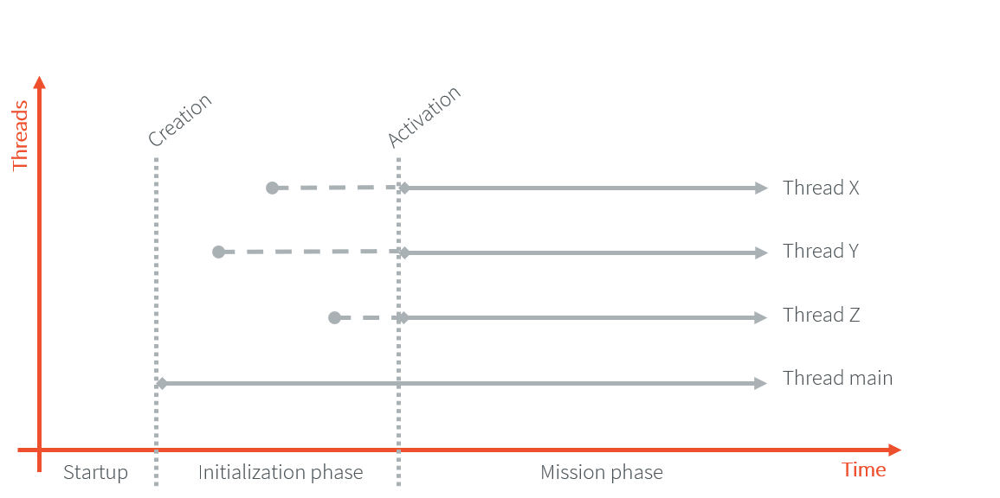

.. _bon_specification:

Beyond Profile (BON)
====================

Introduction
------------

This document defines the Beyond Profile Specification (BON), 
which is designed specifically for devices with limited memory resources. 
It introduces new concepts tailored to these constrained environments, while still adhering to the boundaries of Java semantics, hence the term "Beyond."

BON mainly defines a suitable and flexible approach to fully control both memory usage and startup sequences.
More precisely, it allows:

-  Controlling the initialization sequence in a deterministic way.
-  Defining persistent immutable read-only objects (that may be placed
   into non-volatile memory areas), and do not require copies to be
   made in ram to be manipulated.
-  Defining immortal read-write objects that are always alive.

BON also adds a set of useful utilities:

-  A Timer facilities that allows to schedule small activities
   repeatedly (or not). Such activities are Runnable objects that are
   automatically scheduled by the timer.
-  Platform time which cannot be changed: the time from the very last
   boot of the device.
-  Read-write `ByteArray`_ support according to the underlying processor
   endianness.
-  `ResourceBuffer`_ support for random read access in a :ref:`resource <section.classpath.elements.raw_resources>`.
-  Accessing compile-time :ref:`constants <section.classpath.elements.constants>`.

Specification Summary
~~~~~~~~~~~~~~~~~~~~~

.. include:: bon_spec_summary.rst

Comments
~~~~~~~~

Your comments about this specification are welcome. Please contact :ref:`our support team <get_support>` with "BON" as subject.

Why BON ?
~~~~~~~~~

Many languages let software engineers define the memory management of
their applications. One reason is that most embedded devices have scarce
physical memory, while being cost driven. On the other hand, it is well
known that memory allocation is one of the most difficult tasks to
achieve efficiently as soon as the application uses more than a few
objects.

In order to cope with these two contradictory issues, there are two main
approaches, each one at the extremity of the possibility spectrum:

-  Pre-allocate all of what is needed for the program to run, either
   statically (at compile time) or dynamically once and for all at
   system startup. While running, no extra allocation is done. This
   approach is often used for Hard Real-Time systems when the memory
   consumption cannot be defined at compile-time through formal
   analysis.
-  Let the runtime system manage the memory, fully freeing the engineers
   from that task. This is done through the use of garbage
   collectors. A huge number of different garbage collection policies
   are available and each have their own benefits and drawbacks.

The BON specification builds upon the existing Java specification, which already defines:

- a heap where Java objects are stored. This heap is automatically managed by a garbage collector. 
- a semantically immutable set of objects, the pool of intern `String`_,
- how applications are initialized, even though it is quite a loose process where lazy initialization is
  permitted. Intuitively, classes are initialized before any instance
  creation or access to its static variables (see :ref:`bon-startup`).

One of the newer trends in software involves designing simple solutions
that are easy to understand and most importantly easy to manipulate and
control. Developers must be able to minimize development time, often
dealing with small memory budgets for their application. On microcontrollers, 
there is much more read-only memory than volatile memory.

First Example
-------------

The simple next example illustrates the use of big buffers. They are
made immortal in order to recycle them manually while they represent the
most critical ram consumption. This example also makes use of an
immutable object, an array of values that never changes during the
lifetime of the device.

.. code-block:: java

    package example;

    import ej.bon.*

    public class Filter {
        public static final int BufferSize = 4096;// 16k (an int is 32-bit)
        public static int[][] Buffers;
        public static int[] ValidValues;
        static {
            ValidValues =(int[])Immutables.get("filter");
        }

        static {
            // Allocate the immortal pool of buffers. Only two Filters may
            // be alive at the same time: ==> 32k of ram for two Filters
            Buffers = new int[2][];
            Buffers[0] = (int[])Immortals.setImmortal(new int[BufferSize]);
            Buffers[1] = (int[])Immortals.setImmortal(new int[BufferSize]);
        }

        public int ptr;
        public int[] buffer;

        public Filter(){
            // grab a buffer from the pool, or throw an exception
            synchronized (Buffers){
                for (int i = Buffers.length; --i >= 0; ){
                    if (Buffers[i] != null ){
                        buffer = Buffers[i];
                        ptr=-1;
                        Buffers[i] = null ;
                        break ;
                    } 
                } 
            } 
            if (buffer == null ){
                throw new OutOfMemoryError();
            }
        }
        
        public void close(){
            // recycle manually the immortal buffer: store it in
        // global Buffers array pool
            synchronized (Buffers){
                for (int i = Buffers.length; --i >= 0; ){
                    if (Buffers[i] == null ){
                        Buffers[i] = buffer;
                        break;
                    }
                }
            }
        }

        public synchronized void insert( int value){
            // only insert permitted values

            if (ptr >= BufferSize) return; // full

            for (int j = ValidValues.length; --j >= 0; ){
                if (value == ValidValues[j]){
                    buffer[++ptr] = value;
                }
            }
        }
    }

Object Natures
--------------

The BON specification extends the Java semantic by defining three natures for objects: 

- :ref:`Immutable objects <immutable>` : persistent objects that are alive at system startup.
  Immutable objects are also referred to as read-only objects, since they most probably reside in non-volatile memory. 
  All together they form a pre-existing world that exists on its own, just like the hardware does.
- :ref:`Immortal objects <immortal>`: objects that do not move around in memory: they remain physically located in one memory location forever.
- Reclaimable objects: the regular objects managed by the Garbage Collector. 

Although objects get a liveness nature, this is fully transparent for the
application developer this is completely transparent to the application developer, 
except for the restriction that writing to an immutable object is not allowed.

.. _immutable:

Persistent Immutable Objects
~~~~~~~~~~~~~~~~~~~~~~~~~~~~

Immutable objects are read-only objects. They are instances of any
concrete class. Although they are immutable, they obey all the Java
object's semantics. In particular, they hold a hash code, have a class
and have a monitor that a thread may enter into.

There is no way for an immutable object to directly refer to a
non-immutable object. References from immutable objects always refer to
other immutable objects. Writing into an immutable object (field write
access) results in an unspecified behavior. The BON experts group
strongly encourages implementations of the BON specification to raise
an uncatchable exception when there is an attempt to write into an
immutable object, although a no-op operation may be sufficient.

Immutable objects are declared at build time by specifying objects in an
XML configuration file, as described in the sections immediately below.

The immutable objects will be linked to a particular location in (read-only) memory. 
Note that immutable objects do not need to be copied in (scarce) ram memory to be
manipulated.

Software is made up of several parts, often called libraries, that may
come with their own immutable object descriptions. Therefore more than
one immutable description may be declared in the classpath.

Object ID and Immutable Object Querying
+++++++++++++++++++++++++++++++++++++++

Immutable objects are semantically organized into one global pool, just
like the Java interned `String`_ objects.

An immutable object may be attached to a `String`_ key, known
as its ID. This ID allows an immutable object to be retrieved out of the
global pool of immutable objects, thanks to the method
`Immutables.get(String)`_. The ID of an object is globally unique in the system.

Immutable Objects Descriptions and Creation
+++++++++++++++++++++++++++++++++++++++++++

Descriptions are based on the structure of objects, that is, they embed
structural information such as fully qualified class names and field
names. Fields  that need to get initialized with some value
(base-type or another immutable object) are described using a pair:
field-name, value. 
Only instance fields of objects are involved, i.e. not static fields.

Fields that are not described get initialized with the default Java
value (``0`` for numeric types, ``null`` for objects, ``false`` for booleans,
``0.0`` for floating-point numbers). No visibility rule applies,
that is, any kind of field may be listed, even private ones. 

There is no particular order for the creation of the immutable objects.
The BON experts recommend the use of tools for the creation of large
graphs of immutable objects.

XML Grammar
+++++++++++

Immutable objects are described according to the following XML syntax
(Annex :ref:`DTD` gives the DTD).

-  ``<immutables>``: the root element of one immutable objects description.

   -  attributes:
  
      -  ``name``: an optional attribute that defines the content of the XML description.
  
   -  child elements: ``<object>`` , ``<objectAlias>``, ``<array>`` , ``<string>``, ``<class>``, ``<null>``, ``<importObject>``.

-   ``<object>``: element that defines a new object.

   -  attributes:
  
      -  ``id``: the ID string that allows the object to be retrieved
         through the use of `Immutables.get(String)`_
      -  ``type``: the name of the class of the object. An alias may be
         used instead of the fully-qualified class name.
      -  ``private``: a boolean that indicates whether the object will be
         accessible using the `Immutables.get(String)`_ method. If
         false, the objects can only be referenced within the XML
         immutable objects descriptions.

   -  child elements: ``<field>`` , ``<refField>``
  
-  ``<objectAlias>``: element that defines a new key for an existing object.

   -  attributes:

      -  ``id``: the ID string that allows the object to be retrieved
         through the use of `Immutables.get(String)`_.
      -  ``object``: the existing object ID or alias ID.
      -  ``private`` : a boolean that indicates whether the object will be
         accessible using the Immutables.get(String) method. If
         false, the objects can only be referenced within the XML
         immutable objects descriptions.

   -  child elements: none
  
-  ``<string>``: element that defines an interned string.

   -  attributes:
  
      -  ``id``: the ID that allows the object to be retrieved through the
         use of `Immutables.get(String)`_
      -  ``value``: the string literal
      -  ``private`` : a boolean that indicates whether the object will be
         accessible using the `Immutables.get(String)`_ method. If
         false, the objects can only be referenced within the XML
         immutable objects descriptions.

   -  child elements: none

-  ``<class>``: element that defines an instance of a ``java.lang.Class``.
   The ID of this object can be used for type attributes.

   -  attributes:
  
      -  ``id``: the ID that allows the object to be retrieved through the
         use of `Immutables.get(String)`_
      -  ``type``: the class fully qualified name like ``java.lang.Object``.
      -  ``private`` : a boolean that indicates whether the object will be
         accessible using the `Immutables.get(String)`_ method. If
         false, the objects can only be referenced within the XML
         immutable objects descriptions.

   -  child elements: none
  
-  ``<field>``: elements that state a field with its associated literal value.
  
   -  attributes:
 
      -  ``name``: the name of the field as defined in the class that
         defines it.
      -  ``value``: the value of the field. The value is a primitive type
         (numeric or boolean) or a literal string (see ).
      -  ``type``: this attribute is optional. It represents the class
         where the field is defined. A field without its ``type``
         attribute refers to the first field found while scanning the
         class hierarchy from the bottom to the top (following the
         superclass link).

   -  child elements: none

-  ``<refField>``: elements that state a field that references an immutable object.

   -  attributes:

      -  ``name``: the name of the field as defined in the class that
         defines it.
      -  ``ref``: the ID of the referenced immutable object.
      -  ``type``: this attribute is optional. It represents the class
         where the field is defined. A field without its type
         attribute refers to the first field found while scanning the
         class hierarchy from the bottom to the top (following the
         superclass link).

   -  child elements: none

-  ``<array>``: element that defines a new array.

   -  attributes:

      -  ``id``: the ID that allows the object to be retrieved through the
         use of `Immutables.get(String)`_
      -  ``type``: the array type. An alias may be used instead of the
         fully qualified class name. Dimensions are given using the
         Java notation ``[]``.
      -  ``length``: this attribute is optional. It represents the number
         of elements the array has.
      -  ``private`` : a boolean that indicates whether the object will be
         accessible using the `Immutables.get(String)`_ method. If
         false, the objects can only be referenced within the XML
         immutable objects descriptions.

   -  child elements: ``<elem>`` , ``<refElem>``

-  ``<elem>``: element that defines an array element with its literal value.
  
   -  attributes:
 
      -  ``value``: the value of the element. The value is a primitive type
         (numeric or boolean) or a literal string (see ).
 
   -  child elements: none

-  ``<refElem>``: element that defines an array element. Such element
   references an immutable object.

   -  attributes:

      -  ``ref``: the ID of the referenced immutable object.

   -  child elements: none

-  ``<null>``: element that defines a null object that can be referenced
   by an object field or an array element

   -  attributes:

      -  ``id``: the ID that allows the null object to be retrieved through
         the use of `Immutables.get(String)`_
      -  ``private`` : a boolean that indicates whether the object will be
         accessible using the `Immutables.get(String)`_ method. If false,
         the objects can only be referenced within the XML immutable
         objects descriptions.

   -  child elements: none

-  ``<importObject>``: element that import an object that is defined in
   another immutable file. The referenced object may be private or public.

   -  attributes:

      -  ``id``: the ID of the imported object

   -  child elements: none

Class names use the Java notation (using a ``'.'`` as separator):
``java.lang.Object`` is an example.

String literals are defined as in XML specification. To allow quotes in
XML string data use the apostrophe ``'’ '`` separator as XML separator
or the escape character ``&quot;``.

To define the next 9 characters String, ``my"String``, as string literal
value, use one of following syntax:

.. code-block:: xml

    <field name="f1" value=’my"String’ />
    <field name="f1" value="my&quot;String" />

Next table lists the format for the primitive values:

.. list-table:: Table 1: Immutables Primitive Type Format
   :header-rows: 1
   :widths: 2 4 3

   - 
      - Primitive Type
      - Format
      - Example
   - 
      - boolean
      - ``true`` or ``false``
      - ``<…value=”true”/>``
   - 
      - byte, short, int, long
      - Format defined in the Java method ``Long.decode(String)``
      - ``<…value=”123”/>``
        ``<…value=”0x2A”/>``
        ``<…value=”-561”/>``
   - 
      - char
      - ``Format defined in the Java method Long.decode(String)`` or a
        character value between simple quotes
      - ``<…value=”123”/>``
        ``<…value=”'z'”/>``
        ``<…value=”'&#xA9;'”/>``
   - 
      - float
      - Format defined in the Java method Float.parseFloat\ ``(String)``
      - ``<…value=”2.3”/>``
        ``<…value=”4.2e12”/>``
        ``<…value=”-5.671”/>``
   - 
      - double
      - Format defined in the Java method Double.parseDouble\ ``(String)``
      - ``<…value=”2.3”/>``
        ``<…value=”4.2e12”/>``
        ``<…value=”-5.671”/>``

IDs define one global name space: an ID only refers to only one
object. It is an error to have objects sharing ID.
As a good practice, it is recommended to define ID using a qualified
name, such as `myCorp.myApp.MyID12`.

Immutable XML Description Examples
++++++++++++++++++++++++++++++++++

.. code-block:: xml

    <immutables name="MyCorp objects">

        <array id="corp.immut00" type="boolean[]" length="2">
            <elem value="true"/>
            <elem value="false"/>
        </array>
        
        <array id="corp.immut01" type="int[]">
            <elem value="3"/>
            <elem value="2"/>
            <elem value="1"/>
        </array>

        <class id="MyClass" type="myCompany.mypackage.MyClass" 
        private="true"/>

        <object id="corp.immut02" type="MyClass">
            <field name="a" value="50" />
            <field name="str" value="Hello" />
            <refField name="b" ref="corp.null" />
        </object>

        <object id="corp.immut03" type="myCompany.mypackage.A">
            <refField name="f" ref="corp.immut04" />
            <refField name="s" ref="corp.internalKey"/>
            <refField name="o" ref="corp2.immut"/>
        </object>

        <string id="corp.immut04" value='Hello World!' />

        <string id="corp.internalKey" value="one" private="true" />

        <string id="key1" value="two" />

        <string id="key2" value='thr"ee' />

        <object id="value1" type="java.lang.Object" />

        <null id="corp.null"/>

        <importObject id="corp2.immut"/>

    </immutables>

.. _immortal:

Immortal Objects 
~~~~~~~~~~~~~~~~

Non Garbageable Objects
+++++++++++++++++++++++

Immortal objects are regular objects that are not managed by the garbage collector.
Immortal objects do not move around in memory: they remain physically located in one memory location forever.

.. _turningIntoImmortal:

Turning Objects Into Immortal Objects
+++++++++++++++++++++++++++++++++++++

Reclaimable objects may be turned into immortal objects using the
`Immortals.setImmortal(Object)`_ method. Only the object passed as
argument is turned into an immortal object, i.e. none of the objects it
refers to through its fields become immortal. This is in contrast with
`Immortals.deepImmortal(Object)`_ that turns the object passed as the
argument and all objects referred to from the argument into immortal
objects. Note that weakly reachable objects are not turned into immortal
objects; in other words the `WeakReference`_ semantic is not affected by
this operation.

The total amount of free immortal memory still available is
`Immortals.freeMemory()`_. It is system dependent.

The system provides the possibility to create objects directly as
immortal objects using the method `Immortals.run(Runnable)`_: while the
`Runnable.run()`_ method executes, all created objects are
allocated as immortal objects.

Runtime Phases
--------------

BON defines two phases of execution:

-  The initialization phase: this is the very first Java code that
   executes. Its purpose is to let the device “boot”, that is, to
   initialize all necessary resources, like allocating buffers for
   drivers, performing default sanity checks, scanning hardware, etc.
   The initialization sequence executes all the static initializer methods (known as the ``<clinit>`` methods).
-  The mission phase: once initialized, the device switches to the endless
   mission phase. The ``main(String[])`` method of the main class is
   called and the application runs until the device is switched off.

`Util.isInInitialization()`_ and `Util.isInMission()`_ methods allows the phase to be tested.

.. _mono:

Mono-threaded Phase
~~~~~~~~~~~~~~~~~~~

During the initialization phase, there is only one Java thread running:
the main thread which will eventually execute the ``main(String[])``
method once the system enters the mission phase.

  BON phases and threads activation.

If other threads are created while the class initializations execute
(``<clinit>`` methods), those threads will be on hold (i.e. waiting) until
the system enters the mission phase, even if those threads have received
the ``start()`` message and have a higher priority than the main thread.

.. _bon-startup:

Deterministic Initialization Order 
~~~~~~~~~~~~~~~~~~~~~~~~~~~~~~~~~~

If a class needs to be initialized, it defines a ``<clinit>`` method.
These methods are not visible per se at the Java source level.
They are generated by compilers: they capture the semantic of the
initialization of both static fields and static initializers of classes.

During the initialization phase, all classes which are involved within
the application are initialized. It implies calling all ``<clinit>``
methods, in sequence.

The order is statically computed from the application code entry points and does not rely on runtime behavior.
If the application code does not change, the order remains the same.
The order is also compatible with the Java semantic. Intuitively,
a class may depend on other classes. Those classes should be initialized
first. We list a few of these dependencies: object creation, superclass,
methods receiver, arguments and fields types, ….

Dependencies of classes upon themselves define a graph of dependencies.
This graph may depict cycles. The graph is linearized in an order which
depends only on the graph itself.

The classes dependencies also includes all the classes of pre-configured
:ref:`immutable objects <immutable>`  objects.

Utilities
---------

Timer & TimerTask
~~~~~~~~~~~~~~~~~

An `Timer`_ defines a single Java thread in charge of scheduling
`Runnable`_ objects from the `TimerTask`_ class. All `TimerTask`_
are executed sequentially, according to their schedule. A `Timer`_ does
its best effort to schedule the `TimerTask`_ appropriately, which depends
on the `TimerTask`_ durations and schedules (there is no real-time
guaranties).

A `TimerTask`_ may be scheduled repeatedly. In that case, the delay for
the next schedule may depends on the end of the previous ending of the
`TimerTask`_, and not on some absolute time: if the previously execution
of the `TimerTask`_ is delayed for some reason, the next executions are
delayed too by the same amount of time. It is also possible to schedule
repeatedly a `TimerTask`_ at fixed rate, which allows executions to be
independent .

In case a `TimerTask`_ execution terminates unexpectedly, the other tasks
are not impacted: the `TimerTask`_ is assumed to have terminated its
execution regularly, and is not rescheduled event if it was scheduled
repeatedly.

The main APIs are:

-  `Timer.schedule(TimerTask, long)`_ and `Timer.schedule(TimerTask, Date)`_ methods
   allow to schedule one execution after the specified delay.
-  `Timer.schedule(TimerTask task, long, long)`_ and `Timer.schedule(TimerTask, Date,
   long)`_ methods allow to schedule repeatedly executions, the first
   one after the specified delay. The waiting time between two
   executions is relative to the end of the previous execution.
-  `Timer.scheduleAtFixedRate(TimerTask task, long, long)`_ and
   `Timer.scheduleAtFixedRate(TimerTask, Date, long)`_ methods allow to
   schedule repeatedly executions, the first one after the specified
   delay. The waiting time between two executions is independent of
   the end of the previous execution.

Platform time
~~~~~~~~~~~~~

The application time is the user time: it depends on its localization.
`System.currentTimeMillis()`_ returns the application time
expressed in milliseconds since midnight, January 1, 1970 UTC.

BON introduces a platform time that is independent from any user
considerations: it materializes the running time since the very last
start of the device. This time cannot be changed.

The `Util`_ class defines several methods to handle both
application time and platform time: 

-  `Util.platformTimeNanos()`_ and `Util.platformTimeMillis()`_ method return the
   platform time, a ``long``, expressed in nanoseconds and in
   milliseconds.
-  `Util.setCurrentTimeMillis(long)`_ and `Util.setCurrentTimeMillis(Date)`_
   methods allow to change the application time in order to match a
   user localization. This has no effect on the platform time.
   `Util.currentTimeMillis()`_ method is a synonym of
   `System.currentTimeMillis()`_.

Byte Array Accesses
~~~~~~~~~~~~~~~~~~~

The addresses space is 8-bit oriented even if there are platforms that
manipulate quantities that are larger than an 8-bit: 32-bit processors
for example do so. The ordering of individual addressable sub-components
within the representation of a larger data item is called the
endianness. ``BigEndian`` describes an ordering with the most significant
byte first, whereas ``LittleEndian`` describes an ordering with the least
significant byte first.

  Representation of the 32-bit quantity 0x0000100A using both BigEndian and in LittleEndian layout.

BON introduces methods to read and write into array of byte (byte[])
according to the platform endianness, or according to a specific
provided endianness. The `ByteArray`_ class provides such APIs:

-  `ByteArray.getPlatformEndianness()`_ returns the underlying system-dependent
   endianness, which mostly depends on the target processor(s).
-  `ByteArray.readInt(byte[], int)`_ and `ByteArray.writeInt(byte[], int, int)`_ reads and
   writes an ``int`` using the platform specific endianness.
-  `ByteArray.readInt(byte[], int, int)`_ and `ByteArray.writeInt(byte[], int, int, int)`_
   reads and writes an ``int`` using the specified endianness as last
   argument, which may be either `LITTLE_ENDIAN`_ or `BIG_ENDIAN`_.

Similar methods are provided for ``short``, ``char``, ``long`` types.

.. _DTD:

Annex A: Immutables DTD
-----------------------

.. code-block:: dtd

    <!ELEMENT immutables ( object*, objectAlias*, array*, string*, class*, null*, importObject* ) >
    <!ATTLIST immutables 
        name     CDATA #IMPLIED
    >

    <!ELEMENT object ( field*, refField* ) >
    <!ATTLIST object 
        id    	ID    #REQUIRED
        private  	(true | false) "false"
        type	 	CDATA #REQUIRED
    >

    <!ELEMENT objectAlias EMPTY >
    <!ATTLIST objectAlias 
        id    	ID    #REQUIRED
        private  	(true | false) "false"
        object 	IDREF #REQUIRED
    >

    <!ELEMENT array ( elem*, refElem* ) >
    <!ATTLIST array 
        id    	ID    #REQUIRED
        private  	(true | false) "false"
        type  	CDATA #REQUIRED 
        length 	CDATA #IMPLIED 
    >

    <!ELEMENT elem EMPTY >
    <!ATTLIST elem 
        value CDATA #REQUIRED 
    >

    <!ELEMENT refElem EMPTY >
    <!ATTLIST refElem 
        ref IDREF #REQUIRED 
    >

    <!ELEMENT class EMPTY >
    <!ATTLIST class 
        id    	ID    #REQUIRED
        private  	(true | false) "false"
        type		CDATA #REQUIRED
    >

    <!ELEMENT string EMPTY >
    <!ATTLIST string 
        id    	ID    #REQUIRED
        private  	(true | false) "false"
        value 	CDATA #REQUIRED
    >

    <!ELEMENT field EMPTY >
    <!ATTLIST field 
        name  CDATA #REQUIRED 
        value CDATA #REQUIRED 
        type  CDATA #IMPLIED
    >

    <!ELEMENT refField EMPTY >
    <!ATTLIST refField 
        name  CDATA #REQUIRED 
        ref 	IDREF #REQUIRED 
        type  CDATA #IMPLIED
    >

    <!ELEMENT null EMPTY >
    <!ATTLIST null 
        id    	ID    #REQUIRED
        private  	(true | false) "false"
    >

    <!ELEMENT importObject EMPTY >
    <!ATTLIST importObject 
        id    	ID    #REQUIRED
    >

.. _String: https://repository.microej.com/javadoc/microej_5.x/apis/java/lang/String.html
.. _ByteArray: https://repository.microej.com/javadoc/microej_5.x/apis/ej/bon/ByteArray.html
.. _ResourceBuffer: https://repository.microej.com/javadoc/microej_5.x/apis/ej/bon/ResourceBuffer.html
.. _Runnable: https://repository.microej.com/javadoc/microej_5.x/apis/java/lang/Runnable.html
.. _Timer: https://repository.microej.com/javadoc/microej_5.x/apis/ej/bon/Timer.html
.. _TimerTask: https://repository.microej.com/javadoc/microej_5.x/apis/ej/bon/TimerTask.html
.. _Util: https://repository.microej.com/javadoc/microej_5.x/apis/ej/bon/Util.html
.. _WeakReference: https://repository.microej.com/javadoc/microej_5.x/apis/java/lang/ref/WeakReference.html
.. _Runnable.run(): https://repository.microej.com/javadoc/microej_5.x/apis/java/lang/Runnable.html#run--
.. _Immutables.get(String): https://repository.microej.com/javadoc/microej_5.x/apis/ej/bon/Immutables.html#get-java.lang.String-
.. _Immortals.deepImmortal(Object): https://repository.microej.com/javadoc/microej_5.x/apis/ej/bon/Immortals.html#deepImmortal-T-
.. _Immortals.freeMemory(): https://repository.microej.com/javadoc/microej_5.x/apis/ej/bon/Immortals.html#freeMemory--
.. _Immortals.run(Runnable): https://repository.microej.com/javadoc/microej_5.x/apis/ej/bon/Immortals.html#run-java.lang.Runnable-
.. _Immortals.setImmortal(Object): https://repository.microej.com/javadoc/microej_5.x/apis/ej/bon/Immortals.html#setImmortal-T-
.. _Util.isInInitialization(): https://repository.microej.com/javadoc/microej_5.x/apis/ej/bon/Util.html#isInInitialization--
.. _Util.isInMission(): https://repository.microej.com/javadoc/microej_5.x/apis/ej/bon/Util.html#isInMission--
.. _Timer.schedule(TimerTask, long): https://repository.microej.com/javadoc/microej_5.x/apis/ej/bon/Timer.html#schedule-ej.bon.TimerTask-long-
.. _Timer.schedule(TimerTask, Date): https://repository.microej.com/javadoc/microej_5.x/apis/ej/bon/Timer.html#schedule-ej.bon.TimerTask-java.util.Date-
.. _Timer.schedule(TimerTask task, long, long): https://repository.microej.com/javadoc/microej_5.x/apis/ej/bon/Timer.html#schedule-ej.bon.TimerTask-long-long-
.. _Timer.schedule(TimerTask, Date, long): https://repository.microej.com/javadoc/microej_5.x/apis/ej/bon/Timer.html#schedule-ej.bon.TimerTask-java.util.Date-long-
.. _Timer.scheduleAtFixedRate(TimerTask task, long, long): https://repository.microej.com/javadoc/microej_5.x/apis/ej/bon/Timer.html#scheduleAtFixedRate-ej.bon.TimerTask-long-long-
.. _Timer.scheduleAtFixedRate(TimerTask, Date, long): https://repository.microej.com/javadoc/microej_5.x/apis/ej/bon/Timer.html#scheduleAtFixedRate-ej.bon.TimerTask-java.util.Date-long-
.. _System.currentTimeMillis(): https://repository.microej.com/javadoc/microej_5.x/apis/java/lang/System.html#currentTimeMillis--
.. _Util.currentTimeMillis(): https://repository.microej.com/javadoc/microej_5.x/apis/ej/bon/Util.html#currentTimeMillis--
.. _Util.platformTimeMillis(): https://repository.microej.com/javadoc/microej_5.x/apis/ej/bon/Util.html#platformTimeMillis--
.. _Util.platformTimeNanos(): https://repository.microej.com/javadoc/microej_5.x/apis/ej/bon/Util.html#platformTimeNanos--
.. _Util.setcurrentTimeMillis(long): https://repository.microej.com/javadoc/microej_5.x/apis/ej/bon/Util.html#setCurrentTimeMillis-long-
.. _Util.setcurrentTimeMillis(Date): https://repository.microej.com/javadoc/microej_5.x/apis/ej/bon/Util.html#setCurrentTimeMillis-java.util.Date-

.. _ByteArray.getPlatformEndianness(): https://repository.microej.com/javadoc/microej_5.x/apis/ej/bon/ByteArray.html#getPlatformEndianness--
.. _ByteArray.readInt(byte[], int): https://repository.microej.com/javadoc/microej_5.x/apis/ej/bon/ByteArray.html#readInt-byte:A-int-
.. _ByteArray.writeInt(byte[], int, int): https://repository.microej.com/javadoc/microej_5.x/apis/ej/bon/ByteArray.html#writeInt-byte:A-int-int-
.. _ByteArray.readInt(byte[], int, int): https://repository.microej.com/javadoc/microej_5.x/apis/ej/bon/ByteArray.html#readInt-byte:A-int-
.. _ByteArray.writeInt(byte[], int, int, int): https://repository.microej.com/javadoc/microej_5.x/apis/ej/bon/ByteArray.html#writeInt-byte:A-int-int-int-

.. _LITTLE_ENDIAN: https://repository.microej.com/javadoc/microej_5.x/apis/ej/bon/ByteArray.html#LITTLE_ENDIAN
.. _BIG_ENDIAN: https://repository.microej.com/javadoc/microej_5.x/apis/ej/bon/ByteArray.html#BIG_ENDIAN

..
   | Copyright 2024, MicroEJ Corp. Content in this space is free 
   for read and redistribute. Except if otherwise stated, modification 
   is subject to MicroEJ Corp prior approval.
   | MicroEJ is a trademark of MicroEJ Corp. All other trademarks and 
   copyrights are the property of their respective owners.
