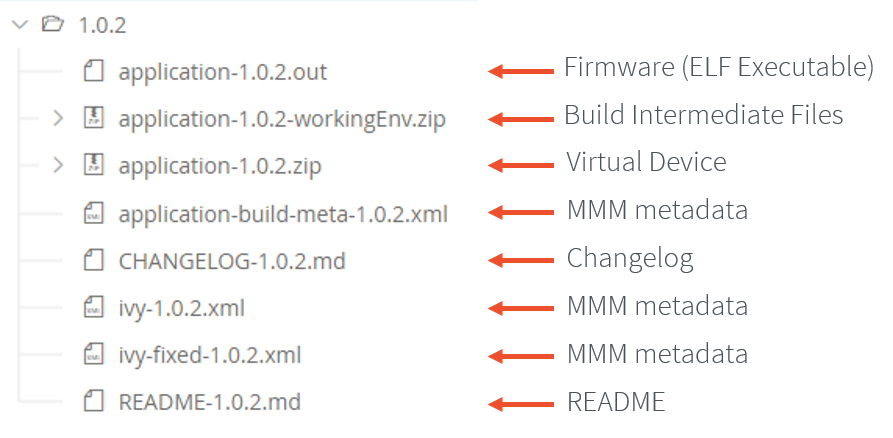

.. _outputfiles:

Build Output Files
==================

When building a Standalone Application, multiple files are generated next to the ELF executable file.

Launch Output Folder
~~~~~~~~~~~~~~~~~~~~

Using a :ref:`MicroEJ Application Launch <concepts-microejlaunches>`, the files are generated in a folder which is named like the main type and which is located in the output folder specified in the run configuration.

.. tabs::

   .. tab:: Build Output Files (Architecture ``8.x``)

      .. figure:: images/build-output-files.png
         :alt: Build Output Files
         :align: center

   .. tab:: Build Output Files (Architecture ``7.x``)   

      .. figure:: images/build-output-files_arch7.png
         :alt: Build Output Files
         :align: center

Published Module Files
~~~~~~~~~~~~~~~~~~~~~~

After :ref:`building <mmm_module_build>` the Standalone Application, the published module contains the following main files:

- ``[name]-[version].out``: Firmware (ELF Executable)
- ``[name]-[version].zip``: Virtual Device
- ``[name]-[version]-workingEnv.zip``: Build intermediate files, including the content of the launch output Folder

   Published Standalone Application Module Files

The SOAR Map File
~~~~~~~~~~~~~~~~~

The ``.map`` file lists every embedded symbol of the application (section, Java class or method, etc.) and its size in ROM or RAM.
Since Architecture ``8.x``, this file is called ``<main class>.map``. It was formerly named ``SOAR.map`` for Architecture ``7.x``.
This file can be opened using the :ref:`memorymapanalyzer`.

The embedded symbols are grouped into multiple categories. For example, the ``Object`` class and its methods are grouped in the ``LibFoundationEDC`` category.
For each symbol or each category, you can see its size in ROM (``Image Size``) and RAM (``Runtime Size``).

The SOAR groups all the Java strings in the same section, which appears in the ``ApplicationStrings`` category.
The same applies to the static fields (``Statics`` category), the types (``Types`` category), and the class names (``ClassNames`` category).

.. _soar_info_file:

The SOAR Information File
~~~~~~~~~~~~~~~~~~~~~~~~~

The SOAR information file contains details on the embedded elements of an application.

Since Architecture ``8.x``, information are dispatched in separate files which are related to :ref:`SOAR build phases <soar_build_phases>`:

-  ``soar/<main class>.loadermap``: generated by the SOAR Resolver. It provides details on files and resources that have been loaded from the :ref:`Application Classpath <chapter.microej.classpath>`.
-  ``soar/<main class>.selectormap``: generated by the SOAR Resolver. It provides details about the elements that have been included in the application.
-  ``soar/<main class>.optimizermap``: generated by the SOAR Optimizer. It provides details about the elements that have been linked in the application.

Each of these files can be opened with an XML editor. The following table describes the information that can be retrieved with their file location.

.. tabs::

   .. tab:: The SOAR Information File (Architecture ``8.x``)

      .. list-table::
         :widths: 25 30 45

         * - **Information**
           - **XML Location (tag > subtag [attribute=value])**
           - **File Location**
         * - :ref:`Classpath <chapter.microej.classpath>`
           - ``classpath``
           - ``soar/<main class>.loadermap``
         * - :ref:`Resources <chapter.microej.applicationResources>`
           - ``resources``
           - ``soar/<main class>.loadermap``
         * - :ref:`External resources <chapter.microej.applicationResources>`
           - ``external_resources``
           - ``soar/<main class>.loadermap``
         * - :ref:`System properties <system_properties>` 
           - ``properties``
           - ``soar/<main class>.loadermap``
         * - :ref:`Constants <section.classpath.elements.constants>`
           - ``constants``
           - ``soar/<main class>.loadermap``
         * - :ref:`Immutables <section.classpath.elements.immutables>`
           - N/A
           - N/A
         * - Interned strings
           - ``strings``
           - ``soar/<main class>.selectormap``
         * - :ref:`Class initialization order <soar_clinit>`
           - ``clinit``
           - ``soar/<main class>.selectormap``
         * - Types
           - ``types``
           - ``soar/<main class>.selectormap``
         * - Number of types
           - ``types>[nb]``
           - ``soar/<main class>.selectormap``
         * - Number of concrete classes
           - ``types[nbConcreteClasses]``
           - ``soar/<main class>.selectormap``
         * - Number of abstract classes
           - ``types[nbAbstractClasses]``
           - ``soar/<main class>.selectormap``
         * - Number of interfaces
           - ``types[nbInterfaces]``
           - ``soar/<main class>.selectormap``
         * - Number of arrays
           - ``types[nbArrays]``
           - ``soar/<main class>.selectormap``
         * - Class instance size (in bytes)
           - ``types>type[instanceSize]``
           - ``soar/<main class>.loadermap``
         * - Type :ref:`embeds its name <section.classpath.elements.types>`
           - ``types>type[hasRuntimeName = true]``
           - ``soar/<main class>.selectormap``
         * - Type :ref:`is exposed as Kernel API <kernel.api>`
           - ``types>type[api=true]``
           - ``soar/<main class>.selectormap``
         * - Number of reference fields in a class
           -  ``types>type[nbReferenceFields]``
           - ``soar/<main class>.loadermap``
         * - Methods
           - ``methods``
           - ``soar/<main class>.selectormap``
         * - Method code size (in bytes)
           - ``methods>method[codesize]``
           - ``soar/<main class>.loadermap``
         * - Method :ref:`is inlined <soar_method_inlining>`
           - ``methods>method[inlined=true]``
           - ``soar/<main class>.loadermap``
         * - Method :ref:`is exposed as Kernel API <kernel.api>`
           - ``methods>method[api=true]``
           - ``soar/<main class>.selectormap``
         * - Statics fields
           - ``statics``
           - ``soar/<main class>.selectormap``

   .. tab:: The SOAR Information File (Architecture ``7.x``)

      .. list-table::
        :widths: 25 30 45

        * - **Information**
          - **XML tag>subtag[attribute=value]**
          - **File**
        * - :ref:`Classpath <chapter.microej.classpath>`
          - ``classpath``
          - ``soar/<main class>.xml``
        * - :ref:`Resources <chapter.microej.applicationResources>`
          - ``selected_resources``
          - ``soar/<main class>.xml``
        * - :ref:`External resources <chapter.microej.applicationResources>`
          - ``external_resources``
          - ``soar/<main class>.xml``
        * - :ref:`System properties <system_properties>` 
          - ``java_properties``
          - ``soar/<main class>.xml``
        * - :ref:`Constants <section.classpath.elements.constants>`
          - ``constants``
          - ``soar/<main class>.xml``
        * - :ref:`Immutables <section.classpath.elements.immutables>`
          - ``selected_immutables``
          - ``soar/<main class>.xml``
        * - Interned strings
          - ``selected_internStrings``
          - ``soar/<main class>.xml``
        * - :ref:`Class initialization order <soar_clinit>`
          - ``clinit_order``
          - ``soar/<main class>.xml``
        * - Types
          - ``selected_types``
          - ``soar/<main class>.xml``
        * - Number of types
          - ``selected_types[nb]``
          - ``soar/<main class>.xml``
        * - Number of concrete classes
          - ``selected_types[nbConcreteClasses]``
          - ``soar/<main class>.xml``
        * - Number of abstract classes
          - ``selected_types[nbAbstractClasses]``
          - ``soar/<main class>.xml``
        * - Number of interfaces
          - ``selected_types[nbInterfaces]``
          - ``soar/<main class>.xml``
        * - Number of arrays
          - ``selected_types[nbArrays]``
          - ``soar/<main class>.xml``
        * - Class instance size (in bytes)
          - ``selected_types>type[instanceSize]``
          - ``soar/<main class>.xml``
        * - Type :ref:`embeds its name <section.classpath.elements.types>`
          - ``required_types``
          - ``soar/<main class>.xml``
        * - Type :ref:`is exposed as Kernel API <kernel.api>`
          - ``selected_types>type[api=true]``
          - ``soar/<main class>.xml``
        * - Number of reference fields in a class
          -  ``selected_types>type[nbReferenceFields]``
          - ``soar/<main class>.xml``
        * - Methods
          - ``selected_methods``
          - ``soar/<main class>.xml``
        * - Method code size (in bytes)
          - ``selected_methods>method[codesize]``
          - ``soar/<main class>.xml``
        * - Method :ref:`is inlined <soar_method_inlining>`
          - ``selected_methods>method[inlined=true]``
          - ``soar/<main class>.xml``
        * - Method :ref:`is exposed as Kernel API <kernel.api>`
          - ``selected_methods>method[api=true]``
          - ``soar/<main class>.xml``
        * - Statics fields
          - ``selected_static_fields``
          - ``soar/<main class>.xml``
..
   | Copyright 2008-2023, MicroEJ Corp. Content in this space is free 
   for read and redistribute. Except if otherwise stated, modification 
   is subject to MicroEJ Corp prior approval.
   | MicroEJ is a trademark of MicroEJ Corp. All other trademarks and 
   copyrights are the property of their respective owners.
