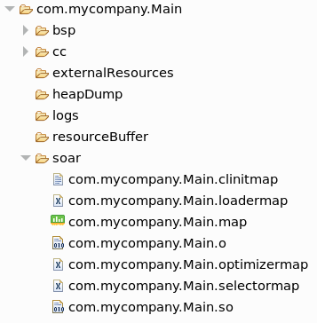

.. _outputfiles:

Build Output Files
==================

When building a Standalone Application, multiple files are generated next to the ELF executable file.

Launch Output Folder
~~~~~~~~~~~~~~~~~~~~

Using a :ref:`MicroEJ Application Launch <concepts-microejlaunches>`, the files are generated in a folder which is named like the main type and which is located in the output folder specified in the run configuration.

   Build Output Files from MicroEJ Application Launch

Published Module Files
~~~~~~~~~~~~~~~~~~~~~~

After :ref:`building <mmm_module_build>` the Standalone Application, the published module contains the following main files:

- ``[name]-[version].out``: Firmware (ELF Executable)
- ``[name]-[version].zip``: Virtual Device
- ``[name]-[version]-workingEnv.zip``: Build intermediate files, including the content of the launch output Folder)

.. figure:: images/standalone_application_published_files.png
   :alt:  Published Standalone Application Module Files
   :align: center
   :scale: 70%

   Published Standalone Application Module Files

The SOAR Map File
~~~~~~~~~~~~~~~~~

The ``SOAR.map`` file lists every embedded symbol of the application (section, Java class or method, etc.) and its size in ROM or RAM.
This file can be opened using the :ref:`memorymapanalyzer`.

The embedded symbols are grouped into multiple categories. For example, the ``Object`` class and its methods are grouped in the ``LibFoundationEDC`` category.
For each symbol or each category, you can see its size in ROM (``Image Size``) and RAM (``Runtime Size``).

The SOAR groups all the Java strings in the same section, which appears in the ``ApplicationStrings`` category.
The same applies to the static fields (``Statics`` category), the types (``Types`` category), and the class names (``ClassNames`` category).

.. _soar_info_file:

The SOAR Information File
~~~~~~~~~~~~~~~~~~~~~~~~~

The ``soar/<main class>.xml`` file can be opened using any XML editor.

This file contains the list of the following embedded elements:

- method (in ``selected_methods`` tag)
- :ref:`resource <chapter.microej.applicationResources>` (in ``selected_resources`` tag)
- :ref:`system property <system_properties>` (in ``java_properties`` tag)
- string (in ``selected_internStrings`` tag)
- :ref:`type <section.classpath.elements.types>` (in ``selected_types`` tag)
- :ref:`immutable <section.classpath.elements.immutables>` (in ``selected_immutables`` tag)

..
   | Copyright 2008-2022, MicroEJ Corp. Content in this space is free 
   for read and redistribute. Except if otherwise stated, modification 
   is subject to MicroEJ Corp prior approval.
   | MicroEJ is a trademark of MicroEJ Corp. All other trademarks and 
   copyrights are the property of their respective owners.
