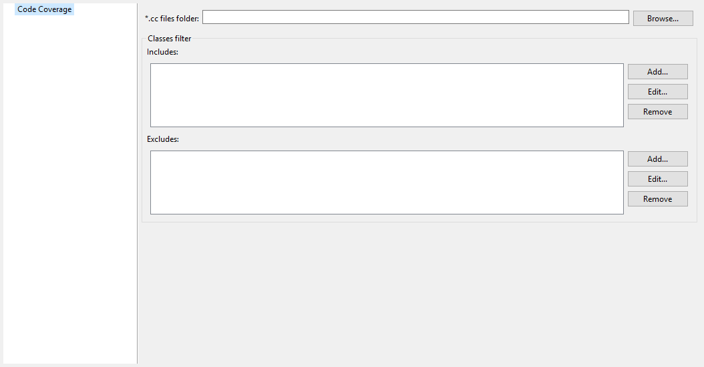

-----------------------
Category: Code Coverage
-----------------------

Option(browse): \*.cc files folder
----------------------------------

*Option Name*: ``cc.dir``

*Default value*: ``(empty)``

*Description*:

Specify a folder which contains the cc files to process (\*.cc).

Group: Classes filter
---------------------

Option(list): Includes
^^^^^^^^^^^^^^^^^^^^^^

*Option Name*: ``cc.includes``

*Default value*: ``(empty)``

*Description*:

List packages and classes to include to code coverage report. If no
package/class is specified, all classes found in the project classpath will
be analyzed.

Examples:

``packageA.packageB.*``: includes all classes which are in package
``packageA.packageB``

``packageA.packageB.className``: includes the class
``packageA.packageB.className``

Option(list): Excludes
^^^^^^^^^^^^^^^^^^^^^^

*Option Name*: ``cc.excludes``

*Default value*: ``(empty)``

*Description*:

List packages and classes to exclude to code coverage report. If no
package/class is specified, all classes found in the project classpath will
be analyzed.

Examples:

``packageA.packageB.*``: excludes all classes which are in package
``packageA.packageB``

``packageA.packageB.className``: excludes the class
``packageA.packageB.className``

..
   | Copyright 2008-2022, MicroEJ Corp. Content in this space is free 
   for read and redistribute. Except if otherwise stated, modification 
   is subject to MicroEJ Corp prior approval.
   | MicroEJ is a trademark of MicroEJ Corp. All other trademarks and 
   copyrights are the property of their respective owners.
