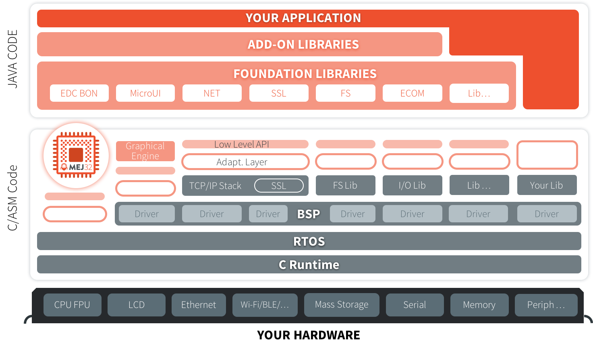

MicroEJ Overview
================

.. _section.microej.studio:

MicroEJ Editions
================

MicroEJ offers a comprehensive toolset to build the embedded software of
a device. The toolset covers two levels in device software development:

-  MicroEJ SDK for device firmware development

-  MicroEJ Studio for application development

The firmware will generally be produced by the device OEM, it includes
all device drivers and a specific set of MicroEJ functionalities useful
for application developers targeting this device.

.. figure:: ../ApplicationDeveloperGuide/png/toolchain.png
   :alt: MicroEJ Development Tools Overview
   :width: 100.0%

   MicroEJ Development Tools Overview

Using the MicroEJ SDK tool, a firmware developer will produce two
versions of the MicroEJ binary, each one able to run applications
created with the MicroEJ Studio tool:

-  A MicroEJ Firmware binary to be flashed on OEM devices;

-  A Virtual Device which will be used as a device simulator by
   application developers.

Using the MicroEJ Studio tool, an application developer will be able to:

-  Import Virtual Devices matching his target hardware in order to
   develop and test applications on the simulator;

-  Deploy the application locally on an hardware device equipped with
   the MicroEJ firmware;

-  Package and publish the application on a MicroEJ Forge Instance,
   enabling remote end users to install it on their devices. For more
   information about MicroEJ Forge, please consult
   ``https://www.microej.com/product/forge``.

.. _section.firmware:

MicroEJ Firmware
================

.. _section.bootable.binary:

Bootable Binary with Core Services
----------------------------------

A MicroEJ Firmware is a binary software program that can be programmed
into the flash memory of a device. A MicroEJ Firmware includes an
instance of a MicroEJ runtime linked to:

-  underlying native libraries and BSP + RTOS,

-  MicroEJ libraries and application code (C and Java code).

   MicroEJ Firmware Architecture

.. _section.javadoc:

Specification
-------------

The set of libraries included in the firmware and its dimensioning
limitations (maximum number of simultaneous threads, open connections,
…) are firmware specific. Please refer to
``https://developer.microej.com/5/getting-started-studio.html`` for
evaluation firmware release notes.

.. _section.virtual.device:

Virtual Device
==============

.. _section.virtual.device.simulation:

Using a Virtual Device for Simulation
-------------------------------------

The Virtual Device includes the same custom MicroEJ Core, libraries and
system applications as the real device. The Virtual Device allows
developers to run their applications either on the Simulator, or
directly on the real device through local deployment.

The Simulator runs a mockup board support package (BSP Mock) that mimics
the hardware functionality. An application on the Simulator is run as a
standalone application.

Before an application is locally deployed on device, MicroEJ Studio
ensures that it does not depend on any API that is unavailable on the
device.

.. figure:: ../SandboxedAppDevGuide/png/virtual-device.png
   :alt: MicroEJ Virtual Device Architecture
   :width: 100.0%

   MicroEJ Virtual Device Architecture

.. _section.javadoc.specification:

Runtime Environment
-------------------

The set of MicroEJ APIs exposed by a Virtual Device (and therefore
provided by its associated firwmare) is documented in Javadoc format in
the MicroEJ Resource Center (:guilabel:`Window` > :guilabel:`Show View` >
:guilabel:`MicroEJ Resource Center`).

.. figure:: ../SandboxedAppDevGuide/png/Overview_resourcecenter.png
   :alt: MicroEJ Resource Center APIs
   :width: 100.0%

   MicroEJ Resource Center APIs

.. _Standalone_vs_Sandboxed:

MicroEJ Applications
====================

Two kinds of applications can be developed on MicroEJ: MicroEJ
Standalone Applications and MicroEJ Sanboxed Applications.

A MicroEJ Standalone Application is a MicroEJ application that is
directly linked to the C code to produce a MicroEJ Firmware. Such
application must define a main entry point, i.e. a class containing a
``public static void main(String[])`` method. MicroEJ Standalone
Applications are developed using MicroEJ SDK.

A MicroEJ Sandboxed Application is a MicroEJ application that can run
over a Multi-Sandbox Firmware. It can be linked either statically or
dynamically. If it is statically linked, it is then called a System
Application as it is part of the initial image and cannot be removed.
MicroEJ Sandboxed Applications are developed using MicroEJ Studio.

A MicroEJ Multi-Sandbox Firmware is a MicroEJ Firmware that implements
the ability to be extended by exposing a set of APIs and a memory space
to link MicroEJ Sandboxed Applications. It can host several MicroEJ
Sandboxed applications.
