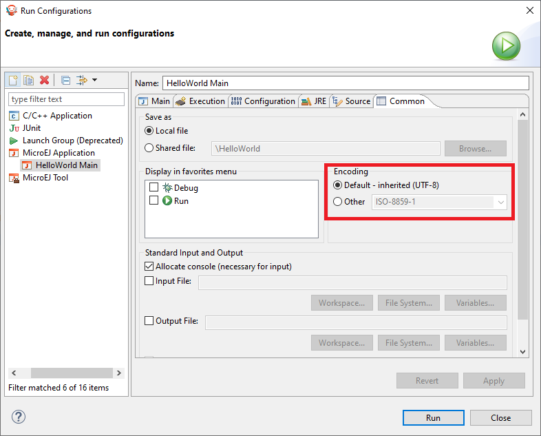

Character Encoding
==================

Default Encoding
----------------

The default character encoding is ``ISO-8859-1``. It is thus the encoding used when:

-  creating a new string from a byte array without specifying the encoding (`String(byte[]) constructor <https://repository.microej.com/javadoc/microej_5.x/apis/java/lang/String.html#String-byte:A->`_),

-  getting the byte array from a string without specifying the encoding (`String.getBytes() method <https://repository.microej.com/javadoc/microej_5.x/apis/java/lang/String.html#getBytes-->`_),

-  printing a string to standard output stream (`System.out <https://repository.microej.com/javadoc/microej_5.x/apis/java/lang/System.html#out>`_),

-  creating a new `PrintStream <https://repository.microej.com/javadoc/microej_5.x/apis/java/io/PrintStream.html>`_ without specifying the encoding.

.. _encoding_utf8:

UTF-8 Encoding
--------------

EDC provides an implementation of the ``UTF-8`` character encoding. 
It can be embedded using the :ref:`Embed UTF-8 encoding option <option_embed_utf8>` (otherwise a `java.io.UnsupportedEncodingException <https://repository.microej.com/javadoc/microej_5.x/apis/java/io/UnsupportedEncodingException.html>`_ exception will be thrown).

This implementation also supports Unicode code points as supplementary characters, by setting the :ref:`constant <section.classpath.elements.constants>` ``com.microej.library.edc.supplementarycharacter.enabled`` to ``true``.

Custom Encoding
---------------

It is possible to connect additional custom encodings. 
Please contact :ref:`our support team <get_support>` for more details.

Console Output
--------------

By default, the standard output stream (``System.out``) uses ``ISO-8859-1`` encoding to print strings. If you want to print a string with a different encoding, you can create a new ``PrintStream``:

.. code-block:: java

    PrintStream outUtf8 = new PrintStream(System.out, true, "UTF-8");
    outUtf8.println("你好");

.. warning::

    Make sure you embed the ``UTF-8`` encoder (see :ref:`encoding_utf8`)

The print methods write the raw byte array with the encoding used by the ``PrintStream`` to the console. The console must then be configured with the same encoding to display characters properly.

.. _set_console_encoding:

Set Encoding in MicroEJ SDK Console
~~~~~~~~~~~~~~~~~~~~~~~~~~~~~~~~~~~

The default encoding for Eclipse consoles is ``UTF-8``. If your application prints non-ASCII characters, they may not be displayed properly.

The encoding used by a console for a given application can be set in the application launcher options: :guilabel:`Run` > :guilabel:`Run Configurations...`, and then :guilabel:`Common` tab > :guilabel:`Encoding` radio buttons.

      Eclipse Launcher Console Encoding Options
..
   | Copyright 2022, MicroEJ Corp. Content in this space is free 
   for read and redistribute. Except if otherwise stated, modification 
   is subject to MicroEJ Corp prior approval.
   | MicroEJ is a trademark of MicroEJ Corp. All other trademarks and 
   copyrights are the property of their respective owners.