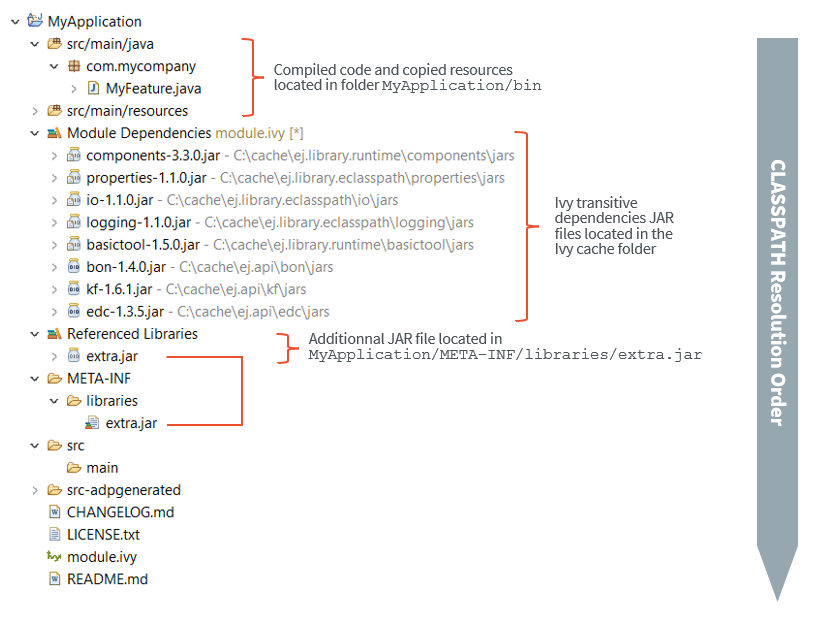
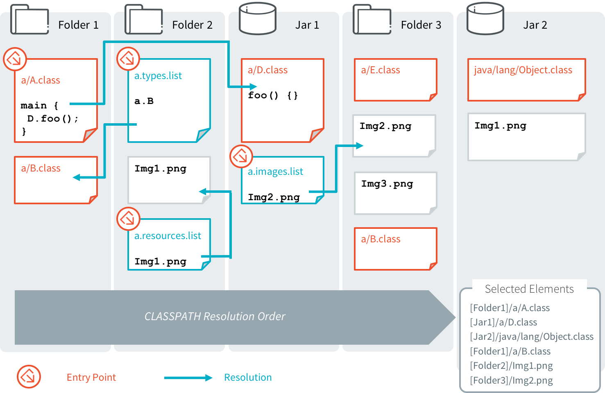

.. _chapter.microej.classpath:

MicroEJ Classpath
#################

MicroEJ Applications run on a target device and their footprint is
optimized to fulfill embedded constraints. The final execution context
is an embedded device that may not even have a file system. Files
required by the application at runtime are not directly copied to the
target device, they are compiled to produce the application binary code
which will be executed by MicroEJ Core Engine.

As a part of the compile-time trimming process, all types not required
by the embedded application are eliminated from the final binary.

MicroEJ Classpath is a developer defined list of all places containing
files to be embedded in the final application binary. MicroEJ Classpath
is made up of an ordered list of paths. A path is either a folder or a
zip file, called a JAR file (JAR stands for Java ARchive).

-  :ref:`application.classpath.mapping` explains how the MicroEJ Classpath is built from a
   MicroEJ Application project.

-  :ref:`section.microej.link.and.load.model` explains how the application contents is loaded from
   MicroEJ Classpath.

-  :ref:`section.classpath.elements` specifies the different elements that can be declared
   in MicroEJ Classpath to describe the application contents.

-  :ref:`section.foundation.library.versus.add.on.library` explains the different kind of
   libraries that can be added to MicroEJ Classpath.

-  Finally, :ref:`section.ivy.dependency.manager` shows how to manage libraries dependencies
   in MicroEJ.

.. _application.classpath.mapping:

Application Classpath
=====================

The following schema shows the classpath mapping from a MicroEJ
Application project to the MicroEJ Classpath ordered list of folders and
JAR files. The classpath resolution order (left to right) follows the
project appearance order (top to bottom).

   MicroEJ Application Classpath Mapping

.. _section.microej.link.and.load.model:

Classpath Load Model
====================

A MicroEJ Application classpath is created via the loading of :

-  an entry point type,

-  all ``*.[extension].list`` files declared in a MicroEJ Classpath.

The different elements that constitute an application are described in
:ref:`section.classpath.elements`. They are searched within MicroEJ Classpath from left to
right (the first file found is loaded). Types referenced by previously loaded
MicroEJ Classpath elements are loaded transitively.

   Classpath Load Principle

.. _section.classpath.elements:

Classpath Elements
==================

The MicroEJ Classpath contains the following elements:

-  An entrypoint described in section :ref:`section.classpath.elements.entrypoints`;

-  Types in ``.class`` files, described in section :ref:`section.classpath.elements.types`;

-  Raw resources, described in section :ref:`section.classpath.elements.resources`;

-  Immutables Object data files, described in Section :ref:`section.classpath.elements.immutables`;

-  Images and Fonts resources;

-  ``*.[extension].list`` files, declaring contents to load. Supported
   list file extensions and format is specific to declared application
   contents and is described in the appropriate section.

.. _section.classpath.elements.entrypoints:

Application Entry Points
------------------------

MicroEJ Application entry point declaration differs depending on the
application kind:

-  In case of a MicroEJ Standalone Application, it is a class that
   contains a ``public static void main(String[])`` method, declared
   using the option ``application.main.class``.

-  In case of a MicroEJ Sandboxed Application, it is a class that
   implements ``ej.kf.FeatureEntryPoint``, declared in the
   ``Application-EntryPoint`` entry in ``META-INF/MANIFEST.MF`` file.

.. _section.classpath.elements.types:

Types
-----

MicroEJ types (classes, interfaces) are compiled from source code
(``.java``) to classfiles (``.class``). When a type is loaded, all types
dependencies found in the classfile are loaded (transitively).

A type can be declared as a *Required type* in order to enable the
following usages:

-  to be dynamically loaded from its name (with a call to
   ``Class.forName(String)``);

-  to retrieve its fully qualified name (with a call to
   ``Class.getName()``).

A type that is not declared as a *Required type* may not have its fully
qualified name (FQN) embedded. Its FQN can be retrieved using the stack
trace reader tool (see :ref:`section.stacktrace.reader.tool`).

Required Types are declared in MicroEJ Classpath using ``*.types.list``
files. The file format is a standard Java properties file, each line
listing the fully qualified name of a type. Example:

::

   # The following types are marked as MicroEJ Required Types
   com.mycompany.MyImplementation
   java.util.Vector

.. _section.classpath.elements.resources:

Raw Resources
-------------

Raw resources are binary files that need to be embedded by the
application so that they may be dynamically retrieved with a call to
``Class.getResourceAsStream(java.io.InputStream)``. Raw Resources are
declared in MicroEJ Classpath using ``*.resources.list`` files. The file
format is a standard Java properties file, each line is a relative ``/``
separated name of a file in MicroEJ Classpath to be embedded as a
resource. Example:

::

   # The following resource is embedded as a raw resource
   com/mycompany/MyResource.txt

.. _section.classpath.elements.immutables:

Immutable Objects
-----------------

Immutables objects are regular read-only objects that can be retrieved
with a call to ``ej.bon.Immutables.get(String)``. Immutables objects are
declared in files called *immutable objects data files*, which format is
described in the ``[B-ON]`` specification (:http:`http://e-s-r.net`).
Immutables objects data files are declared in MicroEJ Classpath using
``*.immutables.list`` files. The file format is a standard Java
properties file, each line is a ``/`` separated name of a relative file
in MicroEJ Classpath to be loaded as an Immutable objects data file.
Example:

::

   # The following file is loaded as an Immutable objects data files
   com/mycompany/MyImmutables.data

System Properties
-----------------

System Properties are key/value string pairs that can be accessed with a
call to ``System.getProperty(String)``. System properties are declared
in MicroEJ Classpath ``*.properties.list`` files. The file format is a
standard Java properties file. Example:

::

   # The following property is embedded as a System property
   com.mycompany.key=com.mycompany.value

.. _section.classpath.Images:

Images
------

Overview
~~~~~~~~

Images are graphical resources that can be accessed with a call to
``ej.microui.display.Image.createImage()``. To be displayed, these
images have to be converted from their source format to the display raw
format. The conversion can either be done at :

-  build-time (using the image generator tool),

-  run-time (using the relevant decoder library).

Images that must be processed by the image generator tool are declared
in MicroEJ Classpath ``*.images.list`` files. The file format is a
standard Java properties file, each line representing a ``/`` separated
resource path relative to the MicroEJ classpath root referring to a
standard image file (e.g. ``.png``, ``.jpg``). The resource may be
followed by an optional parameter (separated by a ``:``) which defines
and/or describes the image output file format (raw format). When no
option is specified, the image is embedded as-is and will be decoded at
run-time (although listing files without format specifier has no impact
on the image generator processing, it is advised to specify them in the
``*.images.list`` files anyway, as it makes the run-time processing
behavior explicit). Example:

::

   # The following image is embedded 
   # as a PNG resource (decoded at run-time)
   com/mycompany/MyImage1.png

   # The following image is embedded 
   # as a 16 bits format without transparency (decoded at build-time)
   com/mycompany/MyImage2.png:RGB565

   # The following image is embedded 
   # as a 16 bits format with transparency (decoded at build-time)
   com/mycompany/MyImage3.png:ARGB1555

.. include:: ../ApplicationDeveloperGuide/sectionImageFormats.rst

.. _section.classpath.Fonts:

Fonts
-----

Overview
~~~~~~~~

Fonts are graphical resources that can be accessed with a call to
``ej.microui.display.Font.getFont()``. To be displayed, these fonts have
to be converted at build-time from their source format to the display
raw format by the font generator tool. Fonts that must be processed by
the font generator tool are declared in MicroEJ Classpath
``*.fonts.list`` files. The file format is a standard Java properties
file, each line representing a ``/`` separated resource path relative to
the MicroEJ classpath root referring to a MicroEJ font file (usually
with a ``.ejf`` file extension). The resource may be followed by
optional parameters which define :

-  some ranges of characters to embed in the final raw file;

-  the required pixel depth for transparency.

By default, all characters available in the input font file are
embedded, and the pixel depth is ``1`` (i.e 1 bit-per-pixel). Example:

::

   # The following font is embedded with all characters
   # without transparency
   com/mycompany/MyFont1.ejf

   # The following font is embedded with only the latin 
   # unicode range without transparency 
   com/mycompany/MyFont2.ejf:latin

   # The following font is embedded with all characters
   # with 2 levels of transparency
   com/mycompany/MyFont2.ejf::2

MicroEJ font files conventionally end with the ``.ejf`` suffix and are
created using the Font Designer (see :ref:`section.tool.fontdesigner`).

Font Range
~~~~~~~~~~

The first parameter is for specifying the font ranges to embed.
Selecting only a specific set of characters to embed reduces the memory
footprint. Several ranges can be specified, separated by ``;``. There
are two ways to specify a character range: the custom range and the
known range.

Custom Range
^^^^^^^^^^^^

Allows the selection of raw Unicode character ranges.

Examples:

-  ``myfont:0x21-0x49``: Embed all characters from 0x21 to 0x49
   (included);

-  ``myfont:0x21-0x49,0x55``: Embed all characters from 0x21 to 0x49 and
   character 0x55;

-  ``myfont:0x21-0x49;0x55``: Same as previous, but done by declaring
   two ranges.

Known Range
^^^^^^^^^^^

A known range is a range defined by the "Unicode Character Database"
version 9.0.0 available on :http:`http://www.unicode.org/`. Each range is
composed of sub ranges that have a unique id.

-  ``myfont:basic_latin``: Embed all *Basic Latin* characters;

-  ``myfont:basic_latin;arabic``: Embed all *Basic Latin* characters,
   and all *Arabic* characters.

Transparency
~~~~~~~~~~~~

The second parameter is for specifying the font transparency level
(``1``, ``2``, ``4`` or ``8``).

Examples:

-  ``myfont:latin:4``: Embed all latin characters with 4 levels of
   transparency

-  ``myfont::2``: Embed all characters with 2 levels of transparency

.. _section.foundation.library.versus.add.on.library:

Foundation Libraries vs Add-On Libraries
========================================

A MicroEJ Foundation Library is a MicroEJ Core library that provides
core runtime APIs or hardware-dependent functionality. A Foundation
library is divided into an API and an implementation. A Foundation
library API is composed of a name and a 2 digits version (e.g.
``EDC-1.3``) and follows the semantic versioning (:http:`http://semver.org`)
specification. A Foundation Library API only contains prototypes without
code. Foundation Library implementations are provided by MicroEJ
Platforms. From a MicroEJ Classpath, Foundation Library APIs
dependencies are automatically mapped to the associated implementations
provided by the Platform or the Virtual Device on which the application
is being executed.

A MicroEJ Add-On Library is a MicroEJ library that is implemented on top
of MicroEJ Foundation Libraries (100% full Java code). A MicroEJ Add-On
Library is distributed in a single JAR file, with a 3 digits version and
provides its associated source code.

Foundation and Add-On Libraries are added to MicroEJ Classpath by the
application developer as module dependencies (see :ref:`section.ivy.dependency.manager`).

   MicroEJ Foundation Libraries and Add-On Libraries

MicroEJ Central Repository
==========================

The MicroEJ Central Repository is the binary repository maintained by
MicroEJ. It contains Foundation Library APIs and numerous Add-On
Libraries. Foundation Libraries APIs are distributed under the
organization ``ej.api``. All other artifacts are Add-On Libraries.

For more information, please visit :http:`https://repository.microej.com`.

Offline Repository
==================

By default, MicroEJ is configured to connect online MicroEJ Central
Repository. The MicroEJ Central Repository can be downloaded locally for
offline use. Please follow the steps described at
:http:`https://repository.microej.com`.

..
   | Copyright 2008-2020, MicroEJ Corp. Content in this space is free 
   for read and redistribute. Except if otherwise stated, modification 
   is subject to MicroEJ Corp prior approval.
   | MicroEJ is a trademark of MicroEJ Corp. All other trademarks and 
   copyrights are the property of their respective owners.
