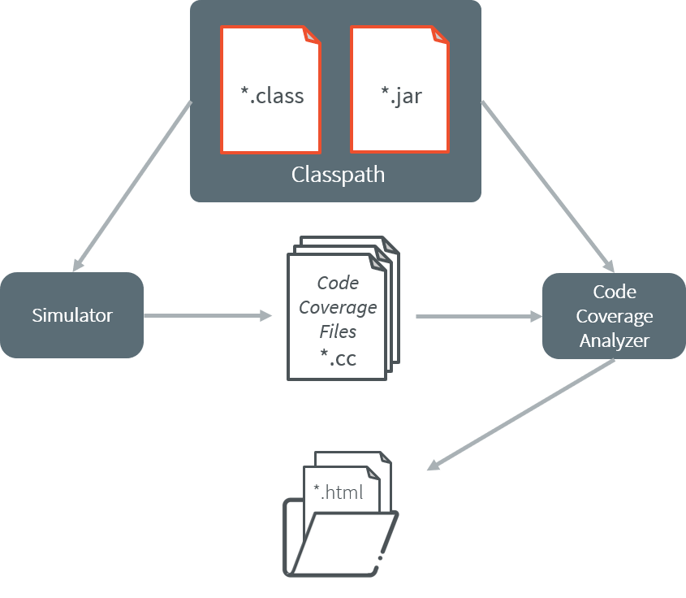

.. _code_coverage_analyzer:

======================
Code Coverage Analyzer
======================

Principle
=========

The MicroEJ Simulator features an option to output .cc (Code Coverage)
files that represent the use rate of functions of an application. It
traces how the opcodes are really executed.

Functional Description
======================

The Code Coverage Analyzer scans the output .cc files, and outputs an
HTML report to ease the analysis of methods coverage. The HTML report is
available in a folder named htmlReport in the same folder as the .cc
files generated by enabling the :ref:`Code Coverage option <category.code.coverage>` .

   Code Coverage Analyzer Process

Dependencies
============

In order to work properly, the Code Coverage Analyzer should input the
.cc files. The .cc files relay the classpath used during the execution
of the Simulator to the Code Coverage Analyzer. Therefore the classpath
is considered to be a dependency of the Code Coverage Analyzer.

Installation
============

This tool is a built-in platform tool.

.. _codeCoverageAnalyzerTool:

Use
===

A MicroEJ tool is available to launch the Code Coverage Analyzer tool.
The tool name is Code Coverage Analyzer.

Two levels of code analysis are provided, the Java level and the
bytecode level. Also provided is a view of the fully or partially
covered classes and methods. From the HTML report index, just use
hyperlinks to navigate into the report and source / bytecode level code.

.. include:: cca_use.rst

..
   | Copyright 2008-2021, MicroEJ Corp. Content in this space is free 
   for read and redistribute. Except if otherwise stated, modification 
   is subject to MicroEJ Corp prior approval.
   | MicroEJ is a trademark of MicroEJ Corp. All other trademarks and 
   copyrights are the property of their respective owners.
