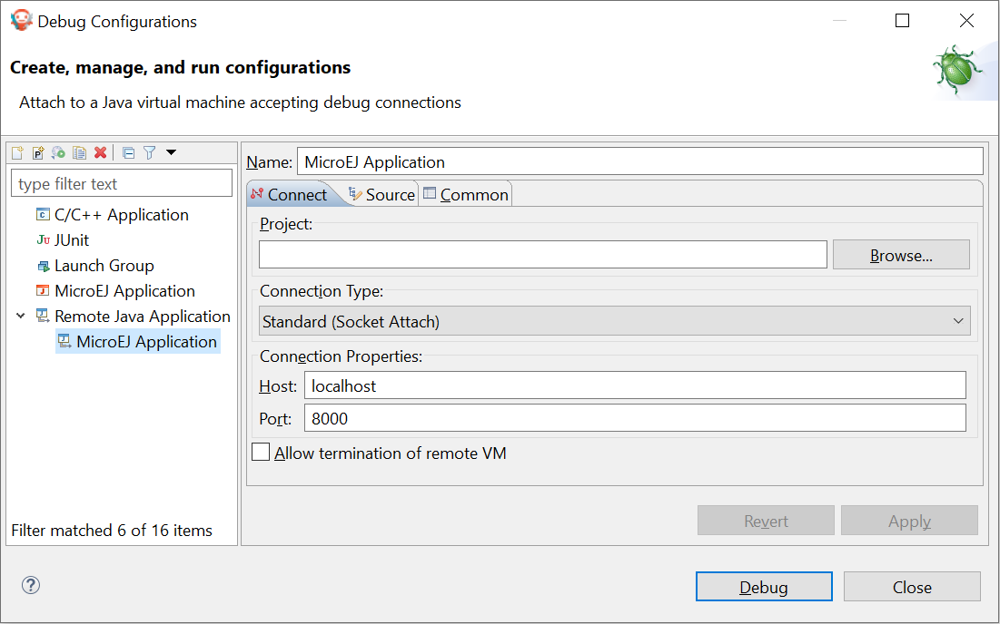
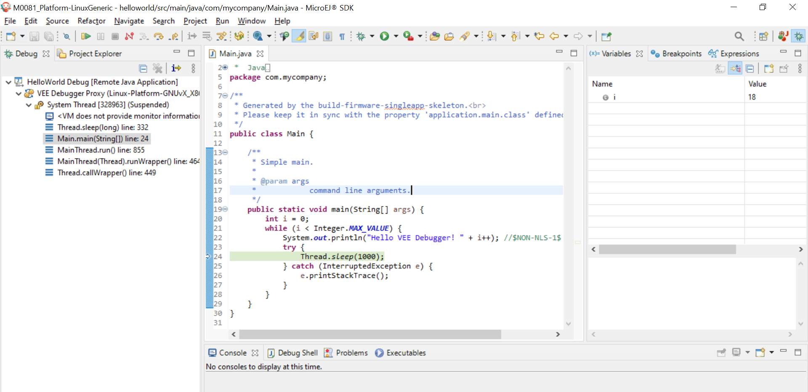

.. _application_debugger:

Debug an Application
====================

Debug on Simulator
------------------

To debug an application on Simulator, select it in the left panel then right-click
and select :guilabel:`Debug As` > :guilabel:`MicroEJ Application`.

.. figure:: images/debug1.png
   :alt: MicroEJ Development Tools Overview of the Debugger on Simulator
   :align: center

   MicroEJ Development Tools Overview of the Debugger on Simulator

.. _application_debugger_on_board:

Debug on Board
--------------

To debug an application on Board, first run the :ref:`MicroEJ debugger proxy <MicroEJ-Debugger-Proxy>`, and run a Remote Java Application launch:

- Go to :guilabel:`Run` > :guilabel:`Debug Configurations` > :guilabel:`Remote Java Application`
  
- Set the informations about the project to debug, the proxy connections properties, etc.
  
- Click on :guilabel:`Debug`

   MicroEJ Development Tools Overview of the Remote Java Application

In the the MicroeEJ SDK, open the Debug perperctive :guilabel:`Window` > :guilabel:`Perspective` > :guilabel:`Open Perspective` > :guilabel:`Other...` > :guilabel:`Debug` to show the current debugging process.

   MicroEJ Development Tools Overview of the Debugger on Board

It makes use of Eclipse Java debugger client.
If you are unfamiliar with Java debugging or Eclipse IDE, see `Debugging the Eclipse IDE for Java Developers`_ to get started.

.. _Debugging the Eclipse IDE for Java Developers:  https://www.eclipse.org/community/eclipse_newsletter/2017/june/article1.php

Get Library Sources
-------------------

All libraries included in MicroEJ SDK are provided with their source code and resources.
The way the sources are retrieved depends on the kind of library (Add-On Library or Foundation Library).

Add-On Library Sources
~~~~~~~~~~~~~~~~~~~~~~

Add-On Library sources are packaged in a dedicated file named ``[module_name]-source.jar`` available in the module directory:

.. figure:: images/addon_library_source.png
      :alt: Add-On Library Sources Location
      :align: center

      Add-On Library Sources Location

In the SDK, sources are automatically connected to Eclipse JDT when the new Add-On Library is added as a :ref:`module dependency <mmm_module_dependencies>`.

On any Java element (type, method, field), press ``F3`` or ``CTRL-Click`` to open the implementation:

.. figure:: images/addon_library_open_implementation.png
      :alt: Add-On Library Open Implementation
      :align: center

      Add-On Library Open Implementation

Then the implementation class is open in read-only mode.

.. figure:: images/addon_library_implementation_read_only.png
      :alt: Add-On Library Read-Only Source Code
      :align: center

      Add-On Library Read-Only Source Code

.. _foundation_library_sources:

Foundation Library Sources
~~~~~~~~~~~~~~~~~~~~~~~~~~

Foundation Library sources are directly included in the implementation file (JAR file) provided by the Platform.

They are located in the following Platform folders:

- :guilabel:`javaLibs` for generic Foundation Libraries (defaults).
- :guilabel:`MICROJVM/javaLibs` for Foundation Libraries specific to the MicroEJ Core Engine.
- :guilabel:`S3/javaLibs` for Foundation Libraries specific to the Simulator.

.. figure:: images/foundation_library_implementation_folders.png
      :alt: Foundation Library Platform Folders
      :align: center

      Foundation Library Platform Folders
   
In the SDK, sources can be connected while debugging an Application on Simulator.
This ensures to get the exact source code which is executed on your Platform.

Here are the steps to attach Foundation Library sources from a Platform loaded in the workspace:

- Open a :ref:`MicroEJ Application launch <concepts-microejlaunches>`,

- Select the :guilabel:`Source` tab (see also :ref:`launch_source_tab`), 

- Click on :guilabel:`Add...` button,

- Select :guilabel:`Archive` item and press :guilabel:`OK`,

   .. figure:: images/foundation_library_debug_add_source_archive.png
         :alt: Add Foundation Library Sources to MicroEJ Application Launch
         :align: center

         Add Foundation Library Sources to MicroEJ Application Launch

- Select the Foundation Libraries from Platform folders and press :guilabel:`OK`,

   .. figure:: images/foundation_library_debug_select_source_jars.png
      :alt: Select Foundation Libraries Implementation Files
      :align: center

      Select Foundation Libraries Implementation files 

   .. warning::

      You must select the libraries from the Platform project corresponding to the execution Platform (see :ref:`launch_execution_tab`).

In the debug session the implementation sources will be now displayed.

   .. figure:: images/foundation_library_debug_open_implementation.png
      :alt: Foundation Library Read-Only Source Code
      :align: center

      Foundation Library Read-Only Source Code

..
   | Copyright 2008-2023, MicroEJ Corp. Content in this space is free 
   for read and redistribute. Except if otherwise stated, modification 
   is subject to MicroEJ Corp prior approval.
   | MicroEJ is a trademark of MicroEJ Corp. All other trademarks and 
   copyrights are the property of their respective owners.
