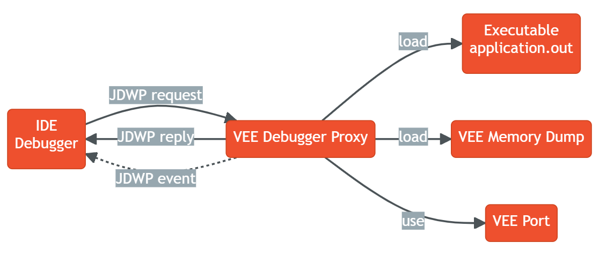

..  _debugger_proxy:

VEE Debugger Proxy
##################

Principle
=========

The VEE debugger proxy is an implementation of the Java Debug Wire protocol (JDWP) for debugging Applications executed by MICROEJ VEE.
It consists of a TCP server implementing the JDWP protocol and acting as a proxy between the IDE (debugger) and the Executable (debuggee) running on the device.

The debugger proxy allows a postmortem debug from a core dump of a running MICROEJ VEE Executable.

   Debugger Proxy Principle

.. note::
   This feature requires Architecture version ``8.0.0`` or higher.

Generate a Core Dump File on Linux using GDB
============================================

Open a shell terminal and enter the following commands:

.. code-block:: sh

    # Instruct the Linux kernel to Dump file-backed private mappings.
    echo 0x37 > /proc/self/coredump_filter
    # Stard gdb.
    gdb ./application.out

The following GDB script generates a core dump file when:

- the signal ``SIGUSR1`` is received,
- or when a out of memory error occurs, 
- or when an explicit garbage collection (GC) is done.

.. code-block:: sh

   # In the gdb console.
   catch signal SIGUSR1 # catch the SIGUSR1 signal
   commands 
   silent
   generate-core-file [file] # the argument `file` specifies the file name where to put the core dump
   cont
   end

   break LLMJVM_on_OutOfMemoryError_thrown # break in the LLMJVM_on_OutOfMemoryError_thrown, this function is called when an out of memory error occurs
   commands 
   silent
   generate-core-file [file] # the argument `file` specifies the file name where to put the core dump
   cont
   end

   break LLMJVM_on_Runtime_gc_done # break in the LLMJVM_on_Runtime_gc_done function
   commands 
   silent
   generate-core-file [file] # the argument `file` specifies the file name where to put the core dump
   cont
   end

Run the program:

.. code-block:: sh

    # In the gdb console.
    run

A core dump file will be generated once the Executable reach one of the breaking conditions described previously.

You can also suspend the process and generate the core dump file by yourself:

.. code-block:: sh

    # In the gdb console.
    # suspend first the process with Ctrl-C and then generate the core dump file.
    generate-core-file [file] # the argument `file` specifies the file name where to put the core dump

Start the Proxy
===============

Please contact :ref:`our support team <get_support>` to get the VEE Debugger Proxy program.

Open a shell terminal and run the following command

.. code-block:: sh

    java -Dloader.path=<Path to runtime jars> \
        -Ddebugger.port=<8000> \
        -Ddebugger.out.path=<path to the Executable file (``application.out``)> \
        -Ddebugger.out.coredump.path=<path to the core dump file> \
        -Ddebugger.out.format=<elf> \
        -Ddebugger.out.bigEndianness=<false> \
        -jar microej-debugger-proxy.jar

* **debugger.port**: TCP server port, defaults to ``8000``
* **debugger.out.path**: path to the Executable file (``application.out``)
* **debugger.out.coredump.path**: path to the core dump file
* **debugger.out.format**: VEE .out file format, default to elf
*  **debugger.out.bigEndianness**: VEE .out file big endian, default to false
* **loader.path**: The path to the platform ``soarModelReader.jar`` and ``vmModelReader.jar`` needs to be provided here.
  This is a Comma-separated Classpath, such as `${PLATFORM}/tools/soarModelReader.jar,${PLATFORM}/tools/soarModelReader.jar`.
  Earlier entries take precedence, like a regular -classpath on the javac command line. 
  Other runtime jars can be provided using this property.

Open the SDK and run a :ref:`Remote Java Application Launch <debug_on_device>` to debug your code.

..
   | Copyright 2022, MicroEJ Corp. Content in this space is free 
   for read and redistribute. Except if otherwise stated, modification 
   is subject to MicroEJ Corp prior approval.
   | MicroEJ is a trademark of MicroEJ Corp. All other trademarks and 
   copyrights are the property of their respective owners.