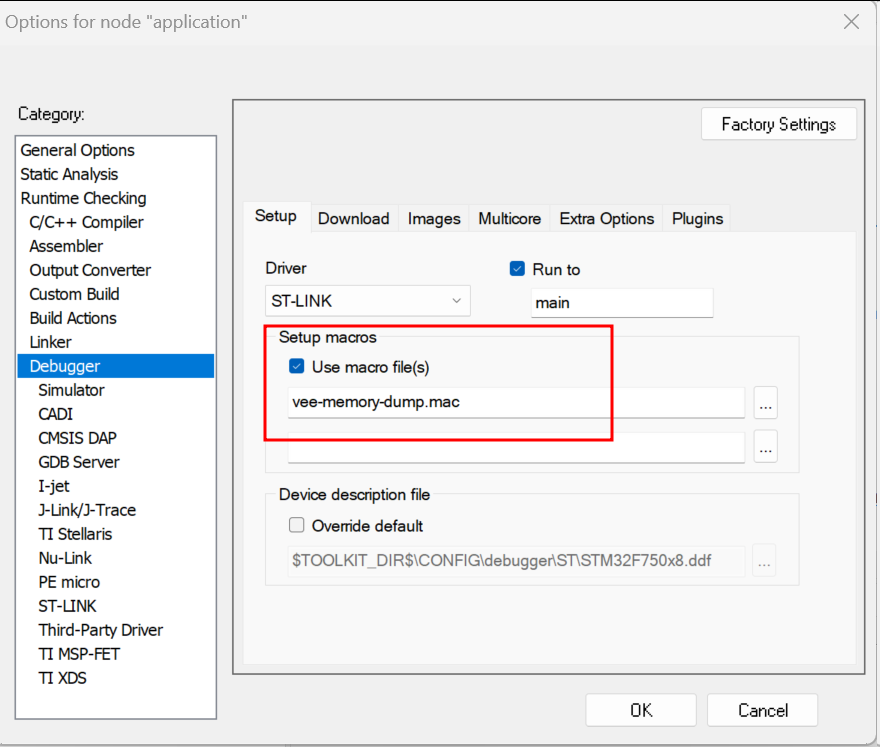
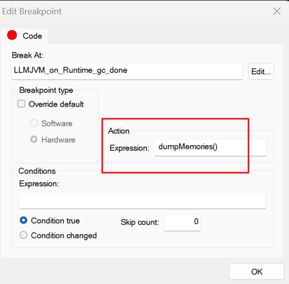

..  _debugger_proxy:

VEE Debugger Proxy
##################

Principle
=========

The VEE debugger proxy is an implementation of the Java Debug Wire protocol (JDWP) for debugging Applications executed by MICROEJ VEE.
It consists of a TCP server implementing the JDWP protocol and acting as a proxy between the IDE (debugger) and the Executable (debuggee) running on the device.

The debugger proxy allows a postmortem debug from a snapshot of the memory (core dump file for Linux/QNX targets and Intel hex file for MCU targets) of a running Executable binary.

.. figure:: images/debugger_proxy1.png
   :alt: Debugger Proxy Principle
   :align: center
   :scale: 70%

   Debugger Proxy Principle

.. warning::
    
    The snapshot of the memory (core dump or Intel hex files) should only be generated when the Core Engine task is stopped on one of the Core Engine hooks (``LLMJVM_on_OutOfMemoryError_thrown``, ``LLMJVM_on_Runtime_gc_done`` etc.) or in a native function. 
    Otherwise, the Core Engine memory dump is not guarranted to be consistent, which may cause the VEE Debugger to crash abruptly. 

.. note::
    This feature requires Architecture version ``8.1.0`` or higher and only works for Mono-Sandbox Executable.
    
    Please contact :ref:`our support team <get_support>` to get the VEE Debugger Proxy tool ``microej-debugger-proxy.jar`` compatible with your Architecture version.

Debugging Executable for Linux or QNX target
============================================

In order to debug an Executable for Linux or QNX target, you need to dump the memory of the running Executable and then run the VEE Debugger Proxy.

For Linux and QNX target, the memory dump must be a core dump file.

Generate a Core Dump File using GDB
-----------------------------------

Open a shell terminal on the device and enter the following commands:

.. code-block:: sh

    # Instruct the Linux kernel to Dump file-backed private mappings.
    echo 0x37 > /proc/self/coredump_filter
    # Start GDB
    gdb ./application.out

The following GDB script can be used to generate a core dump file:

- when the signal ``SIGUSR1`` is received
- or when an out of memory error occurs 
- or when an explicit garbage collection (GC) is done.

You can run the script directly in the GDB console.

.. code-block:: sh

   ## From GBD documentation:
   ## generate-core-file [file]
   ##   Produce a core dump of the inferior process.
   ##   The optional argument file specifies the file name where to put the core dump.
   ##   If not specified, the file name defaults to 'core.pid', where pid is the inferior process ID.

   ## Generate a core dump when the signal SIGUSR1 is received
   catch signal SIGUSR1
   commands 
   silent
   generate-core-file
   cont
   end

   ## Generate a core dump when an out of memory error occurs
   break LLMJVM_on_OutOfMemoryError_thrown
   commands 
   silent
   generate-core-file
   cont
   end

   ## Generate a core dump when an explicit garbage collection (GC) is done
   break LLMJVM_on_Runtime_gc_done
   commands 
   silent
   generate-core-file
   cont
   end

Starts executing the Mono-Sandbox Executable under GDB:

.. code-block:: sh

    # In the GDB console:
    run

A core dump file will be generated once the Executable reach one of the breaking conditions described previously.

Run the VEE Debugger Proxy
--------------------------

Open a shell terminal on your workstation and run the following command

.. code-block:: sh

    java -DveePortDir=<path to VEE Port directory> \
        -Ddebugger.port=<8000> \
        -Ddebugger.out.path=<path to the Executable file (``application.out``)> \
        -Ddebugger.out.coredump.path=<path to the core dump file> \
        -jar microej-debugger-proxy.jar

Open the SDK and run a :ref:`Remote Java Application Launch <debug_on_device>` to debug your code.

Debugging Executable for MCU target
===================================

The VEE Debugger Proxy for MCU target requires a memory dump of the running Executable in Intel hex format.
It provides a tool to generate a script for IAR or GDB debugger which contain the needed commands to dump the required memory regions in Intel hex format.

.. _generate_vee_memory_dump_script:

Generate VEE memory dump script for IAR or GDB debugger
-------------------------------------------------------

Open a shell terminal on your workstation and run the following command

.. code-block:: sh

    java -DveePortDir=<path to VEE Port directory> \
        -Ddebugger.out.path=<path to the Executable file (``application.out``)> \
        -cp microej-debugger-proxy.jar com.microej.jdwp.VeeDebuggerCli \
        --debugger=IAR|GDB \
        --output=<Output folder where the script file will be generated> \
        -jar microej-debugger-proxy.jar

A script file named ``vee-memory-dump.mac`` (for IAR) or ``vee-memory-dump.gdb`` (for GDB) is generated into the specified output folder.

You can now use this script to dump the memory of the running Executable.

Dump the memory of the running Executable
-----------------------------------------

With IAR Debugger
~~~~~~~~~~~~~~~~~

In IAR Embedded Workbench:

- Register the generated ``vee-memory-dump.mac`` file in the debugger project option

   IAR Debugger Project Option

- Add the macro ``dumpMemories()`` as an action expression to a code breakpoint:

   IAR Breakpoint editor

When the IAR Debugger hits the specified breakpoint, the ``dumpMemories()`` macro function is executed and the memory is dumped into ``*.ihex`` files.
Note that the ``*.ihex`` files are generated in the same folder as the ``vee-memory-dump.mac`` file.

With GNU Debugger (GDB)
~~~~~~~~~~~~~~~~~~~~~~~

In your GDB console:

- Create a breakpoint at a specific safe point (Core Engine hooks or native function)

.. code-block:: sh

    # E.g. Add breakpoint at LLMJVM_on_Runtime_gc_done hook
    break LLMJVM_on_Runtime_gc_done
    run

- When the running Executable stops at the Breakpoint, run the ``vee-memory-dump.gdb`` script file to dump the memory.

.. code-block:: sh

    # E.g. Run the GDB memory dump script
    source [/path/to]/vee-memory-dump.gdb

The memory is dumped into ``*.ihex`` files in the same folder as the ``vee-memory-dump.gdb`` file.

Start the VEE Debugger Proxy
----------------------------

Open a shell terminal on your workstation and run the following command

.. code-block:: sh

    java -DveePortDir=<path to VEE Port directory> \
        -Ddebugger.port=<8000> \
        -Ddebugger.out.path=<path to the Executable file (``application.out``)> \
        -Ddebugger.out.ihex.path=<comma-separated list of the memory dump files in Intel hex format> \
        -jar microej-debugger-proxy.jar

Open the SDK and run a :ref:`Remote Java Application Launch <debug_on_device>` to debug your code.

VEE Debugger Proxy Options Summary
==================================

* **veePortDir**: The path to the VEE Port directory (must point to the `source` folder of the VEE Port.)
* **debugger.port**: TCP server port, defaults to ``8000``.
* **debugger.out.path**: Path to the Executable file (``application.out``)
* **debugger.out.coredump.path**: Path to the core dump file (conflict with **debugger.out.ihex.path** option)
* **debugger.out.ihex.path**: Path to the memory dump files in Intel hex format (conflict with **debugger.out.coredump.path** option)
  This option value must be a comma-separated list of the memory dump files, such as ``[/path/to]/java_heap.ihex,[/path/to]/java_stacks.ihex,[/path/to]/vm_instance.ihex``

..
   | Copyright 2022-2023, MicroEJ Corp. Content in this space is free 
   for read and redistribute. Except if otherwise stated, modification 
   is subject to MicroEJ Corp prior approval.
   | MicroEJ is a trademark of MicroEJ Corp. All other trademarks and 
   copyrights are the property of their respective owners.