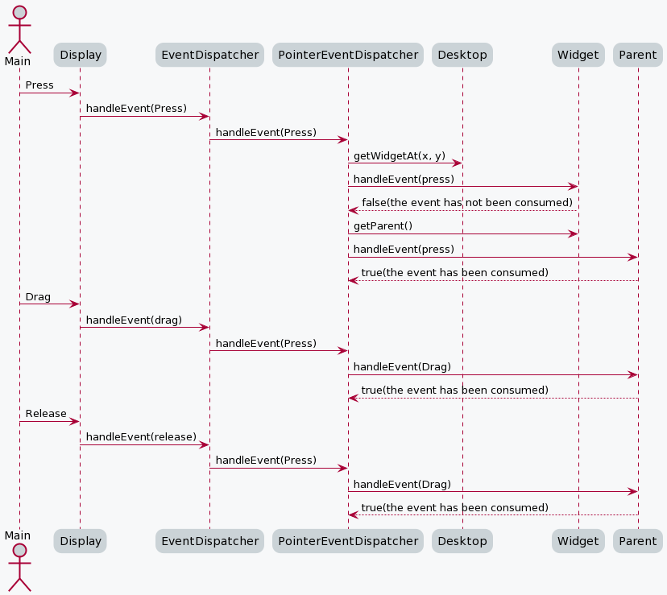
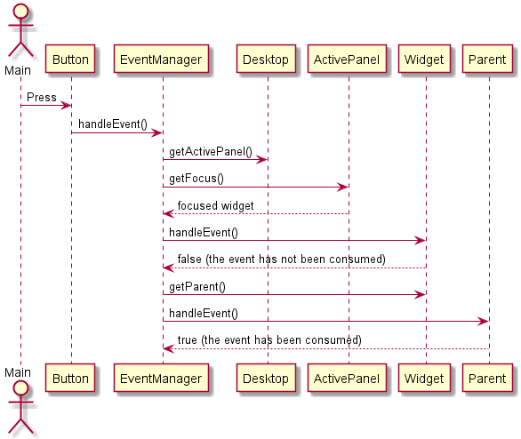

Event propagation in Widget 4.x
===============================

The MicroUI 3.x events (touch, buttons…) are sent to the application in the same order as they are generated.
In MicroUI, events are sent to the displayable that is shown on the display. In MWT, events are sent to the Desktop that dispatches the event to its children widgets.

Pointer Events
--------------

Pointer events are grouped in sessions. A session starts when the pointer is pressed, and ends when the pointer is released.

While no renderable consumes the events, they are sent to the renderable that is under the pointer, then sent to all its parent hierarchy. Once a renderable has consumed an event, every other event in the session is sent to it.

The renderable under the pointer is requested using getDesktop().getWidgetAt(). By default every widget is considered as a rectangular area. This area can be modified by subclassing Widget.contains().

Other Events
------------

For other events, the events are sent to the focus owner of the active Displayable.

