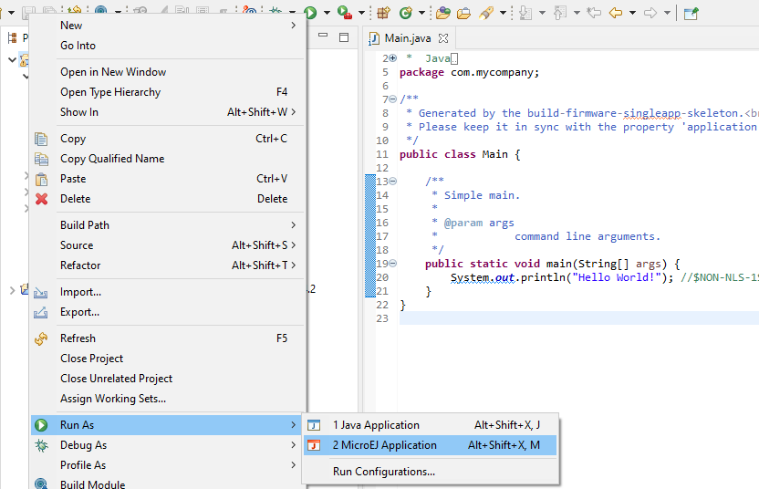
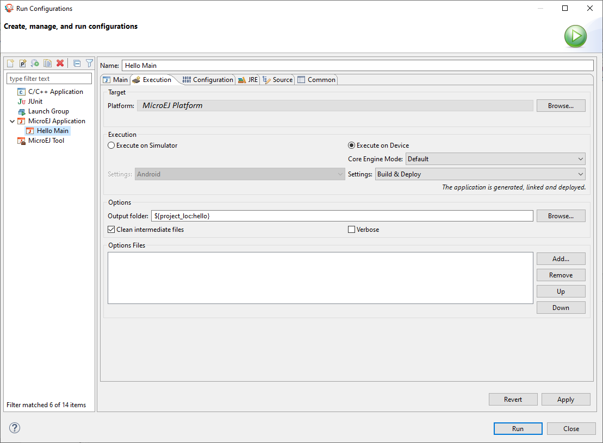
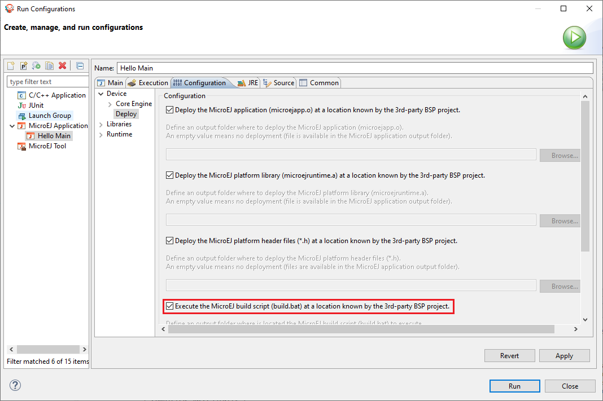

Build and Run an Application
============================

.. _simulator_execution:

Create a MicroEJ Standalone Application
---------------------------------------

-  Create a project in your workspace. Select :guilabel:`File` > :guilabel:`New` >
   :guilabel:`Standalone Application Project`.

   .. figure:: images/newApp1.png
      :alt: New MicroEJ Standalone Application Project
      :align: center
      :width: 719px
      :height: 174px

      New MicroEJ Standalone Application Project

-  Fill in the application template fields, the Project name field will
   automatically duplicate in the following fields. Click on :guilabel:`Finish`.
   A template project is automatically created and ready to use, this
   project already contains all folders wherein developers need to put
   content:

   -  ``src/main/java``: Folder for future sources

   -  ``src/main/resources``: Folder for future resources (images, fonts, etc.)

   -  ``META-INF``: Sandboxed Application configuration and resources

   -  ``module.ivy``: Ivy input file, dependencies description for the
      current project

-  Right click on the source folder ``src/main/java`` and select
   :guilabel:`New` > :guilabel:`Package`. Give a name: ``com.mycompany``.
   Click on :guilabel:`Finish`.

   .. figure:: images/newApp8.png
      :alt: New Package
      :align: center
      :width: 525px
      :height: 326px

      New Package

-  The package ``com.mycompany`` is available under ``src/main/java`` folder.
   Right click on this package and select :guilabel:`New` > :guilabel:`Class`.
   Give a name: ``Test`` and check the box ``public static void main(String[]
   args)``. Click on :guilabel:`Finish`.

   .. figure:: images/newApp9.png
      :alt: New Class
      :align: center
      :width: 542px
      :height: 634px

      New Class

-  The new class has been created with an empty ``main()`` method. Fill
   the method body with the following lines:

   ::

      System.out.println("hello world!");

   .. figure:: images/newApp10.png
      :alt: MicroEJ Application Content
      :align: center
      :width: 438px
      :height: 192px

      MicroEJ Application Content

   The test application is now ready to be executed. See next sections.

.. _section.run.on.simulator:

Run on the Simulator
--------------------

To run the sample project on Simulator, select it in the left panel then right-click
and select :guilabel:`Run` > :guilabel:`Run as` > :guilabel:`MicroEJ Application`.

   MicroEJ Development Tools Overview

MicroEJ SDK console will display Launch steps messages.

::

    =============== [ Initialization Stage ] ===============
    =============== [ Launching on Simulator ] ===============
    hello world!
    =============== [ Completed Successfully ] ===============

    SUCCESS

.. _device_build:

Run on the Hardware Device
--------------------------

- Open the run dialog (:guilabel:`Run` > :guilabel:`Run Configurations...`).

- Select the :guilabel:`MicroEJ Application` > :guilabel:`HelloWorld` that is created by the previous chapter.

- Open :guilabel:`Execution` tab and select :guilabel:`Execute on Device`.

- Set :guilabel:`Settings` checkbox to :guilabel:`Build & Deploy`.

   Execution on Device

- Click :guilabel:`Run` : the application is compiled. Depending on your platform :ref:`BSP connection <bsp_connection>` the application, runtime library 
  or header files can be automatically deployed to your BSP.

::

    =============== [ Deployment ] ===============
    MicroEJ files for the 3rd-party BSP project are generated to '<application-project>/<fully-qualified-name-of-main-class>/platform'.
    The MicroEJ application (microejapp.o) has been deployed to: '<path-to-platform-lib-folder>'.
    The MicroEJ platform library (microejruntime.a) has been deployed to: '<path-to-platform-lib-folder>'.
    The MicroEJ platform header files (*.h) have been deployed to: '<path-to-platform-include-folder>'.
    =============== [ Completed Successfully ] ===============

    SUCCESS

- The application link can be triggered by executing the :ref:`build script <bsp_connection_build_script>` file.

  - Open :guilabel:`configuration` tab and select :guilabel:`Device` > :guilabel:`Deploy`.
  
  - By default the options to deploy the application, runtime library and header files are already set. Check the :guilabel:`deploy.bsp.microejscript` option. 

   BSP connection options

- Depending on BSP connection case, different options can be specified, see :ref:`BSP connection options <bsp_connection_options>`. 
  
- More options can be defined to run a MicroEJ Standalone Application on an hardware device, see :ref:`Application options <application_options>`.

..
   | Copyright 2008-2022, MicroEJ Corp. Content in this space is free 
   for read and redistribute. Except if otherwise stated, modification 
   is subject to MicroEJ Corp prior approval.
   | MicroEJ is a trademark of MicroEJ Corp. All other trademarks and 
   copyrights are the property of their respective owners.
