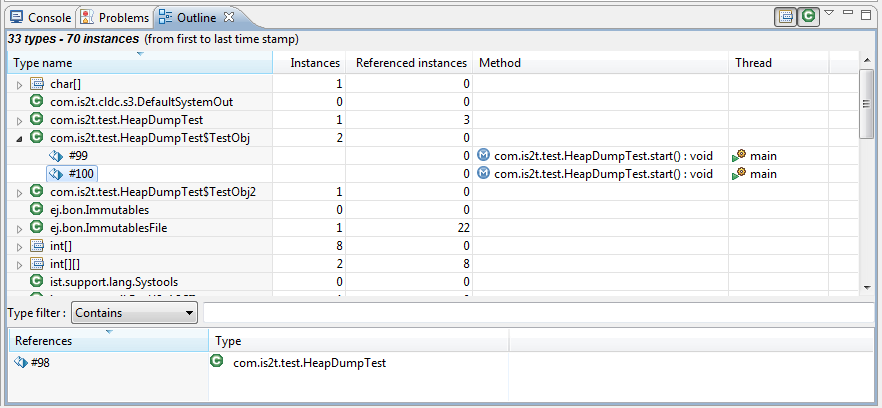
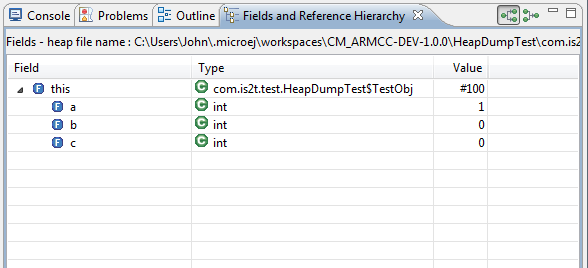
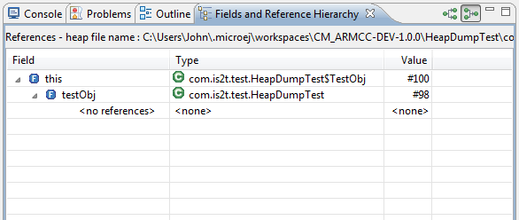
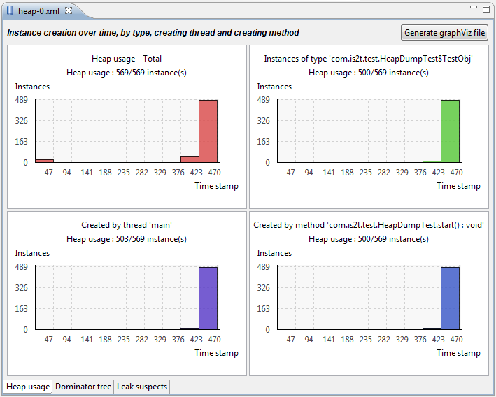
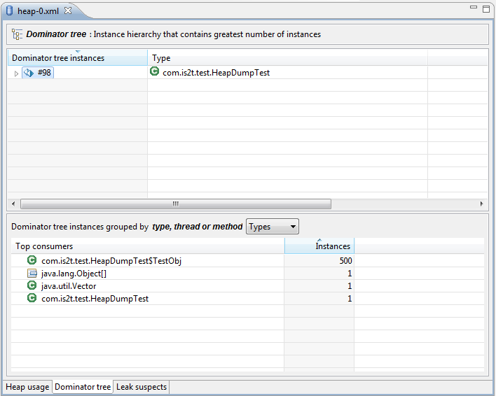
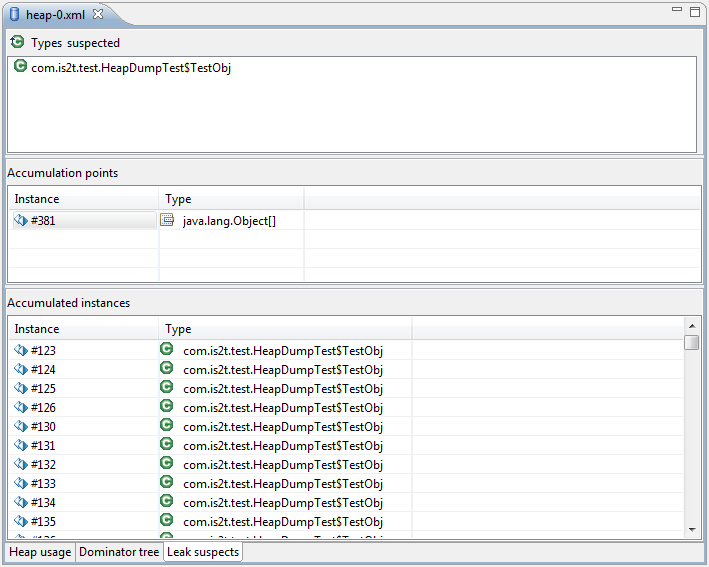
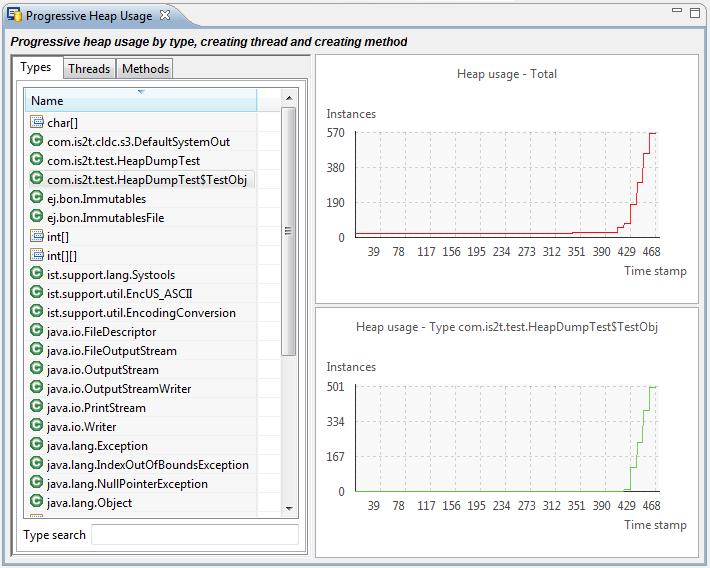
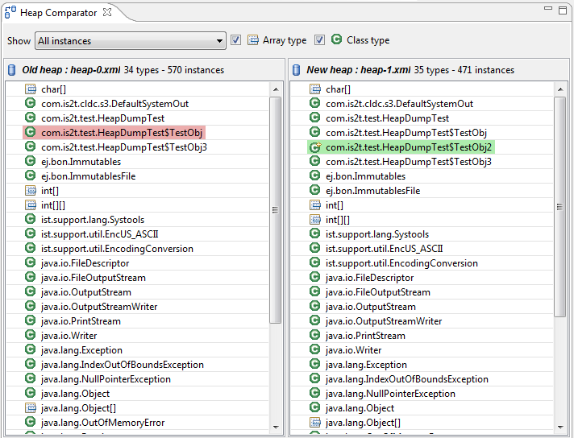
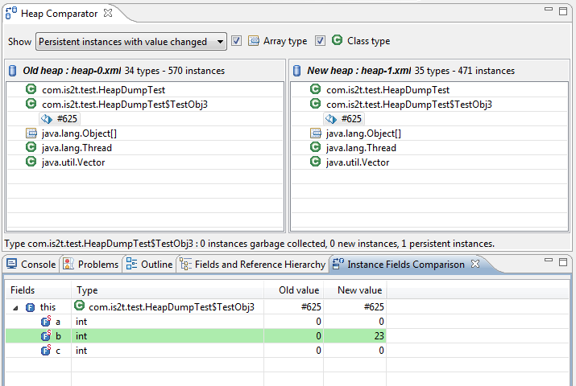

Heap Dumper & Heap Analyzer
===========================

Introduction
------------

Heap Dumper is a tool that takes a snapshot of the heap. Generated files
(with the ``.heap`` extension) are available on the application output
folder. Note that it works only on simulations. It is a built-in platform tool and has no dependencies.

The Heap Analyzer is a set of tools to help developers understand the
contents of the Java heap and find problems such as memory leaks.
For its part, the Heap Analyzer plug-in is able to open dump files. It
helps you analyze their contents thanks to the following features:

-  memory leaks detection

-  objects instances browse

-  heap usage optimization (using immortal or immutable objects)

The heap
~~~~~~~~

The heap is a memory area used to hold Java objects created at runtime.
Objects persist in the heap until they are garbage collected. An object
becomes eligible for garbage collection when there are no longer any
references to it from other objects.

Heap dump
~~~~~~~~~

A heap dump is an XML file that provides a snapshot of the heap contents
at the moment the file is created. It contains a list of all the
instances of both class and array types that exist in the heap. For each
instance it records:

-  The time at which the instance was created

-  The thread that created it

-  The method that created it

For instances of class types, it also records:

-  The class

-  The values in the instance’s non-static fields

For instances of array types, it also records:

-  The type of the contents of the array

-  The contents of the array

For each referenced class type it records the values in the static
fields of the class.

Heap Analyzer tools
~~~~~~~~~~~~~~~~~~~

The Heap Analyzer is an Eclipse plugin that adds three tools to the
MicroEJ environment.

    +-----------------------+---------------+-------------------------------+
    | Tool name             | Number of     | Purpose                       |
    |                       | input files   |                               |
    +=======================+===============+===============================+
    | Heap Viewer           | 1             | Shows what instances are in   |
    |                       |               | the heap, when they were      |
    |                       |               | created, and attempts to      |
    |                       |               | identify problem areas        |
    +-----------------------+---------------+-------------------------------+
    | Progressive Heap      | 1 or more     | Shows how the number of       |
    | Usage                 |               | instances in the heap has     |
    |                       |               | changed over time             |
    +-----------------------+---------------+-------------------------------+
    | Compare               | 2             | Compares two heap dumps,      |
    |                       |               | showing which objects were    |
    |                       |               | created, or garbage           |
    |                       |               | collected, or have changed    |
    |                       |               | values                        |
    +-----------------------+---------------+-------------------------------+

Heap Dumper
-----------

When the Heap Dumper option is activated, the garbage collector process
ends by performing a dump file that represent a snapshot of the heap at
this moment. Thus, to generate such dump files, you must explicitly call
the System.gc() method in your code, or wait long enough for garbage
collector activation.

The heap dump file contains the list of all instances of both class and
array types that exist in the heap. For each instance it records:

-  the time at which the instance was created

-  the thread that created it

-  the method that created it

For instances of class types, it also records:

-  the class

-  the values in the instance’s non-static fields

For instances of array types, it also records:

-  the type of the contents of the array

-  the contents of the array

For each referenced class type, it records the values in the static
fields of the class.

For more information about using the Heap Analyzer plug-in, please refer
to the menu :guilabel:`Help` > :guilabel:`Help Contents` > :guilabel:`Heap Analyzer User Guide`.

.. include:: heapdumper_use.rst

Heap Viewer
-----------

To open the Heap Viewer tool, select a heap dump XML file in the :guilabel:`Package
Explorer`, right-click on it and select :guilabel:`Open With` > :guilabel:`Heap Viewer`

Alternatively, right-click on it and select :guilabel:`Heap Analyzer` > :guilabel:`Open heap viewer`

This will open a Heap Viewer tool window for the selected heap dump [1]_ .

The Heap Viewer works in conjunction with two views:

1. The Outline view

2. The Instance Browser view

These views are described below.

The Heap Viewer tool has three tabs, each described below.

.. [1]
   Although this is an Eclipse ‘editor’, it is not possible to edit the
   contents of the heap dump.

Outline view
~~~~~~~~~~~~

The Outline view shows a list of all the types in the heap dump, and for
each type shows a list of the instances of that type. When an instance
is selected it also shows a list of the instances that refer to that
instance. The Outline view is opened automatically when an Heap Viewer
is opened.

   Outline View

Instance Browser view
~~~~~~~~~~~~~~~~~~~~~

The Instance Browser view opens automatically when a type or instance is
selected in the Outline view. It has two modes, selected using the
buttons in the top right corner of the view. In ‘Fields’ mode it shows
the field values for the selected type or instance, and where those
fields hold references it shows the fields of the referenced instance,
and so on. In ‘Reference’ mode it shows the instances that refer to the
selected instance, and the instances that refer to them, and so on.

   Instance Browser View - Fields mode

   Instance Browser View - References mode

Heap usage tab
~~~~~~~~~~~~~~

The Heap usage page of the Heap Viewer displays four bar charts. Each
chart divides the total time span of the heap dump (from the time stamp
of the earliest instance creation to the time stamp of the latest
instance creation) into a number of  periods along the x axis, and
shows, by means of a vertical bar, the number of instances created
during the period.

-  The top-left chart shows the total number of instances created in
   each period, and is the only chart displayed when the Heap Viewer is
   first opened.

-  When a type or instance is selected in the Outline view the top-right
   chart is displayed. This chart shows the number of instances of the
   selected type created in each time period.

-  When an instance is selected in the Outline view the bottom-left
   chart is displayed. This chart shows the number of instances created
   in each time period by the thread that created the selected instance.

-  When an instance is selected in the Outline view the bottom-right
   chart is displayed. This chart shows the number of instances created
   in each time period by the method that created the selected instance.

   Heap Viewer - Heap Usage Tab

Clicking on the graph area in a chart restricts the Outline view to just
the types and instances that were created during the selected time
period. Clicking on a chart but outside of the graph area restores the
Outline view to showing all types and instances  [2]_ .

The button Generate graphViz file in the top-right corner of the Heap
Usage page generates a file compatible with graphviz (www.graphviz.org).

.. [2]
   The Outline can also be restored by selecting the All types and
   instances option on the drop-down menu at the top of the Outline
   view.

Dominator tree tab
~~~~~~~~~~~~~~~~~~

The Dominator tree page of the Heap Viewer allows the user to browse the
instance reference tree which contains the greatest number of instances.
This can be useful when investigating a memory leak because this tree is
likely to contain the instances that should have been garbage collected.

The page contains two tree viewers. The top viewer shows the instances
that make up the tree, starting with the root. The left column shows the
ids of the instances – initially just the root instance is shown. The
Shallow instances column shows the number of instances directly
referenced by the instance, and the Referenced instances column shows
the total number of instances below this point in the tree (all
descendants).

The bottom viewer groups the instances that make up the tree either
according to their type, the thread that created them, or the method
that created them.

Double-clicking an instance in either viewer opens the Instance Browser
view (if not already open) and shows details of the instance in that
view.

   Heap Viewer - Dominator Tree Tab

Leak suspects tab
~~~~~~~~~~~~~~~~~

The Leak suspects page of the Heap Viewer shows the result of applying
heuristics to the relationships between instances in the heap to
identify possible memory leaks.

The page is in three parts.

-  The top part lists the suspected types (classes). Suspected types are
   classes which, based on numbers of instances and instance creation
   frequency, may be implicated in a memory leak.

-  The middle part lists accumulation points. An accumulation point is
   an instance that references a high number of instances of a type that
   may be implicated in a memory leak.

-  The bottom part lists the instances accumulated at an accumulation
   point.

   Heap Viewer - Leak Suspects Tab

Progressive Heap Usage
----------------------

To open the Progressive Heap Usage tool, select one or more heap dump
XML files in the :guilabel:`Package Explorer`, right-click and select :guilabel:`Heap Analyzer` > :guilabel:`Show progressive heap usage`

This tool is much simpler than the Heap Viewer described above. It
comprises three parts.

-  The top-right part is a line graph showing the total number of
   instances in the heap over time, based on the creation times of the
   instances found in the heap dumps.

-  The left part is a pane with three tabs, one showing a list of types
   in the heap dump, another a list of threads that created instances in
   the heap dump, and the third a list of methods that created instances
   in the heap dump.

-  The bottom-left is a line graph showing the number of instances in
   the heap over time restricted to those instances that match with the
   selection in the left pane. If a type is selected, the graph shows
   only instances of that type; if a thread is selected the graph shows
   only instances created by that thread; if a method is selected the
   graph shows only instances created by that method.

   Progressive Heap Usage

Compare Heap Dumps
------------------

The Compare tool compares the contents of two heap dump files. To open
the tool select two heap dump XML files in the Package Explorer,
right-click and select :guilabel:`Heap Analyzer` > :guilabel:`Compare`

The Compare tool shows the types in the old heap on the left-hand side,
and the types in the new heap on the right-hand side, and marks the
differences between them using different colors.

Types in the old heap dump are colored red if there are one or more
instances of this type which are in the old dump but not in the new
dump. The missing instances have been garbage collected.

Types in the new heap dump are colored green if there are one or more
instances of this type which are in the new dump but not in the old
dump. These instances were created after the old heap dump was written.

Clicking to the right of the type name unfolds the list to show the
instances of the selected type.

   Compare Heap Dumps

The combo box at the top of the tool allows the list to be restricted in
various ways:

-  All instances – no restriction.

-  Garbage collected and new instances – show only the instances that
   exist in the old heap dump but not in the new dump, or which exist in
   the new heap dump but not in the old dump.

-  Persistent instances – show only those instances that exist in both
   the old and new dumps.

-  Persistent instances with value changed – show only those instances
   that exist in both the old and new dumps and have one or more
   differences in the values of their fields.

Instance Fields Comparison view
~~~~~~~~~~~~~~~~~~~~~~~~~~~~~~~

The Compare tool works in conjunction with the Instance Fields
Comparison view, which opens automatically when an instance is selected
in the tool.

The view shows the values of the fields of the instance in both the old
and new heap dumps, and highlights any differences between the values.

   Instance Fields Comparison view

..
   | Copyright 2008-2020, MicroEJ Corp. Content in this space is free 
   for read and redistribute. Except if otherwise stated, modification 
   is subject to MicroEJ Corp prior approval.
   | MicroEJ is a trademark of MicroEJ Corp. All other trademarks and 
   copyrights are the property of their respective owners.
