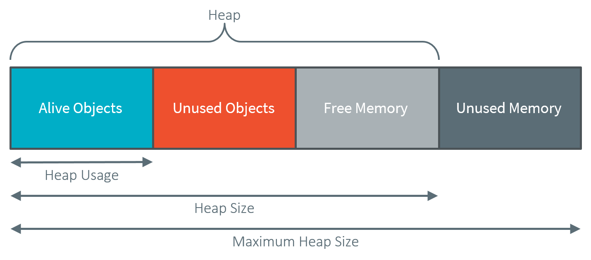

.. _heap_usage_monitoring:

Heap Usage Monitoring
=====================

Introduction
------------

When building a :ref:`standalone_application`, the Java heap size must be specified
as an :ref:`Application Option <application_options>` (see :ref:`option_java_heap`).
The value to set in this option depends on the maximum heap usage, and the 
developer can estimate it by running the application.

The Core Engine provides a Java API to introspect the heap usage at runtime. 
Additionally, heap usage monitoring can be enabled to compute the maximum heap 
usage automatically.

Here are the descriptions of the different notions related to heap usage:

-  **Heap:** memory area used to store the objects allocated by the application.

-  **Heap Size:** current size of the heap.

-  **Maximum Heap Size:** maximum size of the heap. The heap size cannot exceed 
   this value. See :ref:`option_java_heap`.

-  **Heap Usage:** the amount of the heap currently being used to store alive 
   objects.

-  **Garbage Collector (GC):** a memory manager in charge of recycling unused 
   objects to increase free memory.

   Heap Structure Summary

The Java class `java.lang.Runtime <https://repository.microej.com/javadoc/microej_5.x/apis/java/lang/Runtime.html>`_ 
defines the following methods:

-  `gc() <https://repository.microej.com/javadoc/microej_5.x/apis/java/lang/Runtime.html#gc-->`_: 
   Runs the garbage collector. 
   `System.gc() <https://repository.microej.com/javadoc/microej_5.x/apis/java/lang/System.html#gc-->`_ 
   is an alternative means of invoking this method.

-  `freeMemory() <https://repository.microej.com/javadoc/microej_5.x/apis/java/lang/Runtime.html#freeMemory-->`_: 
   Returns the amount of free memory in the heap. 
   This value does not include unused objects eligible for garbage collection.
   Calling the `gc() <https://repository.microej.com/javadoc/microej_5.x/apis/java/lang/Runtime.html#gc-->`_ 
   method may result in increasing the value returned by this method.

-  `totalMemory() <https://repository.microej.com/javadoc/microej_5.x/apis/java/lang/Runtime.html#totalMemory-->`_: 
   Returns the current size of the heap. 
   The value returned by this method may vary over time.

-  `maxMemory() <https://repository.microej.com/javadoc/microej_5.x/apis/java/lang/Runtime.html#maxMemory-->`_: 
   Returns the maximum size of the heap.

Heap Usage Introspection
------------------------

The methods provided by the `Runtime <https://repository.microej.com/javadoc/microej_5.x/apis/java/lang/Runtime.html>`_ 
class allow introspecting the heap usage by comparing the heap size and the free memory size. 
A garbage collection must be executed before computing the heap usage to recycle 
all the unused objects and count only alive objects.

The application can compute the current heap usage by executing the following 
code:

   .. code-block:: java
   
      Runtime runtime = Runtime.getRuntime(); // get Runtime instance
      runtime.gc(); // Ensure unused objects are recycled
      long heapUsage = runtime.totalMemory() - runtime.freeMemory();

This example gives the heap usage at a given point but not the maximum heap 
usage of the application.

.. note::
   When heap usage monitoring is disabled, the heap size is fixed, and so 
   `totalMemory() <https://repository.microej.com/javadoc/microej_5.x/apis/java/lang/Runtime.html#totalMemory-->`_ 
   and `maxMemory() <https://repository.microej.com/javadoc/microej_5.x/apis/java/lang/Runtime.html#maxMemory-->`_ 
   return the same value.

Automatic Heap Usage Monitoring
-------------------------------

The maximum heap usage of an application's execution can be computed 
automatically by enabling heap usage monitoring.

.. note::
   This feature is available in the Architecture versions 7.16.0 or higher for the Applications deployed on hardware devices (not on Simulator).

When this option is activated, an initial size for the heap must be specified, 
and the Core Engine increases the heap size dynamically. 
The value returned by `totalMemory() <https://repository.microej.com/javadoc/microej_5.x/apis/java/lang/Runtime.html#totalMemory-->`_ 
is the current heap size. 
`maxMemory() <https://repository.microej.com/javadoc/microej_5.x/apis/java/lang/Runtime.html#maxMemory-->`_ 
returns the maximum size of the heap. 
A call to `gc() <https://repository.microej.com/javadoc/microej_5.x/apis/java/lang/Runtime.html#gc-->`_ 
decreases the heap size to the higher value of either the heap usage or the 
initial heap size.

At any moment, `totalMemory() <https://repository.microej.com/javadoc/microej_5.x/apis/java/lang/Runtime.html#totalMemory-->`_ 
returns the maximum heap usage of the current execution (assuming the maximum 
heap usage is higher than the initial heap size, and 
`gc() <https://repository.microej.com/javadoc/microej_5.x/apis/java/lang/Runtime.html#gc-->`_ 
has not been called).

See the section :ref:`option_enable_heap_usage` to enable this option and 
configure the initial heap size.

Even if the heap size can vary during time, a memory section of 
`maxMemory() <https://repository.microej.com/javadoc/microej_5.x/apis/java/lang/Runtime.html#maxMemory-->`_ 
bytes is allocated at link time or during the Core Engine startup. 
No dynamic allocation is performed when increasing the heap size.

.. warning::
   A small initial heap size will impact the performances as the GC will be 
   executed every time the heap size needs to be increased. 
   
   Furthermore, the smaller the heap size is, the more frequent the GC will 
   occur. 
   This feature should be used only for heap usage benchmarking.

Heap Usage Analysis
-------------------

To analyze heap usage and see what objects are alive in the application, use the
:ref:`heapdumper` tools.

..
   | Copyright 2021-2022, MicroEJ Corp. Content in this space is free 
   for read and redistribute. Except if otherwise stated, modification 
   is subject to MicroEJ Corp prior approval.
   | MicroEJ is a trademark of MicroEJ Corp. All other trademarks and 
   copyrights are the property of their respective owners.
